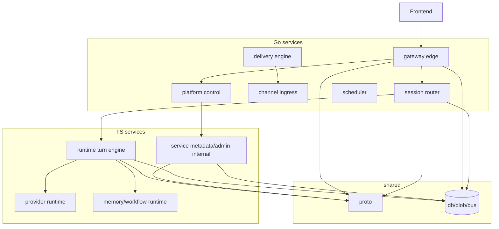

# Next AI Agent User Backend 改造文档索引

这组文档不是泛泛的架构脑图，而是基于前面对 OpenClaw 的完整拆解，反向规划 `next-ai-agent-user-backend` 这个仓库如何承接 Go + TS 双运行时改造。

## 1. 当前目标仓库现状

当前后端仓库已经天然具备一个双栈雏形：

- `gateway/`
  - Go
  - 已有 `chi`、JWT、gRPC/protobuf 依赖
- `runtime/`
  - TS
  - 已有 `@mariozechner/pi-ai`、Fastify、SQLite、Drizzle
- `service/`
  - TS
  - 已有 auth / cron / plugin 等偏业务与元数据能力
- `proto/`
  - 已有 `agent_run.proto`、`chat.proto`、`channels.proto`、`scheduler.proto`、`settings.proto`、`tools.proto`、`auth.proto`、`workspace.proto` 等

所以这次不是从零设计一套空架构，而是要把现有仓库推向一个更清晰的终态：

- `gateway/` = Go 平台壳与唯一公开入口
- `runtime/` = TS 对话与 provider runtime
- `service/` = 过渡期的内部业务/元数据服务，最终要么收缩，要么并入 Go 控制面
- `proto/` = 统一跨服务协议

## 2. 文档阅读顺序

建议按这个顺序读：

1. `go-ts-agent-platform-implementation-plan.md`
   - 总体目标、服务形态、阶段路线
2. `issue-driven-agent-orchestration-plan.md`
   - 通过 Issue 派单驱动 Agent、聊天自动建工单、Go/TS owner 和实施顺序
3. `backend-repo-architecture-index.md`
   - 当前文档集总览
4. `service-boundary-mapping.md`
   - OpenClaw 拆解结果如何映射到当前 backend 仓库目录
5. `go-ts-platform-contracts.md`
   - Go / TS / 前端 / channel / node 之间的对象和协议
6. `migration-roadmap.md`
   - 真正的实施阶段、验收口径、回滚点
7. `frontend-api-alignment.md`
   - 前端如何只连 Go 单入口
8. `plugin-split-strategy.md`
9. `go-ts-coding-standards.md`
   - OpenClaw 扩展体系在新平台里的 Go/TS 分治

## 3. 这组文档解决什么问题

它们要回答的不是“想不想这么做”，而是：

- OpenClaw 当前哪些模块应该去 `gateway/`
- 哪些模块只能去 `runtime/`
- `service/` 在未来是保留、收缩还是过渡
- `proto/` 需要冻结哪些对象
- 前端是否只暴露一个入口
- channel、extension、node/browser/canvas/cron 应该归谁
- provider/model 为什么只能在 TS

## 4. 这组文档的硬结论

### 4.1 对外只暴露一个逻辑入口

前端只连 Go 的统一公开入口。

它可以是：

- 一个域名
- 一个 API Gateway
- 同域名下的 HTTP + WebSocket + SSE

但不能让前端同时直连 `gateway/`、`runtime/`、`service/` 三个后端。

### 4.2 内部可以是多服务

这里的限制从来不是“Go 只能一个服务、TS 只能一个服务”。

真正的限制是 owner：

- Go 可以拆很多服务
- TS 也可以拆很多服务
- 但 provider/model owner 只能是 TS
- channel transport / delivery / control-plane owner 只能是 Go

### 4.3 `service/` 不应长期站在热路径中心

在当前 backend 仓库里，`service/` 已经存在，因此短期可以保留它作为：

- 业务元数据服务
- auth/org/workspace/settings 内部服务
- plugin registry / query service

但长期终态应该是：

- 前端不直连 `service/`
- `service/` 不掌握 provider/model
- `service/` 不掌握 channel transport
- `service/` 逐渐变成内部 supporting service，或者被 Go 控制面吸收

## 5. 当前 backend 仓库的推荐终态

## 6. 在开始实现之前必须冻结的东西

实现前必须先冻结：

- Go/TS owner 表
- session directory 与 semantic transcript 的所有权定义
- `TurnRequest` / `TurnEvent` / `TurnResult` 协议
- channel outbound 归属
- 前端 BFF API 命名
- plugin SDK 分治原则

如果这些没有冻结，就不应该开始在目标 backend 仓库里大规模改目录或改接口。

## 7. 新增硬约束：必须回归三层 `pi-mono` substrate

本组文档最初默认 TS 侧 owner 是“reasoning plane”。现在这个前提进一步收紧为：

- `runtime/` 不能只站在 `@mariozechner/pi-ai` 上
- `runtime/` 必须站在：
  - `@mariozechner/pi-agent-core`
  - `@mariozechner/pi-ai`
  - `@mariozechner/pi-coding-agent`

之上

因此文档阅读顺序建议更新为：

1. `go-ts-agent-platform-implementation-plan.md`
2. `pi-mono-adoption-strategy.md`
3. `issue-driven-agent-orchestration-plan.md`
4. `service-boundary-mapping.md`
5. `go-ts-platform-contracts.md`
6. `migration-roadmap.md`
7. `frontend-api-alignment.md`
8. `plugin-split-strategy.md`
9. `go-ts-coding-standards.md`
