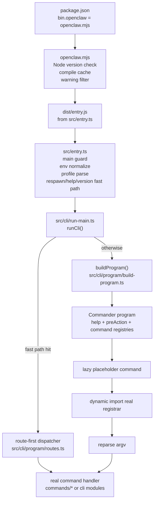
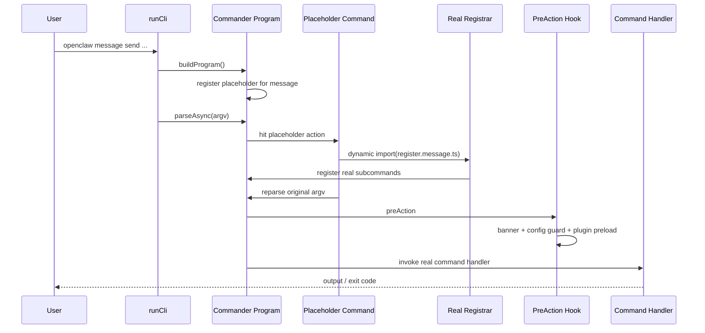
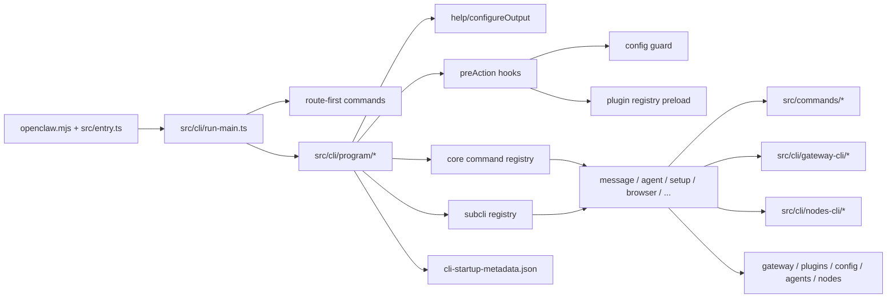

# OpenClaw CLI 深度分析

## 1. CLI 的定位

OpenClaw 的 CLI 不是一个单纯的“命令行壳”。它本身就是整个系统的主控制面之一，承担了以下职责：

- 启动和托管 Gateway
- 初始化本地状态、配置和工作区
- 调用 Agent、管理会话与路由
- 管理各类消息渠道、插件、节点、设备、浏览器、TUI
- 提供诊断、更新、安全审计和运维入口

从代码结构上看，CLI 主要由以下部分构成：

- 启动包装层：`openclaw.mjs`、`src/entry.ts`
- 总调度层：`src/cli/run-main.ts`
- 命令框架层：`src/cli/program/*`
- 业务命令层：`src/cli/*.ts`、`src/commands/*`
- 长生命周期服务入口：`src/cli/gateway-cli/*`、`src/cli/node-cli/*`、`src/cli/tui-cli.ts`

## 2. 是否生成可执行文件

会生成“可执行的 Node CLI”，但不是这里意义上的原生二进制。

### 实际产物

- `package.json` 中声明了：
  - `bin.openclaw = "openclaw.mjs"`
- 这意味着安装包后，包管理器会为 `openclaw` 创建可执行入口。
- `openclaw.mjs` 再去加载构建产物：
  - `dist/entry.js`
  - 必要时 `dist/warning-filter.js`

### 构建产物

`tsdown.config.ts` 会构建：

- `dist/index.js`
- `dist/entry.js`
- `dist/infra/warning-filter.js`
- `dist/plugin-sdk/*`
- 若干懒加载运行时模块

### 结论

- 会生成 npm 可执行 CLI 入口
- 会生成 JS 构建产物
- 不会在这条 CLI 启动链中生成脱离 Node 的 native executable

## 3. 对外暴露的接口

CLI 对外暴露三层接口。

### 3.1 命令行接口

最直接的是：

- `openclaw ...`

这是用户和运维人员的主入口。

### 3.2 JavaScript 模块接口

`package.json` 暴露了：

- `.` -> `dist/index.js`
- `./cli-entry` -> `openclaw.mjs`
- 大量 `./plugin-sdk/*` 子路径导出

### 3.3 `src/index.ts` 导出的程序化接口

`src/index.ts` 对外导出了一批可被其他代码调用的 helper：

- 配置/会话
  - `loadConfig`
  - `loadSessionStore`
  - `saveSessionStore`
  - `deriveSessionKey`
  - `resolveSessionKey`
  - `resolveStorePath`
- 消息/模板
  - `getReplyFromConfig`
  - `applyTemplate`
  - `monitorWebChannel`
- 进程/执行
  - `runExec`
  - `runCommandWithTimeout`
  - `waitForever`
- 环境/可执行检查
  - `ensureBinary`
  - `ensurePortAvailable`
  - `describePortOwner`
  - `handlePortError`
  - `PortInUseError`
- 其他工具
  - `promptYesNo`
  - `createDefaultDeps`
  - `normalizeE164`
  - `toWhatsappJid`
  - `assertWebChannel`

### 3.4 Plugin SDK 接口

还有一层很大的公开面：Plugin SDK。

`package.json` 对外公开了大量 `./plugin-sdk/*` 子模块，例如：

- `./plugin-sdk/core`
- `./plugin-sdk/telegram`
- `./plugin-sdk/discord`
- `./plugin-sdk/slack`
- `./plugin-sdk/signal`
- `./plugin-sdk/imessage`
- `./plugin-sdk/whatsapp`
- 以及一系列 capability-specific SDK

这说明 CLI/运行时并不是封闭系统，而是显式面向插件生态提供扩展入口。

## 4. 启动链路

真实启动链如下：

1. `package.json` 通过 `bin` 暴露 `openclaw`
2. `openclaw.mjs` 负责 Node 版本检查、compile cache、warning filter、加载构建产物
3. `src/entry.ts` 负责 CLI 启动前的环境整理与快速路径处理
4. `src/cli/run-main.ts` 负责总调度
5. `src/cli/program/*` 构建命令树
6. 业务命令注册器动态加载真实命令实现
7. 最终进入 `src/commands/*` 或具体 CLI 业务模块

## 5. `openclaw.mjs` 做了什么

`openclaw.mjs` 是 npm 的真正 `bin` 入口。它实现了：

- Node 最低版本检查：要求 `22.12+`
- compile cache 最佳努力开启
- 启动阶段 warning filter 的预加载
- 动态导入构建产物：`dist/entry.js`
- 如果构建产物不存在，会明确报错：缺少 `dist/entry.(m)js`

它的作用非常明确：

- 保证用户执行 `openclaw` 时，先通过一个极小且稳定的启动外壳
- 再跳转到真正的构建产物
- 把“运行前校验”和“业务启动”隔离开

## 6. `src/entry.ts` 做了什么

这是 CLI 启动包装器，职责非常重。

### 6.1 主模块保护

它先用 `isMainModule(...)` 判断当前文件是否是实际入口，避免 `dist/entry.js` 被当依赖导入时重复触发 CLI 启动逻辑。

### 6.2 进程级启动整理

它会：

- 设置 `process.title = "openclaw"`
- 安装 process warning filter
- 规范化环境变量
- 尝试开启 Node compile cache

### 6.3 特殊命令的启动策略

- 如果命令是 `secrets audit`，会强制把 auth store 设为只读
- 如果带 `--no-color`，会设置 `NO_COLOR=1` 与 `FORCE_COLOR=0`

### 6.4 Respawn 机制

它会判断是否需要带 `--disable-warning=ExperimentalWarning` 重新拉起自身：

- 若当前还没抑制 ExperimentalWarning
- 若没有命中禁止 respawn 的条件
- 若未显式关闭 respawn

就会 `spawn(process.execPath, [...])` 重新启动当前 CLI 进程。

这说明 CLI 启动层主动处理 Node 运行时噪声，而不是把这些问题丢给下游命令。

### 6.5 根级快速路径

它对下面两类情况提供 fast path：

- 根级 `--version` / `-V`
- 根级 `--help` / `-h`

这两类路径会绕过完整命令启动，减少启动成本。

### 6.6 Profile 解析

它会在进入主 CLI 前解析：

- `--dev`
- `--profile <name>`

然后把 profile 写入环境变量，保证后续配置、状态路径、端口选择都一致。

### 6.7 进入主 CLI

只有在前面的 fast path 都不命中时，才动态导入 `src/cli/run-main.ts` 并执行 `runCli(process.argv)`。

## 7. `src/cli/run-main.ts` 做了什么

这是 CLI 总调度器。

### 7.1 启动前环境准备

它会：

- 规范化 Windows argv
- 再次解析 profile
- 加载 `.env`
- 再次规范化环境变量
- 必要时执行 `ensureOpenClawCliOnPath()`，保证后续子进程/更新逻辑能再次找到 `openclaw`
- 强制运行时版本校验

### 7.2 Route-first 快速分发

它先尝试 `tryRouteCli(argv)`。

如果命中了“快速分发命令”，就不走 Commander 命令树，而是直接执行命令处理函数。

当前这批 routed commands 包括：

- `health`
- `status`
- `sessions`（仅 bare `sessions`）
- `agents list`
- `memory status`
- `config get`
- `config unset`
- `models list`
- `models status`

这类命令通常是：

- 高频
- 相对只读
- 参数结构简单
- 希望减少命令树装配成本

### 7.3 完整命令树启动

如果没有命中 route-first，就会：

- 开启 console capture
- 动态导入 `buildProgram()`
- 安装全局未处理异常处理器
- 将 `--update` 改写为 `update`
- 基于 primary command 只注册需要的 core/subcli
- 在必要时注册 plugin CLI
- 最终 `program.parseAsync(...)`

## 8. 命令树框架怎么工作

命令树框架主要在 `src/cli/program/*`。

### 8.1 根 Program 的构建

`buildProgram()` 做的事：

- 创建 Commander `Command`
- 创建 `ProgramContext`
- 配置帮助输出
- 注册 preAction hooks
- 注册顶层命令

### 8.2 `ProgramContext`

它携带 CLI 的全局上下文，比如：

- `programVersion`
- `channelOptions`
- `messageChannelOptions`
- `agentChannelOptions`

注意这里的 channel options 不是每次启动现算。
`src/cli/channel-options.ts` 会优先读取构建时生成的 `dist/cli-startup-metadata.json`。

### 8.3 构建期预生成 CLI 启动元数据

`scripts/write-cli-startup-metadata.ts` 会扫描 `extensions/*/package.json` 中声明的 channel 信息，生成：

- `dist/cli-startup-metadata.json`

这里面会预写入 `channelOptions`。

作用是：

- 避免每次 CLI 启动时都深度扫描扩展目录
- 提前准备好帮助文本和 option 枚举所需的数据
- 降低启动成本

## 9. 懒加载命令树机制

这是这套 CLI 最关键的设计之一。

### 9.1 Core CLI 与 Sub CLI 两级命令表

- `src/cli/program/command-registry.ts`
  管 core commands
- `src/cli/program/register.subclis.ts`
  管 subcli commands

### 9.2 不是一次性全量注册真实命令

它不是一启动就把所有命令和所有子命令都挂上去。
它先注册“占位命令”：

- 命令名
- 简短描述
- 一个 action

### 9.3 占位命令的执行逻辑

当用户真正执行某个命令时：

1. 占位命令先命中
2. 卸掉旧 placeholder
3. 动态导入真实 registrar
4. 把真实命令和子命令注册到 program 上
5. 用原始 argv 再 parse 一次
6. 最终进入真实 action handler

也就是：

- first parse 只负责命中 command family
- second parse 才进入真实命令实现

### 9.4 为什么这么设计

这样做有几个直接收益：

- 降低 CLI 冷启动开销
- 避免一次性加载所有命令依赖
- 让帮助系统仍然能展示完整顶层命令名
- 对大命令族（如 `message`、`nodes`、`browser`、`plugins`）尤其有效

## 10. preAction Hook 做了什么

`src/cli/program/preaction.ts` 在命令真正执行前统一做了横切处理。

### 内容包括

- 根据命令设置 `process.title`
- 输出 CLI banner
- 解析并注入 verbose/log level
- 对绝大多数命令做 config guard
- 对需要 plugin 的命令预加载 plugin registry

### config guard

`src/cli/program/config-guard.ts` 会：

- 读取配置快照
- 检查配置是否存在语义错误/遗留 key
- 对不允许在坏配置下继续运行的命令直接失败退出
- 对某些允许带病运行的命令放行，例如：
  - `doctor`
  - `logs`
  - `health`
  - `status`
  - `backup`
  - 一部分 `gateway` 子命令

这说明 CLI 并不是“先执行再报错”，而是在命令真正进入业务逻辑之前就统一做边界校验。

## 11. Route-first 与 Commander 懒加载的关系

这两者不是重复设计，而是互补。

- route-first
  适合高频、参数简单、无需完整命令树的只读命令
- lazy Commander
  适合复杂命令族、子命令丰富、帮助系统要求高的命令

所以 CLI 实际有两层分发：

- 第一层：`run-main.ts` 的 `tryRouteCli()`
- 第二层：Commander + placeholder + dynamic import + reparse

## 12. 顶层命令体系

### 12.1 Core commands

由 `src/cli/program/command-registry.ts` 管理的顶层命令包括：

- `setup`
- `onboard`
- `configure`
- `config`
- `backup`
- `doctor`
- `dashboard`
- `reset`
- `uninstall`
- `message`
- `memory`
- `agent`
- `agents`
- `status`
- `health`
- `sessions`
- `browser`

### 12.2 Sub CLI commands

由 `src/cli/program/register.subclis.ts` 管理的顶层命令包括：

- `acp`
- `gateway`
- `daemon`
- `logs`
- `system`
- `models`
- `approvals`
- `nodes`
- `devices`
- `node`
- `sandbox`
- `tui`
- `cron`
- `dns`
- `docs`
- `hooks`
- `webhooks`
- `qr`
- `clawbot`
- `pairing`
- `plugins`
- `channels`
- `directory`
- `security`
- `secrets`
- `skills`
- `update`
- `completion`

## 13. 这些命令分别提供什么能力

### 配置与初始化

- `setup`
  初始化本地 config 和 agent workspace
- `onboard`
  交互式 onboarding
- `configure`
  交互式配置向导
- `config`
  读写配置、校验配置、查看配置文件
- `backup`
  备份与恢复相关
- `doctor`
  健康检查和修复建议
- `reset`
  重置本地状态
- `uninstall`
  卸载本地 gateway 服务与数据

### Gateway 与服务控制

- `gateway`
  启动、探测、发现、RPC 调用 Gateway
- `daemon`
  Gateway service 的 legacy alias
- `status`
  查看通道状态与最近会话目标
- `health`
  查看运行中的 Gateway 健康状态
- `sessions`
  查看会话存储
- `logs`
  查看 Gateway 日志
- `system`
  系统事件、heartbeat、presence
- `cron`
  管理 Gateway scheduler 上的 cron 作业
- `dns`
  与 wide-area discovery 相关的 DNS 辅助
- `update`
  检查与执行 OpenClaw 更新

### Agent、消息与模型

- `agent`
  直接通过 Gateway 跑一轮 agent turn
- `agents`
  管理隔离 agent、绑定关系、身份信息
- `message`
  发送、读取、编辑、删除、反应、poll、thread 管理等
- `memory`
  搜索和重建 memory index
- `models`
  列出模型、配置默认模型、fallback、auth、probe provider
- `skills`
  列出和检查可用 skills
- `tui`
  打开连接到 Gateway 的终端 UI

### 渠道、插件与扩展

- `channels`
  增删改查 channel account、登录、登出、能力与状态检查
- `directory`
  解析联系人/群组 ID
- `plugins`
  安装、链接、启用、禁用、卸载插件
- `pairing`
  安全 DM 配对流程
- `hooks`
  管理 agent hooks
- `webhooks`
  webhook helpers 和 integrations
- `browser`
  管理 OpenClaw 的专用浏览器
- `security`
  本地安全工具与配置审计
- `secrets`
  secrets runtime reload 控制

### 节点与设备

- `nodes`
  管理 gateway-owned nodes：配对、调用、媒体、推送、位置、canvas、camera、screen
- `devices`
  设备配对与 token 管理
- `node`
  运行和管理 headless node host
- `qr`
  生成配对二维码/setup code
- `sandbox`
  管理 agent isolation 的 sandbox
- `acp`
  Agent Control Protocol 工具集

### 兼容与辅助

- `docs`
  搜索 OpenClaw 文档
- `completion`
  生成 shell completion 脚本
- `clawbot`
  legacy clawbot 命令兼容层

## 14. 关键命令族的实际实现形态

### `message`

不是单一的发送命令，而是一整套消息动作入口。当前包含：

- send
- broadcast
- poll
- reactions
- read/edit/delete
- pins
- permissions
- search
- thread
- emoji/sticker
- Discord admin actions

### `models`

不只是 `list` 和 `status`，还包括：

- `set`
- `set-image`
- `aliases`
- `fallbacks`
- `image-fallbacks`
- `scan`
- auth 相关命令
- provider probe/status 检查

### `channels`

它不仅管理配置，还承担：

- account 增删改
- login/logout
- capabilities 审计
- 名称到 ID 的 resolve
- channel logs/status

### `nodes`

它不是一个简单“节点列表”命令，而是一个完整的远端设备控制入口，覆盖：

- status
- pairing
- invoke
- notify
- push
- canvas
- camera
- screen
- location

### `browser`

它是 Gateway 配套浏览器系统的 CLI 面板，当前包括：

- browser manage
- extension
- inspect
- input actions
- observe actions
- debug
- state

## 15. `gateway run` 实现了什么

`src/cli/gateway-cli/run.ts` 和 `src/cli/gateway-cli/run-loop.ts` 是 CLI 中最重要的一条长生命周期链。

### `gateway run` 启动前做的事

- 解析并继承父命令 option
- 设置 console timestamp / verbose / ws log style
- 处理 raw stream 输出路径
- dev 模式下初始化 dev config
- 读取并校验 config
- 计算 port / bind / auth / tailscale 模式
- 必要时执行 `--force`，先杀掉占用目标端口的进程
- 检查本地 gateway 是否允许在当前配置下启动
- 检查对外 bind 是否配置了共享认证

### 然后进入 `runGatewayLoop()`

`runGatewayLoop()` 负责：

- 获取 gateway lock，避免多实例抢占
- 启动 `startGatewayServer(...)`
- 监听 `SIGTERM` / `SIGINT` / `SIGUSR1`
- 在 restart 时先 drain 活跃任务
- 支持 full-process restart 或 in-process restart
- 在 restart 后恢复新一轮 server 生命周期

这不是普通的“一次调用然后阻塞”，而是一个监督循环。

## 16. 兼容层与构建后处理

CLI 还有一部分兼容层设计。

### 16.1 `clawbot`

`src/cli/clawbot-cli.ts` 提供 legacy `clawbot` 命令别名。

### 16.2 `daemon` 兼容构建

构建后还会运行 `scripts/write-cli-compat.ts`，为旧的 `daemon-cli` 导出形态生成兼容 shim。

这说明 CLI 不只是为当前用户设计，还要兼顾历史命令与更新后的导出形态。

## 17. 这套 CLI 的设计特征

从实现看，CLI 有几个非常明显的设计取向。

### 17.1 冷启动优化优先

- 根级 help/version fast path
- route-first 直达命令
- 懒注册命令树
- 构建期预计算 channel 元数据

### 17.2 配置与插件是启动时一等公民

- preAction 中统一做 config guard
- 某些命令执行前强制 preload plugin registry
- plugin CLI 注册会根据当前 config 决定是否启用

### 17.3 CLI 是控制面，而不是单纯操作壳

它不是把逻辑都放到远端服务里，而是自己承担了大量：

- 本地检查
- 配置修复
- 本地路由判断
- 启动与重启控制
- 与 Gateway、plugins、节点系统的装配协调

### 17.4 长生命周期命令有自己的监督逻辑

`gateway run` 明显就是“带生命周期管理的前台 supervisor”。

## 18. Mermaid 图

### 18.1 CLI 总启动链



### 18.2 懒加载命令树时序



### 18.3 `gateway run` 生命周期

```mermaid
sequenceDiagram
    participant U as User
    participant CLI as gateway run action
    participant V as runGatewayCommand
    participant Loop as runGatewayLoop
    participant Lock as gateway lock
    participant S as startGatewayServer
    participant OS as Signals

    U->>CLI: openclaw gateway run
    CLI->>V: resolve inherited options
    V->>V: validate port/bind/auth/tailscale
    V->>V: optional force-free port
    V->>Loop: enter supervisor loop
    Loop->>Lock: acquire lock
    Loop->>S: startGatewayServer(...)
    S-->>Loop: running server

    OS->>Loop: SIGTERM / SIGINT
    Loop->>S: graceful close
    Loop->>Lock: release
    Loop-->>U: exit 0

    OS->>Loop: SIGUSR1
    Loop->>Loop: drain active tasks
    Loop->>S: close with restart intent
    Loop->>Lock: release / reacquire
    Loop->>S: restart in-process or respawn process
```

### 18.4 CLI 内部模块关系



## 19. 最终结论

OpenClaw 的 CLI 可以被理解成一个“高性能、懒加载、带控制平面属性的命令框架”。

它的核心价值不只是：

- 提供命令

更在于：

- 统一整个 OpenClaw 系统的启动入口
- 作为 Gateway、Agent、插件、渠道、节点系统的协调器
- 把运行前检查、配置边界、插件装配、长生命周期监督统一纳入 CLI 启动链

所以它既是：

- 用户 CLI
- 运维 CLI
- 本地控制面入口
- 插件生态入口
- 部分程序化 API 的导出层

这也是为什么 `src/entry.ts`、`src/cli/run-main.ts`、`src/cli/program/*` 在整个仓库里属于非常核心的基础设施。

## 20. 补充：CLI 模块对其它模块暴露的主要 API、参数与用途

这一节不列出所有 `export`，而只列“被 CLI 以外模块直接消费”或“作为 CLI 框架边界”的主要接口。

### 20.1 启动与命令框架 API

#### `runCli(argv = process.argv): Promise<void>`

定义位置：`src/cli/run-main.ts`

参数：

- `argv: string[]`
  - 含义：原始命令行参数数组
  - 用途：允许 `src/entry.ts`、测试代码或其他启动器用自定义 argv 直接启动 CLI 主流程

用途：

- CLI 总入口
- 负责 profile 处理、dotenv 加载、PATH 修正、route-first、Commander 启动、插件命令注册

主要调用方：

- `src/entry.ts`
- 多个 CLI 测试

#### `buildProgram(): Command`

定义位置：`src/cli/program/build-program.ts`

参数：

- 无

用途：

- 构建 Commander 根程序
- 统一挂上 help、preAction、command registries 和 `ProgramContext`

主要调用方：

- `src/cli/run-main.ts`
- `src/index.ts`
- completion 相关逻辑和测试

#### `createProgramContext(): ProgramContext`

定义位置：`src/cli/program/context.ts`

返回值字段：

- `programVersion: string`
  - 用途：根 help / banner / version 输出
- `channelOptions: string[]`
  - 用途：生成 channel 相关 option 枚举
- `messageChannelOptions: string`
  - 用途：`message` 命令的帮助文本和 option 约束
- `agentChannelOptions: string`
  - 用途：`agent` 命令的 channel option 枚举，额外包含 `last`

用途：

- 为 CLI program 提供稳定上下文，而不是让每个 registrar 自己重新拼 version 和 channel list

#### `setProgramContext(program, ctx): void`
#### `getProgramContext(program): ProgramContext | undefined`

定义位置：`src/cli/program/program-context.ts`

参数：

- `program: Command`
  - 含义：Commander 根程序对象
- `ctx: ProgramContext`
  - 含义：CLI 共享上下文

用途：

- 把 `ProgramContext` 绑定到 Commander 实例上
- 供 completion、命令注册器、测试等模块读取同一份上下文

#### `registerCoreCliByName(program, ctx, name, argv?): Promise<boolean>`

定义位置：`src/cli/program/command-registry.ts`

参数：

- `program: Command`
  - 含义：要挂命令的 Commander 程序
- `ctx: ProgramContext`
  - 含义：共享 CLI 上下文
- `name: string`
  - 含义：需要真实注册的 core 顶层命令名，例如 `message`、`agent`
- `argv: string[] = process.argv`
  - 含义：原始参数；用于按当前命令上下文完成真实注册

用途：

- 对单个 core 顶层命令做按需真实注册
- 是懒加载命令树的核心 API 之一

主要调用方：

- `src/cli/run-main.ts`
- `src/cli/completion-cli.ts`

#### `registerSubCliByName(program, name): Promise<boolean>`

定义位置：`src/cli/program/register.subclis.ts`

参数：

- `program: Command`
  - 含义：Commander 程序
- `name: string`
  - 含义：subcli 顶层命令名，例如 `gateway`、`models`、`nodes`

用途：

- 按需真实注册某个 subcli 顶层命令
- 和 `registerCoreCliByName(...)` 一起构成 CLI 两级懒加载装配机制

主要调用方：

- `src/cli/run-main.ts`
- `src/cli/completion-cli.ts`

#### `ensureConfigReady({ runtime, commandPath?, suppressDoctorStdout? }): Promise<void>`

定义位置：`src/cli/program/config-guard.ts`

参数：

- `runtime: RuntimeEnv`
  - 含义：输出错误、退出进程时使用的运行时抽象
- `commandPath?: string[]`
  - 含义：当前命令路径，例如 `['message']` 或 `['gateway', 'status']`
  - 用途：决定哪些命令允许在坏配置下继续执行
- `suppressDoctorStdout?: boolean`
  - 含义：是否在自动 doctor/migration 预处理时静默标准输出
  - 用途：避免 JSON 模式被诊断文本污染

用途：

- CLI 统一配置守卫
- 在真正执行业务命令前检查配置是否合法、是否有 legacy key、是否需要先跑 doctor/migration

主要调用方：

- `src/cli/program/preaction.ts`
- `src/cli/route.ts`

#### `ensurePluginRegistryLoaded(): void`

定义位置：`src/cli/plugin-registry.ts`

参数：

- 无

用途：

- 读取 config 和默认 agent workspace
- 装载 OpenClaw 插件注册表
- 为 channels、pairing、plugins、message helpers 等需要插件信息的模块提供运行前预热

主要调用方：

- `src/cli/program/preaction.ts`
- `src/cli/channel-options.ts`
- `src/cli/program/message/helpers.ts`
- `src/cli/route.ts`

### 20.2 Gateway / RPC API

#### `addGatewayClientOptions(cmd): Command`

定义位置：`src/cli/gateway-rpc.ts`

参数：

- `cmd: Command`
  - 含义：要补充 gateway client 选项的命令对象

它会给命令挂上：

- `--url <url>`
  - 用途：显式指定 Gateway WebSocket URL
- `--token <token>`
  - 用途：指定 Gateway 鉴权 token
- `--timeout <ms>`
  - 用途：控制 RPC 超时
- `--expect-final`
  - 用途：等待 agent 类调用的最终结果，而不是只等首个事件

用途：

- 让多个 CLI 命令共享统一的 Gateway RPC 连接参数定义

#### `callGatewayFromCli(method, opts, params?, extra?): Promise<unknown>`

定义位置：`src/cli/gateway-rpc.ts`

参数：

- `method: string`
  - 含义：要调用的 Gateway 方法名，例如 `health`、`usage.cost`
- `opts: GatewayRpcOpts`
  - `url?: string`：Gateway 地址
  - `token?: string`：Gateway token
  - `timeout?: string`：超时毫秒数字符串
  - `expectFinal?: boolean`：是否等待 final response
  - `json?: boolean`：是否处于 JSON 输出模式；同时影响是否显示进度
- `params?: unknown`
  - 含义：传给 Gateway 方法的参数对象
- `extra?: { expectFinal?: boolean; progress?: boolean }`
  - `expectFinal?`：覆盖 `opts.expectFinal`
  - `progress?`：强制开启/关闭进度显示

用途：

- CLI 统一的 Gateway RPC 调用包装器
- 自动带上 CLI 客户端身份、模式、超时和进度条

#### `addGatewayRunCommand(cmd): Command`

定义位置：`src/cli/gateway-cli/run.ts`

参数：

- `cmd: Command`
  - 含义：一个 Commander 命令节点，通常是 `gateway` 或 `gateway run`

用途：

- 把 Gateway 启动相关 option 和 action 绑定到命令上
- 这使 `gateway run` 的 option 定义能够在多个命令层级复用

其暴露给用户的关键参数包括：

- `--port <port>`：WebSocket 端口
- `--bind <mode>`：绑定模式，如 `loopback` / `lan` / `tailnet`
- `--token <token>`：Gateway shared token
- `--auth <mode>`：认证模式
- `--password <password>` / `--password-file <path>`：password 模式输入
- `--tailscale <mode>`：Tailscale 暴露模式
- `--allow-unconfigured`：允许在未完整配置时启动
- `--dev` / `--reset`：开发 profile 初始化和重置
- `--force`：先释放占用端口的旧进程
- `--verbose` / `--ws-log <style>` / `--raw-stream`：控制日志与 stream 输出

#### `runGatewayLoop({ start, runtime, lockPort? }): Promise<void>`

定义位置：`src/cli/gateway-cli/run-loop.ts`

参数：

- `start: () => Promise<ServerLike>`
  - 含义：实际启动 Gateway server 的函数
- `runtime: typeof defaultRuntime`
  - 含义：CLI 运行时抽象，用于退出和错误输出
- `lockPort?: number`
  - 含义：用于 gateway lock 的端口号，防止多实例并发运行

用途：

- 提供带锁、带信号处理、带 drain/restart 的 Gateway 生命周期监督循环

### 20.3 进度、提示与命令格式化 API

#### `formatCliCommand(command, env = process.env): string`

定义位置：`src/cli/command-format.ts`

参数：

- `command: string`
  - 含义：原始命令文本，例如 `openclaw doctor --fix`
- `env: Record<string, string | undefined>`
  - 含义：环境变量集，主要读取 `OPENCLAW_PROFILE`

用途：

- 生成“带当前 profile”的正确 CLI 建议文本
- 被大量非 CLI 模块调用，用于报错提示、修复建议、文档化输出

主要调用方：

- `src/gateway/*`
- `src/security/*`
- `src/commands/*`
- `src/infra/*`
- `src/web/*`
- `src/pairing/*`

#### `createCliProgress(options): ProgressReporter`

定义位置：`src/cli/progress.ts`

参数：

- `label: string`
  - 用途：进度条/Spinner 标题
- `indeterminate?: boolean`
  - 用途：是否为不定进度
- `total?: number`
  - 用途：总量；有总量时可自动换算百分比
- `enabled?: boolean`
  - 用途：总开关
- `delayMs?: number`
  - 用途：延迟显示，避免极快任务闪烁
- `stream?: NodeJS.WriteStream`
  - 用途：输出到指定流，默认 stderr
- `fallback?: 'spinner' | 'line' | 'log' | 'none'`
  - 用途：TTY/非 TTY 场景下的降级表现

返回值：

- `setLabel(label)`：更新标签
- `setPercent(percent)`：设置百分比
- `tick(delta?)`：按增量推进
- `done()`：结束并清理进度 UI

用途：

- 为命令层和非命令层提供统一的 CLI 进度输出能力

主要调用方：

- `src/commands/health.ts`
- `src/commands/status*.ts`
- `src/commands/models/*`
- `src/commands/channels/*`
- `src/gateway-status.ts`
- `src/wizard/clack-prompter.ts`

#### `withProgress(options, work): Promise<T>`

参数：

- `options: ProgressOptions`
  - 含义：同 `createCliProgress(...)`
- `work: (progress: ProgressReporter) => Promise<T>`
  - 含义：包裹的异步任务；可以在任务中动态更新进度

用途：

- 以作用域形式包裹一个异步任务，自动创建并清理进度 UI

#### `withProgressTotals(options, work): Promise<T>`

参数：

- `options: ProgressOptions`
  - 含义：同上
- `work: (update, progress) => Promise<T>`
  - `update({ completed, total, label? })`：根据完成数和总数更新百分比
  - `progress`：底层 reporter

用途：

- 适用于可按“已完成/总量”推进的批量任务

#### `promptYesNo(question, defaultYes = false): Promise<boolean>`

定义位置：`src/cli/prompt.ts`

参数：

- `question: string`
  - 用途：提示问题文本
- `defaultYes = false`
  - 用途：空输入时的默认答案

用途：

- 简单 Y/N 交互
- 同时尊重全局 `--yes`

主要调用方：

- `src/index.ts`
- `src/infra/tailscale.ts`

#### `waitForever(): Promise<void>`

定义位置：`src/cli/wait.ts`

参数：

- 无

用途：

- 保持事件循环存活，用在需要“持续驻留”但没有前台退出点的场景

主要调用方：

- `src/index.ts`
- `src/web/auto-reply/monitor.ts`

### 20.4 解析与约束 API

#### `parseDurationMs(raw, opts?): number`

定义位置：`src/cli/parse-duration.ts`

参数：

- `raw: string`
  - 含义：原始时长字符串，例如 `500ms`、`30s`、`1h30m`
- `opts?: { defaultUnit?: 'ms' | 's' | 'm' | 'h' | 'd' }`
  - 用途：当输入是裸数字时，指定默认单位

用途：

- 把配置、命令或工具输入中的时长统一转成毫秒

主要调用方：

- `src/config/zod-schema*.ts`
- `src/memory/backend-config.ts`
- `src/infra/heartbeat-runner.ts`
- `src/agents/tools/nodes-tool.ts`

#### `parseByteSize(raw, opts?): number`

定义位置：`src/cli/parse-bytes.ts`

参数：

- `raw: string`
  - 含义：原始字节大小字符串，例如 `10mb`、`2g`
- `opts?: { defaultUnit?: 'b' | 'kb' | 'mb' | 'gb' | 'tb' }`
  - 用途：裸数字时指定默认单位

用途：

- 把配置和运行时阈值解析成字节数

主要调用方：

- `src/config/zod-schema*.ts`
- `src/config/sessions/store-maintenance.ts`
- `src/cron/run-log.ts`

#### `parseEnvPairs(pairs): Record<string, string> | undefined`

定义位置：`src/cli/nodes-run.ts`

参数：

- `pairs: unknown`
  - 含义：通常是形如 `['A=1', 'B=2']` 的输入数组

用途：

- 把节点调用/agent tool 输入里的环境变量对解析成对象

主要调用方：

- `src/agents/tools/nodes-tool.ts`

### 20.5 依赖注入与出站投递 API

#### `type CliDeps`

定义位置：`src/cli/deps.ts`

字段：

- `sendMessageWhatsApp`
- `sendMessageTelegram`
- `sendMessageDiscord`
- `sendMessageSlack`
- `sendMessageSignal`
- `sendMessageIMessage`

用途：

- 这是 CLI/commands/gateway 层共享的“消息发送依赖集”类型
- 用来把各渠道发送函数以依赖注入方式传给上层业务

#### `createDefaultDeps(): CliDeps`

定义位置：`src/cli/deps.ts`

参数：

- 无

用途：

- 惰性动态加载各渠道的 send runtime
- 返回默认的消息投递依赖集

主要调用方：

- `src/index.ts`
- `src/commands/agent.ts`
- `src/gateway/server.impl.ts`
- `src/gateway/openai-http.ts`
- `src/gateway/openresponses-http.ts`

#### `createOutboundSendDeps(deps): OutboundSendDeps`

定义位置：`src/cli/deps.ts` 和 `src/cli/outbound-send-deps.ts`

参数：

- `deps: CliDeps`
  - 含义：带各渠道发送函数的依赖对象

用途：

- 把 CLI 层的 send 依赖转换为 infra/outbound 层可消费的 `OutboundSendDeps`
- 是 commands、gateway、cron 和 node events 在“发出消息”时的桥接层

主要调用方：

- `src/commands/message.ts`
- `src/commands/agent/delivery.ts`
- `src/gateway/server-node-events.ts`
- `src/gateway/server-cron.ts`
- `src/cron/isolated-agent/*`

### 20.6 插件安装规划 API

#### `resolveBundledInstallPlanForCatalogEntry({ pluginId, npmSpec, findBundledSource }): { bundledSource } | null`

定义位置：`src/cli/plugin-install-plan.ts`

参数：

- `pluginId: string`
  - 含义：插件 catalog 中的插件 ID
- `npmSpec: string`
  - 含义：catalog 对应的 npm 包标识
- `findBundledSource`
  - 含义：根据 pluginId 或 npmSpec 查找仓库内 bundled plugin 的函数

用途：

- 在 catalog 记录和 bundled source 之间建立映射

#### `resolveBundledInstallPlanBeforeNpm({ rawSpec, findBundledSource }): { bundledSource, warning } | null`

参数：

- `rawSpec: string`
  - 含义：用户输入的原始安装 spec
- `findBundledSource`
  - 含义：bundled plugin 查询函数

用途：

- 在真正走 npm 安装前，优先判断某个 bare spec 是否应改用 bundled plugin

#### `resolveBundledInstallPlanForNpmFailure({ rawSpec, code, findBundledSource }): { bundledSource, warning } | null`

参数：

- `rawSpec: string`
  - 含义：原始安装 spec
- `code?: string`
  - 含义：npm 安装失败错误码
- `findBundledSource`
  - 含义：bundled plugin 查询函数

用途：

- 当 npm 包不存在时，回退到 bundled plugin 安装方案

主要调用方：

- `src/commands/onboarding/plugin-install.ts`
- `src/cli/plugins-cli.ts`

### 20.7 节点媒体与工具桥接 API

这组接口虽然名字在 `cli/` 下，但实际上被 agent tools 直接复用。

#### `parseCameraSnapPayload(value): CameraSnapPayload`
#### `parseCameraClipPayload(value): CameraClipPayload`

定义位置：`src/cli/nodes-camera.ts`

参数：

- `value: unknown`
  - 含义：节点 camera 工具返回的原始 payload

用途：

- 校验并标准化 camera 返回值
- 保证后续文件写入逻辑收到结构化数据

#### `cameraTempPath({ kind, facing?, ext, tmpDir?, id? }): string`

参数：

- `kind: 'snap' | 'clip'`
  - 含义：拍照还是录制片段
- `facing?: 'front' | 'back'`
  - 含义：前后摄像头方向
- `ext: string`
  - 含义：文件扩展名
- `tmpDir?: string`
  - 含义：临时目录
- `id?: string`
  - 含义：文件标识

用途：

- 为 camera 媒体结果生成稳定的临时文件路径

#### `writeCameraPayloadToFile({ filePath, payload, expectedHost?, invalidPayloadMessage? }): Promise<void>`

参数：

- `filePath: string`
  - 含义：目标文件路径
- `payload: { url?: string; base64?: string }`
  - 含义：节点返回的媒体内容，支持 URL 或 base64
- `expectedHost?: string`
  - 含义：若是 URL 下载，要求 URL host 必须匹配节点 remote IP/host
- `invalidPayloadMessage?: string`
  - 含义：payload 非法时抛出的错误消息

用途：

- 把节点 camera 结果安全落盘，且对 URL 下载做主机约束和 SSRF 防护

#### `writeCameraClipPayloadToFile({ payload, facing, tmpDir?, id?, expectedHost? }): Promise<string>`

参数：

- `payload: CameraClipPayload`
  - 含义：标准化后的视频片段 payload
- `facing: 'front' | 'back'`
  - 含义：摄像头方向
- `tmpDir?: string`
  - 用途：临时目录
- `id?: string`
  - 用途：文件标识
- `expectedHost?: string`
  - 用途：URL 下载时校验目标 host

用途：

- 写出 camera clip 并返回生成的文件路径

#### `parseCanvasSnapshotPayload(value): CanvasSnapshotPayload`
#### `canvasSnapshotTempPath({ ext, tmpDir?, id? }): string`

定义位置：`src/cli/nodes-canvas.ts`

参数用途：

- `value: unknown`：校验节点 canvas.snapshot 的原始 payload
- `ext: string`：输出文件扩展名
- `tmpDir?: string`：临时目录
- `id?: string`：文件标识

用途：

- 把 canvas 工具结果标准化并生成快照落盘路径

#### `parseScreenRecordPayload(value): ScreenRecordPayload`
#### `screenRecordTempPath({ ext, tmpDir?, id? }): string`
#### `writeScreenRecordToFile(filePath, base64): Promise<{ path: string; bytes: number }>`

定义位置：`src/cli/nodes-screen.ts`

参数用途：

- `value: unknown`：校验 screen.record 原始 payload
- `ext: string`：输出扩展名
- `tmpDir?: string`：临时目录
- `id?: string`：文件标识
- `filePath: string`：目标文件路径
- `base64: string`：录屏内容

用途：

- 为录屏工具提供统一的 payload 校验、路径生成和文件写出逻辑

主要调用方：

- `src/agents/tools/nodes-tool.ts`
- `src/agents/tools/canvas-tool.ts`

## 21. 这一层 API 的总体作用

从跨模块调用关系看，CLI 层并不是只负责“打印帮助”和“接收 argv”。

它额外对整个仓库暴露了 5 类基础能力：

- 启动装配能力
  - 例如 `runCli()`、`buildProgram()`、命令注册器
- 运行前边界控制能力
  - 例如 `ensureConfigReady()`、`ensurePluginRegistryLoaded()`
- Gateway / 远端调用能力
  - 例如 `callGatewayFromCli()`、`addGatewayRunCommand()`
- 终端交互与反馈能力
  - 例如 `withProgress()`、`promptYesNo()`、`formatCliCommand()`
- 工具侧数据桥接能力
  - 例如 camera/canvas/screen payload 解析与落盘 helper

换句话说，CLI 层本身也是一个基础设施层。
它不仅服务用户输入，也服务：

- `src/commands/*`
- `src/gateway/*`
- `src/agents/tools/*`
- `src/config/*`
- `src/infra/*`
- `src/security/*`
- `src/web/*`
- onboarding / wizard / plugin 安装流程
