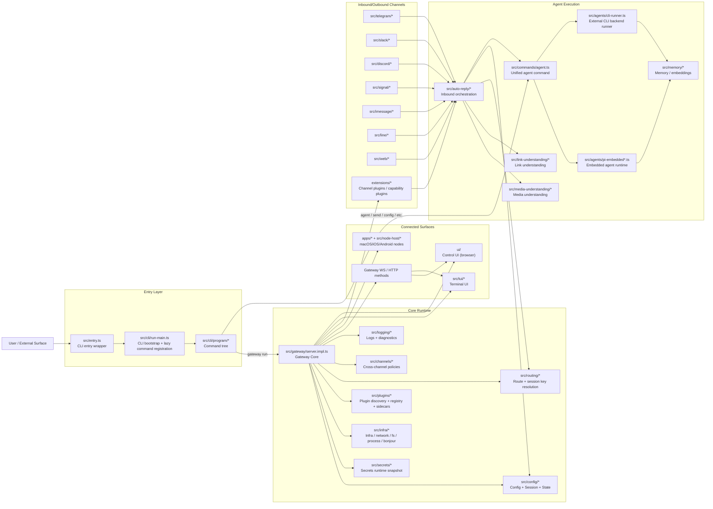
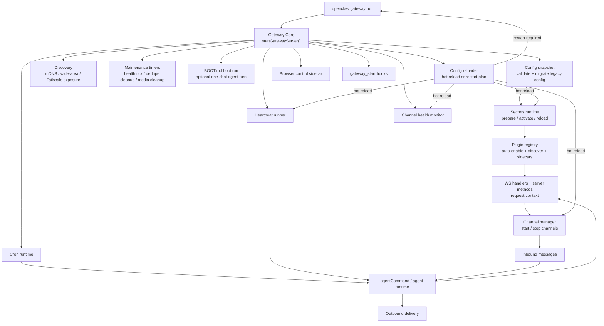
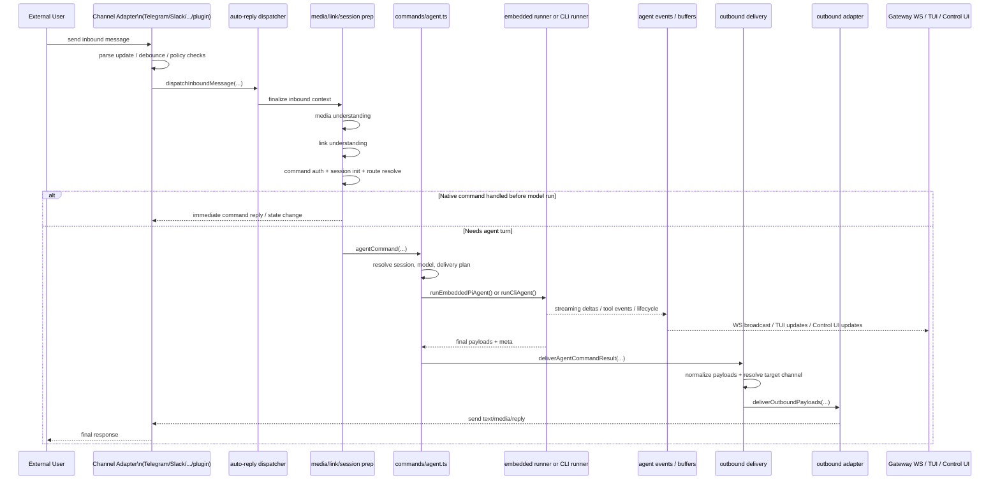
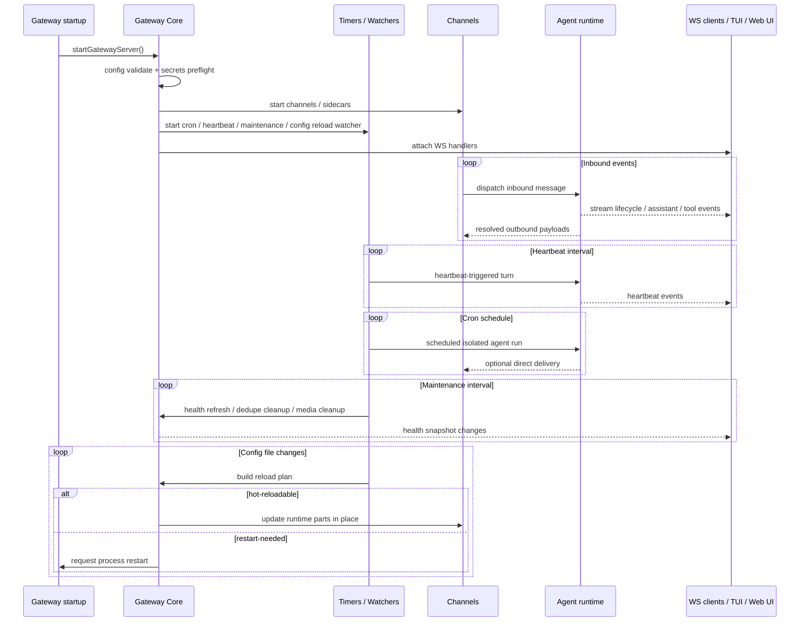
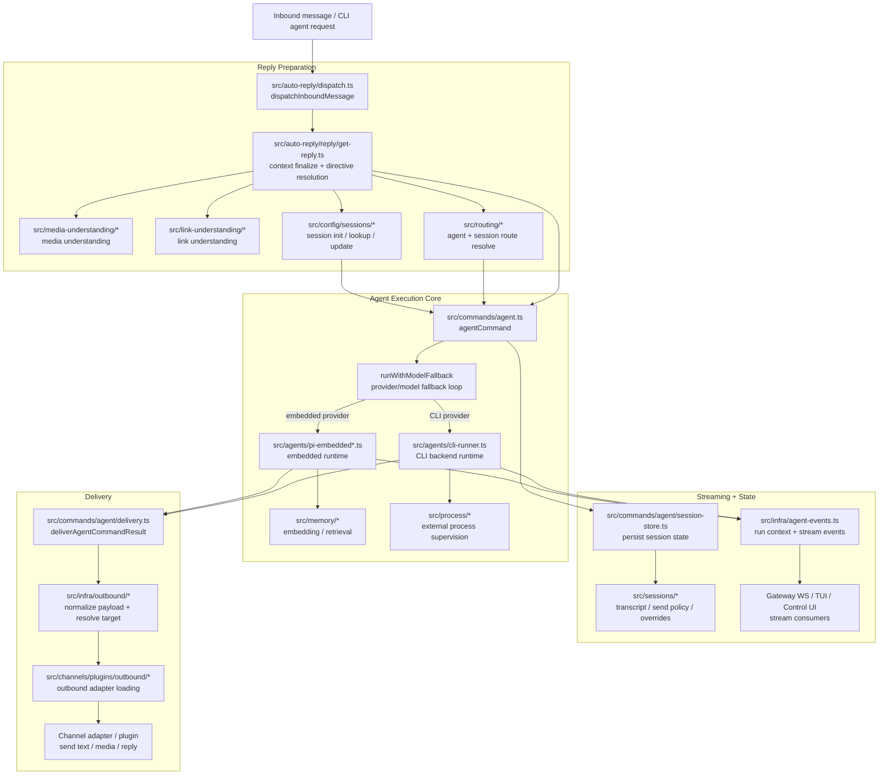
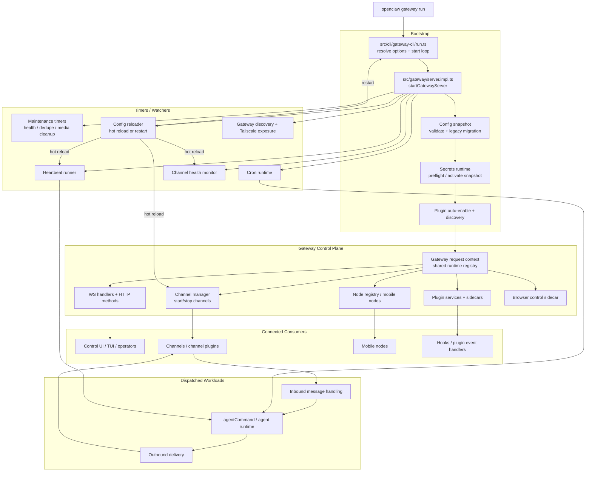
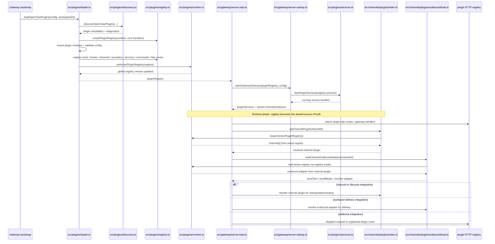
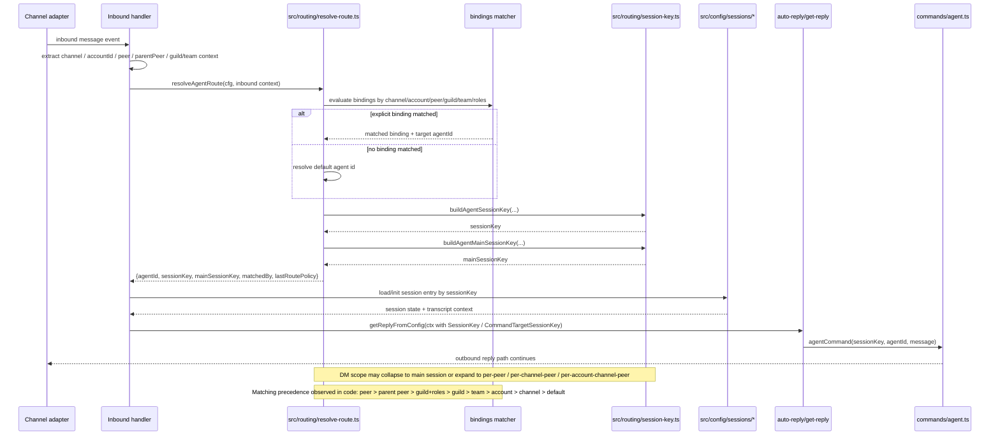
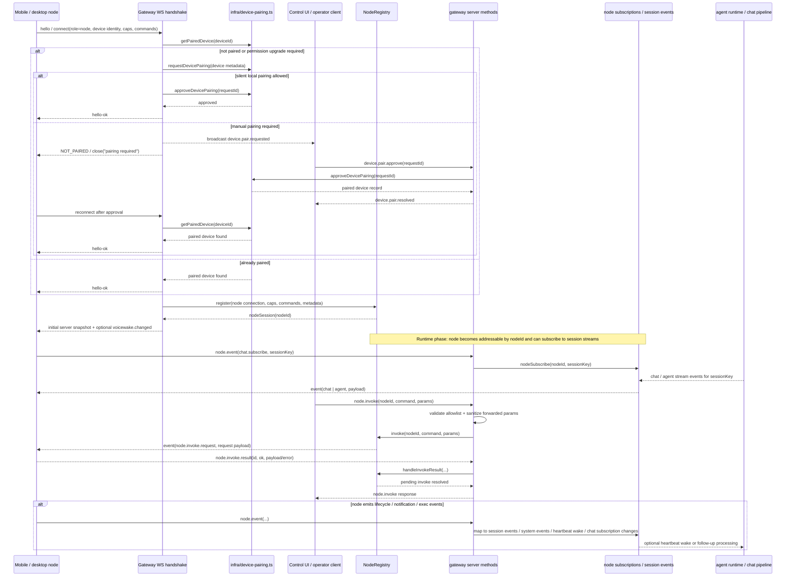

# OpenClaw Framework

## 1. 总体框架组成



## 2. Gateway 的装配与调度关系



## 3. 渠道消息进入直到回复送回去的核心时序



## 4. 关键时序与后台调度



## 5. Agent 子系统细化



## 6. Gateway 控制平面细化



## 7. 插件系统 / 渠道插件装配时序



## 8. 渠道入站后的 Session 路由与 Agent 绑定时序



## 9. Config / Secrets 热重载与重启判定时序

```mermaid
sequenceDiagram
    participant Watcher as config-reloader chokidar watcher
    participant Snapshot as readConfigFileSnapshot()
    participant Diff as diffConfigPaths()
    participant Plan as buildGatewayReloadPlan()
    participant Secrets as secrets runtime snapshot
    participant Handlers as server-reload-handlers.ts
    participant Channels as channel manager
    participant Sidecars as heartbeat / cron / browser / gmail / health monitor
    participant Restart as restart deferral / SIGUSR1 restart

    Watcher->>Snapshot: file add/change/unlink
    Snapshot-->>Watcher: config snapshot

    alt config missing or invalid
        Watcher-->>Watcher: skip reload / retry / warn
    else valid snapshot
        Watcher->>Diff: compare currentConfig vs nextConfig
        Diff-->>Watcher: changedPaths
        Watcher->>Plan: buildGatewayReloadPlan(changedPaths)
        Plan-->>Watcher: restartGateway? hot actions? noop paths?

        alt mode=off
            Watcher-->>Watcher: ignore change
        else mode=restart
            Watcher->>Restart: requestGatewayRestart(plan, nextConfig)
        else hybrid/hot and plan.restartGateway=true
            alt mode=hot
                Watcher-->>Watcher: warn restart required but ignored
            else hybrid
                Watcher->>Secrets: prepare/validate next secret snapshot only
                alt secrets preflight failed
                    Secrets-->>Watcher: restart not scheduled
                else preflight ok
                    Watcher->>Restart: requestGatewayRestart(plan, nextConfig)
                end
            end
        else hot-reloadable
            Watcher->>Secrets: prepare + activate runtime secret snapshot
            alt secrets activation failed
                Secrets-->>Watcher: keep last-known-good snapshot
            else activation ok
                Watcher->>Handlers: applyHotReload(plan, nextConfig)
                Handlers->>Sidecars: reload hooks / restart heartbeat / cron / gmail / browser / health monitor
                Handlers->>Channels: restart channels listed by plan.restartChannels
                Handlers-->>Watcher: hot reload applied
            end
        end
    end

    alt restart requested while work is active
        Restart->>Restart: deferGatewayRestartUntilIdle(queue + replies + embedded runs)
        Restart-->>Restart: emit restart when idle or timeout
    else no active work
        Restart->>Restart: emitGatewayRestart()
    end

    Note over Plan,Handlers: Plugin channel reload rules contribute hot/noop prefixes dynamically through listChannelPlugins()
    Note over Secrets,Handlers: On hot reload, secret activation happens before applying runtime changes; on failure, runtime stays on last-known-good snapshot
```

## 10. 节点系统（macOS / iOS / Android node）与 Gateway 交互时序


