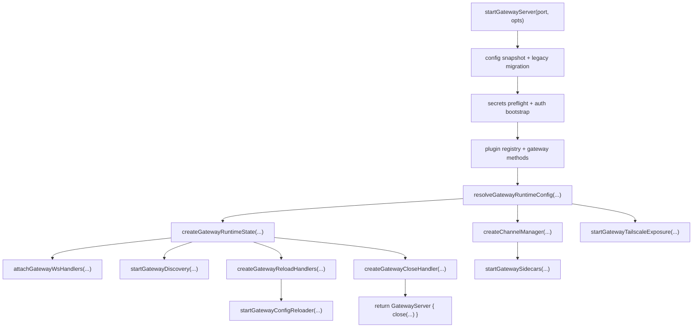
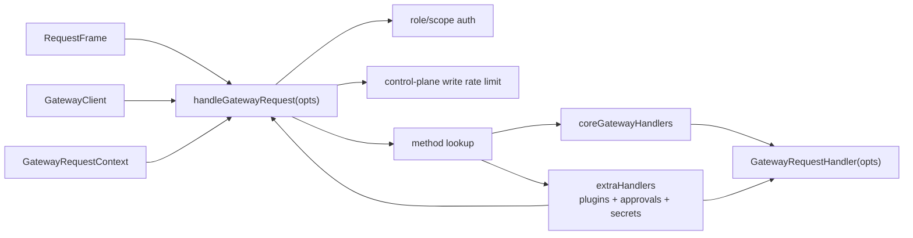
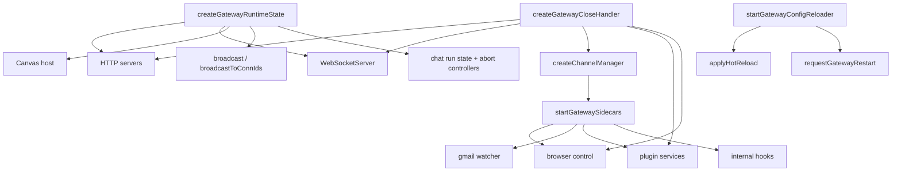

# OpenClaw Gateway 控制平面深度分析

## 1. 这部分模块的定位

这里分析的不是 Gateway 的某一个业务方法，而是 Gateway 作为“控制平面”被装起来的那一层。

核心关注点是：

- 它对外真正暴露了哪些 API
- 这些 API 的参数是什么
- 参数对象里有哪些字段
- 每个字段和每个方法的用途是什么
- Gateway 是如何把 HTTP / WS / plugin / channel / cron / node / secrets / reload 这些子系统装配到一起的

这一层的关键文件主要是：

- `src/gateway/server.ts`
- `src/gateway/server.impl.ts`
- `src/gateway/server-runtime-config.ts`
- `src/gateway/server-runtime-state.ts`
- `src/gateway/server-startup.ts`
- `src/gateway/server-methods.ts`
- `src/gateway/server-methods/types.ts`
- `src/gateway/server-reload-handlers.ts`
- `src/gateway/config-reload.ts`
- `src/gateway/server-ws-runtime.ts`
- `src/gateway/server-close.ts`
- `src/gateway/server-channels.ts`
- `src/gateway/server-methods-list.ts`

## 2. 模块对外公开的“包级 API”

如果从 `src/gateway/server.ts` 看，这一层真正对包外公开的表面其实非常窄。

### 2.1 `startGatewayServer(port?, opts?): Promise<GatewayServer>`

来源：`src/gateway/server.ts` 重新导出 `src/gateway/server.impl.ts`

用途：

- 启动整个 Gateway 控制平面
- 这是 Gateway 的主入口 API
- CLI 的 `gateway run` 最终就是调用它

参数：

- `port = 18789`
  - 含义：Gateway WebSocket/HTTP 的监听端口
  - 用途：统一控制对外暴露的主端口；还会被写回 `OPENCLAW_GATEWAY_PORT`，供 browser/canvas 等派生端口或 URL 逻辑感知

- `opts: GatewayServerOptions = {}`
  - 含义：Gateway 启动时的运行时覆盖项
  - 用途：允许 CLI 或测试在不改动配置文件的前提下，覆盖 bind、auth、HTTP endpoint、Tailscale、wizard runner 等行为

### 2.2 `type GatewayServer`

定义：

- `close(opts?): Promise<void>`

用途：

- 对外只暴露一个“关闭 Gateway”的 handle
- 调用者不需要知道 Gateway 内部起了多少 HTTP server、WS server、sidecar、channel、plugin service 或 watcher

`close(opts?)` 的参数：

- `reason?: string`
  - 含义：关闭原因文本
  - 用途：广播给连接中的客户端，同时传递给 stop hook 和 shutdown event
- `restartExpectedMs?: number | null`
  - 含义：预估的重启等待时间
  - 用途：在“准备重启而不是永久下线”时，告诉客户端这是一次预期内重启

### 2.3 `type GatewayServerOptions`

这是 `startGatewayServer(...)` 最重要的参数对象。

字段如下。

- `bind?: GatewayBindMode`
  - 含义：绑定策略，而不是具体 host
  - 可选值：`loopback` / `lan` / `tailnet` / `auto` / `custom`
  - 用途：告诉 Gateway 应该如何选择监听地址

- `host?: string`
  - 含义：直接指定监听 host，绕过 bind mode 解析
  - 用途：高级覆盖项；通常只在测试或特殊部署里使用

- `controlUiEnabled?: boolean`
  - 含义：是否启用浏览器 Control UI
  - 用途：临时关闭内置控制面前端，而不改配置文件

- `openAiChatCompletionsEnabled?: boolean`
  - 含义：是否启用 `POST /v1/chat/completions`
  - 用途：按启动上下文决定是否暴露兼容 OpenAI 的 HTTP endpoint

- `openResponsesEnabled?: boolean`
  - 含义：是否启用 `POST /v1/responses`
  - 用途：控制 OpenResponses API 是否对外开放

- `auth?: GatewayAuthConfig`
  - 含义：Gateway auth 配置覆盖项
  - 用途：在启动期动态覆盖 `gateway.auth`，而不是直接写配置

- `tailscale?: GatewayTailscaleConfig`
  - 含义：Gateway Tailscale 暴露配置覆盖项
  - 用途：在启动期覆盖 `gateway.tailscale`

- `allowCanvasHostInTests?: boolean`
  - 含义：测试环境下是否允许启动 canvas host
  - 用途：测试专用逃生口

- `wizardRunner?: (opts, runtime, prompter) => Promise<void>`
  - 含义：覆盖 onboarding wizard 的执行器
  - 用途：测试替身、特殊集成场景或替换向导实现

`wizardRunner` 参数说明：

- `opts: OnboardOptions`
  - 含义：wizard 启动参数对象
  - 用途：决定 onboarding 的输入模式和行为
- `runtime: RuntimeEnv`
  - 含义：输出/退出运行时抽象
  - 用途：让 wizard 使用 Gateway/CLI 统一的 runtime
- `prompter: WizardPrompter`
  - 含义：交互式提示器
  - 用途：封装用户输入与 UI 交互

### 2.4 `truncateCloseReason(...)`

来源：`src/gateway/server.ts`

用途：

- 这是一个关闭原因字符串处理 helper
- 不是装配主入口，但属于 `server.ts` 公开的辅助 API

### 2.5 `__resetModelCatalogCacheForTest()`

用途：

- 测试专用缓存重置接口
- 不是正常运行时 API

## 3. `startGatewayServer(...)` 实际做了什么

这个 API 做的不是单一“起服务”。它会完整装配控制平面。

主要阶段如下：

1. 读取并迁移配置
2. 执行 secrets 预激活与启动期校验
3. 处理 Gateway auth bootstrap
4. 装配 plugin registry 和 gateway methods
5. 解析 runtime config
6. 构建 HTTP/WS/canvas host 运行时状态
7. 启动 discovery、maintenance、heartbeat、cron、channels、browser control、plugin services 等 sidecar
8. 绑定 WS handler 和 Gateway request handler
9. 启动 config reloader
10. 返回一个只暴露 `close(...)` 的 `GatewayServer`

所以 `startGatewayServer(...)` 本质上是一个“Gateway 应用装配器”。

## 4. 控制平面内部装配 API

这一节开始讲“包级 API 之外”，控制平面内部彼此协作时暴露的装配接口。

## 5. `resolveGatewayRuntimeConfig(params): Promise<GatewayRuntimeConfig>`

定义位置：`src/gateway/server-runtime-config.ts`

用途：

- 把 config + 启动覆盖项解析成 Gateway 最终运行所需的规范化 runtime config
- 是 `startGatewayServer(...)` 在真正起 HTTP/WS 前的关键预处理步骤

参数对象 `params` 字段：

- `cfg: ReturnType<typeof loadConfig>`
  - 含义：完整 OpenClaw 配置对象
  - 用途：作为所有 Gateway runtime 计算的基线

- `port: number`
  - 含义：最终监听端口
  - 用途：参与 auth/loopback/non-loopback 安全检查和错误信息生成

- `bind?: GatewayBindMode`
  - 含义：运行期 bind 覆盖项
  - 用途：覆盖 `cfg.gateway.bind`

- `host?: string`
  - 含义：直接指定 host
  - 用途：绕过 bind 解析逻辑

- `controlUiEnabled?: boolean`
  - 含义：运行期 Control UI 开关覆盖

- `openAiChatCompletionsEnabled?: boolean`
  - 含义：运行期 OpenAI chat completions endpoint 开关覆盖

- `openResponsesEnabled?: boolean`
  - 含义：运行期 OpenResponses endpoint 开关覆盖

- `auth?: GatewayAuthConfig`
  - 含义：运行期 auth 覆盖对象

- `tailscale?: GatewayTailscaleConfig`
  - 含义：运行期 tailscale 覆盖对象

返回对象 `GatewayRuntimeConfig` 字段：

- `bindHost: string`
  - 含义：最终解析出来的监听地址
- `controlUiEnabled: boolean`
  - 含义：Control UI 是否启用
- `openAiChatCompletionsEnabled: boolean`
  - 含义：chat completions endpoint 是否启用
- `openAiChatCompletionsConfig?`
  - 含义：chat completions endpoint 的完整规范化配置
- `openResponsesEnabled: boolean`
  - 含义：responses endpoint 是否启用
- `openResponsesConfig?`
  - 含义：responses endpoint 的完整规范化配置
- `strictTransportSecurityHeader?: string`
  - 含义：若启用则返回最终 HSTS header 值
- `controlUiBasePath: string`
  - 含义：Control UI 基础路径
- `controlUiRoot?: string`
  - 含义：Control UI root override 路径
- `resolvedAuth: ResolvedGatewayAuth`
  - 含义：最终 auth 解析结果
- `authMode: ResolvedGatewayAuth['mode']`
  - 含义：最终 auth 模式
- `tailscaleConfig: GatewayTailscaleConfig`
  - 含义：合并后的 tailscale 配置
- `tailscaleMode: 'off' | 'serve' | 'funnel'`
  - 含义：最终 tailscale 暴露模式
- `hooksConfig: ReturnType<typeof resolveHooksConfig>`
  - 含义：规范化后的 hooks 配置
- `canvasHostEnabled: boolean`
  - 含义：canvas host 是否启用

这个函数的核心价值是：

- 把一堆来源不同的输入合并成唯一可信的运行时配置对象
- 在装配最早阶段就把安全边界和非法组合挡掉

## 6. `createGatewayRuntimeState(params): Promise<...>`

定义位置：`src/gateway/server-runtime-state.ts`

用途：

- 创建 Gateway 的传输层和运行时状态容器
- 负责起 HTTP server、WebSocketServer、canvas host，以及 chat/client/broadcast 相关状态

参数对象 `params` 很大，可以按职责分组理解。

### 6.1 网络与监听参数

- `cfg: OpenClawConfig`
  - 用途：读取 canvas host、HTTP endpoint 等配置
- `bindHost: string`
  - 用途：日志输出、listen host 解析、对外告警
- `port: number`
  - 用途：HTTP/WS 监听端口

### 6.2 Control UI / HTTP endpoint 参数

- `controlUiEnabled: boolean`
  - 用途：决定是否挂载控制 UI
- `controlUiBasePath: string`
  - 用途：决定 UI 的路由前缀
- `controlUiRoot?: ControlUiRootState`
  - 用途：描述 UI root 的状态
  - 对象形态：
    - `kind: 'resolved' | 'bundled' | 'invalid' | 'missing'`
    - `path?: string`
- `openAiChatCompletionsEnabled: boolean`
  - 用途：是否暴露 `/v1/chat/completions`
- `openAiChatCompletionsConfig?`
  - 用途：chat completions 端点细配置
- `openResponsesEnabled: boolean`
  - 用途：是否暴露 `/v1/responses`
- `openResponsesConfig?`
  - 用途：responses 端点细配置
- `strictTransportSecurityHeader?: string`
  - 用途：为 HTTP server 配置 HSTS

### 6.3 安全与认证参数

- `resolvedAuth: ResolvedGatewayAuth`
  - 用途：HTTP/WS 握手和 plugin path auth enforcement
- `rateLimiter?: AuthRateLimiter`
  - 用途：auth brute-force 防护
- `gatewayTls?: GatewayTlsRuntime`
  - 用途：提供 TLS 监听配置

### 6.4 扩展与 hook 参数

- `hooksConfig: () => HooksConfigResolved | null`
  - 用途：给 hook request handler 提供延迟读取的 hooks 配置
- `pluginRegistry: PluginRegistry`
  - 用途：生成 plugin HTTP handler，并决定 plugin path 是否强制 gateway auth

### 6.5 运行时依赖与日志参数

- `deps: CliDeps`
  - 用途：hook、消息发送、下游命令执行等运行时依赖
- `canvasRuntime: RuntimeEnv`
  - 用途：canvas host 的 runtime
- `canvasHostEnabled: boolean`
  - 用途：决定是否尝试启动 canvas host
- `allowCanvasHostInTests?: boolean`
  - 用途：测试环境逃生口
- `logCanvas`
  - 字段：`info`, `warn`
  - 用途：canvas host 相关日志
- `log`
  - 字段：`info`, `warn`
  - 用途：Gateway 主日志
- `logHooks`
  - 用途：hook 子系统日志器
- `logPlugins`
  - 用途：plugin HTTP/route 子系统日志器
- `getReadiness?: ReadinessChecker`
  - 用途：把 readiness 检查挂入 HTTP 层

返回对象字段很多，也按职责分组理解。

### 6.6 返回值：传输层对象

- `canvasHost: CanvasHostHandler | null`
  - 含义：canvas host handle
- `httpServer: HttpServer`
  - 含义：主 HTTP server
- `httpServers: HttpServer[]`
  - 含义：所有实际监听的 HTTP server（包括 loopback alias）
- `httpBindHosts: string[]`
  - 含义：实际成功绑定的 host 列表
- `wss: WebSocketServer`
  - 含义：Gateway WS server

### 6.7 返回值：连接与广播对象

- `clients: Set<GatewayWsClient>`
  - 含义：当前 WS 客户端集合
- `broadcast: GatewayBroadcastFn`
  - 含义：向所有订阅方广播 Gateway 事件
- `broadcastToConnIds: GatewayBroadcastToConnIdsFn`
  - 含义：只向指定连接集合广播

### 6.8 返回值：Agent / Chat 状态对象

- `agentRunSeq: Map<string, number>`
  - 含义：run 序列号
- `dedupe: Map<string, DedupeEntry>`
  - 含义：去重缓存
- `chatRunState`
  - 含义：chat run 总状态容器
- `chatRunBuffers: Map<string, string>`
  - 含义：chat 文本 buffer
- `chatDeltaSentAt: Map<string, number>`
  - 含义：最近一次 delta 推送时间
- `addChatRun(sessionId, entry)`
  - 用途：注册运行中的 chat run
- `removeChatRun(sessionId, clientRunId, sessionKey?)`
  - 用途：移除 chat run
- `chatAbortControllers: Map<string, ChatAbortControllerEntry>`
  - 含义：可中断 chat run 的控制器表
- `toolEventRecipients`
  - 含义：工具事件订阅者注册器

这个 API 的本质是：

- 一次性把“传输层 + 连接状态 + chat 运行时状态”都建立好
- 返回给上层作为 Gateway 活动期的核心状态容器

## 7. `startGatewaySidecars(params)`

定义位置：`src/gateway/server-startup.ts`

用途：

- 启动 Gateway 附属 sidecar / background subsystem
- 这一步不是起 HTTP/WS，而是起“配套服务”

参数对象字段：

- `cfg`
  - 含义：当前配置
- `pluginRegistry`
  - 含义：已装好的插件注册表
- `defaultWorkspaceDir: string`
  - 用途：hooks/internal hook/plugin services 等需要 workspace 路径
- `deps: CliDeps`
  - 用途：startup hook / restart sentinel 等依赖注入
- `startChannels: () => Promise<void>`
  - 用途：启动所有 channel runtime
- `log`
  - 字段：`warn`
  - 用途：主 sidecar 启动告警
- `logHooks`
  - 字段：`info`, `warn`, `error`
  - 用途：hooks / Gmail watcher 日志
- `logChannels`
  - 字段：`info`, `error`
  - 用途：channels 启动日志
- `logBrowser`
  - 字段：`error`
  - 用途：browser control sidecar 启动失败日志

它实际做的事情包括：

- 清理 stale session lock files
- 启动 browser control server
- 启动 Gmail watcher
- 校验 hooks.gmail.model
- 载入 internal hooks
- 启动 channels
- 触发 `gateway:startup` internal hook
- 启动 plugin services
- ACP startup identity reconcile
- 初始化 memory backend
- 处理 restart sentinel wake

返回对象：

- `browserControl`
  - 类型上只要求有 `stop(): Promise<void>`
  - 用途：后续 reload / shutdown 时停止 browser control sidecar
- `pluginServices`
  - `PluginServicesHandle | null`
  - 用途：后续 shutdown 时停止插件服务

## 8. `createChannelManager(opts): ChannelManager`

定义位置：`src/gateway/server-channels.ts`

用途：

- 管理 channel runtime 的启动、停止、自动重启、状态快照
- 这是 Gateway 里所有 channel 生命周期的统一入口

参数对象 `opts`：

- `loadConfig: () => OpenClawConfig`
  - 用途：每次启动/重启 channel 时读取当前 config
- `channelLogs: Record<ChannelId, SubsystemLogger>`
  - 用途：按 channel 分配日志器
- `channelRuntimeEnvs: Record<ChannelId, RuntimeEnv>`
  - 用途：按 channel 分配 runtime
- `channelRuntime?: PluginRuntime['channel']`
  - 用途：给外部 channel plugin 注入高级 plugin runtime helper

返回对象 `ChannelManager` 字段：

- `getRuntimeSnapshot(): ChannelRuntimeSnapshot`
  - 用途：读取当前所有 channel/account 运行状态
- `startChannels(): Promise<void>`
  - 用途：启动全部 channel
- `startChannel(channel, accountId?): Promise<void>`
  - 用途：启动某个 channel 或某个 account
- `stopChannel(channel, accountId?): Promise<void>`
  - 用途：停止某个 channel 或 account
- `markChannelLoggedOut(channelId, cleared, accountId?)`
  - 用途：标记某个 channel/account 已登出
- `isManuallyStopped(channelId, accountId): boolean`
  - 用途：判断某个 runtime 是否被人工停掉，避免自动重启
- `resetRestartAttempts(channelId, accountId): void`
  - 用途：重置自动重启计数

`ChannelRuntimeSnapshot` 字段：

- `channels: Partial<Record<ChannelId, ChannelAccountSnapshot>>`
  - 含义：每个 channel 的默认/主运行时快照
- `channelAccounts: Partial<Record<ChannelId, Record<string, ChannelAccountSnapshot>>>`
  - 含义：每个 channel 下按 accountId 划分的运行时快照

## 9. `createGatewayReloadHandlers(params)`

定义位置：`src/gateway/server-reload-handlers.ts`

用途：

- 为 config reload 提供两种行为：
  - hot reload
  - restart request

参数对象 `params` 字段：

- `deps: CliDeps`
  - 用途：重建 cron 等子系统时复用依赖
- `broadcast(event, payload, opts?)`
  - 用途：重载后向前端/客户端广播事件
- `getState(): GatewayHotReloadState`
  - 用途：读取当前可热更新状态
- `setState(state): void`
  - 用途：应用热更新后的新状态
- `startChannel(name)` / `stopChannel(name)`
  - 用途：对单个 channel 做热重启
- `logHooks`, `logBrowser`, `logChannels`, `logCron`, `logReload`
  - 用途：各子系统重载日志
- `createHealthMonitor(checkIntervalMs)`
  - 用途：按新配置重建 channel health monitor

`GatewayHotReloadState` 字段：

- `hooksConfig`
  - 含义：当前 hooks 配置
- `heartbeatRunner`
  - 含义：当前 heartbeat runner
- `cronState`
  - 含义：当前 cron service 及其存储路径
- `browserControl`
  - 含义：当前 browser control sidecar handle
- `channelHealthMonitor`
  - 含义：当前 channel health monitor handle

返回对象字段：

- `applyHotReload(plan, nextConfig): Promise<void>`
  - 用途：对允许热更的项做 in-place 更新
- `requestGatewayRestart(plan, nextConfig): void`
  - 用途：对必须重启的变更发起 SIGUSR1 restart 流程

## 10. `startGatewayConfigReloader(opts): GatewayConfigReloader`

定义位置：`src/gateway/config-reload.ts`

用途：

- 文件级 config watcher
- 监听 config 文件变化，决定：忽略 / hot reload / restart

参数对象 `opts` 字段：

- `initialConfig: OpenClawConfig`
  - 用途：作为当前配置基线
- `readSnapshot: () => Promise<ConfigFileSnapshot>`
  - 用途：读取配置快照
- `onHotReload(plan, nextConfig): Promise<void>`
  - 用途：执行热更新
- `onRestart(plan, nextConfig): void | Promise<void>`
  - 用途：执行重启判定和重启请求
- `log`
  - 字段：`info`, `warn`, `error`
  - 用途：reloader 日志
- `watchPath: string`
  - 含义：被 watch 的配置文件路径

返回对象 `GatewayConfigReloader` 字段：

- `stop(): Promise<void>`
  - 用途：停止 chokidar watcher，清掉 debounce timer

辅助对象 `GatewayReloadSettings` 字段：

- `mode: GatewayReloadMode`
  - 可选值：`off` / `restart` / `hot` / `hybrid`
  - 用途：决定 reload 策略
- `debounceMs: number`
  - 用途：控制文件变化 debounce 时间

辅助对象 `GatewayReloadPlan` 字段：

- `changedPaths: string[]`
  - 含义：发生变化的配置路径
- `restartGateway: boolean`
  - 含义：是否需要整体重启 Gateway
- `restartReasons: string[]`
  - 含义：触发整体重启的路径列表
- `hotReasons: string[]`
  - 含义：可以热更新的路径列表
- `reloadHooks: boolean`
  - 含义：是否需要重载 hooks
- `restartGmailWatcher: boolean`
  - 含义：是否需要重启 Gmail watcher
- `restartBrowserControl: boolean`
  - 含义：是否需要重启 browser control sidecar
- `restartCron: boolean`
  - 含义：是否需要重建 cron service
- `restartHeartbeat: boolean`
  - 含义：是否需要刷新 heartbeat runner 配置
- `restartHealthMonitor: boolean`
  - 含义：是否需要重建 health monitor
- `restartChannels: Set<ChannelKind>`
  - 含义：哪些 channel 需要重启
- `noopPaths: string[]`
  - 含义：变化了但不会触发动作的路径

## 11. `attachGatewayWsHandlers(params)`

定义位置：`src/gateway/server-ws-runtime.ts`

用途：

- 把 Gateway WS 连接处理器挂到 `WebSocketServer`
- 它不是业务 handler 本身，而是“把 handler 所需依赖全部接好”

参数对象 `params` 由两部分组成：

### 11.1 继承自 `GatewayWsSharedHandlerParams` 的字段

- `wss: WebSocketServer`
  - 用途：WS server 实例
- `clients: Set<GatewayWsClient>`
  - 用途：当前连接池
- `port: number`
  - 用途：构造对外信息和默认 URL
- `gatewayHost?: string`
  - 用途：构造 canvas host URL 等对外地址
- `canvasHostEnabled: boolean`
  - 用途：告诉连接处理器 canvas host 是否可用
- `canvasHostServerPort?: number`
  - 用途：单独指定 canvas host 端口
- `resolvedAuth: ResolvedGatewayAuth`
  - 用途：WS 握手鉴权
- `rateLimiter?: AuthRateLimiter`
  - 用途：通用连接认证限流
- `browserRateLimiter?: AuthRateLimiter`
  - 用途：浏览器来源的专用限流器
- `gatewayMethods: string[]`
  - 用途：向客户端公布可调用 method 列表
- `events: string[]`
  - 用途：向客户端公布可订阅 event 列表

### 11.2 `GatewayWsRuntimeParams` 自有字段

- `logGateway`
  - 用途：Gateway 主日志器
- `logHealth`
  - 用途：health 相关日志器
- `logWsControl`
  - 用途：WS 控制面日志器
- `extraHandlers: GatewayRequestHandlers`
  - 用途：把 plugin / exec approval / secrets 等动态 handler 注入 WS 请求路径
- `broadcast(event, payload, opts?)`
  - 用途：向连接池广播事件
- `context: GatewayRequestContext`
  - 用途：为每个请求提供统一 request context

## 12. `handleGatewayRequest(opts)` 与请求处理 API

定义位置：`src/gateway/server-methods.ts`

用途：

- Gateway method dispatcher
- 按 method 名把请求路由到对应 handler
- 在真正调用 handler 前统一做 role/scope/control-plane write rate limit 检查

参数对象 `opts` 字段：

- `req: RequestFrame`
  - 含义：客户端请求帧
- `client: GatewayClient | null`
  - 含义：当前 WS 客户端上下文
- `isWebchatConnect(params): boolean`
  - 用途：判断连接是否属于 webchat connect 场景
- `respond: RespondFn`
  - 用途：向客户端回写请求结果
- `context: GatewayRequestContext`
  - 用途：请求执行所需的一切控制平面上下文
- `extraHandlers?: GatewayRequestHandlers`
  - 用途：在 core handlers 之外，附加 plugin 或特殊 handler

### 12.1 `GatewayClient` 字段

- `connect: ConnectParams`
  - 含义：连接协商参数
- `connId?: string`
  - 含义：连接 ID
- `clientIp?: string`
  - 含义：客户端 IP
- `canvasHostUrl?: string`
  - 含义：对这个客户端可见的 canvas host URL
- `canvasCapability?: string`
  - 含义：canvas capability 标识
- `canvasCapabilityExpiresAtMs?: number`
  - 含义：capability 过期时间

### 12.2 `RespondFn`

签名：

- `respond(ok, payload?, error?, meta?)`

参数用途：

- `ok: boolean`
  - 请求是否成功
- `payload?: unknown`
  - 成功载荷
- `error?: ErrorShape`
  - 失败错误对象
- `meta?: Record<string, unknown>`
  - 附加元信息

### 12.3 `GatewayRequestContext` 字段

这是整个控制平面最重要的上下文对象之一。它把运行期能力全部打包给 method handlers。

字段如下。

#### 运行依赖与服务

- `deps: ReturnType<typeof createDefaultDeps>`
  - 渠道发送依赖集
- `cron: CronService`
  - cron 服务实例
- `cronStorePath: string`
  - cron 存储路径
- `execApprovalManager?: ExecApprovalManager`
  - exec approval 管理器
- `loadGatewayModelCatalog(): Promise<ModelCatalogEntry[]>`
  - 模型目录加载器

#### 健康与日志

- `getHealthCache(): HealthSummary | null`
  - 读取缓存的 health snapshot
- `refreshHealthSnapshot(opts?): Promise<HealthSummary>`
  - 主动刷新 health snapshot
- `logHealth`
  - health 错误日志
- `logGateway`
  - Gateway 主日志器
- `incrementPresenceVersion(): number`
  - 推进 presence 版本号
- `getHealthVersion(): number`
  - 读取 health 版本号

#### 广播与客户端通知

- `broadcast`
  - 广播事件给所有客户端
- `broadcastToConnIds`
  - 向指定连接集合广播

#### 节点系统接口

- `nodeSendToSession(sessionKey, event, payload)`
  - 向订阅某 session 的节点发送事件
- `nodeSendToAllSubscribed(event, payload)`
  - 向所有已订阅节点广播事件
- `nodeSubscribe(nodeId, sessionKey)`
  - 建立节点对 session 的订阅
- `nodeUnsubscribe(nodeId, sessionKey)`
  - 取消单个订阅
- `nodeUnsubscribeAll(nodeId)`
  - 清空某节点的所有订阅
- `hasConnectedMobileNode(): boolean`
  - 判断是否有移动节点在线
- `hasExecApprovalClients?(): boolean`
  - 判断是否存在可处理 exec approval 的 operator 客户端
- `nodeRegistry: NodeRegistry`
  - 节点注册表

#### Agent / chat 运行状态

- `agentRunSeq: Map<string, number>`
  - run 序列号映射
- `chatAbortControllers: Map<string, ChatAbortControllerEntry>`
  - chat run 中断控制器
- `chatAbortedRuns: Map<string, number>`
  - 被中断的运行记录
- `chatRunBuffers: Map<string, string>`
  - chat 文本缓冲区
- `chatDeltaSentAt: Map<string, number>`
  - 最近一次 delta 发送时间
- `addChatRun(sessionId, entry)`
  - 注册 chat run
- `removeChatRun(sessionId, clientRunId, sessionKey?)`
  - 注销 chat run
- `registerToolEventRecipient(runId, connId)`
  - 为 tool event 建立接收者映射
- `dedupe: Map<string, DedupeEntry>`
  - 去重表

#### Wizard 与 channel lifecycle

- `wizardSessions: Map<string, WizardSession>`
  - 活跃 wizard session 表
- `findRunningWizard(): string | null`
  - 查找正在运行的 wizard
- `purgeWizardSession(id): void`
  - 清理 wizard session
- `getRuntimeSnapshot(): ChannelRuntimeSnapshot`
  - 读取 channel runtime 快照
- `startChannel(channel, accountId?)`
  - 启动 channel/account
- `stopChannel(channel, accountId?)`
  - 停止 channel/account
- `markChannelLoggedOut(channelId, cleared, accountId?)`
  - 标记 channel/account 已登出
- `wizardRunner(opts, runtime, prompter)`
  - 触发 onboarding wizard

#### 其他控制面广播

- `broadcastVoiceWakeChanged(triggers: string[])`
  - 向客户端广播 voice wake 触发词变化

### 12.4 `GatewayRequestHandlerOptions`

这是单个 method handler 真正收到的参数对象。

字段：

- `req: RequestFrame`
- `params: Record<string, unknown>`
- `client: GatewayClient | null`
- `isWebchatConnect(...)`
- `respond: RespondFn`
- `context: GatewayRequestContext`

### 12.5 `GatewayRequestHandler` 与 `GatewayRequestHandlers`

- `GatewayRequestHandler`
  - 签名：`(opts: GatewayRequestHandlerOptions) => Promise<void> | void`
- `GatewayRequestHandlers`
  - 形态：`Record<string, GatewayRequestHandler>`
  - 用途：method 名到 handler 的映射表

## 13. `listGatewayMethods()` 与 `GATEWAY_EVENTS`

定义位置：`src/gateway/server-methods-list.ts`

用途：

- `listGatewayMethods()`
  - 返回 Gateway 当前对外可调用的方法名集合
  - 会把 base methods 和 channel plugin 贡献的方法合并后去重
- `GATEWAY_EVENTS`
  - 返回 Gateway 对外广播事件的白名单

当前 base methods 覆盖：

- health / logs / channels / status / usage / tts
- config / exec approvals / wizard / talk / models / tools catalog
- agents / skills / update / secrets / sessions
- heartbeat / wake / node pair / device pair / node invoke / cron
- send / agent / browser / chat 等

当前 events 覆盖：

- `connect.challenge`
- `agent`
- `chat`
- `presence`
- `tick`
- `talk.mode`
- `shutdown`
- `health`
- `heartbeat`
- `cron`
- node/device pairing 与 invoke 相关事件
- `voicewake.changed`
- exec approval 相关事件
- `update.available`

## 14. `startGatewayDiscovery(params)`

定义位置：`src/gateway/server-discovery-runtime.ts`

用途：

- 启动 Gateway 的本地 Bonjour/mDNS 广播与 wide-area DNS-SD 更新

参数对象字段：

- `machineDisplayName: string`
  - 用途：生成对外展示的 Gateway 实例名
- `port: number`
  - 用途：广播 Gateway 端口
- `gatewayTls?: { enabled: boolean; fingerprintSha256?: string }`
  - 用途：在 discovery 广播里携带 TLS 信息
- `canvasPort?: number`
  - 用途：广播 canvas 端口
- `wideAreaDiscoveryEnabled: boolean`
  - 用途：是否启用 wide-area discovery
- `wideAreaDiscoveryDomain?: string | null`
  - 用途：wide-area discovery domain
- `tailscaleMode: 'off' | 'serve' | 'funnel'`
  - 用途：决定 tailnet 相关 discovery 提示
- `mdnsMode?: 'off' | 'minimal' | 'full'`
  - 用途：决定 Bonjour 发布的详细程度
- `logDiscovery`
  - 字段：`info`, `warn`
  - 用途：discovery 日志输出

返回对象字段：

- `bonjourStop: (() => Promise<void>) | null`
  - 用途：关闭 Bonjour 广播

## 15. `startGatewayTailscaleExposure(params)`

定义位置：`src/gateway/server-tailscale.ts`

用途：

- 启动 Gateway 的 Tailscale serve/funnel 暴露
- 可选返回一个 cleanup 函数

参数对象字段：

- `tailscaleMode: 'off' | 'serve' | 'funnel'`
  - 用途：决定是否以及如何暴露 Gateway
- `resetOnExit?: boolean`
  - 用途：退出时是否自动清理 tailscale serve/funnel 配置
- `port: number`
  - 用途：暴露的本地端口
- `controlUiBasePath?: string`
  - 用途：日志里拼接 Control UI URL
- `logTailscale`
  - 字段：`info`, `warn`
  - 用途：tailscale 日志

返回值：

- `Promise<(() => Promise<void>) | null>`
  - 若返回函数，则这个函数就是退出清理器

## 16. `createGatewayCloseHandler(params)`

定义位置：`src/gateway/server-close.ts`

用途：

- 构造统一 shutdown 函数
- 把 Gateway 的所有资源释放逻辑集中到一起

参数对象字段：

- `bonjourStop`
  - 用途：停止 discovery 广播
- `tailscaleCleanup`
  - 用途：清理 tailscale 暴露
- `canvasHost`
  - 用途：关闭 canvas host
- `canvasHostServer`
  - 用途：关闭 canvas host server
- `stopChannel(name, accountId?)`
  - 用途：停止 channel runtime
- `pluginServices`
  - 用途：停止 plugin services
- `cron`
  - 用途：停止 cron service
- `heartbeatRunner`
  - 用途：停止 heartbeat runner
- `updateCheckStop?`
  - 用途：停止启动后的 update check timer
- `nodePresenceTimers`
  - 用途：清理节点 presence 定时器
- `broadcast`
  - 用途：广播 shutdown event
- `tickInterval`, `healthInterval`, `dedupeCleanup`, `mediaCleanup`
  - 用途：关闭 maintenance timers
- `agentUnsub`, `heartbeatUnsub`
  - 用途：撤销事件订阅
- `chatRunState`
  - 用途：清空 chat state
- `clients`
  - 用途：遍历并关闭所有 WS 客户端
- `configReloader`
  - 用途：停止 config watcher
- `browserControl`
  - 用途：关闭 browser control sidecar
- `wss`
  - 用途：关闭 WebSocket server
- `httpServer`, `httpServers?`
  - 用途：关闭 HTTP 监听器

返回值：

- 一个 async `close(opts?)` 函数

该 `close(opts?)` 的参数：

- `reason?: string`
  - 用途：广播 shutdown 原因
- `restartExpectedMs?: number | null`
  - 用途：告诉客户端是否是预期内重启

## 17. Gateway 控制平面“方法装配”的含义

`src/gateway/server-methods.ts` 中的 `coreGatewayHandlers` 是 Gateway 控制平面最重要的“能力目录”。

它把多个 handler map 合并为一个总表：

- `connectHandlers`
- `logsHandlers`
- `voicewakeHandlers`
- `healthHandlers`
- `channelsHandlers`
- `chatHandlers`
- `cronHandlers`
- `deviceHandlers`
- `doctorHandlers`
- `execApprovalsHandlers`
- `webHandlers`
- `modelsHandlers`
- `configHandlers`
- `wizardHandlers`
- `talkHandlers`
- `toolsCatalogHandlers`
- `ttsHandlers`
- `skillsHandlers`
- `sessionsHandlers`
- `systemHandlers`
- `updateHandlers`
- `nodeHandlers`
- `pushHandlers`
- `sendHandlers`
- `usageHandlers`
- `agentHandlers`
- `agentsHandlers`
- `browserHandlers`

这意味着 Gateway 控制平面并不靠一个巨型 switch，而是靠“按能力切片的 handler map”装配起来。

## 18. Mermaid

### 18.1 `startGatewayServer(...)` 总装配

### 18.2 Gateway 请求处理装配

### 18.3 WS / HTTP / Sidecar 协作

## 19. 结论

Gateway 控制平面的 API 设计有两个非常明显的特点。

### 19.1 对包外暴露面很窄

真正对包外显式公开的主 API 只有：

- `startGatewayServer(...)`
- `GatewayServer`
- `GatewayServerOptions`
- 少量辅助导出

这说明作者希望把 Gateway 当成一个“可启动应用”，而不是一堆随便拼装的散装函数。

### 19.2 对包内装配面很丰富

控制平面内部则暴露了很多“工厂 API”和“状态对象 API”：

- runtime config 工厂
- runtime state 工厂
- channel manager
- sidecar 启动器
- request dispatcher
- reload handler
- config reloader
- close handler

这说明 Gateway 控制平面是典型的“装配式应用内核”：

- 包外只有一个稳定入口
- 包内通过多个明确的工厂和上下文对象把系统拼起来

一句话总结：

OpenClaw Gateway 的控制平面不是“一个 server 文件”，而是一组围绕 `startGatewayServer(...)` 协作的装配 API。真正的设计重点不在单个 handler，而在这些工厂函数如何把 config、auth、HTTP、WS、plugin、channel、node、cron、reload 和 shutdown 统一编排成一个可控的运行时。
