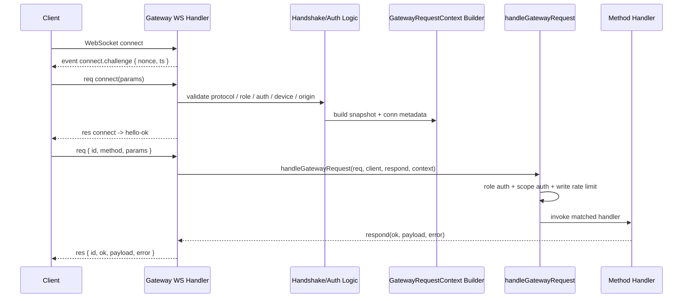
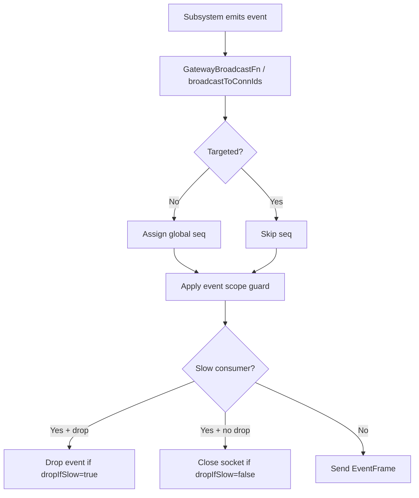
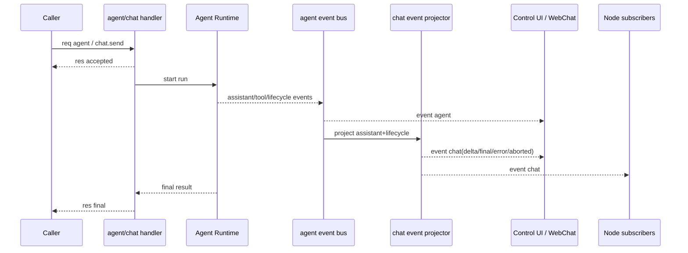
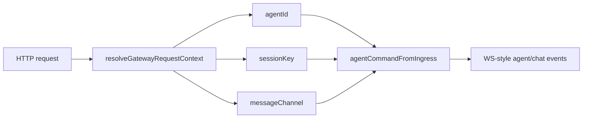

# OpenClaw Gateway Request and Event Model

## 1. 结论先说

Gateway 的“请求模型”和“事件模型”不是普通 REST 风格，而是一个以 WebSocket 为主、HTTP 兼容面为辅的控制平面协议层。

它的核心特征有 6 个：

1. 所有 WS 交互都基于统一帧协议：`req` / `res` / `event`。
2. 连接建立不是裸握手，而是显式的 `connect.challenge` 事件 + `connect` 请求协商。
3. 连接成功后，服务端用 `hello-ok` 一次性下发协议版本、方法列表、事件列表、快照和限额策略。
4. 请求分发统一收敛到 `handleGatewayRequest(...)`，由它完成角色校验、scope 校验、控制面写入限流、handler 查找和插件作用域封装。
5. 事件分发统一收敛到 `createGatewayBroadcaster(...)`，由它完成事件序号、状态版本号、慢消费者处理、按 scope 过滤和定向广播。
6. 这层协议不是严格的一问一答模型。`agent` 默认就是“先 accepted，再 final”；`exec.approval.request` 在 `twoPhase=true` 时也会用同一个请求 `id` 发两次 `res`。

## 2. 对外暴露的接口面

Gateway 这一层实际暴露的是 3 种接口面。

### 2.1 WebSocket 控制面协议

这是主接口面，类型定义集中在：

- `src/gateway/protocol/schema/frames.ts`
- `src/gateway/protocol/schema/snapshot.ts`
- `src/gateway/protocol/schema/agent.ts`
- `src/gateway/protocol/schema/logs-chat.ts`
- `src/gateway/server/ws-connection.ts`
- `src/gateway/server/ws-connection/message-handler.ts`

它对外暴露的核心契约是：

- 顶层帧：`req` / `res` / `event`
- 握手请求：`connect`
- 握手响应：`hello-ok`
- 方法列表：`listGatewayMethods()` 返回的 method 名称集合
- 事件列表：`GATEWAY_EVENTS`

### 2.2 HTTP 兼容入口

这层不是 Gateway 的原生协议，而是兼容 OpenAI / OpenResponses 调用格式，再映射回 Gateway/agent 执行链。

关键文件：

- `src/gateway/openai-http.ts`
- `src/gateway/openresponses-http.ts`
- `src/gateway/http-utils.ts`

它对外暴露的不是 `req/res/event` 帧，而是 HTTP 请求头与请求体约定，例如：

- `Authorization: Bearer <token>`
- `x-openclaw-agent-id`
- `x-openclaw-agent`
- `x-openclaw-session-key`
- `x-openclaw-message-channel`

这些 header 会被 `resolveGatewayRequestContext(...)` 解释成内部的 `agentId`、`sessionKey` 和 `messageChannel`。

### 2.3 Node 专用事件面

Node 连接本质上也是同一个 WS 协议，但在连接成功后，会额外接收节点专用事件，比如：

- `node.invoke.request`
- `voicewake.changed`
- `health`
- `tick`
- `chat`
- `agent`

关键实现：

- `src/gateway/node-registry.ts`
- `src/gateway/server.impl.ts`
- `src/gateway/server-methods/nodes.ts`

## 3. 顶层帧协议

顶层帧统一定义在 `src/gateway/protocol/schema/frames.ts`。

### 3.1 RequestFrame

接口：`RequestFrame`

字段：

- `type: "req"`
  - 含义：这是一个请求帧。
- `id: string`
  - 含义：请求唯一标识。
  - 用途：服务端响应时会原样带回，客户端据此关联请求和响应。
- `method: string`
  - 含义：调用的方法名，例如 `health`、`agent`、`chat.send`。
- `params?: unknown`
  - 含义：方法参数。
  - 用途：具体结构由各 method 自己的 schema 决定。

### 3.2 ResponseFrame

接口：`ResponseFrame`

字段：

- `type: "res"`
  - 含义：这是一个响应帧。
- `id: string`
  - 含义：对应请求的 `id`。
- `ok: boolean`
  - 含义：请求是否成功。
- `payload?: unknown`
  - 含义：成功结果或部分结果。
- `error?: ErrorShape`
  - 含义：失败信息。

### 3.3 EventFrame

接口：`EventFrame`

字段：

- `type: "event"`
  - 含义：这是一个服务端主动推送事件。
- `event: string`
  - 含义：事件名，例如 `agent`、`chat`、`presence`。
- `payload?: unknown`
  - 含义：事件载荷。
- `seq?: number`
  - 含义：全局广播事件序号。
  - 用途：客户端可以用它检查丢包、乱序或做增量同步。
  - 观察到的实现细节：定向事件没有 `seq`，只有全局广播才会分配 `seq`。
- `stateVersion?: { presence?: number; health?: number }`
  - 含义：状态版本号。
  - 用途：告诉客户端当前 `presence` / `health` 快照版本。

### 3.4 ErrorShape

接口：`ErrorShape`

字段：

- `code: string`
  - 含义：错误码，例如 `INVALID_REQUEST`、`UNAVAILABLE`。
- `message: string`
  - 含义：面向调用方的错误说明。
- `details?: unknown`
  - 含义：结构化附加信息，例如协议不匹配、配对 requestId、认证原因。
- `retryable?: boolean`
  - 含义：是否可重试。
- `retryAfterMs?: number`
  - 含义：建议重试等待时间。

## 4. 握手模型

握手不是浏览器层 WS upgrade 完成就结束，而是应用层再跑一遍显式协商。

### 4.1 `connect.challenge` 事件

发送方：服务端，在 socket 刚建立时立刻发送。

事件名：`connect.challenge`

观察到的 payload 字段：

- `nonce: string`
  - 含义：一次性随机挑战值。
  - 用途：设备签名时必须把这个 nonce 带进去，防止重放。
- `ts: number`
  - 含义：挑战生成时间戳。

### 4.2 `connect` 请求

方法：`connect`

参数对象：`ConnectParams`

字段：

- `minProtocol: number`
  - 含义：客户端可接受的最低协议版本。
- `maxProtocol: number`
  - 含义：客户端可接受的最高协议版本。
  - 用途：服务端会用它和当前 `PROTOCOL_VERSION` 做区间匹配。

- `client: object`
  - 含义：客户端身份声明。
  - 字段：
    - `id: string`
      - 客户端类别标识，例如 CLI、Control UI、节点等。
    - `displayName?: string`
      - 人类可读名称。
    - `version: string`
      - 客户端版本。
    - `platform: string`
      - 运行平台，例如 macOS/iOS/Android/Web。
    - `deviceFamily?: string`
      - 设备族，例如 phone、desktop。
    - `modelIdentifier?: string`
      - 设备型号标识。
    - `mode: string`
      - 客户端模式，例如 backend、cli、webchat。
    - `instanceId?: string`
      - 客户端实例 ID，用于多实例区分和 presence 归并。

- `caps?: string[]`
  - 含义：客户端声明的能力集合。
  - 用途：例如是否支持 tool events。

- `commands?: string[]`
  - 含义：节点声明自己支持的命令。
  - 用途：`role=node` 时会被 allowlist 过滤后写回连接信息。

- `permissions?: Record<string, boolean>`
  - 含义：节点声明的权限位。
  - 用途：辅助节点能力判定。

- `pathEnv?: string`
  - 含义：节点上报的 PATH 环境。
  - 用途：节点技能/bin 探测时可参考。

- `role?: string`
  - 含义：请求的角色。
  - 允许值：从代码观察只有 `operator` 和 `node`。

- `scopes?: string[]`
  - 含义：请求的 operator scope。
  - 用途：控制 method 和部分 event 的最小权限。
  - 实现细节：默认是 default-deny，未绑定到可信设备时 scope 可能会被清空。

- `device?: object`
  - 含义：设备身份和签名材料。
  - 字段：
    - `id: string`
      - 设备 ID，应当与公钥派生结果匹配。
    - `publicKey: string`
      - 设备公钥。
    - `signature: string`
      - 对 challenge payload 的签名。
    - `signedAt: number`
      - 签名时间戳。
    - `nonce: string`
      - 客户端回传的 challenge nonce，必须和 `connect.challenge` 一致。

- `auth?: object`
  - 含义：共享认证材料。
  - 字段：
    - `token?: string`
      - 网关 token。
    - `deviceToken?: string`
      - 已配对设备 token。
    - `password?: string`
      - 网关密码。

- `locale?: string`
  - 含义：客户端语言环境。
- `userAgent?: string`
  - 含义：客户端 UA 字符串。

### 4.3 服务端在握手期做什么

主要逻辑在 `src/gateway/server/ws-connection/message-handler.ts`。

握手阶段会做这些事：

1. 解析客户端 IP，区分本地直连、可信代理、伪造代理头。
2. 根据 `Origin` / `Host` / `trustedProxies` 决定是否执行浏览器来源校验。
3. 校验第一帧必须是 `type=req` 且 `method=connect`。
4. 校验协议版本区间。
5. 校验 `role`。
6. 解析共享认证和设备认证。
7. 校验设备 ID、公钥、签名时间、nonce、签名 payload 版本。
8. 判定是否需要触发设备配对或权限升级审批。
9. 对 node 连接过滤允许的命令清单。
10. 写入 presence。
11. 生成 `hello-ok`。
12. 对 `role=node` 注册到 `NodeRegistry` 并下发初始的 `voicewake.changed`。

### 4.4 `hello-ok` 响应

它是 `connect` 请求成功后的 `payload`，对象名是 `HelloOk`。

字段：

- `type: "hello-ok"`
  - 含义：应用层握手成功。
- `protocol: number`
  - 含义：实际协商成功的协议版本。
- `server: object`
  - 字段：
    - `version: string`
      - 服务端版本。
    - `connId: string`
      - 这条连接的服务端连接 ID。
- `features: object`
  - 字段：
    - `methods: string[]`
      - 当前连接可见的 method 名称集合。
    - `events: string[]`
      - 当前连接可能接收的事件名集合。
- `snapshot: Snapshot`
  - 含义：当前运行时快照。
- `canvasHostUrl?: string`
  - 含义：Canvas host URL。
  - 用途：节点若拿到 canvas capability，会收到带 token 的 scoped URL。
- `auth?: object`
  - 含义：服务端签发给已识别设备的 device token 信息。
  - 字段：
    - `deviceToken: string`
      - 后续连接可直接使用的设备 token。
    - `role: string`
      - token 绑定角色。
    - `scopes: string[]`
      - token 绑定 scopes。
    - `issuedAtMs?: number`
      - 签发或轮转时间。
- `policy: object`
  - 字段：
    - `maxPayload: number`
      - 单帧允许的最大 payload 大小。
    - `maxBufferedBytes: number`
      - 客户端被判定为 slow consumer 前允许的缓冲上限。
    - `tickIntervalMs: number`
      - 服务端 tick 周期。

### 4.5 `Snapshot` 对象

接口：`Snapshot`

字段：

- `presence: PresenceEntry[]`
  - 含义：当前系统 presence 列表。
- `health: unknown`
  - 含义：健康快照。
  - 实现细节：初始由 `buildGatewaySnapshot()` 先放空对象，若已有缓存则立即替换。
- `stateVersion: { presence: number; health: number }`
  - 含义：快照对应的状态版本号。
- `uptimeMs: number`
  - 含义：网关已运行时长。
- `configPath?: string`
  - 含义：当前实际配置文件路径。
- `stateDir?: string`
  - 含义：状态目录路径。
- `sessionDefaults?: object`
  - 字段：
    - `defaultAgentId: string`
      - 默认 agent。
    - `mainKey: string`
      - 主会话主键。
    - `mainSessionKey: string`
      - 主会话完整 key。
    - `scope?: string`
      - session scope 配置。
- `authMode?: "none" | "token" | "password" | "trusted-proxy"`
  - 含义：当前网关认证模式。
- `updateAvailable?: object`
  - 字段：
    - `currentVersion: string`
    - `latestVersion: string`
    - `channel: string`

### 4.6 `PresenceEntry` 对象

字段：

- `host?: string`
  - 设备或客户端可读名称。
- `ip?: string`
  - 远端 IP。
- `version?: string`
  - 客户端版本。
- `platform?: string`
  - 平台。
- `deviceFamily?: string`
  - 设备族。
- `modelIdentifier?: string`
  - 型号标识。
- `mode?: string`
  - 连接模式。
- `lastInputSeconds?: number`
  - 距离最近一次输入的秒数。
- `reason?: string`
  - 最近一次状态变化原因。
- `tags?: string[]`
  - 自定义标签。
- `text?: string`
  - presence 文本。
- `ts: number`
  - 时间戳。
- `deviceId?: string`
  - 设备 ID。
- `roles?: string[]`
  - 角色列表。
- `scopes?: string[]`
  - scope 列表。
- `instanceId?: string`
  - 实例 ID。

## 5. 请求分发模型

### 5.1 入口函数

入口函数：`handleGatewayRequest(opts)`

定义位置：`src/gateway/server-methods.ts`

职责：

1. 角色授权：`isRoleAuthorizedForMethod(...)`
2. scope 授权：`authorizeOperatorScopesForMethod(...)`
3. 控制面写入限流：`config.apply`、`config.patch`、`update.run`
4. method 查表：`coreGatewayHandlers` + `extraHandlers`
5. 将 handler 包在插件 runtime request scope 中执行

### 5.2 `GatewayRequestOptions`

接口：`GatewayRequestOptions`

字段：

- `req: RequestFrame`
  - 当前请求帧。
- `client: GatewayClient | null`
  - 当前连接客户端信息；握手后通常存在。
- `isWebchatConnect: (params) => boolean`
  - 工具函数，用于判断当前连接是否是 WebChat/Control UI 风格客户端。
- `respond: RespondFn`
  - 响应函数。
- `context: GatewayRequestContext`
  - 当前请求的完整运行时上下文。

### 5.3 `GatewayClient`

接口：`GatewayClient`

字段：

- `connect: ConnectParams`
  - 握手时保存下来的连接参数。
- `connId?: string`
  - 连接 ID。
- `clientIp?: string`
  - 服务端归一化后的客户端 IP。
- `canvasHostUrl?: string`
  - 原始 canvas host URL。
- `canvasCapability?: string`
  - 节点用的 canvas capability token。
- `canvasCapabilityExpiresAtMs?: number`
  - capability 过期时间。

### 5.4 `RespondFn`

签名：

```ts
(ok: boolean, payload?: unknown, error?: ErrorShape, meta?: Record<string, unknown>) => void
```

参数：

- `ok`
  - 是否成功。
- `payload`
  - 响应载荷。
- `error`
  - 错误对象。
- `meta`
  - 仅供服务端日志使用的附加元信息。
  - 用途：记录 `runId`、`cached`、错误摘要、suppressed unauthorized count 等。

### 5.5 `GatewayRequestHandlerOptions`

这是具体 handler 实际收到的参数对象。

字段：

- `req: RequestFrame`
  - 原始请求帧。
- `params: Record<string, unknown>`
  - 已从 `req.params` 取出的参数对象。
- `client: GatewayClient | null`
  - 当前连接客户端信息。
- `isWebchatConnect`
  - WebChat 判定函数。
- `respond`
  - 发送响应的函数。
- `context: GatewayRequestContext`
  - 整个 Gateway 运行态上下文。

### 5.6 `GatewayRequestContext`

这是 Gateway handler 看到的最大上下文对象，也是这一层最重要的内部 API。

字段分组如下。

#### A. 运行时依赖

- `deps`
  - `createDefaultDeps()` 创建的依赖集合。
  - 用途：给 handler 调命令、发消息、访问运行时工具。
- `cron`
  - `CronService` 实例。
- `cronStorePath`
  - cron 存储路径。

#### B. 审批与模型

- `execApprovalManager?`
  - 执行审批管理器。
- `loadGatewayModelCatalog: () => Promise<ModelCatalogEntry[]>`
  - 读取模型目录。

#### C. 健康与日志

- `getHealthCache: () => HealthSummary | null`
  - 获取当前健康缓存。
- `refreshHealthSnapshot(opts?)`
  - 刷新健康快照。
  - 参数：`opts?.probe`
    - `true` 表示做主动 probe。
- `logHealth`
  - 健康子系统 logger。
- `logGateway`
  - Gateway 主 logger。

#### D. 状态版本与广播

- `incrementPresenceVersion: () => number`
  - presence 版本号自增。
- `getHealthVersion: () => number`
  - 当前 health 版本号。
- `broadcast`
  - 全量广播函数。
- `broadcastToConnIds`
  - 定向广播函数。

#### E. 节点总线

- `nodeSendToSession(sessionKey, event, payload)`
  - 向订阅该 session 的节点发送事件。
- `nodeSendToAllSubscribed(event, payload)`
  - 向全部订阅节点广播。
- `nodeSubscribe(nodeId, sessionKey)`
  - 订阅某 session。
- `nodeUnsubscribe(nodeId, sessionKey)`
  - 取消某 session 订阅。
- `nodeUnsubscribeAll(nodeId)`
  - 取消该节点全部订阅。
- `hasConnectedMobileNode()`
  - 是否有移动端节点在线。
- `hasExecApprovalClients?()`
  - 是否有具备审批 scope 的控制面客户端在线。
- `nodeRegistry`
  - `NodeRegistry` 实例。

#### F. 运行中会话 / 流式状态

- `agentRunSeq: Map<string, number>`
  - 记录每个 run 的最新事件序号。
- `chatAbortControllers: Map<string, ChatAbortControllerEntry>`
  - 可中止聊天运行集合。
- `chatAbortedRuns: Map<string, number>`
  - 已中止运行集合及时间戳。
- `chatRunBuffers: Map<string, string>`
  - 聊天增量文本缓冲。
- `chatDeltaSentAt: Map<string, number>`
  - 最近一次 delta 推送时间。
- `addChatRun(sessionId, entry)`
  - 记录 run 与 session 的映射。
- `removeChatRun(sessionId, clientRunId, sessionKey?)`
  - 删除 run 映射。
- `registerToolEventRecipient(runId, connId)`
  - 注册某个 WS 连接接收该 run 的 tool 事件。
- `dedupe: Map<string, DedupeEntry>`
  - 幂等缓存。

#### G. 向导与渠道生命周期

- `wizardSessions`
  - 向导会话表。
- `findRunningWizard()`
  - 找到当前运行中的 wizard。
- `purgeWizardSession(id)`
  - 清理 wizard 会话。
- `getRuntimeSnapshot()`
  - 获取渠道运行时快照。
- `startChannel(channel, accountId?)`
  - 启动某渠道。
- `stopChannel(channel, accountId?)`
  - 停止某渠道。
- `markChannelLoggedOut(channelId, cleared, accountId?)`
  - 标记渠道登出。
- `wizardRunner(opts, runtime, prompter)`
  - 执行 onboarding wizard。

#### H. 语音唤醒广播

- `broadcastVoiceWakeChanged(triggers)`
  - 广播 `voicewake.changed` 事件。

### 5.7 方法授权模型

相关文件：

- `src/gateway/role-policy.ts`
- `src/gateway/method-scopes.ts`

规则：

- 角色只有两种：`operator`、`node`
- `node` 只能调用 node role methods，例如：
  - `node.invoke.result`
  - `node.event`
  - `node.canvas.capability.refresh`
  - `node.pending.pull`
  - `node.pending.ack`
  - `skills.bins`
- 其他方法默认只能 `operator` 调
- operator 还要过 scope 校验

scope 分级：

- `operator.read`
- `operator.write`
- `operator.approvals`
- `operator.pairing`
- `operator.admin`

补充规则：

- `operator.admin` 可以绕过其余 scope 检查
- `operator.write` 也可覆盖读方法
- 未分类方法默认拒绝

### 5.8 控制面写入限流

只对这 3 个方法做额外限流：

- `config.apply`
- `config.patch`
- `update.run`

用途：

- 防止控制面被高频写操作打爆或误触发多次危险写入
- 限制是 `3 per 60s`

## 6. 方法列表与能力面

方法名列表来源：`listGatewayMethods()`。

核心内建方法按职责可分为：

- 健康与日志
  - `health`
  - `logs.tail`
  - `status`
  - `usage.status`
  - `usage.cost`

- 配置与向导
  - `config.get`
  - `config.set`
  - `config.apply`
  - `config.patch`
  - `config.schema`
  - `wizard.start`
  - `wizard.next`
  - `wizard.cancel`
  - `wizard.status`

- 会话与聊天
  - `sessions.*`
  - `chat.history`
  - `chat.send`
  - `chat.abort`
  - `chat.inject`

- Agent 与技能
  - `agent`
  - `agent.identity.get`
  - `agent.wait`
  - `agents.*`
  - `skills.*`
  - `tools.catalog`

- 渠道、设备、节点
  - `channels.*`
  - `send`
  - `node.*`
  - `device.*`
  - `push.test`
  - `browser.request`

- 定时与系统控制
  - `cron.*`
  - `last-heartbeat`
  - `set-heartbeats`
  - `wake`
  - `update.run`
  - `voicewake.get`
  - `voicewake.set`

实现细节：

- 方法列表不是纯静态的。
- `listGatewayMethods()` 会把 channel plugin 自己贡献的 `gatewayMethods` 也并进来。

## 7. 关键请求参数对象

这一节只展开最直接参与“请求模型”和“事件模型”的参数对象。

### 7.1 `AgentParams`

方法：`agent`

字段：

- `message: string`
  - 必填，agent 输入文本。
- `agentId?: string`
  - 指定目标 agent。
- `to?: string`
  - 外发目标。
- `replyTo?: string`
  - 优先回复目标。
- `sessionId?: string`
  - 显式 sessionId。
- `sessionKey?: string`
  - 显式 sessionKey。
- `thinking?: string`
  - 思考档位。
- `deliver?: boolean`
  - 是否把结果投递到外部渠道。
- `attachments?: unknown[]`
  - 附件列表。
- `channel?: string`
  - 来源或目标渠道提示。
- `replyChannel?: string`
  - 回复使用的渠道。
- `accountId?: string`
  - 渠道账号 ID。
- `replyAccountId?: string`
  - 回复时使用的账号 ID。
- `threadId?: string`
  - 线程或话题 ID。
- `groupId?: string`
  - 群组 ID。
- `groupChannel?: string`
  - 群组所在渠道。
- `groupSpace?: string`
  - 群组空间。
- `timeout?: number`
  - 超时毫秒数。
- `bestEffortDeliver?: boolean`
  - 是否允许最佳努力投递。
- `lane?: string`
  - 并发 lane。
- `extraSystemPrompt?: string`
  - 额外 system prompt。
- `internalEvents?: AgentInternalEvent[]`
  - 内部事件列表，给子代理/cron 等来源附加上下文。
- `inputProvenance?: object`
  - 输入来源信息。
  - 字段：
    - `kind`
    - `originSessionId?`
    - `sourceSessionKey?`
    - `sourceChannel?`
    - `sourceTool?`
- `idempotencyKey: string`
  - 幂等键。
- `label?: string`
  - session label。
- `spawnedBy?: string`
  - 父 session 或父 run 来源。
- `workspaceDir?: string`
  - 生成子代理工作目录时的覆盖值。

观察到的语义：

- `agent` 方法会先回一个 accepted 响应，再异步执行 agent，并再次回最终结果。
- 也就是说，它本身就是半流式 request 模型。

### 7.2 `ChatSendParams`

方法：`chat.send`

字段：

- `sessionKey: string`
  - 目标聊天 session。
- `message: string`
  - 输入消息。
- `thinking?: string`
  - 思考档位。
- `deliver?: boolean`
  - 是否把结果同步投递到外部渠道。
- `attachments?: unknown[]`
  - 附件列表。
- `timeoutMs?: number`
  - 超时毫秒数。
- `systemInputProvenance?: object`
  - 系统注入输入来源。
  - 字段：
    - `kind`
    - `originSessionId?`
    - `sourceSessionKey?`
    - `sourceChannel?`
    - `sourceTool?`
- `systemProvenanceReceipt?: string`
  - 给系统来源附带一段人类可读 receipt。
- `idempotencyKey: string`
  - 幂等键。

观察到的语义：

- `chat.send` 最终结果主要通过 `chat` 事件流给到 UI。
- 它不是像 `agent` 那样天然依赖二次 `res`；更偏“accepted + event stream + 可能的 dedupe 查询”。

### 7.3 `ChatHistoryParams`

方法：`chat.history`

字段：

- `sessionKey: string`
  - 要读取的 session。
- `limit?: number`
  - 条数上限。

### 7.4 `ChatAbortParams`

方法：`chat.abort`

字段：

- `sessionKey: string`
  - 要终止的 session。
- `runId?: string`
  - 只终止某个 run；不传则可按 session 终止。

### 7.5 `ExecApprovalRequestParams`

方法：`exec.approval.request`

字段：

- `id?: string`
  - 显式 approval ID。
- `command: string`
  - 命令文本。
- `commandArgv?: string[]`
  - 拆分后的 argv。
- `systemRunPlan?: object`
  - `system.run` 计划。
  - 字段：
    - `argv: string[]`
      - 计划执行的 argv。
    - `cwd: string | null`
      - 计划工作目录。
    - `rawCommand: string | null`
      - 原始命令文本。
    - `agentId: string | null`
      - 发起 agent。
    - `sessionKey: string | null`
      - 发起 session。
    - `mutableFileOperand?: object | null`
      - 可变文件操作数。
      - 字段：
        - `argvIndex: number`
        - `path: string`
        - `sha256: string`
- `env?: Record<string, string>`
  - 环境变量。
- `cwd?: string | null`
  - 工作目录。
- `nodeId?: string | null`
  - 节点目标。
- `host?: string | null`
  - 主机类型，例如 `node`。
- `security?: string | null`
  - 安全等级或说明。
- `ask?: string | null`
  - 审批提示文案。
- `agentId?: string | null`
  - 发起 agent。
- `resolvedPath?: string | null`
  - 已解析路径。
- `sessionKey?: string | null`
  - 发起 session。
- `turnSourceChannel?: string | null`
  - 触发该审批的渠道。
- `turnSourceTo?: string | null`
  - 原消息目标。
- `turnSourceAccountId?: string | null`
  - 原账号。
- `turnSourceThreadId?: string | number | null`
  - 原线程。
- `timeoutMs?: number`
  - 审批超时时间。
- `twoPhase?: boolean`
  - 是否先返回 accepted，再返回最终决策。

观察到的特殊语义：

- 当 `twoPhase=true` 时，这个方法会对同一个请求 `id` 发两次 `res`。
- 第一次是 `{ status: "accepted" }`。
- 第二次才是最终决策。

### 7.6 `SendParams`

方法：`send`

字段：

- `to: string`
  - 消息目标。
- `message?: string`
  - 文本内容。
- `mediaUrl?: string`
  - 单个媒体 URL。
- `mediaUrls?: string[]`
  - 多个媒体 URL。
- `gifPlayback?: boolean`
  - GIF 播放策略。
- `channel?: string`
  - 渠道。
- `accountId?: string`
  - 账号。
- `agentId?: string`
  - 用于 per-agent 媒体根解析。
- `threadId?: string`
  - 线程 ID。
- `sessionKey?: string`
  - 若提供，则投递结果也可回写 transcript。
- `idempotencyKey: string`
  - 幂等键。

## 8. 事件模型

### 8.1 事件列表

事件名列表由 `GATEWAY_EVENTS` 暴露：

- `connect.challenge`
- `agent`
- `chat`
- `presence`
- `tick`
- `talk.mode`
- `shutdown`
- `health`
- `heartbeat`
- `cron`
- `node.pair.requested`
- `node.pair.resolved`
- `node.invoke.request`
- `device.pair.requested`
- `device.pair.resolved`
- `voicewake.changed`
- `exec.approval.requested`
- `exec.approval.resolved`
- `update.available`

### 8.2 广播接口

接口：`GatewayBroadcastFn`

签名：

```ts
(event: string, payload: unknown, opts?: GatewayBroadcastOpts) => void
```

参数：

- `event`
  - 事件名。
- `payload`
  - 事件载荷。
- `opts?.dropIfSlow`
  - `true` 时遇到慢消费者直接丢弃该事件。
  - `false/undefined` 时遇到慢消费者会关闭该连接。
- `opts?.stateVersion`
  - 附带状态版本号。

接口：`GatewayBroadcastToConnIdsFn`

签名：

```ts
(event: string, payload: unknown, connIds: ReadonlySet<string>, opts?: GatewayBroadcastOpts) => void
```

新增参数：

- `connIds`
  - 只向这些连接推送。

### 8.3 广播语义

关键实现：`src/gateway/server-broadcast.ts`

观察到的行为：

- 非定向事件会得到一个全局 `seq`。
- 定向事件不带 `seq`，因为它们不是全局一致事件流。
- `exec.approval.*` 和 `device/node pair.*` 事件会按 scope 过滤。
- 慢消费者处理策略：
  - `dropIfSlow=true`：丢该事件
  - 否则：直接关闭连接，原因是 `slow consumer`

### 8.4 `GatewayBroadcastStateVersion`

字段：

- `presence?: number`
  - 当前 presence 版本。
- `health?: number`
  - 当前 health 版本。

用途：

- 给客户端一个轻量同步点。
- 如果 UI 收到版本跳变，可以决定是否重新拉取快照。

## 9. 关键事件载荷

### 9.1 `agent` 事件

接口：`AgentEvent`

字段：

- `runId: string`
  - 运行 ID。
- `seq: number`
  - run 内事件序号。
- `stream: string`
  - 事件流类别，例如 `assistant`、`tool`、`lifecycle`。
- `ts: number`
  - 时间戳。
- `data: Record<string, unknown>`
  - 事件具体内容。

实现语义：

- `agent` 是底层执行事件流。
- `tool` 事件可能被裁掉 `result` / `partialResult`，除非 verbose=full。
- 对于 tool 事件，默认只定向推送给注册了 `tool-events` capability 的连接。
- 若发现 run 内 `seq` 断裂，服务端还会主动广播一个 `agent` 错误事件说明 gap。

### 9.2 `chat` 事件

接口：`ChatEvent`

字段：

- `runId: string`
  - run ID。
- `sessionKey: string`
  - 所属 session。
- `seq: number`
  - 事件序号。
- `state: "delta" | "final" | "aborted" | "error"`
  - 聊天状态。
- `message?: unknown`
  - assistant 消息对象。
- `errorMessage?: string`
  - 错误文本。
- `usage?: unknown`
  - 资源使用信息。
- `stopReason?: string`
  - 停止原因。

实现语义：

- `chat` 是给 UI/节点消费的“可展示消息流”。
- 它不是原始 agent event，而是从 `assistant` / `lifecycle` 事件二次整形得到。
- `delta` 有 150ms 节流。
- `final` 前会尝试把被节流掉的最后一段文本补刷一次，避免 UI 收到不完整内容。
- `aborted` 事件会携带被中止前的 partialText（如果有）。

### 9.3 `presence` 事件

payload：

- `{ presence: PresenceEntry[] }`

配套版本号：

- `stateVersion.presence`
- `stateVersion.health`

用途：

- 让 UI 更新在线节点、客户端和状态文案。

### 9.4 `health` 事件

payload：

- `HealthSummary`

实现语义：

- health 是缓存快照，不是每次连接即时 probe。
- 定时刷新由 maintenance timer 驱动。
- 每次刷新会更新 `healthVersion`，并带到广播帧的 `stateVersion`。

### 9.5 `tick` 事件

payload：

- `{ ts: number }`

用途：

- 连接保活、UI 心跳、轻量时间同步。

### 9.6 `talk.mode` 事件

payload：

- `enabled: boolean`
- `phase: string | null`
- `ts: number`

用途：

- 让 Control UI / Talk 客户端同步语音对讲开关状态。

### 9.7 `shutdown` 事件

payload：

- `reason: string`
- `restartExpectedMs?: number`

用途：

- 让客户端知道网关正在关闭，是否预期短时间内重启。

### 9.8 `heartbeat` 事件

payload：

- 这类 payload 没有在 protocol schema 中集中定义。
- 观察到它直接从 `onHeartbeatEvent(...)` 转发。

语义：

- 它是 heartbeat runner 的上游事件转发，不是 Gateway 自己重新建模后的对象。

### 9.9 `cron` 事件

payload：

- 同样没有在统一 schema 中集中定义。
- 观察到它直接来自 cron service 的 `onEvent(evt)`。

语义：

- 它是 cron job 生命周期事件流，UI 可用于显示 job 开始、结束、失败等状态。

### 9.10 配对与审批事件

#### `device.pair.requested`

payload：

- 来自 `requestDevicePairing(...)` 的 request 对象。
- 至少包含 `requestId` 与设备配对请求上下文。

#### `device.pair.resolved`

payload 字段：

- `requestId: string`
- `deviceId: string`
- `decision: "approved" | "rejected"`
- `ts: number`

#### `node.pair.requested`

payload：

- 来自 `requestNodePairing(...)` 的 request 对象。

#### `node.pair.resolved`

payload 字段：

- `requestId: string`
- `nodeId: string`
- `decision: "approved" | "rejected"`
- `ts: number`

#### `exec.approval.requested`

payload 字段：

- `id: string`
- `request: object`
- `createdAtMs: number`
- `expiresAtMs: number`

#### `exec.approval.resolved`

payload 字段：

- `id: string`
- `decision: string`
- `resolvedBy?: string`
- `ts: number`
- `request?: object`

### 9.11 `voicewake.changed`

payload 字段：

- `triggers: string[]`

用途：

- 通知 node / UI 当前启用的语音唤醒词。

### 9.12 `update.available`

payload 字段：

- `updateAvailable: UpdateAvailable | null`

用途：

- 通知 UI 当前是否有可用更新。

## 10. HTTP 兼容入口的请求上下文模型

函数：`resolveGatewayRequestContext(params)`

定义位置：`src/gateway/http-utils.ts`

返回：`{ agentId, sessionKey, messageChannel }`

参数：

- `req: IncomingMessage`
  - 原始 HTTP 请求。
- `model: string | undefined`
  - 调用方传入的模型名。
  - 用途：兼容把 `openclaw:<agentId>` 或 `agent:<agentId>` 写进 model。
- `user?: string`
  - 上游传入的 user 字段。
  - 用途：构造稳定 sessionKey。
- `sessionPrefix: string`
  - sessionKey 前缀，例如 `openai`、`openresponses`。
- `defaultMessageChannel: string`
  - 默认 messageChannel，例如 `webchat`。
- `useMessageChannelHeader?: boolean`
  - 是否接受 `x-openclaw-message-channel` 覆盖。

它暴露的 header 语义：

- `Authorization: Bearer <token>`
  - 认证 token。
- `x-openclaw-agent-id` / `x-openclaw-agent`
  - 显式 agentId。
- `x-openclaw-session-key`
  - 显式 sessionKey。
- `x-openclaw-message-channel`
  - 显式 messageChannel，仅在允许时生效。

## 11. 关键 Mermaid 图

### 11.1 握手与请求分发



### 11.2 事件广播模型



### 11.3 `agent` / `chat` 双层事件流



### 11.4 HTTP 兼容入口映射



## 12. 最值得记住的实现事实

1. Gateway 的 WS 协议是强类型帧协议，不是随意发 JSON。
2. 握手不是一个 `101 Switching Protocols` 就结束，而是显式的 `connect.challenge` + `connect` + `hello-ok`。
3. `GatewayRequestContext` 是所有 Gateway methods 的统一运行时注入面，里面把广播、节点、会话、幂等、wizard、健康、渠道生命周期都收口了。
4. 事件总线是两层的：
   - `agent` 事件偏运行时原始流
   - `chat` 事件偏 UI 可展示消息流
5. `agent` 和 `exec.approval.request(twoPhase=true)` 都可能对同一个请求 `id` 返回多次 `res`，这和普通 JSON-RPC 风格不同。
6. HTTP 兼容入口本质上不是单独一套系统，而是把 OpenAI/OpenResponses 请求头和 body 映射回同一个 agent/gateway 执行链。

## 13. 推荐下一步

如果你继续往下深挖，最值得读的是这 4 组：

1. `src/gateway/server-methods/chat.ts`
   - 这里能看清 `chat.send`、`chat.abort`、`chat.history` 怎么把 transcript、agent run 和 UI 事件串起来。
2. `src/gateway/server-chat.ts`
   - 这里是 `agent` 事件如何投影成 `chat` 事件的核心。
3. `src/gateway/server/ws-connection/message-handler.ts`
   - 这里是握手、安全边界、配对、role/scope 绑定的核心。
4. `src/gateway/server-methods/agent.ts`
   - 这里是 Gateway RPC 风格的 `agent` 方法如何变成一次真正的 agent run。
