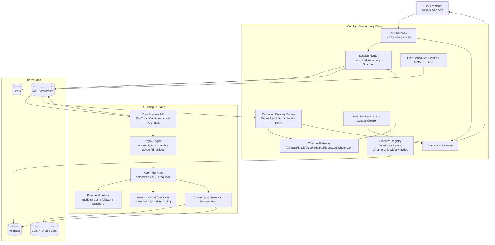
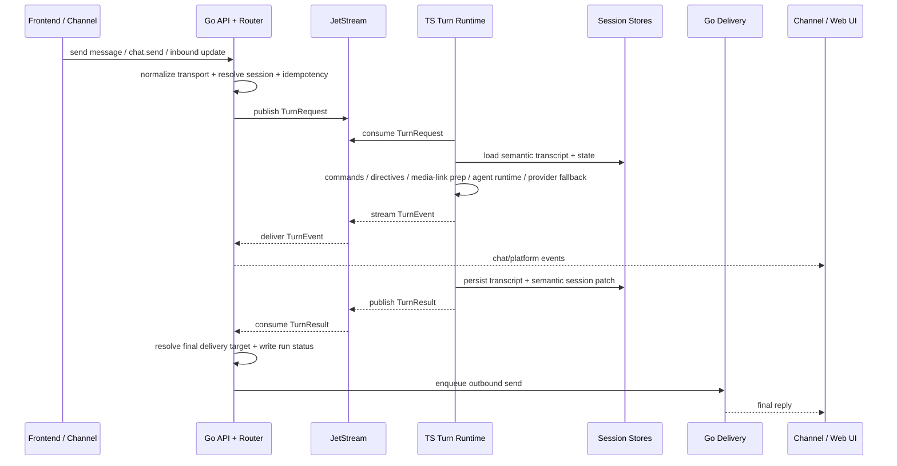
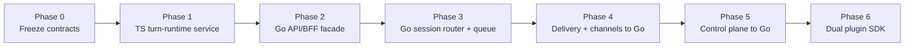
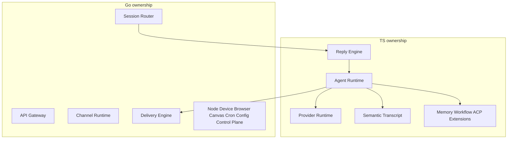

# OpenClaw 改造成 Go + TS 高并发 Agent 平台的完整方案

## 1. 目标定义

目标不是把现有 OpenClaw 简单拆成两个仓库，而是把它重构成一个职责严格分离的双运行时平台：

- Go 侧只负责高并发控制面、连接面、调度面、状态面。
- TS 侧只负责用户对话到响应回复的语义执行面。
- AI Providers、Models、Auth Profiles、Model Fallback、Prompt Assembly、Tool-Orchestrated Turn，只允许在 TS 侧存在。
- Go 和 TS 不允许同时拥有 provider/model 逻辑。Go 只能把 model/provider 当成 opaque metadata，看见名字，不执行策略，不接 SDK。
- 前端继续作为独立实现存在，并且只连 Go 暴露的统一服务端 API。

一句话收束：

- Go = 高并发运行平台
- TS = 对话推理引擎

## 2. 基于现状的判断

前面已经把 OpenClaw 现有系统拆得比较完整，可以明确看到当前系统是一个偏 TS 单体化的多面平台，以下几层目前高度耦合在一起：

- CLI 启动与命令装配
- Gateway 请求模型与事件模型
- 内建 channel ingress/runtime/outbound
- auto-reply / agent / fallback / delivery 主链
- provider/model/auth/fallback/runtime wrappers
- session/transcript/deliveryContext 持久化
- plugin/extension registry 与 hook bus
- nodes/devices/browser/canvas/pairing/cron/daemon 外围控制面

这套结构的优点是功能闭环强，但它天然会碰到 4 个并发瓶颈：

1. 长连接面和推理面同进程
   Channel runtime、Gateway WS、Node control、Cron、Browser proxy、Agent runtime 都在同一大运行时里。

2. 控制面和 provider I/O 同事件循环竞争
   provider stream、tool loop、session flush、Gateway event fanout、channel send/retry，本质都争抢同一类 runtime 资源。

3. session/transcript 语义和 transport/runtime 语义纠缠
   当前 session 不只是聊天历史，还携带 deliveryContext、route、tool result、compaction 状态；这对单机很好，但对分布式调度不友好。

4. 扩展面太厚，但没有运行时硬边界
   目前 plugin/extension 能力很强，但 channel、provider、memory、workflow、service-control 都在同一装配面上，导致横向扩展成本高。

所以，这次改造的核心不是“换语言”，而是**把现有单体运行语义拆成两个强边界运行面**。

## 3. 目标架构原则

### 3.1 单一职责所有权

每类核心能力必须只有一个 owner：

- provider/model owner：TS
- 对话编排 owner：TS
- 高并发连接 owner：Go
- session 路由 owner：Go
- delivery transport owner：Go
- channel runtime owner：Go
- operator/control-plane API owner：Go
- node/device/browser/canvas/cron owner：Go

### 3.2 Go 只做 orchestration，不做 reasoning

Go 可以：

- 接入前端
- 管理 channel 长连接
- 维护 session 路由表
- 做 run queue、worker lease、背压、超时、取消、重试调度
- 保存 run metadata、delivery records、node/device 状态
- fanout 事件到 Web UI / operator
- 执行最终 outbound 发送

Go 不可以：

- 解析 provider auth profile
- 加载 provider SDK
- 做 model catalog compatibility 修补
- 执行 provider fallback
- 决定 thinking level
- 执行 prompt compaction
- 生成最终 assistant 推理内容

### 3.3 TS 只做 dialogue engine，不做 control-plane fanout

TS 可以：

- 接收标准化 turn request
- 运行对话级命令判定
- 执行 media/link/session semantic preparation
- 装配 prompt/system prompt/tool runtime
- 调 provider/model
- 执行 fallback、auth profile 轮转、transcript hygiene
- 产出标准化 turn events 和 final reply plan

TS 不可以：

- 自己维护外部 channel 长连接
- 自己向前端广播 Gateway control-plane 事件
- 自己最终决定 delivery target 的 channel-native transport 行为
- 自己管理 node/device/browser/canvas 的 operator 面

### 3.4 前端只连 Go

前端已经在独立路径实现，并且从结构看已经是一个面向平台 API 的 Web 应用，至少已有这些 API 主题：

- `agent-api`
- `session-api`
- `channel-api`
- `scheduler-api`
- `plugin-api`
- `monitoring-api`
- `settings-api`

因此目标形态应该是：

- 前端只调用 Go 暴露的统一 HTTP/WebSocket/SSE 接口
- TS 不直接暴露给浏览器
- Go 负责把 TS 的运行事件转成前端可消费的 session/chat/run stream

## 4. 目标系统总图

## 5. 当前模块到目标服务的归属映射

### 5.1 保留在 TS 侧的模块

这些模块与 provider/model、对话语义、transcript hygiene、tool orchestration 强绑定，不应该迁到 Go：

- `src/auto-reply/*`
- `src/commands/agent.ts`
- `src/commands/agent/delivery.ts` 里的结果整形部分
- `src/agents/*`
- `src/memory/*`
- `src/media-understanding/*`
- `src/link-understanding/*`
- `src/providers/*`
- `src/tts/*` 里如果涉及 provider/model 选择的部分
- `src/config/sessions/*` 里 transcript、tool-result、semantic session 部分
- provider-auth / memory / workflow / ACP 类型 extensions

### 5.2 迁到 Go 侧的模块

这些模块本质是连接/并发/控制/调度/transport，不应继续与 provider runtime 混在一起：

- `src/gateway/*` 的控制面、请求面、事件面、status/health/logs/usage/config/operator API
- `src/channels/*` 共享 channel layer 里的 transport/control 相关部分
- 内建 channel 的 ingress/runtime/outbound transport
- `src/browser/*`
- `src/canvas-host/*`
- `src/daemon/*`
- `src/cron/*`
- `src/pairing/*`
- `src/gateway/node-registry.ts` 一类 node/device control registry
- `src/gateway/server-node-events.ts` 一类 node -> gateway control flow
- channel / device / browser / canvas / diagnostics / control 类型 extensions

### 5.3 拆成共享协议层的模块

这些模块不能继续被某一侧“私有化”，而要变成显式 contract：

- session locator / route key
- delivery context
- run request / run event / final result envelope
- chat stream event
- tool event public envelope
- node invoke / node result envelope
- cron job / cron run envelope
- platform error code
- idempotency key / run lease version

## 6. 推荐技术选型

### 6.1 Go 侧

建议：

- Go 1.23+
- `connectrpc/connect-go` 或 `grpc-go` 作为内部服务协议
- `net/http` + `chi` 或 `echo` 作为外部 HTTP 层
- WebSocket 或 SSE 作为前端实时事件推送
- `NATS JetStream` 作为 run queue 和 event stream
- `Redis` 作为分布式 lease / hot route / dedupe cache
- `Postgres` 作为平台元数据主存储
- `S3/MinIO` 作为 transcript、attachments、artifacts blob store

为什么推荐 NATS JetStream 而不是直接 Kafka：

- 这里不只是日志流，还需要 request/reply 风格、durable consumer、简单 backpressure、低运维成本
- control-plane、chat-plane、job-plane 共用一个轻量消息底座更合适

### 6.2 TS 侧

建议：

- Node 22+ 或 Bun 作为 TS runtime
- 继续保留当前 TS provider/runtime/tool 生态
- 把现有 agent runtime 重新封装成一个长驻 `Turn Runtime Service`
- 内部服务协议用 Connect/gRPC，避免直接暴露 HTTP 兼容层给浏览器

## 7. 服务分层

### 7.1 Go 侧服务拆分

至少拆成 6 个逻辑服务：

1. `api-gateway`
   - 前端 HTTP API
   - WebSocket/SSE event stream
   - operator auth / session auth / org auth
   - request validation

2. `session-router`
   - session shard 归属
   - run lease
   - idempotency key
   - active run 状态
   - abort / retry / requeue

3. `channel-gateway`
   - 各 channel 长连接
   - ingress normalize
   - channel-native action
   - outbound transport send
   - account/login/runtime status

4. `delivery-engine`
   - delivery plan 消费
   - final target resolution
   - retry / DLQ / sent log
   - transcript mirror writeback trigger

5. `platform-control`
   - nodes/devices/browser/canvas/pairing
   - config/status/health/logs/usage/operator actions
   - wizard / cron / wake

6. `scheduler`
   - cron jobs
   - delayed retry
   - timeout sweep
   - stale run recovery

### 7.2 TS 侧服务拆分

至少拆成 4 个逻辑服务或 4 个内部子域：

1. `turn-runtime`
   - 对外唯一入口
   - `RunTurn`
   - `ContinueTurn`
   - `AbortTurn`
   - `CompactSession`

2. `reply-engine`
   - native conversation command
   - directives
   - queue policy
   - reply preparation
   - skill/tool direct-dispatch

3. `agent-runtime`
   - embedded / ACP runtime
   - session transcript hydrate/flush
   - tool loop
   - stream projection

4. `provider-runtime`
   - provider auth
   - model catalog
   - provider wrappers
   - fallback policy
   - transcript/provider compatibility

## 8. Go/TS 硬边界

这是这次架构里最重要的部分。

### 8.1 Go 拿到的 turn request

Go 拿到的是 transport-normalized request，而不是 provider request。

Go 允许看到：

- `tenantId`
- `userId`
- `workspaceId`
- `channel`
- `accountId`
- `sourceMessageId`
- `sessionId`
- `threadId`
- `commandSource`
- `message text`
- `attachments refs`
- `route hints`
- `delivery context`
- `idempotencyKey`
- `abortToken`
- `requestedAgentId`
- `requestedProfileId` 这种 opaque hint

Go 不允许解析：

- profile 内部 credential material
- provider config semantics
- provider capability matrix
- model fallback chain
- model auth order
- prompt compaction rules

### 8.2 TS 返回给 Go 的结果

TS 不直接“发消息”，只返回标准化结果：

- streaming turn events
- final assistant content
- tool events summary
- usage
- modelUsed / providerUsed
- session mutations
- delivery hints
- transcript mirror payload
- optional follow-up scheduling hint

最终是否发到 Telegram / Slack / WebChat / 前端，由 Go 侧决定。

### 8.3 严格禁止双拥有的对象

以下对象只能由一侧拥有解释权：

- `ModelCatalog`: TS only
- `AuthProfile`: TS only
- `ProviderFallbackPolicy`: TS only
- `ChannelRuntimeState`: Go only
- `DeliveryTransportState`: Go only
- `SessionRouteLease`: Go only
- `NodeConnectionState`: Go only
- `SemanticTranscriptState`: TS only

## 9. 前端接入策略

当前前端看起来已经是一个标准平台前端，不是单纯聊天框，因此服务端应给它一个稳定的 Go BFF。

推荐：

- 前端只访问 Go API Gateway
- Go 对前端暴露资源化 API：
  - `/api/agents/*`
  - `/api/sessions/*`
  - `/api/channels/*`
  - `/api/scheduler/*`
  - `/api/plugins/*`
  - `/api/monitoring/*`
  - `/api/settings/*`
- 对话实时事件走：
  - `/ws/chat`
  - `/ws/platform`
  或 SSE 对应流

前端不应该直接连 TS turn-runtime，因为：

- 浏览器不应该感知 provider/model 执行面
- TS 实例可能需要弹性扩缩容，最好隐藏在内网协议后面
- Go 侧本来就要承担 fanout、backpressure、权限和资源裁剪

## 10. 统一协议建议

建议 Go 和 TS 之间统一用 Protobuf/Buf 定义内部协议，外部再由 Go 转成前端友好的 REST/JSON/WS。

核心消息建议如下。

### 10.1 `TurnRequest`

字段建议：

- `requestId`
- `tenantId`
- `workspaceId`
- `userId`
- `sessionId`
- `channel`
- `accountId`
- `threadId`
- `sourceMessageId`
- `messageText`
- `attachments[]`
- `commandSource`
- `deliveryContext`
- `requestedAgentId`
- `requestedProfileId`
- `requestedModelAlias`
- `routeHints`
- `idempotencyKey`
- `deadlineMs`
- `traceId`

字段含义：

- `deliveryContext` 由 Go 负责 canonicalize，TS 只消费，不主导 transport 解释
- `requestedProfileId` 和 `requestedModelAlias` 都只是 hint，只有 TS 可以决定是否采纳
- `idempotencyKey` 由 Go 产生并全链路传递

### 10.2 `TurnEvent`

事件类型建议：

- `accepted`
- `started`
- `assistant_delta`
- `assistant_block`
- `tool_call_started`
- `tool_call_finished`
- `reasoning_summary`
- `usage`
- `warning`
- `needs_approval`
- `compacting`
- `aborted`
- `failed`
- `completed`

说明：

- TS 发的是语义事件，不是 channel 事件
- Go 再把它投影为前端 chat event / operator event / audit event

### 10.3 `TurnResult`

字段建议：

- `requestId`
- `runId`
- `sessionId`
- `status`
- `assistantMessages[]`
- `toolSummary[]`
- `usage`
- `modelUsed`
- `providerUsed`
- `sessionPatch`
- `deliveryPlan`
- `transcriptMirror`
- `artifacts[]`
- `followupPlan?`

这里的 `deliveryPlan` 是 channel-agnostic 的，不能直接带 Slack/Telegram-specific transport 语义。

## 11. Session 所有权模型

这是改造里第二关键的问题。

### 11.1 Go 负责 session directory

Go 负责的 session 元数据：

- `sessionId`
- `tenantId`
- `routeKey`
- `lastChannel`
- `lastAccountId`
- `lastThreadId`
- `deliveryContext`
- `activeRunId`
- `runLeaseOwner`
- `status`
- `updatedAt`
- `lastDeliveryAt`
- `pinnedAgentId`

这些决定的是：

- 一条新消息该发往哪个 TS shard
- 当前 session 是否已有 active run
- 结果发回哪种 surface

### 11.2 TS 负责 semantic transcript

TS 负责的会话语义状态：

- conversation transcript
- tool call/result pairing state
- compaction state
- provider-specific sanitized history
- summary snapshots
- pending semantic directives
- model/thinking override state
- semantic memory binding

原因很简单：这些对象和 provider compatibility、tool loop、compaction、fallback 耦合极深，不适合 Go 解释。

### 11.3 共享但分层写入

建议用两层存储：

- Go 在 Postgres 里维护 `session_directory`
- TS 在 Blob + Postgres manifest 里维护 `session_transcript`

两侧通过 `sessionVersion` / `transcriptVersion` 做因果对齐，但不互相解释内部字段。

## 12. 并发模型

### 12.1 Go 采用 per-session actor + queue 模型

每个 session 在 Go 看起来都是一个 actor：

- 同一 session 同一时刻最多一个 active turn
- 后续消息按 queue policy 进入：
  - reject
  - follow-up
  - steer
  - collect
  - interrupt
- actor 状态放在 Redis + Postgres 双层中

### 12.2 Go worker 与 TS worker 解耦

Go 不直接维护 Node-style in-process callback，而是：

- session-router 把 `TurnRequest` 写入 JetStream stream
- TS workers 作为 consumer group 拉取
- lease / ack / retry / timeout 由 Go scheduler 和队列策略控制

### 12.3 高并发关键机制

至少需要这些机制：

- idempotency key
- per-session single-flight
- per-tenant concurrency quota
- provider-side timeout 由 TS 控制，但 overall job timeout 由 Go 控制
- run cancellation token 双向传播
- event stream sequence number
- slow consumer disconnect / replay from cursor
- delivery queue 与 turn queue 分离

## 13. Turn 生命周期

## 14. Channel 架构改造原则

基于前面的分析，channel 不应该再在 TS 侧承担 runtime 主体。

### 14.1 Go 侧承担的 channel 责任

- 长连接
- webhook / polling / SSE / socket runtime
- account login / reconnect / QR linking
- inbound normalize
- channel-native action surface
- outbound target resolution
- send / retry / throttle / rate-limit
- account status / presence / connection health

### 14.2 TS 侧仍保留的 channel 相关信息

TS 只保留对话级 channel hints：

- 当前 channel 是什么
- thread/reply model 是什么
- commandSource 是 native 还是 text
- 当前 surface 能不能显示中间态
- channel 是否支持某些内容块

这类信息只是 input feature，不是 transport runtime。

### 14.3 当前 built-in channels 的迁移顺序建议

优先顺序：

1. Slack
2. Telegram
3. Discord
4. WhatsApp Web
5. Signal
6. iMessage

原因：

- Slack / Telegram 的 transport 与对话语义边界相对更清晰，适合先做模板
- Discord 线程所有权复杂，适合第二批
- WhatsApp Web / Signal / iMessage 的 transport/login/runtime 壳更重，适合后迁

## 15. Extension 架构改造原则

前面已经把 `extensions/*` 分成几类，这里直接用这个结论来定改造归属。

### 15.1 Go-owned extensions

这类插件迁到 Go 侧：

- channel transport plugins
- device/browser/canvas/control plugins
- diagnostics / monitoring / system-control plugins
- thread ownership 这类 transport/control policy plugins

### 15.2 TS-owned extensions

这类插件保留在 TS 侧：

- provider-auth
- provider bridge
- memory
- workflow/tool
- ACP/runtime backend
- semantic/context-engine extensions

### 15.3 双 SDK 策略

不要再沿用一个 SDK 同时承载 transport 和 reasoning 能力。

应拆成：

- `plugin-sdk-go`
- `plugin-sdk-ts`
- `platform-contracts` 共享协议包

并规定：

- 任一插件只能注册到 Go 或 TS 一侧的主能力槽位
- provider/model 类型插件只允许在 TS 侧
- channel transport 类型插件只允许在 Go 侧

## 16. Provider/Model 独占策略

这是必须落到制度层面的，不是口头约定。

### 16.1 组织原则

以下对象只在 TS runtime 存在：

- provider SDK client
- provider auth material
- auth profile order
- model catalog normalization
- provider wrappers
- fallback policy
- transcript-provider compatibility logic
- thinking level mapping
- provider-specific stream parsers

### 16.2 Go 中允许存在的 provider 字段

Go 只能保存观测字段：

- `providerUsed`
- `modelUsed`
- `modelAliasRequested`
- `usage`
- `cost`
- `latency`
- `errorClass`

这些字段只能用于：

- 计费
- 观测
- 审计
- 面板展示

不能用于：

- 下次 turn 的 fallback 决策
- provider retry 判定
- auth profile 轮换

### 16.3 强制校验

建议加入以下硬性约束：

- Go 侧代码库禁止引入任意 provider SDK
- Go 侧配置里禁止定义 provider secrets
- Go 侧只能引用 TS 暴露的 `ModelRuntimeSummary`
- TS 服务启动时校验自己是唯一 provider owner

## 17. TS Dialogue Engine 的内部拆分

### 17.1 reply-engine

负责：

- native conversation command
- inline directives
- queue policy explain
- message preparation
- route/session semantic initialization
- 何时直接 tool-dispatch，何时进入 agent turn

### 17.2 agent-runtime

负责：

- embedded runtime
- ACP runtime
- tool loop
- compaction
- tool result guard
- event projection to semantic stream

### 17.3 provider-runtime

负责：

- model discovery
- auth profile materialization
- provider wrappers
- provider-specific stream transforms
- fallback state machine
- provider usage extraction

### 17.4 session-runtime

负责：

- transcript hydrate
- semantic session patch
- transcript mirror
- summary snapshot
- session compaction state

## 18. Go Control Plane 的内部拆分

### 18.1 Platform API

对前端和 operator 暴露：

- session list/get/patch/reset/delete
- runs list/get/abort/retry
- channel status/login/logout
- node/device/browser/canvas/operator actions
- cron/wizard/config/status/health/logs/usage

### 18.2 Event Plane

统一事件分发：

- chat stream
- platform stream
- node stream
- cron stream
- delivery stream
- alert stream

### 18.3 Delivery Plane

负责：

- final target resolution
- transport-specific send
- retry / DLQ
- sent receipt / failed receipt
- transcript mirror ack 触发

## 19. 数据存储设计

### 19.1 Postgres

建议的核心表：

- `tenants`
- `workspaces`
- `users`
- `sessions`
- `session_routes`
- `runs`
- `run_events_index`
- `deliveries`
- `delivery_attempts`
- `channels`
- `channel_accounts`
- `nodes`
- `devices`
- `device_tokens`
- `cron_jobs`
- `cron_runs`
- `config_revisions`
- `artifacts`

### 19.2 Redis

用于：

- session active lease
- idempotency cache
- short-lived route cache
- slow consumer cursor cache
- per-tenant rate limiter

### 19.3 Blob Store

用于：

- transcript chunk / jsonl
- attachments
- rendered artifacts
- large tool outputs
- diff/image/pdf assets

### 19.4 NATS JetStream

用于：

- `turn.requests`
- `turn.events`
- `turn.results`
- `delivery.requests`
- `delivery.events`
- `cron.triggers`
- `node.events`

## 20. 错误模型

建议统一错误分类，而不是沿用各层各自抛错。

一级分类：

- `validation_error`
- `authorization_error`
- `route_conflict`
- `session_busy`
- `provider_error`
- `provider_auth_error`
- `provider_rate_limit`
- `provider_overloaded`
- `context_overflow`
- `tool_error`
- `delivery_error`
- `channel_runtime_error`
- `node_runtime_error`
- `timeout`
- `aborted`
- `internal_error`

要求：

- TS 负责把 provider/tool/session-level 错误归一
- Go 负责把 transport/channel/delivery/node/operator-level 错误归一
- 前端只看到平台错误码和友好 message，不看内部 stack

## 21. 流式输出策略

### 21.1 对前端

允许流式：

- assistant delta
- lifecycle events
- tool status
- usage updates
- delivery status

### 21.2 对外部 messaging surfaces

不允许流式中间态直接发出去。

原因：

- 当前 OpenClaw 已明确把外部消息面和内部 UI 流分开
- 对 Telegram/WhatsApp/Signal 这类外部面，只有 final reply 才应该送出

因此架构上应明确：

- TS 可以流式产出 semantic events
- Go 可以把这些 events 推给前端/operator
- Go 对 channel delivery 只消费 `TurnResult.final`

## 22. Node / Device / Browser / Canvas 设计

### 22.1 Node plane

Go 负责：

- node registry
- node pairing
- invoke request / result matching
- APNs wake / reconnect wait
- pending foreground queue
- node status / capabilities / permissions

TS 不直接调用节点，只通过 Go 暴露的 tool bridge 或 operator API 间接请求。

### 22.2 Browser plane

Go 负责：

- browser control service lifecycle
- browser proxy routes
- node browser delegation
- browser file artifact materialization

TS 只看到 browser tool contract，不看到 transport/runtime。

### 22.3 Canvas plane

Go 负责：

- canvas capability token
- host URL minting
- canvas HTTP/WS auth
- node canvas control commands dispatch

TS 只生成 canvas semantic payload 或 tool result，不直接当 host。

## 23. Cron / Scheduler 设计

### 23.1 Cron job owner

Go 负责所有定时作业的生命周期：

- create/update/delete
- schedule normalize
- wake trigger
- run logs
- retry policy
- delayed execution

### 23.2 TS 仅负责 cron turn execution

当 cron job 需要“跑一次 agent”时：

- Go 生成标准 `TurnRequest`
- TS 像处理普通 turn 一样处理它
- Go 负责 cron run status 和最终 delivery

这样 cron 只是 Go 里的一个 trigger source，不是 TS 里的独立任务系统。

## 24. 观测与审计

### 24.1 必须统一的 trace 维度

每条 turn 全链路都要带：

- `traceId`
- `requestId`
- `runId`
- `sessionId`
- `tenantId`
- `channel`
- `providerUsed`
- `modelUsed`
- `workerId`
- `deliveryId`

### 24.2 指标层

Go 指标：

- active sessions
- run queue depth
- route conflicts
- channel connection count
- outbound latency
- delivery retry count
- node invoke latency
- cron lag

TS 指标：

- provider latency
- fallback count
- compaction rate
- tool loop iterations
- transcript repair count
- context overflow rate
- auth profile cooldown hits

## 25. 安全边界

### 25.1 凭证隔离

- provider credentials 只在 TS
- channel credentials 只在 Go
- node/device tokens 只在 Go
- frontend session/JWT 只在 Go 验证

### 25.2 最小权限

- Go 对 TS 只授予 run API 调用权限
- TS 对 Go 只授予 event/result publish 权限
- TS 不直接访问 channel secret store
- Go 不直接访问 provider secret store

### 25.3 审批与高风险命令

`exec approval` 这一类 operator/节点风险面建议放在 Go，因为它属于 control plane，而不是对话语义。

如果 TS 触发了需要审批的 action：

- TS 发出 `needs_approval`
- Go 创建审批单、存储、广播
- 批准后 Go 再向 TS 发送 continuation / approved tool result

## 26. 迁移策略总原则

迁移不能一次性推翻现有 OpenClaw，而应按“先包裹、再切流、再拆核”的方式推进。

原则：

- 第一阶段不重写 agent runtime，只把它服务化
- 第二阶段不重写所有 channel，只先让 Go 成为统一入口和 fanout 层
- 第三阶段再逐步把 channel runtime / delivery / control plane 移到 Go
- provider/model 逻辑从第一天起就锁在 TS，不允许迁去 Go

## 27. 分阶段实施方案

### 阶段 0：合同冻结

目标：先冻结 contract，再做迁移。

交付物：

- `TurnRequest` / `TurnEvent` / `TurnResult` 协议定义
- Session directory 与 transcript ownership 定义
- 错误码表
- event topic 设计
- frontend 到 Go API 的资源命名约定

退出条件：

- Go/TS 边界文档冻结
- 任何新增能力都必须标注 owner 是 Go 还是 TS

### 阶段 1：TS Reasoner Service 化

目标：把现有 TS 主链包进常驻服务。

实施内容：

- 以现有 `auto-reply -> commands/agent -> agents/* -> providers/*` 为核心封装 `turn-runtime`
- 提供 `RunTurn / AbortTurn / CompactSession`
- 把 transcript 持久化抽象成服务接口
- 把结果从“直接送渠道”改成“输出 final reply plan”

退出条件：

- TS 可以独立作为内部服务运行
- 不再依赖 CLI/gateway 进程内直接调用

### 阶段 2：Go API Gateway/BFF 建立

目标：让前端只看到 Go。

实施内容：

- Go 实现 session/chat/platform API
- Go 实现 WebSocket/SSE fanout
- Go 代理/桥接到现有 TS runtime
- chat.send / agent.run / session.list 等操作全部收口到 Go

退出条件：

- 前端不再直连 TS
- Go 已成为唯一外部入口

### 阶段 3：Session Router 与 Queue 接管

目标：把 active run、idempotency、backpressure 从 TS 迁到 Go。

实施内容：

- Go 实现 run queue
- Go 实现 per-session actor/lease
- Go 实现 abort/requeue/timeout sweep
- TS 改成纯 worker 模式消费请求

退出条件：

- 同一 session 的并发控制只在 Go
- TS 不再自行决定 active run queue

### 阶段 4：Delivery 和 Channel 逐步迁到 Go

目标：把 transport 完整从 TS 剥离。

实施内容：

- 先迁 delivery engine
- 再迁 Slack / Telegram / Discord
- 再迁 WhatsApp Web / Signal / iMessage
- 所有 channel sender 和 target resolver 只在 Go

退出条件：

- TS 不再直接发送任何 channel message
- 所有 outbound 都经 Go delivery engine

### 阶段 5：外围控制面迁到 Go

目标：把 Gateway control-plane 真正做成平台壳。

实施内容：

- nodes/devices/browser/canvas
- pairing
- cron/wizard
- status/health/logs/usage/config
- operator scopes / approvals

退出条件：

- 现有 Gateway 的 operator 面全部被 Go 承接

### 阶段 6：Plugin/Extension SDK 双分离

目标：把扩展体系从单体装配转成双 SDK。

实施内容：

- `plugin-sdk-go`
- `plugin-sdk-ts`
- channel/control 插件迁 Go
- provider/memory/tool 插件迁 TS
- 清理跨面注册能力

退出条件：

- 插件 owner 清晰
- 不再存在一个插件同时负责 transport 和 provider/model

## 28. 迭代路线图

### Iteration 1

主题：合同和服务壳

- 冻结协议
- TS turn-runtime 原型
- Go API/BFF 原型
- 前端接入一条最小 chat path

### Iteration 2

主题：session/router/queue

- Go session directory
- idempotency
- per-session actor
- JetStream turn queue
- TS worker consumer

### Iteration 3

主题：delivery 解耦

- final reply plan contract
- Go delivery engine
- transcript mirror ack 机制
- 前端 stream 与外部 final reply 分离

### Iteration 4

主题：首批 channel 迁移

- Slack
- Telegram
- Discord

### Iteration 5

主题：外围控制面

- nodes/devices/browser/canvas
- config/status/health/logs
- cron/wizard/pairing

### Iteration 6

主题：plugin 双 SDK

- transport/control plugins -> Go
- provider/tool/memory plugins -> TS

## 29. 最关键的 10 个落地决策

1. Go 是唯一外部入口，TS 不直面浏览器。
2. Go 只拥有 control-plane、transport、queue、delivery，不拥有 provider/model。
3. TS 只拥有 reasoning-plane、provider/model、semantic transcript，不拥有 channel transport。
4. session route 与 semantic transcript 分离存储。
5. 每个 session 在 Go 层只能有一个 active run owner。
6. channel-native target resolution 最终必须在 Go 完成。
7. TS 返回的是 channel-agnostic final reply plan，不是 send operation。
8. 所有 provider auth/profile/fallback/wrapper 只允许在 TS。
9. 插件必须按 Go/TS 双 SDK 分治。
10. 迁移采取包裹式分阶段，不允许一次性重写。

## 30. 最终系统如何对应当前 OpenClaw 能力

### 30.1 现有能力可以保留的部分

- auto-reply / directives / queue policy 的语义
- embedded / ACP / tool runtime 的核心资产
- provider/model/auth/fallback 的兼容积累
- transcript hygiene、tool-result guard、compaction 逻辑
- memory/workflow/tool extensions
- 前端已经实现的业务面板和用户界面

### 30.2 现有能力需要重构但不应丢失的部分

- Gateway request/event model
- sessions control plane
- node/device/browser/canvas/pairing/cron operator 面
- channel ingress/runtime/outbound
- plugin registry / hook bus
- delivery target resolution / transcript mirror

### 30.3 现有能力应该明确降级或废止的部分

- TS 进程里直接承担所有长连接 runtime
- TS 直接承担最终 channel send
- provider/model 逻辑和 control-plane 放在同一进程
- 单 SDK 同时承载 transport 和 reasoning 插件

## 31. 风险清单

### 31.1 最大技术风险

- session route 与 transcript state 分离后的一致性
- TS runtime 对当前本地文件型 session/transcript 的依赖
- channel-native action 从 TS 迁到 Go 后的行为回归
- plugin 生态双 SDK 分裂带来的兼容成本
- ACP/tool runtime 与 Go scheduler 的取消/恢复语义对齐

### 31.2 最大产品风险

- 聊天体验流式语义变化
- 外部 messaging surface 的 reply 行为变化
- operator 面从现有 Gateway 切换到 Go 的 API 兼容性

### 31.3 风险缓解

- 先统一 event/result contract，再迁 transport
- 先做 Go facade，再切真实执行 owner
- channel 按 1 个 1 个迁，不并行大爆炸
- 前端 API 对外稳定，内部服务可逐步替换

## 32. 推荐的实施输出物

你要求的是“不能改代码，只输出完整优化、迭代、实现方案”，那么真正应该产出的文档包至少包括：

1. 本文档：总体改造方案
2. `go-ts-platform-contracts.md`
   - Go/TS 协议对象定义
3. `service-boundary-mapping.md`
   - 当前模块到目标服务的逐模块 owner 映射
4. `migration-roadmap.md`
   - 阶段、里程碑、回滚点、验收口径
5. `frontend-api-alignment.md`
   - 前端 API 与 Go BFF 对齐方案
6. `plugin-split-strategy.md`
   - Go SDK / TS SDK 的插件拆分方案

## 33. 结论

基于前面对 OpenClaw 的拆解，最合理的 Go + TS 高并发 Agent 平台形态不是：

- Go 做一点基础设施，TS 继续大一统

而应该是：

- Go 接管整个高并发控制平面、连接平面、调度平面、delivery 平面
- TS 收缩成一个纯粹的 dialogue and provider runtime

只有这样，才能同时满足你提出的两个硬要求：

- Go 负责高并发
- provider/model 只在 TS 侧处理

如果只做“Go 包一层网关，TS 内部继续既做 channel 又做 provider”，那只是部署方式变化，不是架构升级。

真正的升级点，在于把 OpenClaw 当前这套已经很厚的单体运行机制，改造成：

- **Go = platform shell**
- **TS = reasoning core**

## 34. Mermaid: 迁移阶段图

## 35. Mermaid: Go 和 TS 的最终边界

## 36. 硬约束更新：TS Runtime 必须基于 `@mariozechner/pi-agent-core`、`@mariozechner/pi-ai`、`@mariozechner/pi-coding-agent`

这一条现在升级为本次改造的硬前提，而不是建议项。

### 36.1 当前 backend 的偏差

当前 `next-ai-agent-user-backend` 的 `runtime/` 只实际接入了 `@mariozechner/pi-ai`，但 agent loop、session shell、message history、orchestrator 这两层是本地自研实现：

- `runtime/src/agent/agent-loop.impl.ts`
- `runtime/src/agent/agent-session.impl.ts`
- `runtime/src/core/agent-loop.ts`
- `runtime/src/core/agent-session.ts`

这意味着当前 runtime 形态更接近：

- `pi-ai + local custom agent/session runtime`

而不是：

- `pi-agent-core + pi-ai + pi-coding-agent + platform orchestration`

### 36.2 本次改造的强制目标

`runtime/` 必须回归到以下三层基线：

1. `@mariozechner/pi-agent-core`
   - 作为最小 loop substrate
2. `@mariozechner/pi-ai`
   - 作为 provider/model transport grammar
3. `@mariozechner/pi-coding-agent`
   - 作为 session/tool/resource shell

也就是说，未来 `runtime/` 不能继续把 `agent-loop`、`agent-session`、`session-manager` 的主逻辑长期维护为本地重写版本。

### 36.3 允许的本地实现边界

允许保留或新增的本地代码，只能位于上游 substrate 之外：

- OpenClaw 风格的 reply-engine
- Go/TS 边界适配
- session directory 与 semantic transcript 的分层持久化
- provider wrappers / auth profile / fallback policy 的平台策略层
- event projection
- delivery-plan result shaping
- plugin/runtime ownership 分治

不允许保留为主实现的本地核心包括：

- 自己长期维护一套替代 `pi-agent-core` 的 agent loop
- 自己长期维护一套替代 `pi-coding-agent` 的 AgentSession / SessionManager 主壳
- 自己定义一套与上游运行语义偏离的 core turn substrate

### 36.4 这会如何影响 Go/TS 架构

这不会改变 Go/TS owner 规则：

- Go 仍然负责高并发平台壳
- TS 仍然负责 provider/model 与对话推理核

它只改变 TS 侧的实现基线：

- TS runtime 必须站在 `pi-agent-core + pi-ai + pi-coding-agent` 之上
- 而不是站在 `pi-ai + local custom runtime` 之上

### 36.5 对本方案的直接修正

因此本方案里的 `runtime/` 实施含义应该修正为：

- 不是“把现有 `runtime/` 服务化”
- 而是“先把现有 `runtime/` 对齐回三层 npm substrate，再在其上做服务化和平台化封装”
