# OpenClaw Main Business Chain

## 1. 结论先说

这条主链的真实结构不是“渠道收到消息 -> 直接调模型 -> 发回去”，而是 5 段式：

1. 渠道适配器先构造 `MsgContext`
2. `dispatchInboundMessage(...)` 只负责收口和 dispatcher 生命周期
3. `getReplyFromConfig(...)` 做真正的前置编排
   - 媒体理解
   - 链接理解
   - 命令授权
   - session 初始化
   - inline/native command 处理
   - prompt 整形
4. `runReplyAgent(...)` / `runAgentTurnWithFallback(...)` 执行 agent turn
5. 结果经 `buildReplyPayloads(...)` 或 `deliverAgentCommandResult(...)` 归一化后，走 outbound delivery 发回渠道

这条链里最重要的设计点有 4 个：

- native command 不是在主链里“推断”的，而是更早由渠道适配器显式写成 `ctx.CommandSource = "native"`。
- 媒体理解、链接理解都发生在 session 初始化之前，它们会直接改写 `ctx.Body` / `ctx.CommandBody` / `ctx.BodyForAgent`。
- `getReplyFromConfig(...)` 不是单函数式“出答案”，而是一个完整的调度器，负责决定这条消息是命令、ACP、inline action，还是 agent turn。
- outbound delivery 不是简单 `send(text)`；它会做 payload 规范化、reply threading、跨渠道路由、chunking、media 发送、hooks、镜像 transcript、write-ahead queue。

## 2. 你指定的 5 个文件，各自到底负责什么

### `src/auto-reply/dispatch.ts`

这是入站统一入口，但它很薄。

核心职责：

- 对 `MsgContext` 先执行 `finalizeInboundContext(...)`
- 把整个 reply 生命周期包进 `withReplyDispatcher(...)`
- 调用 `dispatchReplyFromConfig(...)`
- 无论成功失败，都保证 dispatcher 完整 `markComplete()` 和 `waitForIdle()`

可以把它理解成“入站回复事务包装器”，不是业务决策层。

### `src/auto-reply/reply/get-reply.ts`

这是主编排器。

它真正决定：

- 这条消息是否先做媒体理解 / 链接理解
- 命令是否授权
- session 如何解析和初始化
- model/provider/thinking/verbose/queue/elevated 如何解析
- inline 命令、原生命令、skill command、status 指令、reset 指令是否直接短路
- 如果需要 agent turn，怎么构造最终 prompt、session 文件、workspace、followup、typing 策略

这条链里最重的逻辑基本都在这里和它调的 helper 里。

### `src/auto-reply/reply/agent-runner-execution.ts`

这是“单次 agent run 执行循环”。

它负责：

- 选择 embedded runtime 还是 CLI provider runtime
- 处理 model fallback
- 接住 partial reply / reasoning / tool result / block reply / lifecycle event
- 做 heartbeat/silent token 清理
- 做 compaction failure、context overflow、role ordering conflict、transient HTTP error 的恢复或兜底

可以把它理解成“agent turn 引擎”。

### `src/commands/agent.ts`

这是另一条统一执行入口，偏“程序化调用 / CLI / Gateway RPC”。

它负责：

- 参数校验和 session 解析
- session store 读写
- model / provider / auth profile / fallback 准备
- 执行真正的 agent run
- 更新 session store 中的使用量、fallback 状态、CLI session id
- 调用 `deliverAgentCommandResult(...)`

如果说 `getReplyFromConfig(...)` 是“渠道入站编排器”，那么 `agent.ts` 是“统一 agent 执行器”。

### `src/commands/agent/delivery.ts`

这是“agent 结果 -> outbound payload -> 渠道发送”的桥。

它负责：

- 决定 deliver 还是只本地打印/json 输出
- 决定 delivery channel / target / thread / account
- 归一化 payload
- 调 `deliverOutboundPayloads(...)`
- 处理 nested lane 的日志输出

## 3. 端到端主链

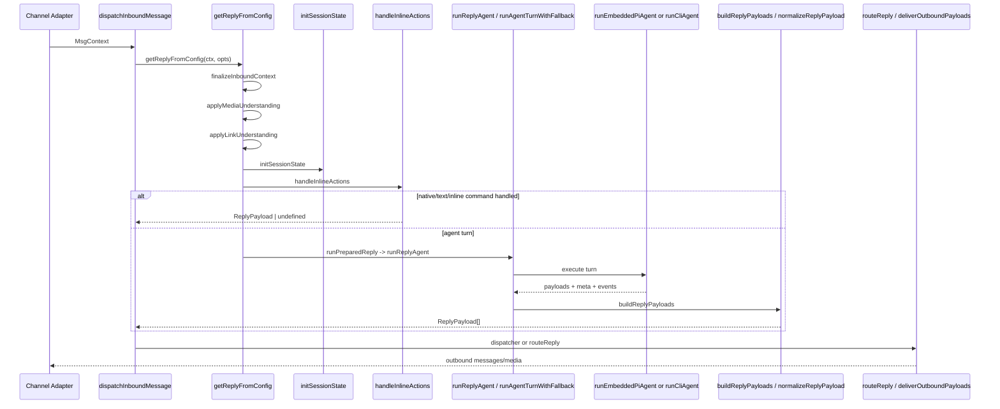

## 4. 渠道消息什么时候被视为 native command，什么时候进入 agent turn

### 4.1 真正的分界点

分界点不是 `hasControlCommand(...)`。

真正的硬边界是：渠道适配器在构造 `MsgContext` 时，是否显式设置了：

- `CommandSource: "native"`
- `CommandTargetSessionKey`

已观察到的例子：

- Slack slash command 会把 `CommandSource` 设成 `"native"`，见 `src/slack/monitor/slash.ts`
- 普通 Discord 文本消息会把 `CommandSource` 设成 `"text"`，见 `src/discord/monitor/message-handler.process.ts`

也就是说：

- native command = 平台原生命令面触发的命令
- text command = 普通消息里写 `/status`、`/new`、`!cmd` 之类文本命令

### 4.2 为什么 native command 在主链里有特殊待遇

主链里多处都看 `ctx.CommandSource === "native"`：

- `getReplyFromConfig(...)` 和 `initSessionState(...)` 会优先用 `ctx.CommandTargetSessionKey`，而不是 slash command 自己的 session
- `dispatch-from-config.ts` 会在 native 场景下关闭 tool summary 文本
- `shouldHandleTextCommands(...)` 会对 native command 永远返回 `true`

这意味着 native command 的语义不是“特殊文本”，而是“命令已经在渠道层被结构化了”。

### 4.3 文本消息何时会被当成命令

在 `getReplyFromConfig(...)` 里，文本命令要经过这几层：

1. `buildCommandContext(...)`
   - 产出 `command.commandBodyNormalized`
   - 同时附带 `isAuthorizedSender`
2. `shouldHandleTextCommands(...)`
   - 规则：
     - 如果 `commandSource === "native"`，直接允许
     - 否则若 `cfg.commands.text !== false`，允许
     - 否则只有非 native-command surface 才允许
3. `handleInlineActions(...)`
   - 先跑 inline simple command
   - 再跑 `handleCommands(...)`
4. `handleCommands(...)`
   - 依次尝试 plugin command、bash、activation、session、tts、help、status、models、stop、compact 等 handler
   - 如果某个 handler 返回结果，则 `shouldContinue=false`
   - 只有全部命令 handler 都不吃这条消息，才继续进入 agent turn

### 4.4 哪些情况会直接短路，不进入 agent turn

会短路的典型情况：

- native slash command / text command 被 command handler 吃掉
- inline skill command 被重写成 tool 调用并立即执行
- `/new` / `/reset` 在部分 ACP 绑定场景下被原地处理
- `/status` 这类 inline status 在 agent run 前直接构造回复
- `sendPolicy === deny`
- 无文本且无媒体时，直接返回提示或空
- 快速 abort 命令命中 `tryFastAbortFromMessage(...)`
- ACP session 命中 `tryDispatchAcpReply(...)`

### 4.5 什么时候一定进入 agent turn

当以下条件同时成立时，消息才会进入 agent turn：

- 没有被 fast abort 短路
- 没有被 ACP 接管
- 没有命中 command handler 的终止分支
- send policy 允许
- 归一化后仍然有文本或媒体输入

最终会进入：

- `runPreparedReply(...)`
- `runReplyAgent(...)`
- `runAgentTurnWithFallback(...)`

## 5. 媒体理解、链接理解、session 初始化发生在什么阶段

### 5.1 顺序

实际顺序在 `getReplyFromConfig(...)` 里是：

1. `finalizeInboundContext(ctx)`
2. `applyMediaUnderstanding(...)`
3. `applyLinkUnderstanding(...)`
4. `emitPreAgentMessageHooks(...)`
5. `resolveCommandAuthorization(...)`
6. `initSessionState(...)`

也就是说：

- 媒体理解和链接理解都发生在 session 初始化之前
- session 初始化看到的已经是“增强后的上下文”

### 5.2 `finalizeInboundContext(...)` 做什么

它做的是基础归一化，不做语义理解。

主要效果：

- 规范 `Body` / `RawBody` / `CommandBody` / `BodyForAgent` / `BodyForCommands`
- 填默认 `CommandAuthorized=false`
- 规范 `ChatType`
- 对媒体类型数组做补齐和对齐
- 生成 `ConversationLabel`

可以把它理解成“把渠道传来的松散字段收成一个稳定上下文对象”。

### 5.3 `applyMediaUnderstanding(...)` 做什么

它不是单纯转录音频，而是完整的附件理解入口。

从代码看，它会：

- 规范附件列表
- 跑 image/audio/video capability
- 记录 `ctx.MediaUnderstandingDecisions`
- 把理解结果写回 `ctx.MediaUnderstanding`
- 用 `formatMediaUnderstandingBody(...)` 重写 `ctx.Body`
- 对音频/媒体消息，把 `ctx.CommandBody` / `ctx.RawBody` 改成更适合命令判定的文本
- 对可提取文本的文件，附加 `<file ...>...</file>` block 到 `ctx.Body`
- 最后再次 `finalizeInboundContext(..., forceBodyForAgent/Commands=true)`

关键含义：

- agent prompt 用的是增强后的 body
- 命令解析看到的也是媒体增强后的命令体
- 所以“音频里说 `/status`”这类场景理论上也能进入命令路径

### 5.4 `applyLinkUnderstanding(...)` 做什么

它更简单：

- 调 `runLinkUnderstanding(...)`
- 把结果塞进 `ctx.LinkUnderstanding`
- 用 `formatLinkUnderstandingBody(...)` 把链接理解结果拼回 `ctx.Body`
- 再次 `finalizeInboundContext(..., forceBodyForAgent/Commands=true)`

关键含义：

- 链接理解结果也是 prompt 正文的一部分，而不是旁路 metadata
- 后续命令和 session 初始化都能看到新的 body

### 5.5 `initSessionState(...)` 在这之后做什么

它是 auto-reply 链里的 session 真正初始化器。

它负责：

- 若 `CommandSource === "native"`，优先把命令作用到 `CommandTargetSessionKey`
- 根据 `cfg.session.scope`、sender、thread、group 等解析 sessionKey
- 读取 session store，判断是不是新会话
- 处理 `/new` / `/reset` 触发的 session rollover
- 继承和恢复 sessionEntry 中的 thinking / verbose / provider / model / route 等状态
- 构造 `sessionCtx`
- 产出 `sessionKey`、`sessionId`、`sessionEntry`、`sessionStore`、`groupResolution` 等供后续使用

所以在 OpenClaw 里，session 初始化不是 agent 执行阶段做的，而是 reply 编排阶段做的。

## 6. agent turn 是怎么被执行的

### 6.1 auto-reply 路径

从 `getReplyFromConfig(...)` 往下是：

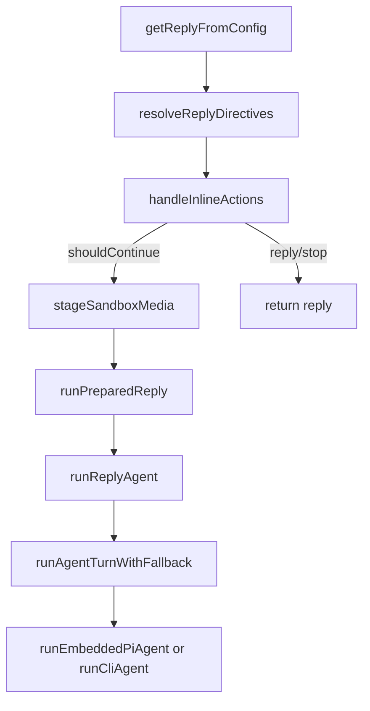

### 6.2 `runPreparedReply(...)`

这是从“编排”进入“执行”的桥。

它负责：

- 构造额外 system prompt
  - inbound meta
  - group chat context
  - group intro
  - group system prompt
- 处理 bare `/new` / `/reset` 的欢迎 prompt
- 注入 thread context、media note、system events、untrusted context
- 解析 queue policy
- 确定 session file
- 组装 `followupRun`
- 调 `runReplyAgent(...)`

### 6.3 `runReplyAgent(...)`

这是一次 reply 级别的执行编排器。

它负责：

- 解析 queue 行为
  - steer
  - followup
  - collect
  - interrupt
  - drop
- 先做 `runMemoryFlushIfNeeded(...)`
- 建 block reply pipeline 和 typing signaler
- 调 `runAgentTurnWithFallback(...)`
- 在 run 完成后：
  - flush block pipeline
  - 等待 pending tool tasks
  - 构建最终 reply payloads
  - 加 fallback/compaction/usage notice
  - 跑 followup queue

### 6.4 `runAgentTurnWithFallback(...)`

这是 agent 执行内核。

它负责：

- 生成 `runId`
- 注册 `registerAgentRunContext(...)`
- 通过 `runWithModelFallback(...)` 跑 provider/model fallback
- 对 CLI provider 调 `runCliAgent(...)`
- 对 embedded provider 调 `runEmbeddedPiAgent(...)`
- 接住这些回调：
  - `onPartialReply`
  - `onReasoningStream`
  - `onAssistantMessageStart`
  - `onAgentEvent`
  - `onBlockReply`
  - `onToolResult`
- 处理这几类恢复/兜底：
  - compaction failure
  - context overflow
  - role ordering conflict
  - Gemini session corruption
  - transient HTTP error retry

### 6.5 partial/tool/block 三种中间产物怎么处理

在 auto-reply 路径里，中间产物不是都等到 final 才发。

- `onPartialReply`
  - 用于普通文本 streaming
- `onToolResult`
  - 用于工具摘要；有串行链，防止乱序
- `onBlockReply`
  - 用于 block streaming；可走 pipeline 聚合，也可能在工具前被直接 flush

这些最终都交还给 `dispatch-from-config.ts` 提供的 dispatcher / routeReply 封装。

## 7. `commands/agent.ts` 这条执行链在主价值链里扮演什么角色

auto-reply 路径和 `commands/agent.ts` 不是互斥关系，而是两种入口收敛到相同的执行语义。

- auto-reply 路径：面向渠道入站消息
- `commands/agent.ts` 路径：面向 CLI、本地入口、Gateway ingress、HTTP 兼容层

### 7.1 入口函数

- `agentCommand(opts, runtime, deps)`
  - 本地可信入口，默认 `senderIsOwner=true`
- `agentCommandFromIngress(opts, runtime, deps)`
  - 网络入口，要求显式传 `senderIsOwner`

### 7.2 关键参数对象 `AgentCommandOpts`

字段里和主链最相关的有：

- `message`
  - agent 输入文本
- `images`
  - 多模态图片输入
- `agentId`
  - 指定 agent
- `to`
  - 目标地址
- `sessionId` / `sessionKey`
  - 目标会话
- `thinking` / `thinkingOnce` / `verbose`
  - 推理级别与输出级别
- `deliver`
  - 是否直接发回外部渠道
- `replyTo` / `replyChannel` / `replyAccountId` / `threadId`
  - 明确覆盖 delivery route
- `messageChannel` / `channel` / `accountId`
  - 当前 turn 的渠道上下文
- `runContext`
  - 嵌入式运行上下文，字段：
    - `messageChannel`
    - `accountId`
    - `groupId`
    - `groupChannel`
    - `groupSpace`
    - `currentChannelId`
    - `currentThreadTs`
    - `replyToMode`
    - `hasRepliedRef`
- `senderIsOwner`
  - 是否拥有 owner-only tool 权限
- `bestEffortDeliver`
  - 发送失败时是否容忍
- `lane`
  - 并发 lane
- `runId`
  - 指定运行 id
- `extraSystemPrompt`
  - 额外 system prompt
- `internalEvents`
  - 内部事件上下文
- `inputProvenance`
  - 输入来源
- `streamParams`
  - provider streaming 参数覆写
- `workspaceDir`
  - workspace 覆写

### 7.3 `commands/agent.ts` 的执行流程

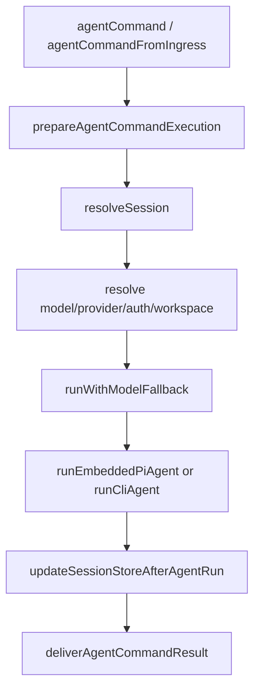

`prepareAgentCommandExecution(...)` 会做：

- 基础 message 校验
- secrets 解析
- agentId 与 sessionKey 一致性检查
- thinking / verbose / timeout 解析
- `resolveSession(...)`
- workspace / outboundSession / ACP session resolution

这里的 `resolveSession(...)` 主要是 CLI/Gateway 风格的 session 解析，不同于 auto-reply 的 `initSessionState(...)`，但目标一致：把入参收敛成稳定的 session identity。

## 8. agent 结果如何转成 outbound payload 再发回渠道

这里分两条路径看。

### 8.1 auto-reply 路径

auto-reply 路径里，run 结果先进入 `buildReplyPayloads(...)`。

它会做这些事情：

- strip stray heartbeat token
- 应用 reply threading
- 解析 reply directives
  - `MEDIA:`
  - `reply_to`
  - `audioAsVoice`
- 归一化媒体路径
- 如果 block streaming 已完整成功，则丢掉 final payload，避免重复
- 对 messaging tool 已经直接发出去的文本/media 做去重
- 最终得到 `replyPayloads`

然后这些 `replyPayloads` 会交给：

- `dispatcher.sendFinalReply(...)`
- `dispatcher.sendToolResult(...)`
- `dispatcher.sendBlockReply(...)`
- 或 `routeReply(...)`（跨 provider 回原渠道）

### 8.2 `commands/agent.ts` 路径

`commands/agent.ts` 的结果会进 `deliverAgentCommandResult(...)`。

它做这些事情：

1. `resolveAgentDeliveryPlan(...)`
   - 综合 sessionEntry、replyChannel、replyTo、turnSourceChannel、thread 等决定 resolved channel/target
2. 必要时 `resolveMessageChannelSelection(...)`
   - 如果用户要求 deliver 但没有显式 channel，尝试自动选 channel
3. `resolveAgentOutboundTarget(...)`
   - 解析显式/隐式目标地址
4. `normalizeOutboundPayloadsForJson(...)`
   - 给 `--json` 输出用
5. `normalizeOutboundPayloads(...)`
   - 把 `ReplyPayload[]` 收成 delivery payload
6. `deliverOutboundPayloads(...)`
   - 真正发消息

### 8.3 `ReplyPayload` 到 `NormalizedOutboundPayload`

输入是 `ReplyPayload`：

- `text?`
- `mediaUrl?`
- `mediaUrls?`
- `replyToId?`
- `replyToTag?`
- `replyToCurrent?`
- `audioAsVoice?`
- `isError?`
- `isReasoning?`
- `channelData?`

输出是 `NormalizedOutboundPayload`：

- `text: string`
- `mediaUrls: string[]`
- `channelData?: Record<string, unknown>`

归一化过程中会：

- 解析 `MEDIA:` / `reply_to` 这类文本指令
- 合并 `mediaUrl` 和 `mediaUrls`
- 过滤 silent payload
- 过滤 reasoning payload（对没有 reasoning lane 的渠道）
- 过滤完全不可渲染 payload

### 8.4 `deliverOutboundPayloads(...)` 真正做了什么

它不是单次 send，而是一个完整发送管线：

1. 先写 write-ahead delivery queue
2. 归一化 payload 到目标渠道
3. 运行 `message_sending` hook
4. 根据渠道创建 handler
5. 处理 text chunking / markdown chunking / signal 特殊格式化
6. 处理 media 发送
7. 运行 `message_sent` hook
8. 若需要，把发出的消息镜像写回 transcript
9. 成功则 `ackDelivery`，失败则 `failDelivery`

### 8.5 回送时序图

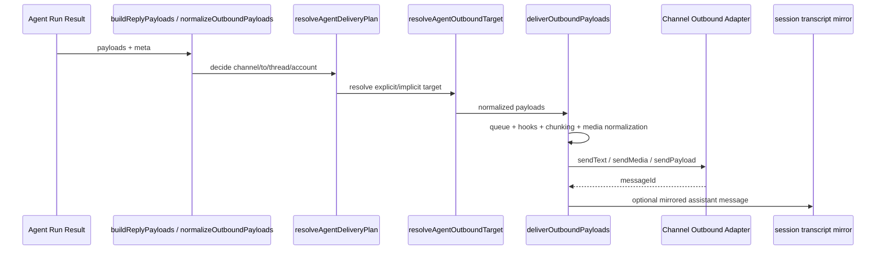

## 9. 这条链里最重要的时序事实

### 9.1 native command 优先于 agent turn

- `CommandSource="native"` 由渠道适配器更早决定
- `handleInlineActions(...)` / `handleCommands(...)` 优先于 agent 执行
- 命令只要被 handler 吃掉，就不会进入 `runReplyAgent(...)`

### 9.2 媒体理解和链接理解先于 session 初始化

- `applyMediaUnderstanding(...)`
- `applyLinkUnderstanding(...)`
- `initSessionState(...)`

所以 session 初始化基于的是“增强后的上下文”。

### 9.3 session 初始化早于模型执行

- sessionKey/sessionId/sessionEntry 在真正跑模型前就已经确定
- 后续 model override、queue、group routing、delivery plan 都依赖这一步产物

### 9.4 outbound 不是一次性 final send

在 auto-reply 链里，可能发生这几种中间回送：

- partial reply
- reasoning block
- tool result
- block reply streaming
- final reply

而在 `commands/agent.ts` 链里，则更偏“run 完成 -> 统一 delivery”。

## 10. 最应该记住的实现判断

1. `dispatch.ts` 只是入口包装，真正业务决策在 `get-reply.ts`。
2. native command 与 text command 的差别，来自渠道适配器是否把 `CommandSource` 标成 `native`。
3. 命令、媒体理解、链接理解、session 初始化都发生在 agent turn 之前。
4. `runReplyAgent(...)` 负责“对一次用户 turn 的执行编排”，`runAgentTurnWithFallback(...)` 负责“真正跑模型”。
5. `commands/agent.ts` 是另一条统一执行入口，不只服务 CLI，也服务 Gateway ingress / HTTP 兼容面。
6. outbound delivery 是一个完整的发送系统，不是简单的 `send(text)`。

## 11. 推荐下一步

如果你继续往下拆，最值得继续深读的是：

1. `src/auto-reply/reply/get-reply-inline-actions.ts`
   - 这里最清楚地定义了命令与 agent turn 的边界。
2. `src/auto-reply/reply/agent-runner.ts`
   - 这里最清楚地定义了 queue、followup、payload 构造和运行后收尾。
3. `src/auto-reply/reply/agent-runner-payloads.ts`
   - 这里最清楚地定义了“结果如何避免重复发送”。
4. `src/infra/outbound/deliver.ts`
   - 这里最清楚地定义了渠道发送的真正执行模型。

## 12. 命令边界的第二层细节：不是只有“命中命令”这么简单

### 12.1 `shouldHandleTextCommands(...)` 的真实判定

`src/auto-reply/commands-registry.ts` 里的 `shouldHandleTextCommands(params)` 很短，但它决定了后续整条分支是否有资格进入命令层。

判定顺序是：

1. 如果 `params.commandSource === "native"`，直接返回 `true`
2. 否则如果 `params.cfg.commands?.text !== false`，返回 `true`
3. 否则只有当前 `surface` 不是 native-command surface 时才返回 `true`

这说明：

- native command 永远允许进入命令处理
- text command 是否允许，受配置和 surface 能力共同约束
- “是否支持文本命令”并不是 agent 层决定的，而是主编排阶段先决定

### 12.2 `handleInlineActions(...)` 先于普通命令 handler

`src/auto-reply/reply/get-reply-inline-actions.ts` 不是一个小 helper，而是命令边界的第二道门。

它先做这些事：

- 解析 slash command 名称
- 按需加载 skill command 列表
- `resolveSkillCommandInvocation(...)`
- 对部分 skill command 直接走 tool dispatch
- 再决定是否继续去 `handleCommands(...)`

这里有个很重要的设计：

- 如果 skill command 的 `dispatch.kind === "tool"`
  - 它不会进入 agent turn
  - 而是立刻用 `createOpenClawTools(...)` 构造工具集
  - 再用 `applyOwnerOnlyToolPolicy(...)` 按 `senderIsOwner` 过滤
  - 然后直接 `tool.execute(...)`

也就是说，一部分 slash command 实际上不是“命令后再调 agent”，而是“命令本身就是工具调用”。

### 12.3 另一类 skill command 会把消息重写后再进入 agent

如果 skill command 不是 tool-dispatch 型，`handleInlineActions(...)` 会把原消息改写成：

- `Use the "<skill>" skill for this request.`
- 再附上用户输入

然后回写：

- `ctx.Body`
- `ctx.BodyForAgent`
- `sessionCtx.Body`
- `sessionCtx.BodyForAgent`
- `sessionCtx.BodyStripped`

这意味着 skill command 有两种完全不同的运行方式：

- 直接工具执行
- 重写 prompt 后进入 agent turn

### 12.4 `handleCommands(...)` 的 handler 顺序本身就是策略

`src/auto-reply/reply/commands-core.ts` 把 handlers 固定成以下顺序：

1. plugin
2. bash
3. activation
4. sendPolicy
5. usage
6. session
7. restart
8. tts
9. help
10. commands list
11. status
12. allowlist
13. approve
14. context
15. export
16. whoami
17. subagents
18. acp
19. config
20. debug
21. models
22. stop
23. compact
24. abort trigger

这个顺序不是随便排的，实际含义是：

- 插件命令优先级高于内建命令
- 会话/治理类命令早于模型/输出类命令
- `abort` 是最后兜底，不去抢前面的更明确语义

### 12.5 `/new` 与 `/reset` 不是普通命令

在 `handleCommands(...)` 里，`/new` / `/reset` 会先被单独识别：

- 未授权 sender 直接忽略
- 授权后会触发 `emitResetCommandHooks(...)`
- 如果是 ACP 绑定 session，还会先 `resetAcpSessionInPlace(...)`
- 如果 reset 命令后面还跟了尾部文本，会把尾部文本重新塞回 `ctx.Body` / `BodyForAgent` / `BodyForCommands`

也就是说，这两个命令既会改 session 状态，也可能把“reset 之后的剩余文本”重新交还主链继续处理。

### 12.6 命令边界图

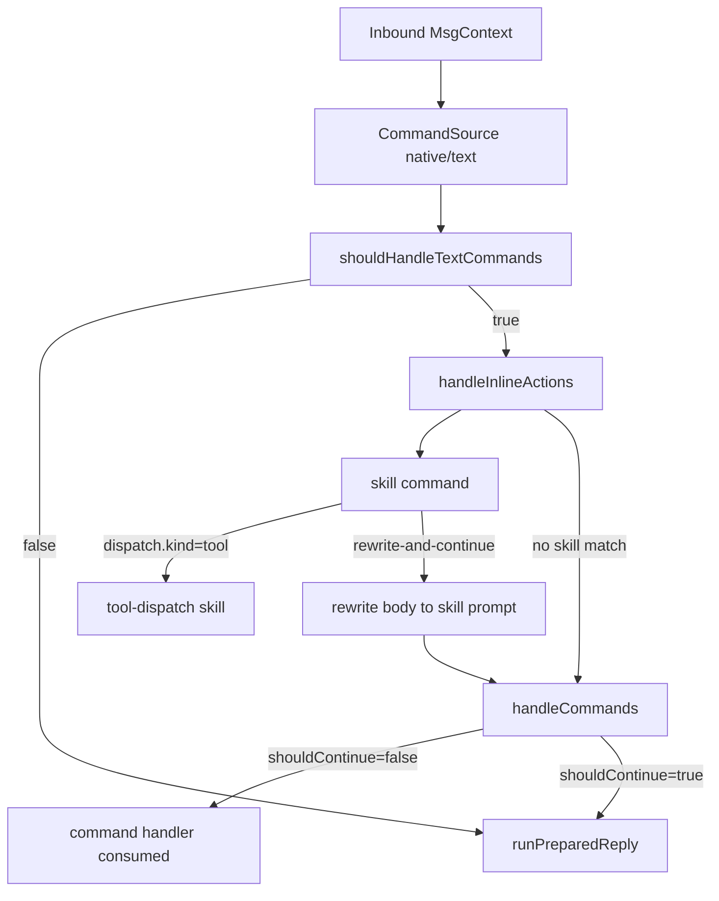

## 13. 活跃 run 的调度：steer、followup、collect、queue 到底怎么工作

### 13.1 `resolveQueueSettings(...)` 的优先级

`src/auto-reply/reply/queue/settings.ts` 里，queue 设置不是只有一个全局开关，而是多层覆盖：

`mode` 优先级：

1. `inlineMode`
2. `sessionEntry.queueMode`
3. `cfg.messages.queue.byChannel[channel]`
4. `cfg.messages.queue.mode`
5. 默认 `"collect"`

`debounceMs` 优先级：

1. `inlineOptions.debounceMs`
2. `sessionEntry.queueDebounceMs`
3. `cfg.messages.queue.debounceMsByChannel[channel]`
4. `plugin.defaults.queue.debounceMs`
5. `cfg.messages.queue.debounceMs`
6. 默认值

`cap` / `dropPolicy` 也分别按 inline -> session -> config -> default 这样覆盖。

这意味着 queue 行为既可以全局配置，也可以被 session 和记忆下来的状态覆盖，还可以被单条消息临时覆盖。

### 13.2 queue mode 不只是一种

`src/auto-reply/reply/queue/types.ts` 定义了 6 种 `QueueMode`：

- `steer`
- `followup`
- `collect`
- `steer-backlog`
- `interrupt`
- `queue`

以及 3 种 drop policy：

- `old`
- `new`
- `summarize`

所以它不是简单“忙则排队”，而是支持多种拥塞策略。

### 13.3 active run 时先决定：run-now、enqueue-followup、还是 drop

`src/auto-reply/reply/queue-policy.ts` 的 `resolveActiveRunQueueAction(...)` 只返回三种动作：

- `run-now`
- `enqueue-followup`
- `drop`

判定规则非常明确：

1. 当前没有 active run：`run-now`
2. 当前是 heartbeat 且有 active run：`drop`
3. 否则如果 `shouldFollowup` 或 `queueMode === "steer"`：`enqueue-followup`
4. 其他情况：`run-now`

这里最关键的事实是：

- heartbeat 在忙时不会排队，直接丢弃
- steer 模式在 busy 时天然转 followup

### 13.4 真正的“steer”发生在 active embedded run 仍在 streaming 时

`src/auto-reply/reply/agent-runner.ts` 里还有一个更细的分支：

- 如果 `shouldSteer && isStreaming`
- 会先尝试 `queueEmbeddedPiMessage(sessionId, prompt)`
- 成功且当前 turn 不要求 followup 时，直接结束本次调度，不再新开 run

这意味着 steer 不是简单“排队后下次再跑”，而是尽量把新消息塞进当前仍在 streaming 的 embedded run lane 里。

### 13.5 `enqueueFollowupRun(...)` 做的不只是 push

`src/auto-reply/reply/queue/enqueue.ts` 还做了三件关键事：

- 用 message-id 做近期去重
- 队列内再次按 routing + messageId 或 prompt 去重
- 应用 drop policy，并在 drain 已空闲时重启 drain

因此 followup queue 是“去重队列”，不是无脑积压。

### 13.6 `scheduleFollowupDrain(...)` 有 collect 模式和跨渠道保护

`src/auto-reply/reply/queue/drain.ts` 的 drain 逻辑很值得注意：

- 若 mode 是 `collect`
  - 会先看队列里的消息是否跨 channel / to / account / thread
  - 如果混了不同目标，就不再 collect 成一个批次 prompt
  - 否则会把多条消息拼成一个 `[Queued messages while agent was busy]` prompt
- 若产生了 summary prompt
  - 会先发 summary 再清理 dropped 状态
- 失败后不会丢队列
  - 会把 `draining=false`
  - 然后如果队列还有积压，再次 `scheduleFollowupDrain(...)`

它本质上是一个“可恢复 drain loop”，不是简单 setTimeout 轮询。

### 13.7 followup queue 调度图

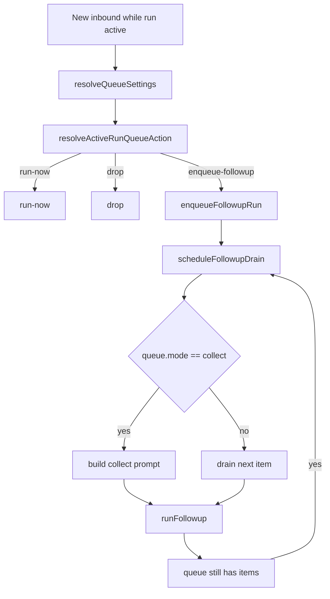

## 14. payload 去重与 block streaming：为什么最终不容易重复回消息

### 14.1 `buildReplyPayloads(...)` 先做基础净化

`src/auto-reply/reply/agent-runner-payloads.ts` 里的 `buildReplyPayloads(...)` 首先会：

- 去掉 stray `HEARTBEAT_OK`
- 去掉 silent reply token
- 对错误文本做用户可见化清洗
- 保留 media-only payload

这一步解决的是“final payload 自身是否可见”。

### 14.2 再做 reply threading、directive 解析、媒体路径标准化

后续会依次做：

- `applyReplyThreading(...)`
- `normalizeReplyPayloadDirectives(...)`
- `normalizeReplyPayloadMedia(...)`
- `isRenderablePayload(...)`

也就是说，最终发送前的 payload 已经带好了：

- replyTo 关系
- 媒体指令结果
- 规范化后的媒体路径
- 渠道可发送形态

### 14.3 block streaming 成功时，会主动丢掉 final payload

这里有个很重要的判断：

- 只有 `blockStreamingEnabled`
- 且 `blockReplyPipeline.didStream() === true`
- 且 pipeline 没有 aborted

才会 `shouldDropFinalPayloads = true`

所以它不是“只要开了 block streaming 就丢 final”，而是“只有 block streaming 已经完整成功跑完，final payload 才被视为重复”。

### 14.4 还会对 messaging tool 直接发出的内容去重

`buildReplyPayloads(...)` 还会看：

- `messagingToolSentTexts`
- `messagingToolSentMediaUrls`
- `messagingToolSentTargets`

然后：

- 只对“同一 origin target”的内容做去重
- 文本走 `filterMessagingToolDuplicates(...)`
- 媒体走 `filterMessagingToolMediaDuplicates(...)`

这点很关键，因为 cross-target 的工具发送不能把当前会话的最终回复也一起吞掉。

### 14.5 block pipeline 和 tool flush 还会再做一层去重

如果没有走“整包丢 final payload”的条件，还会继续过滤：

- `blockReplyPipeline.hasSentPayload(payload)`
- `directlySentBlockKeys`

也就是：

- 被 block pipeline 已经流式发过的内容不再重复发
- 工具 flush 时已经直发的 payload 也不会在 final 阶段再发一次

### 14.6 CLI provider 与 embedded provider 的事件面不一样

`src/auto-reply/reply/agent-runner-execution.ts` 里还能看到一个容易忽略的实现事实：

- CLI provider 不会自己产出 streaming assistant 事件
- 所以运行结束后，代码会手工 `emitAgentEvent({ stream: "assistant", ... })`
- 同时补发 lifecycle `start/end/error`

相对地，embedded provider 会把：

- partial reply
- reasoning stream
- tool result
- lifecycle
- block reply

都通过回调链直接向外吐出。

这就是为什么 Gateway/TUI/UI 看同样一轮运行时，CLI backend 和 embedded backend 的事件形态并不完全一致。

### 14.7 payload 去重与 streaming 图

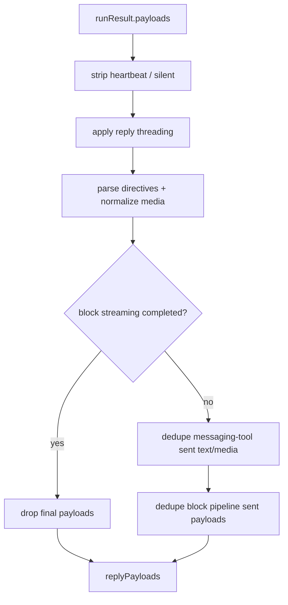

## 15. `deliverOutboundPayloads(...)` 执行器细化：发送不是 `send(text)`

### 15.1 最外层参数的用途

`src/infra/outbound/deliver.ts` 暴露的 `deliverOutboundPayloads(params)` 至少有这些关键输入：

- `cfg`
  - 全局配置，用来解析渠道能力、chunking、markdown、media 限制等
- `channel`
  - 最终要发到哪个 outbound channel
- `to`
  - 最终目标地址/会话 id
- `accountId`
  - 多账号场景下的账号选择
- `payloads`
  - 待发送的 `ReplyPayload[]`
- `replyToId`
  - 线程/回复锚点
- `threadId`
  - 渠道线程 id，例如 Slack thread、Telegram topic
- `identity`
  - outbound 发送身份信息
- `deps`
  - 可注入的 send 实现
- `gifPlayback`
  - 媒体发送时的 gif 策略
- `abortSignal`
  - 发送中止信号
- `bestEffort`
  - 单个 payload 失败时是否继续后续发送
- `onError`
  - best-effort 模式下的单 payload 错误回调
- `onPayload`
  - 每个归一化 payload 发出前的观测钩子
- `session`
  - session/agent 上下文，用于 hook 和 media root 解析
- `mirror`
  - 成功后是否把发出的 assistant 文本镜像写回 transcript
- `silent`
  - 渠道静默发送标志
- `skipQueue`
  - 内部恢复路径专用，跳过 write-ahead queue

### 15.2 最外层先做 write-ahead queue

`deliverOutboundPayloads(...)` 并不直接发送，而是先：

- `enqueueDelivery(...)`

发送完成后：

- 全部成功：`ackDelivery(queueId)`
- 非 bestEffort 且报错：`failDelivery(queueId, error)`
- bestEffort 下有部分失败：`failDelivery(queueId, "partial delivery failure (bestEffort)")`

这说明 delivery queue 不是装饰，而是为了 crash-recovery / 失败诊断保留发送前状态。

### 15.3 `deliverOutboundPayloadsCore(...)` 的阶段

核心执行阶段可以概括成：

1. `createChannelHandler(...)`
   - 通过 `loadChannelOutboundAdapter(channel)` 动态装载 plugin outbound adapter
2. 解析该 channel 的 text limit / chunk mode / Signal 特殊表格模式 / media 限额
3. `normalizePayloadsForChannelDelivery(...)`
   - 过滤 silent 和空 payload
   - 对 plain-text surface 去 HTML
   - 对 WhatsApp 去掉前导空行
4. 创建 `message_sent` 事件发射器
5. 对每个 payload 执行 `message_sending` hook
   - hook 可以改写内容，甚至 cancel 发送
6. 真正发送
   - 有 `channelData` 且 adapter 支持 `sendPayload`：走结构化发送
   - 纯文本：走 `sendText` / chunking
   - Signal：走 markdown-to-styled-text 特殊分支
   - 媒体：走 `sendMedia`
7. 成功或失败都发 `message_sent` hook / internal hook
8. 若启用 `mirror`，把成功发出的 assistant 文本附加进 transcript

### 15.4 适配器抽象不是只有 `sendText`

`createChannelHandler(...)` 产出的 handler 至少包含：

- `chunker`
- `chunkerMode`
- `textChunkLimit`
- `supportsMedia`
- `sendPayload(...)`
- `sendText(...)`
- `sendMedia(...)`

所以 outbound adapter 可以是：

- 最低配：只支持 `sendText`
- 中配：支持 text + media
- 高配：支持 `channelData` 驱动的结构化 payload 发送

### 15.5 media fallback 与 hook 取消都是真分支

两个容易忽略的真实分支：

- 如果 adapter 不支持 `sendMedia`
  - 会降级成 text fallback
  - 但如果没有 text fallback，就抛错
- 如果 `message_sending` hook 返回 `cancel`
  - payload 直接跳过
  - 不进入发送动作

所以“为什么一条回复最后没发出去”，不能只查 channel adapter，还要看 hooks 和 media 能力。

## 16. 继续深挖这条主链时，下一批最值得读的文件

1. `src/auto-reply/reply/get-reply-inline-actions.ts`
   - 看 skill command、tool dispatch、命令短路边界
2. `src/auto-reply/reply/queue/settings.ts`
   - 看 queue 行为是怎么层层覆写出来的
3. `src/auto-reply/reply/queue/enqueue.ts`
   - 看 followup 去重和 drop policy
4. `src/auto-reply/reply/queue/drain.ts`
   - 看 collect / summary / cross-channel 保护
5. `src/auto-reply/reply/agent-runner-payloads.ts`
   - 看 final payload 为什么不会和 block/tool 发送重复
6. `src/infra/outbound/deliver.ts`
   - 看发送执行器与 hooks / transcript / adapter 的真实关系

## 17. `commands/agent.ts` 是这条主链的“程序化入口”

到这里可以把 OpenClaw 的主价值链拆成两条入口：

- 渠道入站入口
  - `dispatchInboundMessage(...)` -> `getReplyFromConfig(...)` -> `runReplyAgent(...)`
- 程序化入口
  - `agentCommand(...)` / `agentCommandFromIngress(...)` -> `agentCommandInternal(...)`

它们前半段不同，但后半段会收敛到两类共同语义：

- 跑 agent
- 把结果变成 outbound payload 并发出去

也就是说，`commands/agent.ts` 不是旁路工具，而是主链的第二入口。

### 17.1 信任边界：`agentCommand(...)` 与 `agentCommandFromIngress(...)`

`src/commands/agent.ts` 暴露两个对外入口：

- `agentCommand(opts, runtime, deps)`
  - 面向本地 CLI / 可信调用方
  - 默认 `senderIsOwner = true`
- `agentCommandFromIngress(opts, runtime, deps)`
  - 面向网络入口
  - 强制要求显式传 `senderIsOwner`

这条边界非常关键，因为 owner-only tool 权限不会自动透传给网络入口。

## 18. `AgentCommandOpts`、`AgentRunContext` 和相关参数对象

### 18.1 `AgentCommandOpts` 的主要字段和用途

`src/commands/agent/types.ts` 里的 `AgentCommandOpts` 是程序化 agent 调用的主输入对象。

按语义可以分成几组：

输入内容：

- `message`
  - 必填 prompt 文本
- `images`
  - 图片内容块，多模态输入
- `clientTools`
  - 客户端注入的 hosted tools
- `internalEvents`
  - 额外内部事件，调用前会被 prepend 到 prompt

会话与 agent 选择：

- `agentId`
  - 指定 agent
- `to`
  - 目标 sender/recipient，用于派生 session
- `sessionId`
  - 显式 session id
- `sessionKey`
  - 显式 session key
- `workspaceDir`
  - 显式 workspace 继承

推理和输出控制：

- `thinking`
  - 持久化 thinking override
- `thinkingOnce`
  - 单次 thinking override
- `verbose`
  - verbose 输出级别
- `timeout`
  - 本次运行 timeout 秒数
- `streamParams`
  - provider stream 参数覆写，例如 `temperature`、`maxTokens`

delivery 与回送：

- `deliver`
  - 是否直接回送到外部渠道
- `replyTo`
  - 显式目标地址 override
- `replyChannel`
  - 显式 delivery channel override
- `replyAccountId`
  - 显式 delivery account override
- `threadId`
  - 目标线程/topic id
- `channel`
  - delivery channel hint
- `accountId`
  - delivery account hint
- `deliveryTargetMode`
  - explicit / implicit target 解析模式
- `bestEffortDeliver`
  - 部分 payload 失败时是否继续发送

运行时上下文：

- `messageChannel`
  - 当前 turn 的消息渠道上下文
- `runContext`
  - 嵌入式运行上下文
- `abortSignal`
  - 中止运行
- `lane`
  - 并发 lane
- `runId`
  - 外部指定的 run id
- `extraSystemPrompt`
  - 额外 system prompt
- `inputProvenance`
  - 输入来源
- `senderIsOwner`
  - 是否授予 owner-only tool 权限

spawn/subagent 元数据：

- `groupId`
- `groupChannel`
- `groupSpace`
- `spawnedBy`

这些字段的整体作用是：

- 前半段决定 session / agent / model / workspace
- 中间段决定执行时上下文
- 后半段决定是否以及如何把结果送出去

### 18.2 `AgentRunContext` 的字段和用途

`AgentRunContext` 是 embedded run 侧更细的路由上下文：

- `messageChannel`
  - 当前消息属于哪个逻辑 channel
- `accountId`
  - 多账号场景的账号 id
- `groupId`
  - group identity
- `groupChannel`
  - group 所属 channel
- `groupSpace`
  - group 所属空间/workspace
- `currentChannelId`
  - 当前会话目标 id
- `currentThreadTs`
  - 当前线程 id
- `replyToMode`
  - `off` / `first` / `all`
- `hasRepliedRef`
  - 共享布尔引用，用于判断本次运行是否已回过消息

### 18.3 `resolveAgentRunContext(opts)` 实际做了什么

`src/commands/agent/run-context.ts` 不只是透传字段，而是会做归一化：

- 统一 `messageChannel`
- 标准化 `accountId`
- 合并 `groupId/groupChannel/groupSpace`
- 若 `currentThreadTs` 为空，则从 `opts.threadId` 填充
- 若 `currentChannelId` 为空，则从 `opts.to` 填充

也就是说，这个对象是 embedded agent 的“最小稳定路由上下文”。

### 18.4 `OutboundSessionContext` 的字段和用途

`src/infra/outbound/session-context.ts` 的 `OutboundSessionContext` 很小，但很关键：

- `key`
  - 规范 session key，用于 internal hook
- `agentId`
  - 当前 agent id，用于 workspace-scoped media roots

`buildOutboundSessionContext(...)` 会根据：

- 显式 `agentId`
- 或从 `sessionKey` 反推 agent id

构造这个对象。

## 19. `prepareAgentCommandExecution(...)`：程序化入口的预处理装配

### 19.1 它先解决什么问题

`prepareAgentCommandExecution(opts, runtime)` 不是轻量 helper，而是程序化路径的装配器。

它先解决以下问题：

1. 输入是否合法
2. 配置和 secret refs 是否已经解析
3. agentId / sessionKey 是否一致
4. thinking / verbose / timeout 是否有效
5. session 应该落到哪里
6. workspace 应该用哪个目录
7. ACP session 是否已经 ready

### 19.2 它的主要返回值

这个函数会返回一组“已经装配好”的运行时对象：

- `body`
  - 可能已经 prepend 过 internal event context 的最终 prompt
- `cfg`
  - 已解析 secret refs 的 config
- `normalizedSpawned`
  - 标准化后的 spawned metadata
- `agentCfg`
  - agent defaults
- `thinkOverride` / `thinkOnce` / `verboseOverride`
  - 已归一化的调用级别覆写
- `timeoutMs`
  - 最终 timeout
- `sessionId` / `sessionKey`
  - 解析后的会话标识
- `sessionEntry` / `sessionStore` / `storePath`
  - 会话状态存储
- `isNewSession`
  - 当前是否新会话
- `persistedThinking` / `persistedVerbose`
  - session 中继承的持久化级别
- `sessionAgentId`
  - 会话最终绑定到哪个 agent
- `outboundSession`
  - delivery/hook 用的 session context
- `workspaceDir`
  - 最终工作目录
- `agentDir`
  - agent 目录
- `runId`
  - 本轮运行 id
- `acpManager` / `acpResolution`
  - ACP 控制平面解析结果

### 19.3 参数对象背后的真实意图

这里最值得注意的是：

- `opts.message` 会先通过 `prependInternalEventContext(...)`，所以 internal events 会进入 prompt 本体
- 配置不是简单 `loadConfig()`；还会尝试 `readConfigFileSnapshotForWrite()`，并通过 `resolveCommandSecretRefsViaGateway(...)` 解析 command secret refs
- workspace 不是直接用 `cwd`，而是通过 `resolveAgentWorkspaceDir(...)` + `ensureAgentWorkspace(...)` 统一得到
- ACP resolution 是在真正跑 agent 前就判定的，所以程序化入口也可能直接走 ACP runtime，而不是 embedded/CLI runtime

## 20. `resolveSession(...)`：程序化路径的 session 解析模型

### 20.1 `resolveSessionKeyForRequest(...)` 的职责

`src/commands/agent/session.ts` 的 `resolveSessionKeyForRequest(...)` 主要负责：

- 优先使用显式 `sessionKey`
- 否则用 `to` 推导 session key
- 如果给了 `sessionId`，优先尝试在当前 store 里反查对应 key
- 若当前 store 没有，再遍历所有 agent store 查找同一个 `sessionId`

这里说明一个事实：

- 程序化入口的 session 解析不是只查默认 store，而是会跨 agent store 搜索已有 session id

### 20.2 `SessionResolution` 的字段和用途

`resolveSession(...)` 最终返回的 `SessionResolution` 包括：

- `sessionId`
  - 最终会话 id；若旧会话不再 fresh，会生成新 UUID
- `sessionKey`
  - 逻辑会话键
- `sessionEntry`
  - 当前已有的 session 状态
- `sessionStore`
  - 所属 store
- `storePath`
  - store 文件路径
- `isNewSession`
  - 本次是否 roll 到了新会话
- `persistedThinking`
  - 从 fresh session 继承的 thinking
- `persistedVerbose`
  - 从 fresh session 继承的 verbose

### 20.3 它如何判断旧 session 是否还能复用

`resolveSession(...)` 会根据：

- `resolveSessionResetType({ sessionKey })`
- `resolveChannelResetConfig(...)`
- `resolveSessionResetPolicy(...)`
- `evaluateSessionFreshness(...)`

来判断旧 session 是否仍然 fresh。

只有 fresh 的旧 session 才会继续复用：

- `sessionId`
- persisted thinking
- persisted verbose

否则会生成新 `sessionId`，并触发 bootstrap snapshot rollover 清理。

## 21. `agentCommandInternal(...)` 有两条执行分支

### 21.1 分支一：ACP ready session

如果 `acpResolution?.kind === "ready"` 且有 `sessionKey`，程序不会走 embedded/CLI run，而是直接走 ACP turn：

- 先发 lifecycle `start`
- `acpManager.runTurn(...)`
- 监听 `text_delta`
- 用 `createAcpVisibleTextAccumulator()` 做可见文本累积
- 把可见增量通过 `emitAgentEvent({ stream: "assistant" ... })` 发出去
- 完成后补 lifecycle `end`
- 再 `persistAcpTurnTranscript(...)`
- 把最终文本 `normalizeReplyPayload(...)`
- 最后仍然走 `deliverAgentCommandResult(...)`

这说明 ACP 分支和常规分支虽然运行内核不同，但最终仍然收敛到同一个 delivery 入口。

### 21.2 分支二：普通 embedded/CLI runtime

如果不是 ACP ready，则进入普通分支：

1. 解析最终 `resolvedThinkLevel` / `resolvedVerboseLevel`
2. 注册 agent run context
3. 解析或构建 `skillsSnapshot`
4. 持久化显式 `/command` thinking / verbose override 到 session store
5. 解析 model/provider override 与 allowlist
6. 校验 auth profile override 是否还匹配 provider
7. 解析 `sessionFile`
8. 进入 `runWithModelFallback(...)`
9. 运行结束后 `updateSessionStoreAfterAgentRun(...)`
10. 最后 `deliverAgentCommandResult(...)`

### 21.3 普通分支的关键设计

这条分支的关键点有三个：

- skills snapshot 在新会话或缺失时会先持久化进 session store
- session 中已有的 provider/model override 会先过 allowlist 校验，失效时会回滚到 default
- 最终运行结果不直接发，而是先更新 session store，再交给统一 delivery 层

## 22. `runAgentAttempt(...)`：单次运行尝试，不等于整轮执行

### 22.1 它的参数对象说明了它的职责边界

`runAgentAttempt(...)` 的参数已经是高层装配之后的“可运行输入”。其中最关键的有：

- `providerOverride` / `modelOverride`
  - 本次尝试用哪个 provider/model
- `sessionEntry`
  - 当前 session 状态
- `sessionId` / `sessionKey` / `sessionFile`
  - 会话身份和 transcript 文件
- `workspaceDir`
  - 执行工作目录
- `body`
  - prompt 本体
- `isFallbackRetry`
  - 是否 fallback 之后的重试
- `resolvedThinkLevel`
  - 最终思考级别
- `timeoutMs`
  - 最终超时
- `opts`
  - 原始调用选项
- `runContext`
  - 归一化后的 embedded run 上下文
- `skillsSnapshot`
  - 本次技能快照
- `resolvedVerboseLevel`
  - 最终 verbose 级别
- `onAgentEvent`
  - 生命周期/事件回调
- `primaryProvider`
  - 首选 provider，用于 auth/profile 逻辑

### 22.2 fallback retry 时不会重复注入原始 prompt

`runAgentAttempt(...)` 内部先调用 `resolveFallbackRetryPrompt(...)`：

- 首次尝试：使用原 `body`
- fallback retry：改成
  - `Continue where you left off. The previous model attempt failed or timed out.`

所以 fallback 重试不会把原始用户 prompt 再追加一次，避免 transcript 语义被重复污染。

### 22.3 CLI provider 与 embedded provider 的差异

CLI provider 分支：

- 用 `getCliSessionId(...)` 读取已有 CLI session
- 失败时如果是 `session_expired`
  - 会先清理 session store 里的 CLI session id
  - 再无 sessionId 重跑一次
  - 成功后把新 CLI session id 写回 store

embedded provider 分支：

- 直接 `runEmbeddedPiAgent(...)`
- 传入 `messageChannel`、`groupId`、`replyToMode`、`hasRepliedRef`、`clientTools`、`senderIsOwner` 等上下文

所以 `runAgentAttempt(...)` 负责的是“某个 provider/model 的一次尝试”，而不是整个 fallback loop。

## 23. `updateSessionStoreAfterAgentRun(...)` 与 `deliverAgentCommandResult(...)`

### 23.1 `updateSessionStoreAfterAgentRun(...)` 更新哪些状态

`src/commands/agent/session-store.ts` 的 `updateSessionStoreAfterAgentRun(...)` 会把运行结果回写到 session store，主要包括：

- `contextTokens`
- runtime model/provider
- CLI session id
- `abortedLastRun`
- `systemPromptReport`
- `inputTokens` / `outputTokens`
- `totalTokens` / `totalTokensFresh`
- `cacheRead` / `cacheWrite`
- `compactionCount`

也就是说，这一步不是简单“记个 last used model”，而是把后续 fallback、token 预算、诊断、CLI session 续接都需要的状态保存下来。

### 23.2 `deliverAgentCommandResult(...)` 的输入对象

`src/commands/agent/delivery.ts` 的 `deliverAgentCommandResult(params)` 接收：

- `cfg`
  - 全局配置
- `deps`
  - CLI 发送依赖
- `runtime`
  - 输出日志/错误的 runtime
- `opts`
  - 原始 `AgentCommandOpts`
- `outboundSession`
  - hook / media root 所需的 session context
- `sessionEntry`
  - 当前 session entry
- `result`
  - run 返回结果
- `payloads`
  - 运行产出的 payload 列表

### 23.3 `AgentDeliveryPlan` 的字段和用途

`src/infra/outbound/agent-delivery.ts` 里的 `AgentDeliveryPlan` 字段包括：

- `baseDelivery`
  - 从 session 和 turn source 推导出的基础 delivery target
- `resolvedChannel`
  - 最终 delivery channel
- `resolvedTo`
  - 最终目标地址
- `resolvedAccountId`
  - 最终账号 id
- `resolvedThreadId`
  - 最终线程 id
- `deliveryTargetMode`
  - `explicit` 或 `implicit`

它的作用是把：

- session-level lastChannel/lastTo
- turn-source channel/to/account/thread
- 用户显式的 `replyChannel/replyTo/threadId`

收敛成一个统一 delivery plan。

### 23.4 `deliverAgentCommandResult(...)` 的阶段

它的执行顺序可以概括成：

1. `resolveAgentDeliveryPlan(...)`
2. 如有需要，`resolveMessageChannelSelection(...)`
3. `resolveAgentOutboundTarget(...)`
4. 若 `opts.json`，先输出 JSON envelope
5. `normalizeOutboundPayloads(...)`
6. 若 `deliver=false`，只做日志输出
7. 若 `deliver=true`，调用 `deliverOutboundPayloads(...)`

这个函数最关键的意义是：

- 它让程序化入口和渠道入口最终共享同一套 outbound 执行模型
- 它把“运行结果怎么展示”和“运行结果怎么发送”明确分离了

## 24. 两条入口如何收敛

### 24.1 真正的收敛点

两条主链不是在一开始就统一，而是在后半段收敛：

- 渠道入站链
  - `getReplyFromConfig(...)` -> `runReplyAgent(...)` -> `buildReplyPayloads(...)` -> `routeReply(...)` / dispatcher
- 程序化 agent 链
  - `agentCommandInternal(...)` -> `runAgentAttempt(...)` / ACP turn -> `deliverAgentCommandResult(...)`

它们共同的底层语义是：

- agent 运行结果都会变成 payload
- payload 都会进入统一的 outbound normalization / adapter / hook / transcript 体系

### 24.2 收敛关系图

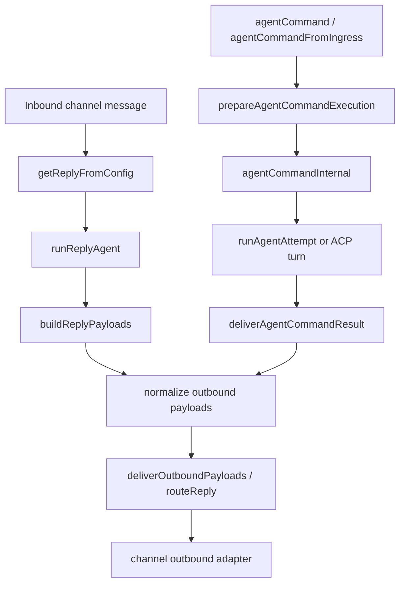

## 25. 现在再看这条主价值链，最应该记住的 8 个判断

1. OpenClaw 的“主链”有两条入口，不是一条。
2. `dispatchInboundMessage(...)` 是渠道入口，`agentCommand(...)` 是程序化入口。
3. `prepareAgentCommandExecution(...)` 是程序化路径的真正装配层，不是轻量参数校验。
4. 程序化路径也会先完成 session、workspace、ACP、secret-ref、timeout、thinking/verbose 的装配，再进入真正运行。
5. 程序化路径的 session 解析支持跨 agent store 反查 `sessionId`。
6. ACP ready session 不走 embedded/CLI runtime，但最终仍然收敛到同一个 delivery 入口。
7. `runAgentAttempt(...)` 只代表一次 provider/model 尝试；完整执行还要外层 `runWithModelFallback(...)` 包起来。
8. 两条入口最终共享的是 payload normalization + outbound delivery 语义，而不是共享同一个前置编排器。

## 26. `runWithModelFallback(...)`：不是“失败了换一个模型”这么简单

### 26.1 输入参数和返回值

`src/agents/model-fallback.ts` 暴露的 `runWithModelFallback(params)` 主要接收：

- `cfg`
  - 配置，用于解析默认主模型、fallback 链、allowlist、auth profiles
- `provider`
  - 当前首选 provider
- `model`
  - 当前首选 model
- `agentDir`
  - auth profile store 的 agent 作用域
- `fallbacksOverride`
  - 显式 fallback 链；只要传了，即使是空数组，也会覆盖全局默认链
- `run(provider, model, options)`
  - 单次尝试执行函数
- `onError`
  - 每次失败后的回调

返回值不是单纯 `result`，而是：

- `result`
  - 成功运行结果
- `provider`
  - 实际成功的 provider
- `model`
  - 实际成功的 model
- `attempts`
  - 所有失败尝试的摘要数组

失败摘要 `FallbackAttempt` 里保留：

- `provider`
- `model`
- `error`
- `reason`
- `status`
- `code`

所以这层 API 的价值不是“帮你重试一次”，而是“帮你生成完整的 failover 轨迹”。

### 26.2 候选链是怎么生成的

`resolveFallbackCandidates(...)` 的顺序不是拍脑袋拼列表，而是有明确规则：

1. 先把当前请求的 `provider/model` 作为 primary candidate 放进去
2. 再解析 fallback 链
3. 必要时把配置里的默认 primary 再补进链尾
4. 全过程按 `provider/model` 去重

其中有两个很关键的细节：

- 显式 fallback 是“用户意图”，不会被 allowlist 静默过滤
- 如果当前 provider 已经不是配置里的 primary provider，只有当当前模型本身就在配置 fallback 链里，才会继续沿这条配置链往后找

这意味着 fallback 不是无条件“回到默认 provider”，而是尽量保持当前会话已经落到的 provider/model 语境。

### 26.3 `resolveEffectiveModelFallbacks(...)` 为什么重要

`src/agents/agent-scope.ts` 里的 `resolveEffectiveModelFallbacks(...)` 会决定 `commands/agent.ts` 传给 `runWithModelFallback(...)` 的 `fallbacksOverride`。

规则是：

- 如果 session 没有 model override
  - 只用 agent 级别的 fallback override
- 如果 session 有 model override
  - 先用 agent 级 override
  - 若 agent 级没配，再退回 defaults 级 fallback 链

这条规则的真实意图是：

- session 已经偏离默认模型时，fallback 仍然要尽量保持“同一条 fallback 语义链”
- 但 agent 级显式配置仍然优先

## 27. fallback 状态机：cooldown、probe、failover reason

### 27.1 不是每个 candidate 都会真的执行

`runWithModelFallback(...)` 在尝试某个 candidate 前，会先看这个 provider 的 auth profiles 是否都处于 cooldown。

如果全部都不可用，它不会立刻 run，而是先进 `resolveCooldownDecision(...)`。

这一步可能得到两种结果：

- `skip`
- `attempt`

### 27.2 `resolveCooldownDecision(...)` 的真实分支

按代码看，大致规则是：

- `auth` / `auth_permanent`
  - 直接 `skip`
- `billing`
  - 只有 primary 且存在 fallback 候选并且允许 probe 时，才 `attempt`
  - 否则 `skip`
- `rate_limit` / `overloaded`
  - primary 在 probe 允许时可尝试
  - 同 provider 的 fallback model 也允许尝试
- 其他 cooldown 场景
  - 大多跳过

这说明 cooldown 不是“这个 provider 一律别碰”，而是区分：

- 永久不可恢复问题
- 暂时性拥塞问题
- 是否值得对 primary 做一次探测

### 27.3 probe 不是无限探测，有节流

fallback 模块还有一层 probe throttle：

- `MIN_PROBE_INTERVAL_MS = 30_000`
- `PROBE_MARGIN_MS = 2 * 60 * 1000`

含义是：

- 同一个 provider/agent scope 30 秒内不会重复 probe
- 当 cooldown 即将到期时，可以在到期前 2 分钟内开始探测 primary 是否恢复

所以 fallback 不是简单 sleep/retry，而是带探测节流的恢复策略。

### 27.4 failover reason 的分类来源

`src/agents/failover-error.ts` 会把错误归类成稳定的 `FailoverReason`，包括：

- `billing`
- `rate_limit`
- `overloaded`
- `auth`
- `auth_permanent`
- `timeout`
- `format`
- `model_not_found`
- `session_expired`

来源包括：

- HTTP status
- 错误 code
- 错误 message
- 已经包装好的 `FailoverError`

这让 fallback 模块能对“同样是失败”做不同处理，而不是一律换模型。

### 27.5 context overflow 是例外，不进入 fallback 链

`runWithModelFallback(...)` 有一个很重要的硬例外：

- 如果错误看起来像 context overflow
- 直接 rethrow
- 不再换下一个模型

这里的设计意图非常明确：

- context overflow 应由更内层的 compaction/retry 逻辑解决
- 盲目换模型可能掉到更小 context window，问题只会更糟

### 27.6 fallback 状态机图

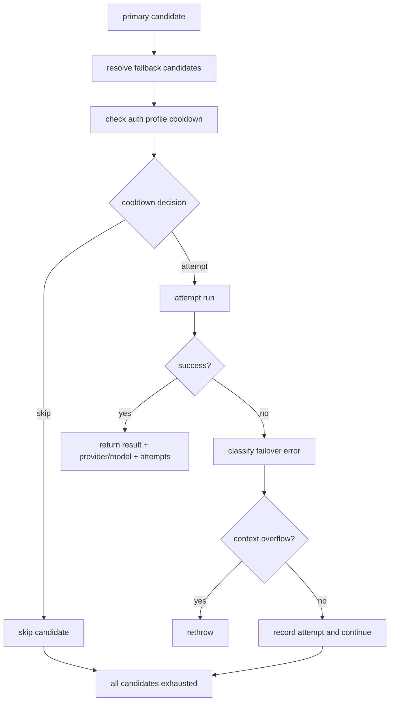

## 28. `commands/agent.ts` 里 fallback 是怎么接进去的

### 28.1 外层负责完整链，内层只负责单次尝试

在 `src/commands/agent.ts` 里：

- `runWithModelFallback(...)`
  - 负责完整 fallback loop
- `runAgentAttempt(...)`
  - 负责某个具体 `provider/model` 的单次尝试

这个分层很重要，因为它把：

- 候选链选择
- 冷却/跳过/探测
- 失败分类与是否继续

都留在外层 fallback 模块，而把真正执行留给内层。

### 28.2 fallback retry 时 prompt 会被换成 continuation 文案

程序化路径里的 `runAgentAttempt(...)` 不是重复发原 prompt。

当 `isFallbackRetry === true` 时，真正送进 runtime 的 prompt 会变成：

- `Continue where you left off. The previous model attempt failed or timed out.`

这保证：

- 失败重试不会把用户输入重复写进 transcript
- 新模型接手时拿到的是 continuation 语义，而不是“又来了一条新用户消息”

### 28.3 `commands/agent.ts` 没有显式传 `onError`

在这条程序化路径里，`runWithModelFallback(...)` 调用时并没有传 `onError`。

这意味着：

- fallback attempt 轨迹会被保存在返回值里
- 但不会在每次失败时立刻做额外 side effect
- 这条路径更像“拿最终成功结果”，而不是“边失败边对外广播”

## 29. `deliverAgentCommandResult(...)`：目标解析不是一步完成的

### 29.1 第一层：`resolveAgentDeliveryPlan(...)`

`src/infra/outbound/agent-delivery.ts` 的 `resolveAgentDeliveryPlan(...)` 先把多个来源揉成一个计划对象。

输入来源包括：

- `sessionEntry`
  - session 上次的 `lastChannel` / `lastTo` / `thread`
- `requestedChannel`
  - `replyChannel` 或 `channel`
- `explicitTo`
  - `replyTo` 或 `to`
- `explicitThreadId`
  - 显式 thread/topic id
- `accountId`
  - 显式 account id
- `turnSourceChannel/to/account/thread`
  - 当前 turn 的来源渠道元数据

输出 `AgentDeliveryPlan` 包括：

- `baseDelivery`
- `resolvedChannel`
- `resolvedTo`
- `resolvedAccountId`
- `resolvedThreadId`
- `deliveryTargetMode`

### 29.2 turn-source 元数据是为了解决共享 session 的路由竞态

这层最重要的设计点是：

- 当当前 turn 有 `turnSourceChannel`
- 它会覆盖 session 里 mutable 的 `lastChannel`

原因不是方便，而是防 race：

- 一个 shared session 可能同时被多个 channel 使用
- 如果 agent turn 还在跑，别的 channel 更新了 `lastChannel`
- 单纯看 session state 会把回复发错地方

所以 `turnSourceChannel/to/account/thread` 本质上是“本轮运行的路由锚点”。

### 29.3 第二层：`resolveMessageChannelSelection(...)`

在 `deliverAgentCommandResult(...)` 里，如果：

- `deliver=true`
- 当前 `resolvedChannel` 还是 internal channel
- 且调用方没给 explicit channel

就会调用 `resolveMessageChannelSelection({ cfg, channel, fallbackChannel })`。

它的规则是：

- 有显式 channel：直接用，`source = "explicit"`
- 否则有 fallbackChannel：用 fallback，`source = "tool-context-fallback"`
- 否则如果只配置了一个可用 channel：自动选它，`source = "single-configured"`
- 否则报错

所以 auto-selection 只有在非常明确时才会发生，不会在多渠道配置下偷偷替你猜。

### 29.4 第三层：`resolveAgentOutboundTarget(...)`

这一步决定最终 target 是如何解释的：

- `targetMode = explicit`
  - 认为调用方给了明确目标
- `targetMode = implicit`
  - 允许从 session/baseDelivery 推导目标

`resolveAgentOutboundTarget(...)` 返回：

- `resolvedTarget`
  - `ok: true/false`
- `resolvedTo`
  - 最终目标地址
- `targetMode`
  - 最终采用的 explicit/implicit 模式

如果还需要更深一层的 channel-specific 目标规范化，它会继续调用 `resolveOutboundTarget(...)`。

## 30. `resolveOutboundTarget(...)`：真正进入 channel 插件的 target resolver

### 30.1 它会先解析 channel plugin

`src/infra/outbound/targets.ts` 里的 `resolveOutboundTarget(...)` 不是直接操作字符串目标，而是先通过：

- `resolveOutboundChannelPlugin(...)`

拿到该 channel 的 plugin。

如果当前 registry 还没就绪，`src/infra/outbound/channel-resolution.ts` 甚至会尝试：

- `applyPluginAutoEnable(...)`
- `loadOpenClawPlugins(...)`

也就是说，delivery target resolution 本身就有 plugin bootstrap 语义。

### 30.2 plugin 可以决定 target 如何解释

拿到 plugin 后，这一步会综合：

- `plugin.config.resolveAllowFrom(...)`
- `plugin.config.resolveDefaultTo(...)`
- `plugin.outbound.resolveTarget(...)`

因此 target 不是简单的 `to` 字符串，而是 channel plugin 自己定义的解析逻辑。

它可以处理：

- default target
- allowFrom 限制
- 模糊名称解析
- 频道/用户/room id 归一化

### 30.3 错误语义也是结构化的

这一层的典型错误包括：

- Unsupported channel
- Missing target
- Unknown target
- Ambiguous target

对应实现位于：

- `src/infra/outbound/target-errors.ts`

这让 delivery 失败不是“发不出去”一个大类，而是能区分：

- channel 不支持
- 没给 target
- target 不存在
- target 不唯一

## 31. `deliverAgentCommandResult(...)` 的输出层：日志、JSON、发送三件事分开

### 31.1 `--json` 不是发送逻辑的一部分

`deliverAgentCommandResult(...)` 里，`opts.json` 会先用：

- `buildOutboundResultEnvelope(...)`

把结果包装成统一 envelope。

这个 envelope 可以包含：

- `payloads`
- `meta`
- `delivery`

所以 JSON 输出是“结果表现层”，不是发送层。

### 31.2 不发送时，它仍然会做 payload 归一化

即使 `deliver=false`，它也不会直接打印原始 `ReplyPayload[]`，而是先：

- `normalizeOutboundPayloadsForJson(...)`
- `normalizeOutboundPayloads(...)`
- `formatOutboundPayloadLog(...)`

也就是说，程序化入口在“不发出去”时，仍然尽量展示“真实会发出去的样子”。

### 31.3 真正发送前，Slack thread 有额外处理

在 `deliverAgentCommandResult(...)` 里：

- 如果目标 channel 是 Slack
- `resolvedThreadId` 会被转成 `replyToId`
- 而不是继续作为 `threadId` 往下传

这说明 delivery 层并不是完全 channel-agnostic，仍然保留少量 channel-specific 桥接逻辑。

## 32. fallback 与 delivery 两套状态机的汇合图

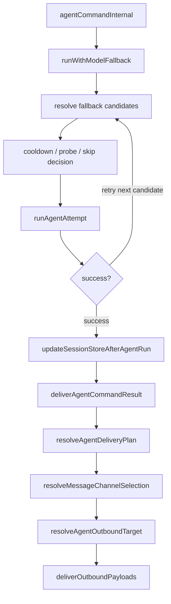

## 33. 现在看这两部分，最应该记住的 6 个判断

1. fallback 是候选模型状态机，不是简单 retry。
2. cooldown 不等于一律跳过；primary probe、同 provider fallback、billing/auth/rate_limit 都有不同策略。
3. context overflow 会直接跳出 fallback 链，交给更内层 compaction 逻辑处理。
4. `deliverAgentCommandResult(...)` 不是直接发消息，而是先做 delivery plan，再做 channel selection，再做 target resolution。
5. turn-source channel 元数据是为了解决 shared session 的跨渠道回复竞态，不是冗余参数。
6. 程序化入口最终共享的仍然是统一 outbound 执行器，而不是自己单独实现一套发送逻辑。

## 34. `runEmbeddedPiAgent(...)` 与 `runCliAgent(...)`：它们不是两种实现细节，而是两种运行语义

### 34.1 共同点

这两个函数最终都产出 `EmbeddedPiRunResult` 风格的结果：

- `payloads`
- `meta.durationMs`
- `meta.systemPromptReport`
- `meta.agentMeta`

所以对上层调用者来说，它们都长得像“agent run”。

但它们的执行模型完全不同。

### 34.2 `runEmbeddedPiAgent(...)` 的语义

`src/agents/pi-embedded-runner/run.ts` 导出的 `runEmbeddedPiAgent(params)` 更像 OpenClaw 自己的原生 agent runtime。

从代码能观察到它会：

- 先把任务放进 session lane 和 global lane 队列
- 根据 channel 决定 `toolResultFormat`
- 确保 runtime plugins 已加载
- 运行 `before_model_resolve` / `before_agent_start` hooks
- 在本地解析 provider/model、上下文窗口、auth profile、tool 集、skills snapshot
- 进入真正的 embedded run attempt
- 通过大量回调把 partial / reasoning / tool / lifecycle / block reply 向外发

它的本质是“完整运行一个本地 agent 运行时”。

### 34.3 `runCliAgent(...)` 的语义

`src/agents/cli-runner.ts` 的 `runCliAgent(params)` 则更像“把 OpenClaw prompt 和上下文翻译给外部 CLI backend，再把输出翻回来”。

它会：

- 解析 CLI backend 配置
- 构建 system prompt 和 bootstrap/context files
- 强制附加 `Tools are disabled in this session. Do not call tools.`
- 用 supervisor 启一个外部进程
- 解析 text / json / jsonl 输出
- 把输出重新包装成 `payloads + meta`

它不是 OpenClaw 自己在本地跑工具链，而是“外部 CLI backend 适配层”。

## 35. embedded 路径的真实执行模型

### 35.1 `RunEmbeddedPiAgentParams` 暴露了它的能力边界

`src/agents/pi-embedded-runner/run/params.ts` 里的 `RunEmbeddedPiAgentParams` 已经能看出 embedded runtime 的能力面。

除了基础的 `prompt/provider/model/sessionId`，它还接收：

路由/会话上下文：

- `messageChannel`
- `messageProvider`
- `agentAccountId`
- `messageTo`
- `messageThreadId`
- `groupId`
- `groupChannel`
- `groupSpace`
- `spawnedBy`
- `currentChannelId`
- `currentThreadTs`
- `replyToMode`
- `hasRepliedRef`

执行能力：

- `skillsSnapshot`
- `clientTools`
- `disableTools`
- `authProfileId`
- `execOverrides`
- `bashElevated`
- `inputProvenance`
- `streamParams`
- `ownerNumbers`

流式回调：

- `onPartialReply`
- `onAssistantMessageStart`
- `onBlockReply`
- `onBlockReplyFlush`
- `onReasoningStream`
- `onReasoningEnd`
- `onToolResult`
- `onAgentEvent`

这说明 embedded runtime 天生是“可流式、可工具、可上下文注入、可多通道路由”的完整运行时，不只是一个模型调用壳子。

### 35.2 它先做两层排队

`runEmbeddedPiAgent(...)` 一进来就会：

- 解析 session lane
- 解析 global lane
- `enqueueSession(() => enqueueGlobal(...))`

也就是说，一次 embedded run 同时受：

- session 级串行约束
- 全局资源约束

控制。

这就是为什么很多看起来“只是调模型”的行为，实际上还带着全局调度语义。

### 35.3 它在 runtime 内部做 model resolve 和上下文窗口治理

embedded 路径不是外部已经决定好一切，它内部还会继续做：

- hook 覆盖 provider/model
- `resolveModel(...)`
- context window 解析和 hard block
- auth profile 选择
- skills snapshot / bootstrap context 注入

也就是说，`commands/agent.ts` 决定的是“候选运行参数”，embedded runtime 内部还会继续做一次真正的运行时模型装配。

### 35.4 它天然支持 streaming 和工具副作用

从参数对象和调用链看，embedded runtime 的输出不是单一 final text，而是：

- partial 文本增量
- reasoning 流
- tool result
- block reply
- lifecycle event
- final payloads

这也是为什么 `runAgentTurnWithFallback(...)` 那边必须对 `onToolResult` 做串行化，对 block pipeline 做 flush/stop，对 final payload 做多层去重。

## 36. CLI 路径的真实执行模型

### 36.1 `runCliAgent(...)` 会把 OpenClaw 上下文翻译给外部 CLI

CLI 路径不是直接把 `prompt` 丢给子进程。它会先构造：

- workspace 解析结果
- bootstrap/context files
- heartbeat prompt
- docs path
- 完整 system prompt
- `systemPromptReport`

然后再结合 backend 配置，决定：

- args 怎么拼
- prompt 是走 argv 还是 stdin
- sessionId 怎么传
- model 名称如何规范化
- 输出是 text/json/jsonl 哪种模式

### 36.2 CLI 路径明确禁用工具

这是一个关键观察：

`runCliAgent(...)` 会把这行字拼进 `extraSystemPrompt`：

- `Tools are disabled in this session. Do not call tools.`

所以 CLI backend 路径和 embedded 路径最大的行为差别之一就是：

- embedded 可以真实运行 OpenClaw 工具
- CLI backend 路径默认被约束成“无工具会话”

### 36.3 它通过 supervisor 管外部进程，而不是本地 agent loop

CLI 路径会：

- `enqueueCliRun(...)`
- 通过 `getProcessSupervisor().spawn(...)` 启子进程
- 带 `timeoutMs`
- 带 `noOutputTimeoutMs`
- 统一收集 stdout/stderr

如果：

- 长时间无输出
- 总超时
- 进程异常退出

它会把这些外部进程异常映射成 `FailoverError`，再交回 fallback 层处理。

### 36.4 CLI session 是“外部会话 id 续接”语义

CLI 路径还维护外部 backend session：

- 从 `src/agents/cli-session.ts` 的 `getCliSessionId(...)` 读取
- 运行成功后写回新的 CLI session id
- 如果报 `session_expired`
  - 先清掉旧 session id
  - 再不带 session id 重试一次

所以 CLI session 不是 OpenClaw transcript 本身，而是“OpenClaw 对外部 CLI backend 会话的续接句柄”。

## 37. 两种运行内核的差异总结

### 37.1 观察到的硬差异

embedded runtime：

- 本地原生 agent runtime
- 支持工具
- 支持 streaming
- 支持 block reply / reasoning / tool result 回调
- 内部自行管理 model/auth/context/runtime hooks

CLI runtime：

- 外部 CLI backend 适配器
- 明确禁用工具
- 以外部进程为执行单位
- 只在结束时返回结构化结果
- 通过 stdout/json/jsonl 解析回 OpenClaw 结果模型

### 37.2 上层为什么还能统一使用它们

因为 `commands/agent.ts` / `runAgentTurnWithFallback(...)` 对它们要求的统一合同只有两件事：

- 返回统一的结果结构
- 在必要时补齐生命周期/assistant event

所以“运行模型不同”并不妨碍“上层调度统一”。

### 37.3 运行内核对比图

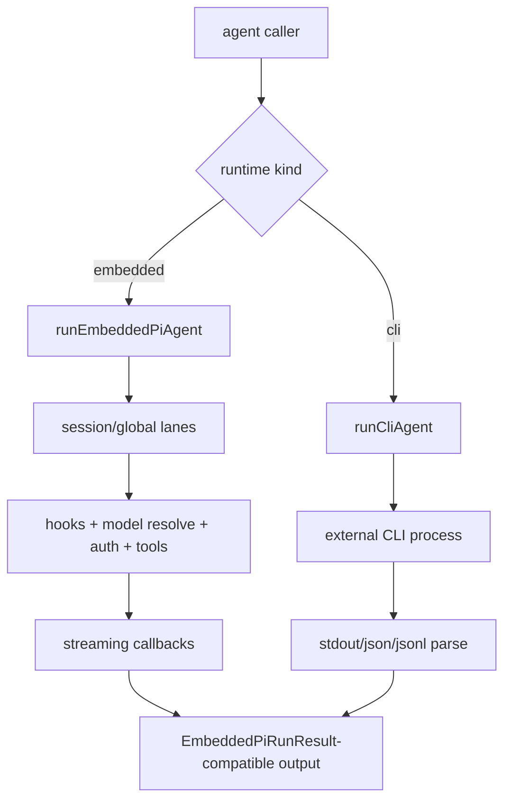

## 38. channel target resolver 家族：不是所有渠道都在同一层解析目标

### 38.1 观察到的实现分布

我对 `resolveTarget:` 做了代码搜索，直接观察到的 plugin/outbound resolver 主要包括：

内建：

- `src/channels/plugins/outbound/whatsapp.ts`
- `src/channels/plugins/outbound/discord.ts`

扩展：

- `extensions/mattermost/src/channel.ts`
- `extensions/googlechat/src/channel.ts`
- `extensions/twitch/src/outbound.ts`
- `extensions/bluebubbles/src/channel.ts`
- `extensions/tlon/src/channel.ts`
- 以及扩展版的 Discord / WhatsApp

基于搜索结果再结合 sender 实现，我的判断是：

- 有些渠道把 target 规范化做在 `resolveTarget(...)`
- 有些核心渠道，例如 Slack、Telegram，更偏向在 send-path 里继续解析原始 target

后者是基于 `resolveTarget:` 搜索没有命中这些渠道、同时 `src/slack/send.ts` / `src/telegram/send.ts` 明确各自再做 target parse 得出的推断。

## 39. 几类典型 target resolver 的差异

### 39.1 WhatsApp：E.164 / group JID，且 DM 会套 allowFrom

`src/whatsapp/resolve-outbound-target.ts` 的规则是：

- 先规范化 `to`
- 支持个人目标和 group JID
- group JID 直接通过
- 对 direct message，即使是 explicit mode，也会检查 `allowFrom`

这意味着 WhatsApp 的 DM 发送权限控制比很多渠道更早、更硬。

### 39.2 Discord：bare numeric id 会被补成 `channel:<id>`

`src/channels/plugins/normalize/discord.ts` 的 `normalizeDiscordOutboundTarget(...)` 会把：

- 纯数字 id

统一补成：

- `channel:<id>`

这样做的目的是把 bare id 从“歧义目标”收敛成稳定 channel target。

此外，`src/channels/plugins/outbound/discord.ts` 还会：

- 如果有 `threadId`，优先把目标转成线程 channel
- 尝试 webhook fast-path

### 39.3 Google Chat：先规范成 `spaces/...` 或 `users/...`，再把 user DM 映射成真实 space

`extensions/googlechat/src/targets.ts` 里：

- `user:foo@bar.com` 会规范成 `users/foo@bar.com`
- `space:xyz` 会规范成 `spaces/xyz`

但真正发送前，`resolveGoogleChatOutboundSpace(...)` 还会：

- 如果 target 是 `users/...`
- 通过 API 找对应 DM space

所以 Google Chat 的“target 解析”其实分两层：

- 语法规范化
- 运行时 API 解析成真正可发的 space

### 39.4 Mattermost：resolver 很薄，更多语义留给上游/目录解析

`extensions/mattermost/src/channel.ts` 的 `resolveTarget(...)` 基本只要求：

- `to` 非空

而 `extensions/mattermost/src/normalize.ts` 提供的更多是 messaging target 规范化，例如：

- `channel:ID`
- `user:ID`
- `@username`

所以 Mattermost 的 outbound resolver 更偏“兜底校验”，而不是强规范化器。

### 39.5 Twitch：implicit/heartbeat 会受 allowlist，explicit 则更宽松

`extensions/twitch/src/outbound.ts` 的规则很清楚：

- 先把 channel name 规范成小写并去掉 `#`
- explicit mode：任何合法 channel name 都可以
- implicit / heartbeat：如果配置了 allowlist，就必须命中 allowlist

这和 WhatsApp 的 DM 策略不同。Twitch 是按 mode 区分宽严，而 WhatsApp 对 DM 更强约束。

### 39.6 Tlon：target 先被解析成 DM 或 group nest

`extensions/tlon/src/channel.ts` 的 `resolveTarget(...)` 会先走 `parseTlonTarget(...)`：

- DM 目标返回 ship
- group 目标返回 nest

所以它的 target resolver 不是字符串清洗，而是语义解析器。

### 39.7 BlueBubbles：handle 或 `chat_guid`

`extensions/bluebubbles/src/channel.ts` 的 resolver 基本接受：

- `handle`
- `chat_guid:GUID`

这说明它偏向接收 BlueBubbles 自己的消息寻址语义，而不是再额外抽象成统一 channel/user target。

## 40. Slack 与 Telegram：更多 target 解析在 send-path

### 40.1 Slack

`src/slack/send.ts` 里可以直接看到：

- `parseSlackTarget(raw)`
- user target 会在发送前通过 `conversations.open(...)` 解析成真实 DM channel id

这意味着 Slack 的 target 解析包含运行时 API 行为，不只是静态规范化。

### 40.2 Telegram

`src/telegram/send.ts` 则会：

- `parseTelegramTarget(to)`
- 必要时把 lookup target 解析成 numeric chat id
- 某些情况下把解析结果持久化回配置/target writeback

也就是说，Telegram 的 target 解析同样带“运行时查找 + 持久化修正”语义。

## 41. 运行内核与 target resolver 放在一起看，最重要的 7 个判断

1. embedded 和 CLI 不是“同一个 runtime 的两种调用方式”，而是两种不同的执行模型。
2. embedded runtime 是流式、可工具、可上下文注入的原生 agent runtime。
3. CLI runtime 是外部进程适配器，核心语义是 system prompt 翻译、stdout 解析和 session 续接。
4. CLI 路径默认禁用工具，这会直接影响它和 embedded 路径的行为上限。
5. channel target 解析并不统一停留在 `resolveTarget(...)` 这一层，不同渠道分布在 plugin resolver、sender、甚至运行时 API 查找上。
6. WhatsApp、Twitch 这种渠道会把 allowlist/mode 直接揉进 target resolution；Google Chat、Slack、Telegram 则更依赖后续 API/lookup。
7. 所以上层看起来只是“deliver to channel X”，底层其实有两层状态机：运行内核状态机 + 渠道目标解析状态机。

## 42. `src/agents/pi-embedded-runner/run/attempt.ts`：embedded runtime 的真正内循环

### 42.1 这不是一次简单 `prompt()` 调用

`run/attempt.ts` 里的单次 attempt，真实结构大致是：

1. 组装 system prompt、技能、工具和 transcript policy
2. 获取 session 写锁
3. 打开并修复 session file
4. 用 `SessionManager` 装载 transcript
5. 创建 `AgentSession`
6. 包装 streamFn 以适配不同 provider 的怪异行为
7. 清洗历史消息并接入 context engine
8. 订阅运行事件
9. 提交 prompt
10. 等待 compaction/retry 收敛
11. 产出 snapshot 和运行结果
12. 在 truly idle 之后 flush pending tool results

所以它不是“模型调用”，而是“带 transcript、tool loop、compaction、hooks、context engine 的一次完整运行 attempt”。

### 42.2 它先拿 session 写锁，再碰 transcript

这一层先做：

- `acquireSessionWriteLock(...)`
- `repairSessionFileIfNeeded(...)`
- `prewarmSessionFile(...)`
- `SessionManager.open(...)`
- `prepareSessionManagerForRun(...)`

然后才创建真正的 agent session。

这说明 transcript 不是被动日志，而是运行时状态本体；因此 attempt 一开始就把 session file 视为“需要保护的共享状态”。

### 42.3 transcript policy 会反过来影响运行语义

attempt 里会先解析 `transcriptPolicy`，再把它用于：

- `guardSessionManager(...)`
  - 是否允许 synthetic tool results
  - 哪些 tool 名称是允许的
- 历史消息清洗
- thinking blocks 是否要丢弃
- tool call id 是否要重写
- OpenAI reasoning/function-call 对是否要降级

也就是说 transcript policy 并不是“只影响落盘格式”，而是会反向影响后续请求如何构造。

## 43. session manager、history 修复与 hook 注入

### 43.1 在真正 prompt 前，历史消息会被多轮修复

attempt 在 prompt 前会依次做：

- `sanitizeSessionHistory(...)`
- `validateGeminiTurns(...)`
- `validateAnthropicTurns(...)`
- `limitHistoryTurns(...)`
- `sanitizeToolUseResultPairing(...)`

这代表 embedded runtime 不信任历史 transcript 一定合法，而是每轮 prompt 前都做一次 provider-aware 修复。

### 43.2 还会修复 orphaned trailing user message

代码里还有一个专门分支：

- 如果 transcript 叶子节点最后是一条 `user` message
- 会 branch 回父节点或 reset leaf
- 再重建 session context

目的就是避免“连续两个 user turn”把 provider 弄成非法 role ordering。

### 43.3 hooks 不只在 run 前后，而是深入 prompt/build/model resolve

在这一层能看到好几类 hooks：

- `before_model_resolve`
- `before_agent_start`
- `before_prompt_build`
- `llm_input`
- `agent_end`
- `llm_output`

这些 hook 不是同一层概念：

- 有的改 provider/model
- 有的改 prompt/system prompt
- 有的只做观测
- 有的在 after-turn 做清理或分析

所以 embedded runtime 的可扩展性不是外围包一层，而是深入 run pipeline 的多个阶段。

### 43.4 context engine 也不是旁路

attempt 里对 context engine 有两次集成：

- prompt 前 `assemble(...)`
  - 可以改写 messages
  - 可以 prepend systemPromptAddition
- prompt 后 `afterTurn(...)` 或 `ingestBatch(...)`
  - 吃本轮新增消息

也就是说 context engine 参与的是前后双向生命周期，而不是只负责“补一段上下文”。

## 44. streamFn 包装、prompt 提交、compaction 与 idle flush

### 44.1 streamFn 会被按 provider 特性层层包装

这一层能观察到很多 provider-specific streamFn 包装：

- Ollama native / Ollama-compatible `num_ctx`
- OpenAI websocket 流
- thinking block 删除
- tool call id 规范化
- OpenAI function-call/reasoning pair 降级
- trim tool call names
- xAI tool args 解码

这说明 provider 兼容层不是单独一个 resolveModel 阶段，而是一直延伸到 live streamFn 层。

### 44.2 prompt 提交前还会做 prompt-local image 检测

在真正 `activeSession.prompt(...)` 前，它还会：

- `detectAndLoadPromptImages(...)`
- 只把本轮 prompt 关联到的图片传入模型

这说明 embedded runtime 的 multimodal 也不是纯 transcript 级别，而是 prompt-local 级别。

### 44.3 compaction 等待是 attempt 的核心分支，不是异常路径

prompt 之后，代码不会立刻结束，而是：

- 捕获 pre-compaction snapshot
- `onBlockReplyFlush()`
- `waitForCompactionRetry()`
- 决定是否 `timedOutDuringCompaction`
- 必要时选 pre-compaction snapshot 作为最终视图

这说明 compaction/retry 不是补丁逻辑，而是 embedded runtime 的主路径组成部分。

### 44.4 最后的 `flushPendingToolResultsAfterIdle(...)` 是关键防线

attempt 结束时不会立刻 flush pending tool results，而是先：

- `waitForIdleBestEffort()`
- 再 `flushPendingToolResults()`
- 如果超时可 `clearPendingToolResults()`

这一步的真实意图是：

- 防止 agent loop 还没真正 idle 时就插入 synthetic missing-tool-result
- 避免 tool 仍在运行时 transcript 被错误补写

这其实是 tool-loop 正确性的最后一道防线。

### 44.5 embedded attempt 内循环图

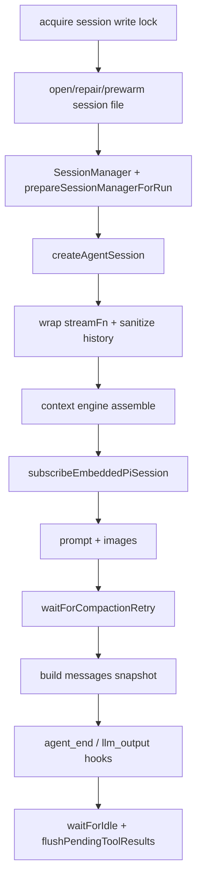

## 45. `src/slack/send.ts`：Slack sender 的真实发送路径

### 45.1 target 解析先进入 Slack 自己的 recipient 语义

Slack 发送链里，首先不是直接用 `to`，而是：

- `parseSlackTarget(raw)`
- `parseRecipient(raw)`
- `resolveChannelId(client, recipient)`

这里有一个很关键的细节：

- 如果目标看起来是 user ID
- 发送前会 `conversations.open(...)`
- 把 user target 转成真实 DM channel ID

原因是 Slack 某些 API，尤其文件上传完成阶段，不接受裸 `U...` user id，只接受 channel id。

### 45.2 发送路径分成 3 类

Slack sender 里有三条主分支：

- `blocks`
  - 走 `postSlackMessageBestEffort(...)`
- `mediaUrl`
  - 先上传文件，再补剩余文本 chunk
- 纯文本
  - chunk 后逐条 `postMessage`

而且 blocks 和 media 不能同时存在。

### 45.3 文本发送会先走 markdown chunking

Slack 路径在纯文本或 caption 文本时，还会先做：

- `resolveTextChunkLimit(...)`
- `resolveChunkMode(...)`
- `chunkMarkdownTextWithMode(...)`
- `markdownToSlackMrkdwnChunks(...)`

也就是说 Slack sender 发送前已经做了平台特化的 markdown/mrkdwn 变换，不是直发原文本。

### 45.4 自定义身份不是硬依赖

`postSlackMessageBestEffort(...)` 会尝试用：

- `username`
- `icon_url`
- `icon_emoji`

发消息；但如果缺少 `chat:write.customize` scope，会自动退回“不带自定义身份”的普通发送。

这说明 Slack sender 对权限能力是 best-effort，不会因为 persona 能力缺失就整体失败。

### 45.5 media 走的是 3 步上传，不是简单 `files.upload`

Slack media 路径会：

1. `files.getUploadURLExternal`
2. 向 presigned URL 真正上传文件
3. `files.completeUploadExternal`

并在需要时把第一段文本作为 `initial_comment`。

所以 Slack 的 media send 实际是一个多步事务，而不是单 API call。

## 46. `src/telegram/send.ts`：Telegram sender 的真实发送路径

### 46.1 target 解析本身就带 lookup + writeback

Telegram 发送链的前几步是：

- `parseTelegramTarget(to)`
- `resolveAndPersistChatId(...)`

而 `resolveAndPersistChatId(...)` 会：

- 如果已经是 numeric chat id，直接用
- 否则试图 lookup 成 numeric chat id
- 成功后还可能 `maybePersistResolvedTelegramTarget(...)`

也就是说 Telegram sender 的 target 解析本身就包含“查找 + 持久化修正”语义。

### 46.2 thread/reply 处理比 Slack 更复杂

Telegram 会先构造：

- `buildTelegramThreadReplyParams(...)`

里面会综合：

- target 自带的 `messageThreadId`
- 调用方传入的 `messageThreadId`
- `replyToMessageId`
- `quoteText`
- chatType 是 direct 还是 forum/group

而且如果因为 `message_thread_id` 失败，还会：

- `withTelegramThreadFallback(...)`
- 自动去掉 thread id 再试一次

这说明 Telegram 把 thread 视为“可恢复路由信息”，不是失败就直接终止。

### 46.3 HTML parse fallback 是内建的

Telegram sender 还内建：

- 先按 HTML 渲染发
- 如果遇到 parse entities / HTML parse error
- 自动回退成 plain text 再发一次

所以 Telegram 的格式失败不是第一时间暴露给上层，而是先在 sender 层内部自愈。

### 46.4 media 路径按媒体类型分叉

Telegram sender 对 media 不是统一 sendMedia，而是按类型分：

- photo
- animation
- video
- video note
- voice
- audio
- document

并且会：

- 对 caption 做长度切分
- 如果 caption 太长，就 media 先发、正文 follow-up text 再发
- `reply_markup` 在这种情况下只挂在 follow-up text 上

所以 Telegram sender 是“媒体种类驱动的多分支发送器”，不是单一路径。

### 46.5 Telegram sender 还带 retry policy 和 chat-not-found 包装

它会构造：

- `createTelegramRequestWithDiag(...)`
- `createTelegramNonIdempotentRequestWithDiag(...)`
- `createRequestWithChatNotFound(...)`

因此 Telegram sender 不只是 send call，还带：

- retry policy
- API error logging
- 对 `chat not found` 的更具体解释包装

## 47. Slack 与 Telegram sender 的对照

### 47.1 target 解析层

Slack：

- 先把 target 解析成 user/channel
- user target 发送前再变成真实 DM channel

Telegram：

- 先解析 target 里的 topic/thread 语义
- 再把 lookup target 解析成 numeric chat id
- 还可能写回已解析结果

### 47.2 发送事务形态

Slack：

- blocks / media / text 三分支
- media 是 3 步外部上传事务

Telegram：

- text / media / sticker / poll / edit / reaction 等多条专用路径
- media 又按 photo/video/audio/document 继续分叉

### 47.3 错误恢复风格

Slack：

- 自定义身份缺 scope 时降级
- 没有明显的 sender 内部 retry 框架

Telegram：

- thread-not-found 自动去 thread 再试
- HTML parse error 自动 plain-text fallback
- recoverable network error 走 retry runner
- chat-not-found 错误会被增强成更可诊断的信息

### 47.4 Slack vs Telegram sender 图

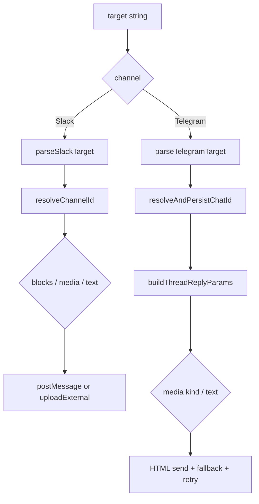

## 48. 现在看这两部分，最应该记住的 8 个判断

1. embedded runtime 的真正复杂度不在 `runEmbeddedPiAgent(...)` 壳子，而在 `run/attempt.ts` 的内循环。
2. transcript 在 embedded 路径里是活状态，不是事后日志，所以它需要写锁、修复、清洗和 provider-aware 校验。
3. streamFn 在 embedded 路径里会被按 provider 特性持续包装，这使 provider 兼容逻辑深入到 live request 层。
4. compaction/retry 是 embedded attempt 的主路径组成部分，不是异常兜底。
5. Slack sender 的关键点是 user->DM channel 解析和三步文件上传事务。
6. Telegram sender 的关键点是 target lookup/writeback、thread fallback、HTML parse fallback 和媒体类型分叉。
7. 所以“不同 channel 的 send”不仅是不同 API 调用，而是不同的目标解析模型、错误恢复模型和事务模型。
8. 到这里为止，OpenClaw 的主链已经可以分成三层状态机去理解：agent 调度状态机、运行内核状态机、渠道发送状态机。

## 49. `src/agents/pi-embedded-subscribe.ts`：它不是转发器，而是 embedded stream 的事件整形器

对外入口只有一个：

- `subscribeEmbeddedPiSession(params)`

但这个函数实际承担了 5 层职责：

1. 订阅 `session.subscribe(...)` 的底层 runtime 事件。
2. 把 provider / runtime 的碎片化 stream 重组为稳定的 `assistantTexts`、tool meta、reasoning stream。
3. 处理 `<think>` / `<final>` / inline directive / downgraded tool text 这类“不能直接外发”的内容。
4. 维护 messaging tool 去重、compaction wait、usage 累加、tool error 等运行状态。
5. 对外暴露一组供外层调度器读取的查询接口，而不是直接自己完成最终发送。

### 49.1 参数的真实含义

最关键的参数不是“把 session 传进来”这么简单，而是把整个外层策略注入到这个订阅器里：

- `session`
  embedded runtime session，本函数通过 `session.subscribe(...)` 消费底层事件。
- `runId`
  这次 agent run 的公共事件 id。thinking 事件和 agent event 都会带这个 id。
- `reasoningMode`
  决定是否保留 reasoning，以及 reasoning 是否单独流式输出。
- `toolResultFormat`
  决定 tool summary / tool output 是 markdown 还是 plain text。
- `verboseLevel`
  决定 tool result / tool output 的暴露等级。
- `blockReplyChunking`
  如果启用 block reply 流式回送，决定 chunker 如何切块。
- `blockReplyBreak`
  决定 block reply 在什么边界上认为一个块结束。
- `enforceFinalTag`
  是否强制只把 `<final>` 内的内容当成最终可发文本。
- `onBlockReply(payload)`
  用于把“已经过过滤和 directives 拆解的块”回送给外层发送器。
- `onToolResult(payload)`
  用于把 tool 摘要或 tool 输出交给外层。
- `onReasoningStream(payload)`
  用于把 thinking stream 暴露给上层。
- `shouldEmitToolResult()` / `shouldEmitToolOutput()`
  允许外层按运行时条件决定当前 run 是否显示 tool 结果或 tool 原始输出。
- `hookRunner`
  让 tool / assistant 生命周期仍可接到 hook 体系。

### 49.2 内部状态不是临时 buffer，而是一台小状态机

它维护的核心状态包括：

- `assistantTexts`
  当前 run 已确认的 assistant 文本块集合。
- `toolMetas` / `toolMetaById` / `toolSummaryById`
  tool 执行摘要和去重索引。
- `deltaBuffer` / `blockBuffer`
  text-delta 和 block-reply 两套缓冲。
- `blockState` / `partialBlockState`
  跨 chunk 跟踪 `<think>`、`<final>`、inline code span，避免标签跨块时泄漏推理文本。
- `messagingToolSentTexts*` / `messagingToolSentTargets` / `messagingToolSentMediaUrls`
  记录“已经由 messaging tool 成功直发”的文本、目标和媒体，用于 suppress agent 自己的重复 reply。
- `compactionInFlight` / `pendingCompactionRetry` / `compactionRetryPromise`
  把 compaction 变成显式可等待、可取消的运行阶段。
- `usageTotals`
  把 provider usage 逐条累加为最终 usage snapshot。

### 49.3 它对外暴露的返回接口

返回值不是一个 opaque handle，而是一组外层会真正消费的接口：

- `assistantTexts`
  当前 run 产出的 assistant 文本数组。
- `toolMetas`
  当前 run 产生的 tool 摘要数组。
- `unsubscribe()`
  取消 session 订阅；如果 compaction 还在飞行，会显式拒绝等待 promise，并尝试 `abortCompaction()`。
- `isCompacting()`
  当前是否仍处在 compaction 中，或还有 compaction retry 未完成。
- `isCompactionInFlight()`
  当前是否真的有 compaction 正在执行。
- `getMessagingToolSentTexts()` / `getMessagingToolSentMediaUrls()` / `getMessagingToolSentTargets()`
  让外层 delivery 层知道哪些内容已经被 tool 直发过。
- `getSuccessfulCronAdds()`
  暴露 cron add 成功次数，供外层决定是否再补发确认消息。
- `didSendViaMessagingTool()`
  只要 messaging tool 成功发过消息，就可以 suppress 像“我已经在 Telegram 回复了”这种重复确认文本。
- `getLastToolError()`
  返回最后一个 tool error 的摘要。
- `getUsageTotals()`
  返回累计 usage。
- `getCompactionCount()`
  暴露本轮 compaction 次数。
- `waitForCompactionRetry()`
  给外层一个等待 compaction 稳定完成的 promise；如果已经 unsubscribe，会以 `AbortError` 拒绝。

### 49.4 最关键的 4 个实现细节

- `emitBlockChunk(...)` 不只是 emit；它会先 strip `<think>` / `<final>` / downgraded tool call，再用 messaging-tool sent text 做重复抑制。
- `replyDirectiveAccumulator` 和 `partialReplyDirectiveAccumulator` 使 streamed text 不会因为 directive 跨 chunk 而被错误外发。
- `resetForCompactionRetry()` 会把 assistant/tool/messaging state 一次性清空，所以 compaction retry 被视为“重新生成本轮最终表示”，不是简单续写。
- `unsubscribe()` 的顺序非常讲究：先标记 `unsubscribed`，再拒绝等待 promise，再尝试 abort compaction，最后才真正取消 session 订阅。

## 50. `src/gateway/server-chat.ts`：怎样把 agent event 投影成 Control UI / node 可消费的 chat 事件

这个文件真正重要的 API 不是单个 handler，而是 4 组对象：

- `createChatRunRegistry()`
- `createChatRunState()`
- `createToolEventRecipientRegistry()`
- `createAgentEventHandler(options)`

### 50.1 `ChatRunRegistry` 的接口和用途

`ChatRunRegistry` 是 run-id 到“对哪个 clientRunId / sessionKey 投影”的排队映射：

- `add(sessionId, entry)`
  记录某个 session 对应的一个待投影 chat run。
- `peek(sessionId)`
  查看当前 session 队首 chat run，但不移除。
- `shift(sessionId)`
  在 lifecycle end/error 时取出并消费队首 chat run。
- `remove(sessionId, clientRunId, sessionKey?)`
  定点移除某个 chat run，主要用于 aborted 或异常清理。
- `clear()`
  清空所有映射。

这里的关键含义是：Gateway 不直接把底层 `evt.runId` 原样暴露给 UI，而是允许把真正的 agent run 映射到一个面向客户端的 `clientRunId`。

### 50.2 `ChatRunState` 的字段和用途

`ChatRunState` 是 chat 投影的即时状态：

- `registry`
  上面的 run 映射表。
- `buffers`
  `clientRunId -> merged assistant text`，用于 delta 节流后的最终 flush。
- `deltaSentAt`
  最近一次 delta 广播时间；当前节流窗口是 150ms。
- `deltaLastBroadcastLen`
  最近一次已广播文本长度，防止 final 前重复 flush。
- `abortedRuns`
  被标记为 aborted 的 run 集合。
- `clear()`
  清空所有状态。

### 50.3 `ToolEventRecipientRegistry` 的接口和用途

这是 tool event 的收件人表，不是 chat 文本本身：

- `add(runId, connId)`
  给某个 run 绑定一个可接收 tool event 的 WS 连接。
- `get(runId)`
  读取当前 run 的 tool-event 收件人集合。
- `markFinal(runId)`
  run 结束后给收件人集合打 final 时间戳，并在 grace period 后清理。

所以 tool event 的可见性是独立控制的，不跟 chat delta/final 混在一起。

### 50.4 `createAgentEventHandler(options)` 的参数含义

这个 handler 把 `AgentEventPayload` 投影为 `agent` 和 `chat` 两种面向客户端的事件。它依赖的外部接口有：

- `broadcast(type, payload, opts?)`
  向 WS 广播事件；chat delta 可带 `dropIfSlow`。
- `broadcastToConnIds(type, payload, connIds, opts?)`
  定向把 tool event 送给有 capability 的连接。
- `nodeSendToSession(sessionKey, type, payload)`
  把事件同步给 node/session 订阅者。
- `agentRunSeq`
  记录 run 的最近 `seq`，用于检测 seq gap。
- `chatRunState`
  维护 delta buffer / final flush / abort 清理。
- `resolveSessionKeyForRun(runId)`
  当事件里没带 sessionKey 时，从 run 上下文反查。
- `clearAgentRunContext(runId)`
  run 结束后清理上下文。
- `toolEventRecipients`
  控制 tool event 该发给哪些 WS 客户端。

### 50.5 这个投影器真正做了什么

它的运行语义可以概括成：

1. 所有 agent event 先按 `seq` 检查是否有 gap。
2. 非 tool event 会走 `broadcast("agent", ...)`。
3. tool event 会走“始终广播给已注册 WS 收件人”，但对 node/channel subscriber 还要看 verbose 级别。
4. `assistant` stream 会进入 `emitChatDelta(...)`：
   - strip inline directive tags
   - 合并 `previousText + nextText/delta`
   - 150ms 节流
   - heartbeat / silent reply 抑制
5. lifecycle `end/error` 会走 `emitChatFinal(...)`：
   - final 前先 flush 一次未发出的 delta
   - 再发 `state: final` 或 `state: error`
   - 最后清 buffer、seq、run context、tool recipient 状态

### 50.6 `server-chat` 图

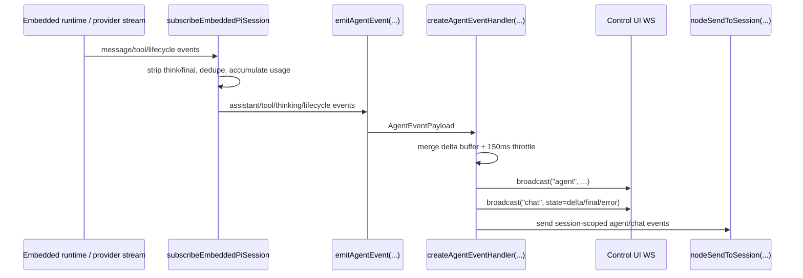

## 51. `src/config/sessions/types.ts` + `src/utils/delivery-context.ts`：session entry 是运行状态、路由状态和 transcript 绑定的聚合体

`SessionEntry` 不是只保存 `sessionId`。它把 4 类状态都聚合到了一条 session 记录里：

### 51.1 会话/运行时字段

- `sessionId`
  runtime session 的稳定 id。
- `updatedAt`
  最近活动时间；注意不是所有 metadata 更新都会刷新它。
- `systemSent`
  system intro 是否已经送过。
- `abortedLastRun`、`abortCutoffMessageSid`、`abortCutoffTimestamp`
  `/stop` 之后的截断边界。
- `thinkingLevel`、`verboseLevel`、`reasoningLevel`、`elevatedLevel`
  session 级的运行行为覆盖项。
- `queueMode`、`queueDebounceMs`、`queueCap`、`queueDrop`
  followup / steer / collect 等排队策略。

### 51.2 模型/认证字段

- `providerOverride` / `modelOverride`
  用户或命令显式设定的 provider/model。
- `modelProvider` / `model`
  最近一次实际 runtime 选中的 provider/model。
- `authProfileOverride*`
  session 级 auth profile 覆盖项。
- `fallbackNoticeSelectedModel` / `fallbackNoticeActiveModel` / `fallbackNoticeReason`
  避免重复发 fallback 提示。

### 51.3 路由/投递字段

- `channel`
  session 主渠道。
- `origin`
  初始来源摘要，可带 `provider/surface/from/to/accountId/threadId`。
- `deliveryContext`
  当前 canonical outbound route：`{ channel?, to?, accountId?, threadId? }`。
- `lastChannel` / `lastTo` / `lastAccountId` / `lastThreadId`
  `deliveryContext` 的展开镜像字段，给旧逻辑和展示层使用。

### 51.4 transcript / 派生 session / ACP 字段

- `sessionFile`
  这条 session 当前绑定的 transcript 文件路径。
- `spawnedBy` / `forkedFromParent` / `spawnDepth`
  子 agent / 线程分叉关系。
- `skillsSnapshot` / `systemPromptReport`
  这轮 session 使用的技能和 prompt 装配快照。
- `acp`
  ACP backend、runtimeSessionName、identity、cwd、state 等长生命周期信息。

### 51.5 `DeliveryContext` 的接口和语义

`DeliveryContext` 很小，但很关键：

- `channel`
  目标消息渠道。
- `to`
  渠道内目标 id / room / chat / user。
- `accountId`
  多账号渠道下的账号标识。
- `threadId`
  thread/topic 级目标。

围绕它的 4 个 helper 决定了 route 合并语义：

- `normalizeDeliveryContext(context)`
  标准化 channel、accountId、threadId，清掉空值。
- `normalizeSessionDeliveryFields(source)`
  把 `deliveryContext` 和 `last*` 字段归一到一套一致表示。
- `deliveryContextFromSession(entry)`
  从 session entry 中恢复 canonical route。
- `mergeDeliveryContext(primary, fallback)`
  合并 route，但当 channel 冲突时，不允许把 `to/account/thread` 从另一个 channel 错配过来。

这个“channel 冲突时不交叉复用 route fields”的规则非常关键，它防止 shared session 在多渠道下把 thread / target 串线。

## 52. `src/config/sessions/store.ts`：session store 不是普通 JSON 读写，而是带缓存、串行锁和维护策略的状态仓库

### 52.1 读接口

- `loadSessionStore(storePath, opts?)`
  从磁盘读 store，但会先看 TTL cache；同时做 migration 和 delivery/runtime field normalize。
- `readSessionUpdatedAt({ storePath, sessionKey })`
  轻量读取某个 session 的最近活动时间。
- `resolveSessionStoreEntry({ store, sessionKey })`
  统一处理 normalized key 与 legacy key，确保大小写不一致的旧 key 能被并入同一条记录。

### 52.2 写接口

- `saveSessionStore(storePath, store, opts?)`
  在 lock 内完整写回整个 store。
- `updateSessionStore(storePath, mutator, opts?)`
  核心写接口。它会在锁内重新加载最新 store，再执行 mutator，然后保存，避免并发 writer 覆盖。
- `updateSessionStoreEntry({ storePath, sessionKey, update })`
  针对单条 entry 的 helper，内部仍然走 lock + re-read。

### 52.3 锁与并发模型

`withSessionStoreLock(storePath, fn, opts?)` 不是直接上 OS 文件锁，而是“两层保护”：

1. 进程内：`LOCK_QUEUES` 保证同一 `storePath` 的写任务串行排队。
2. 跨进程：每个排队任务真正执行前，再通过 `acquireSessionWriteLock(...)` 拿 session 写锁。

这意味着 store 写入不是谁先到谁直接写，而是：

- 先排队
- 再拿锁
- 再 re-read
- 再 mutate
- 再 atomic write

### 52.4 `recordSessionMetaFromInbound(...)` 的用途

参数：

- `storePath`
  session store 路径。
- `sessionKey`
  当前 inbound 对应的 session key。
- `ctx`
  入站消息上下文，用来派生 channel、group、origin 等 metadata。
- `groupResolution`
  群组/空间解析结果。
- `createIfMissing`
  如果 session 不存在，是否允许创建新 entry。

它的关键语义是：

- 用 `deriveSessionMetaPatch(...)` 从 inbound 派生 metadata。
- 如果只是 metadata 更新，走 `mergeSessionEntryPreserveActivity(...)`，**不刷新 `updatedAt`**。

这条规则很重要，因为 idle reset / active session 判断要依赖真实会话活动，而不是每次收一个 metadata patch 都把 session 变“活跃”。

### 52.5 `updateLastRoute(...)` 的用途

参数：

- `storePath`, `sessionKey`
  定位目标 session。
- `channel`, `to`, `accountId`, `threadId`
  inline route 输入。
- `deliveryContext`
  显式传入的 canonical route。
- `ctx`, `groupResolution`
  可选地同时补 session metadata。

它的真实行为不是“覆盖 lastTo”这么简单，而是：

1. 先标准化 `deliveryContext` 和 inline route。
2. 判断这次是否显式提供了 route。
3. 如果显式更新 route 但没带 thread，就会把 fallback route 里的 thread 去掉，防止旧 thread 泄漏到新 route。
4. 再和旧 session 的 `deliveryContext` 做 `mergeDeliveryContext(...)`。
5. 最后统一回写 `deliveryContext + lastChannel + lastTo + lastAccountId + lastThreadId`。

所以它本质上是在维护“下一次 outbound 默认该发到哪里”。

### 52.6 保存时的附带维护

`saveSessionStoreUnlocked(...)` 不只是写文件，还会顺手做：

- stale session prune
- entry count cap
- store file rotate
- disk budget sweep
- 已移除 session transcript 归档和清理

也就是说 session store 本身就是 transcript 生命周期管理的入口之一。

## 53. `src/config/sessions/session-file.ts` + `transcript.ts` + `delivery-info.ts` + `src/sessions/transcript-events.ts`：session file 绑定、transcript 镜像和 route 恢复

### 53.1 `resolveAndPersistSessionFile(params)`

参数对象字段：

- `sessionId`
  真实 runtime session id。
- `sessionKey`
  store 里的 key。
- `sessionStore`
  当前内存中的 store 快照。
- `storePath`
  store 文件路径。
- `sessionEntry`
  当前 entry；没传就从 store 中拿。
- `agentId`, `sessionsDir`
  控制 transcript 文件生成位置。
- `fallbackSessionFile`
  在 thread/topic fork 这类场景下提供一个候选 transcript 路径。
- `activeSessionKey`
  保存 store 时用于维护逻辑的 active key。

它的职责是：

- 计算 `sessionId + sessionKey` 当前应该绑定到哪个 transcript 文件。
- 如果 `sessionFile` 变了，就把新路径写回 session store。
- 返回 `{ sessionFile, sessionEntry }`，让调用方用统一的结果继续执行。

### 53.2 `resolveSessionTranscriptFile(params)`

这是更上层的 transcript 入口。它会：

- 根据 `sessionId`、已有 `sessionEntry.sessionFile`、`agentId` 解析 transcript 路径。
- 如果有 `sessionStore + storePath`，进一步调用 `resolveAndPersistSessionFile(...)`，把结果固化到 store 里。
- 解析 `sessionKey` 上的 `:thread:` / `:topic:` 后缀，必要时生成 per-thread transcript path。

### 53.3 `appendAssistantMessageToSessionTranscript(params)`

参数：

- `agentId?`
  可选的 agent 维度 transcript 目录。
- `sessionKey`
  要镜像写入哪条 session。
- `text?`, `mediaUrls?`
  要镜像的最终输出内容。
- `storePath?`
  测试或特殊环境下覆盖默认 store。

它的语义是：

1. 先把 `text/mediaUrls` 规范成 transcript 可读文本；媒体优先镜像成文件名列表，没有文件名时退成 `media`。
2. 从 store 里找到 `sessionId` 和 `sessionFile`。
3. 必要时补写 session header。
4. 用 `SessionManager.open(sessionFile)` 追加一条 `role: assistant` 的镜像消息。
5. 调 `emitSessionTranscriptUpdate(sessionFile)` 通知监听者刷新。

这里最关键的事实是：delivery mirror 不是“另外一份日志”，它直接写进当前 session transcript，所以 UI/调试器看到的 transcript 能反映外发结果。

### 53.4 `parseSessionThreadInfo(...)`、`extractDeliveryInfo(...)` 和 transcript 事件总线

- `parseSessionThreadInfo(sessionKey)`
  从 `sessionKey` 里提取 `:thread:` 或 `:topic:` 后缀，返回 `{ baseSessionKey, threadId }`。
- `extractDeliveryInfo(sessionKey)`
  best-effort 地从 sessionKey/store 恢复 `{ deliveryContext, threadId }`，给需要“只知道 sessionKey”的调用方一个 route 恢复入口。
- `onSessionTranscriptUpdate(listener)`
  注册 transcript 更新监听器。
- `emitSessionTranscriptUpdate(sessionFile)`
  在 transcript 文件有新写入时广播 `{ sessionFile }`。

### 53.5 session route / transcript 演化图

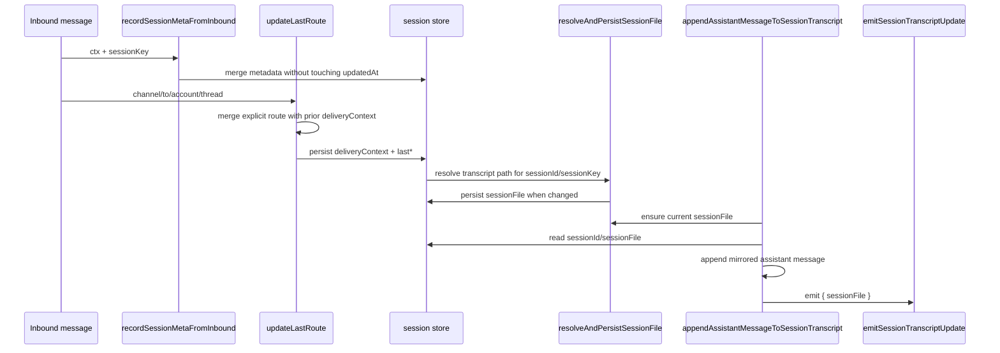

## 54. 这两部分合起来，最应该记住的 10 个判断

1. `subscribeEmbeddedPiSession(...)` 不是简单 event bridge，而是一台负责“过滤、重组、去重、等待 compaction”的中间状态机。
2. embedded runtime 的 `assistant/tool/lifecycle` 流不会直接暴露给 UI；它先被 `subscribeEmbeddedPiSession(...)` 规范化，再被 `server-chat.ts` 二次投影。
3. `server-chat.ts` 维护了自己的 chat buffer、节流时间戳和 run-id 映射，所以 UI 看到的 chat delta/final 不是 provider 原始流。
4. tool event 的收件人和 chat 文本的收件人是两套机制；tool event 还受 verbose 与 capability 双重约束。
5. `SessionEntry` 把运行时覆盖、模型状态、route、transcript 绑定、ACP 元数据全塞在一起，所以它本质上是“session 控制面记录”。
6. `deliveryContext` 才是 canonical outbound route，`lastChannel/lastTo/...` 更像兼容层和展开镜像。
7. `recordSessionMetaFromInbound(...)` 故意不刷新 `updatedAt`，说明 OpenClaw 明确区分“收到了 metadata”与“发生了真实 session 活动”。
8. `updateLastRoute(...)` 的核心不是保存 lastTo，而是用受约束的 merge 规则维护“下一次该回哪条渠道/线程”。
9. `sessionFile` 不是临时推导出来的路径，而是被持久化进 session store 的身份字段之一。
10. transcript mirror 不是外围日志系统，而是 session transcript 主状态的一部分，所以 Gateway、UI、调试工具都能共享同一条事实来源。

## 55. `src/gateway/server/ws-connection/message-handler.ts`：Gateway 上的真实请求入口不是 HTTP，而是 `connect -> req -> res/event` 的 WS 会话

这一层的对外入口是：

- `attachGatewayWsMessageHandler(params)`

### 55.1 这个入口函数依赖哪些参数

它不是单纯“给 WebSocket 挂个 `on("message")`”。它把一个连接的认证、握手、请求处理、上下文构造全都挂进去，所以参数很多，但可以分成 6 类：

- 连接对象
  - `socket`
  - `upgradeReq`
- 连接与来源元信息
  - `connId`
  - `remoteAddr`
  - `forwardedFor`
  - `realIp`
  - `requestHost`
  - `requestOrigin`
  - `requestUserAgent`
- 握手与认证依赖
  - `connectNonce`
  - `resolvedAuth`
  - `rateLimiter`
  - `browserRateLimiter`
- Gateway 能力清单
  - `gatewayMethods`
  - `events`
  - `extraHandlers`
- 请求生命周期回调
  - `buildRequestContext()`
  - `send(obj)`
  - `close(code?, reason?)`
  - `isClosed()`
  - `clearHandshakeTimer()`
- 连接状态与审计回调
  - `getClient()` / `setClient(...)`
  - `setHandshakeState(...)`
  - `setCloseCause(...)`
  - `setLastFrameMeta(...)`
  - `originCheckMetrics`
  - `logGateway` / `logHealth` / `logWsControl`

这意味着 request handler 自己不保存全局状态，它依赖外部把“如何构造 request context、如何写回连接状态”注入进来。

### 55.2 握手阶段的协议契约

这个 handler 强制第一帧必须是：

- `type: "req"`
- `method: "connect"`
- `params` 通过 `validateConnectParams(...)`

也就是说 WS 连接不是“连上就能发业务请求”，而是先建立一层 Gateway 协议会话。

握手阶段会依次做：

1. request frame 验证
2. protocol version 协商
3. role/scopes 规范化
4. Control UI / webchat origin check
5. shared auth + device identity + device signature 校验
6. pairing / scope upgrade / metadata pinning 判定
7. node command allowlist 过滤
8. presence 记录
9. 构造 `hello-ok` payload
10. 把连接升级为已连接 client

### 55.3 `hello-ok` 里真正暴露了什么

握手成功后并不是发一个空 ACK，而是通过同一个 `res` 帧返回一个 `hello-ok` payload，里面包含：

- `protocol`
  当前 Gateway 协议版本。
- `server.version` / `server.connId`
  连接绑定到的服务版本和连接 id。
- `features.methods`
  这个 Gateway 当前支持的方法列表。
- `features.events`
  这个 Gateway 当前支持的事件列表。
- `snapshot`
  握手时的 presence / health / stateVersion 快照。
- `canvasHostUrl`
  对 node 来说可能是带 capability token 的 scoped Canvas host URL。
- `auth`
  如果设备配对成功，会下发 device token / role / scopes。
- `policy`
  `maxPayload`、`maxBufferedBytes`、`tickIntervalMs` 这类运行时限制。

所以 `hello-ok` 本身就是一个“会话能力协商 + 初始状态同步”包，不是只告诉客户端“你连上了”。

### 55.4 握手后的请求模型

握手一旦完成，这个 WS 连接后续只接受 `req` 帧。

每个请求的统一路径是：

1. `validateRequestFrame(parsed)`
2. 构造 `respond(ok, payload, error, meta?)`
3. 调 `handleGatewayRequest({ req, respond, client, isWebchatConnect, extraHandlers, context: buildRequestContext() })`
4. handler 内部再决定是立即 `res`，还是先 `accepted/started` 再配合后续事件流/第二个 `res`

这里最关键的事实是：**Gateway 的方法层并不直接持有全局单例，而是每次请求都显式拿一个 `GatewayRequestContext`**。

## 56. `src/gateway/server-methods.ts`：真正的 method dispatch 层

这一层只暴露一个入口：

- `handleGatewayRequest(opts)`

但它实际定义了“请求能不能进业务层”的 3 层门槛。

### 56.1 参数对象 `GatewayRequestOptions`

- `req`
  当前 `RequestFrame`。
- `client`
  已握手的 Gateway client；里面带 `connect`、`connId`、canvas capability 等。
- `isWebchatConnect(...)`
  识别 webchat client 的 helper。
- `respond(...)`
  当前请求对应的 `res` 发送器。
- `context`
  整个 Gateway 运行时上下文。

### 56.2 `GatewayRequestContext` 里最关键的字段

对 chat/agent 主链最相关的是这些：

- `deps`
  CLI/command 依赖注入对象。
- `logGateway`
  method 层主日志器。
- `broadcast(...)` / `broadcastToConnIds(...)`
  对 WS 客户端广播 agent/chat/tool event。
- `nodeSendToSession(...)`
  把事件同步给 node 订阅者。
- `agentRunSeq`
  追踪 run 的事件序号。
- `chatAbortControllers`
  活跃 chat run 的 abort controller 表。
- `chatRunBuffers`
  chat delta buffer，用于 abort 时补 transcript 和 final flush。
- `chatDeltaSentAt`
  delta 节流时间戳表。
- `addChatRun(...)` / `removeChatRun(...)`
  把真实 runId 和 clientRunId / sessionKey 关联起来。
- `registerToolEventRecipient(...)`
  给某些连接注册 tool event 能力。
- `dedupe`
  RPC 级幂等缓存。
- `loadGatewayModelCatalog()`
  method 层按需取 model catalog。
- `nodeRegistry`
  node 注册和投递入口。

### 56.3 它做的 3 件前置事情

1. `authorizeGatewayMethod(...)`
   先按 role/scopes 判权。
2. control-plane 写入预算
   `config.apply`、`config.patch`、`update.run` 这类写方法会再走速率限制。
3. `withPluginRuntimeGatewayRequestScope(...)`
   所有 handler 都在 request scope 里执行，这样插件运行时内部如果还要回调 Gateway，能拿到当前请求上下文。

所以 `handleGatewayRequest(...)` 不是一个简单的“method -> handler map”，而是 Gateway 协议面的安全边界。

### 56.4 Gateway request dispatch 图

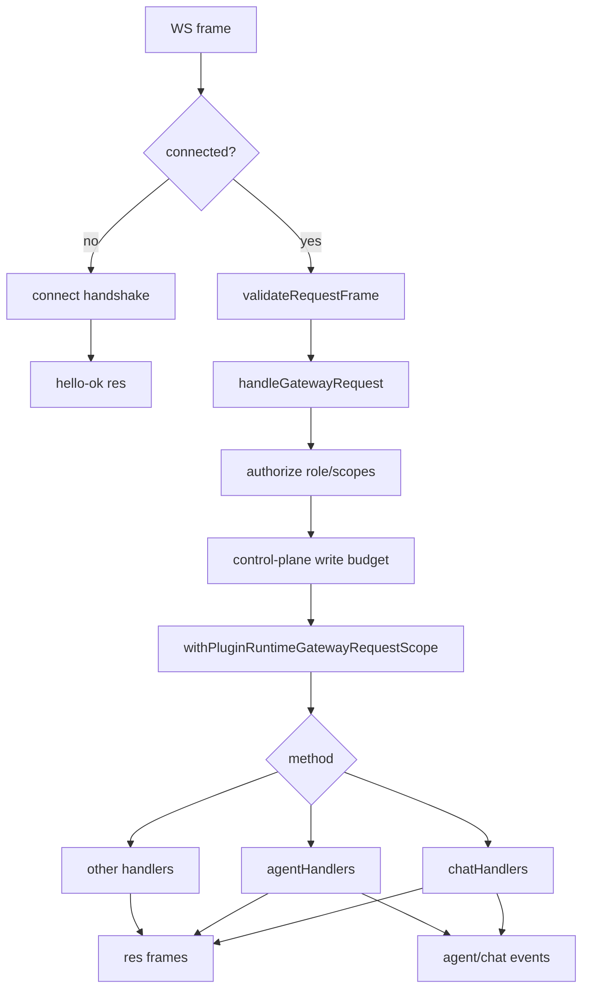

## 57. `src/gateway/server-methods/chat.ts`：Control UI / webchat 走的是“伪渠道入站”，不是直接调 `agentCommand(...)`

这个文件里最核心的方法族有 4 个：

- `chat.history`
- `chat.abort`
- `chat.send`
- `chat.inject`

对用户输入主链最关键的是 `chat.send`。

### 57.1 `chat.send` 的参数与用途

- `sessionKey`
  目标 session。
- `message`
  用户输入正文。
- `thinking?`
  本次 chat.send 的 thinking 覆盖项；如果正文不是 `/command`，会被改写成 `/think ...` 前缀。
- `deliver?`
  是否允许本次消息沿 session route 外发到真实渠道。
- `attachments?`
  RPC 附件，会先被规范成 chat attachments，再可能被转成 images。
- `timeoutMs?`
  当前 run 的 timeout override。
- `systemInputProvenance?` / `systemProvenanceReceipt?`
  只允许 ACP bridge client 使用。
- `idempotencyKey`
  这次 chat run 的 clientRunId，也是 dedupe key 的核心。

### 57.2 `chat.send` 与 `agent` 的本质差异

`chat.send` **不会直接调用** `agentCommandFromIngress(...)`。

它会先把请求包装成一个内部 `MsgContext`，然后调用：

- `dispatchInboundMessage({ ctx, cfg, dispatcher, replyOptions })`

所以在 Gateway 看来，webchat / Control UI 发来的 chat.send，更像“模拟了一次渠道入站消息”。

这也是为什么它还能复用：

- native command 判定
- inline action
- media/link/session 初始化
- auto-reply queue
- `dispatchInboundMessage(...)` 整条入站编排链

### 57.3 `chat.send` 里构造的 `MsgContext`

它会把 RPC 请求重写成一条内部渠道消息，关键字段包括：

- `Body`
  原始消息体。
- `BodyForAgent`
  注入 timestamp 后给 agent 用的正文。
- `BodyForCommands` / `CommandBody`
  带 `/think ...` 注入后的命令视图。
- `RawBody`
  原始未改写的正文。
- `InputProvenance`
  输入来源。
- `SessionKey`
  当前 session。
- `Provider` / `Surface`
  固定为 `INTERNAL_MESSAGE_CHANNEL`。
- `OriginatingChannel` / `OriginatingTo` / `AccountId` / `MessageThreadId`
  从 session route 或连接来源恢复出来的外发目标线索。
- `ExplicitDeliverRoute`
  这次是否显式要求按已有 route 外发。
- `GatewayClientScopes`
  连接携带的 operator scopes。

也就是说 `chat.send` 的本质是：**把 RPC 聊天请求伪装成一条内部消息，再让 auto-reply 主链处理它。**

### 57.4 `chat.send` 的响应模型

它和 `agent` 的响应模型完全不同。

- 立即 `respond(true, { runId, status: "started" })`
- 后续真正的内容通过 `chat` / `agent` 事件流送回
- 如果这次输入最终根本没有进入 agent run，而是被 native command 当场吃掉，那么 `chat.send` 会自己合成 transcript 追加和 `chat final` 事件

其中 `agentRunStarted` 是关键分界：

- `false`
  说明这次输入被命令/inline action 直接处理，`chat.send` 自己负责把 final reply 拼出来并广播 final。
- `true`
  说明已经进入真正的 agent run，后续 UI 更新由 `agent event -> server-chat` 那条链来完成。

### 57.5 `chat.abort` 和 `chat.history` 的意义

- `chat.abort`
  不只是停 run；它还会把当前 buffer 里的 partial assistant text 尝试补写进 transcript。
- `chat.history`
  不是简单读 transcript；它会 strip directives、裁剪超长内容、隐藏 silent reply、限制总字节预算，然后把 `thinkingLevel/verboseLevel` 一起返回给 UI。

### 57.6 `chat.send` 图

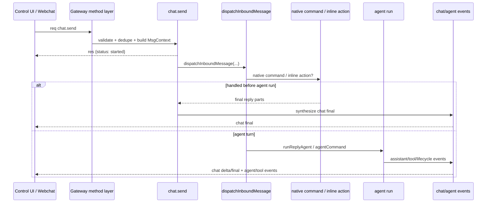

## 58. `src/gateway/server-methods/agent.ts`：程序化入口不走伪渠道，而是直接下沉到 `agentCommandFromIngress(...)`

这个文件最关键的是 3 个方法：

- `agent`
- `agent.identity.get`
- `agent.wait`

### 58.1 `agent` 方法的参数与用途

它的参数明显比 `chat.send` 更偏“程序化 agent job”：

- `message`
  本次 agent turn 的正文。
- `agentId?`
  指定 agent。
- `sessionId?` / `sessionKey?`
  指定会话。
- `to?` / `replyTo?`
  显式目标。
- `channel?` / `replyChannel?`
  turn 来源渠道与回复渠道。
- `accountId?` / `replyAccountId?`
  多账号渠道上下文。
- `threadId?`
  thread/topic 目标。
- `deliver?`
  是否允许最终外发。
- `attachments?`
  附件。
- `thinking?`
  thinking 覆盖项。
- `lane?`
  调度 lane，例如 subagent lane。
- `extraSystemPrompt?`
  本次 turn 的额外 system prompt。
- `internalEvents?`
  内部 runtime 事件，用于前置注入 prompt。
- `timeout?`
  本次 turn 超时。
- `bestEffortDeliver?`
  允许 delivery 最后阶段 best-effort。
- `label?`
  session label。
- `spawnedBy?`
  派生关系。
- `inputProvenance?`
  输入来源。
- `workspaceDir?`
  spawned/subagent 场景下的 workspace override。
- `idempotencyKey`
  这次 job 的幂等键和 `runId` 基础。

### 58.2 它的真实工作顺序

`agent` handler 不是直接把参数传给 `agentCommandFromIngress(...)`。它会先做一大段 gateway-specific 预处理：

1. 参数验证
2. `senderIsOwner` 从 client scopes 推导
3. 附件归一化并转图片
4. `agentId` / `sessionKey` 一致性校验
5. `/new`、`/reset` 特殊处理
6. timestamp 注入
7. session entry patch 与 session store 持久化
8. tool-event 收件人注册
9. delivery plan / outbound target 解析
10. 立即返回 accepted ACK
11. 后台异步调用 `dispatchAgentRunFromGateway(...)`

### 58.3 `agent` 与 `chat.send` 的响应差异

`agent` 的 ACK 是：

- `respond(true, { runId, status: "accepted", acceptedAt })`

然后后台异步执行 `agentCommandFromIngress(...)`。执行完成后，`dispatchAgentRunFromGateway(...)` 会 **对同一个请求 id 再发第二个 `res`**：

- 成功：`status: "ok", result: ...`
- 失败：`status: "error", summary: ...`

也就是说：

- `chat.send` 的最终结果主要靠 `chat` 事件流
- `agent` 的最终结果可以靠第二个 `res`，也可以再配合 `agent/chat` 事件流

这是两个很不同的客户端契约。

### 58.4 `agent.identity.get` 和 `agent.wait`

- `agent.identity.get`
  根据 `agentId` 或 `sessionKey` 返回 assistant identity / avatar，主要是 UI 展示契约。
- `agent.wait`
  给程序化客户端一个“等 run 结束”的轮询/阻塞接口。它会同时等：
  - lifecycle snapshot
  - gateway dedupe terminal snapshot

所以 `agent.wait` 是 `agent` 这套双响应模型的补充接口。

### 58.5 这一层最重要的边界

这条路径里最重要的不是 delivery，而是信任边界：

- handler 里先从 client scopes 推导 `senderIsOwner`
- 再把它传给 `agentCommandFromIngress(...)`
- 而不是让网络入口自动继承本地 CLI 的 owner 默认值

这就是 Gateway 路径和本地 CLI 路径之间最重要的权限分界。

## 59. `src/commands/agent.ts`：ACP-ready session 不是普通 runtime 的一个分支参数，而是另一条执行模型

### 59.1 入口 API 的信任边界

这一层对外其实只有两个入口：

- `agentCommand(opts, runtime?, deps?)`
- `agentCommandFromIngress(opts, runtime?, deps?)`

差别不在参数多少，而在默认信任：

- `agentCommand(...)`
  默认 `senderIsOwner = true`，是本地 CLI / trusted operator 入口。
- `agentCommandFromIngress(...)`
  要求调用方显式传 `senderIsOwner`，否则直接抛错。

### 59.2 `prepareAgentCommandExecution(...)` 产出的对象

这个函数已经不是简单参数检查，而是一次完整的执行装配。返回值里最关键的字段有：

- `body`
  加上 internal event 上下文后的最终 prompt。
- `cfg`
  secret refs 已解析过的运行时配置。
- `sessionId` / `sessionKey`
  这次 run 绑定的会话身份。
- `sessionEntry` / `sessionStore` / `storePath`
  当前持久会话状态和写回位置。
- `sessionAgentId`
  真正归属的 agent。
- `outboundSession`
  delivery 阶段要用的 session-scoped outbound context。
- `workspaceDir` / `agentDir`
  当前 agent 的工作区和 agent 目录。
- `runId`
  事件总线里的 run id。
- `acpManager`
  ACP 控制平面 manager。
- `acpResolution`
  当前 session 是否已绑定到 ACP runtime，会返回 `ready` / `stale` / `null`。

### 59.3 ACP-ready session 的执行顺序

当 `acpResolution?.kind === "ready" && sessionKey` 时，代码不会进入普通的 model selection / fallback / embedded / CLI 逻辑，而是走 ACP turn：

1. `registerAgentRunContext(runId, { sessionKey })`
2. `emitAgentEvent(lifecycle:start)`
3. 检查 ACP dispatch policy 和 agent policy
4. `acpManager.runTurn({ cfg, sessionKey, text: body, mode: "prompt", requestId: runId, signal, onEvent })`
5. 在 `onEvent` 里只消费 `text_delta` 且 `stream === "output"` 的文本
6. 用 `createAcpVisibleTextAccumulator()` 做可见文本累积
7. `done` 事件记录 `stopReason`
8. 成功后发 `lifecycle:end`，失败则转换成 ACP runtime error 并发 `lifecycle:error`
9. 用 `persistAcpTurnTranscript(...)` 把 user/assistant 写进 transcript
10. 把最终文本走 `normalizeReplyPayload(...)`
11. **最终仍然调用 `deliverAgentCommandResult(...)`**

### 59.4 `createAcpVisibleTextAccumulator()` 的真实作用

它不是普通字符串拼接器，而是 ACP-output 到 OpenClaw assistant stream 的适配器：

- 过滤 silent reply token 前缀
- 处理 ACP backend 可能发来的 cumulative snapshot
- 只把“用户应该看到的可见文本”转成 `text + delta`

所以 ACP 分支虽然最终也发 `assistant` event，但中间已经经过一次“ACP 输出语义 -> OpenClaw assistant stream 语义”的转换。

### 59.5 `persistAcpTurnTranscript(...)` 做了什么

这个 helper 会：

- 先用 `resolveSessionTranscriptFile(...)` 确保 transcript path 存在并持久化到 session store
- `SessionManager.open(sessionFile)`
- 必要时 `prepareSessionManagerForRun(...)`
- 追加一条 user message
- 再追加一条 assistant message
- assistant message 的 provider/model 固定记为 `openclaw / acp-runtime`
- 最后 `emitSessionTranscriptUpdate(sessionFile)`

也就是说 ACP 分支不会沿用 embedded runtime 自己的 transcript 生成机制，而是由 `commands/agent.ts` 在控制层手动补 transcript。

### 59.6 ACP 分支与普通分支的最大区别

ACP 分支：

- 不走 `runWithModelFallback(...)`
- 不走 `runAgentAttempt(...)`
- 不走 embedded tool loop
- 不走 CLI backend runner
- 但仍然走统一的 event bus 和统一的 `deliverAgentCommandResult(...)`

所以它共享的是“事件协议 + delivery 语义”，不是“底层运行内核”。

### 59.7 ACP 分支图

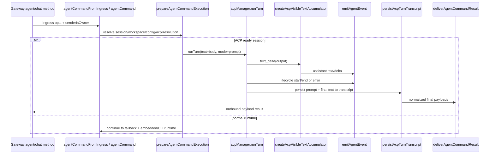

## 60. 现在，Gateway 侧的“用户输入 -> agent -> 输出”链可以怎样完整理解

到这里可以把 Gateway 面的主链分成两条：

### 60.1 UI/chat 链

- `attachGatewayWsMessageHandler(...)`
- `handleGatewayRequest(...)`
- `chat.send`
- `dispatchInboundMessage(...)`
- `getReplyFromConfig(...)`
- native command 或 `agentCommand(...)`
- `subscribeEmbeddedPiSession(...)` / `server-chat.ts`
- `chat final` / `agent event` / transcript mirror

### 60.2 程序化 agent 链

- `attachGatewayWsMessageHandler(...)`
- `handleGatewayRequest(...)`
- `agent`
- `agentCommandFromIngress(...)`
- `prepareAgentCommandExecution(...)`
- ACP 分支 或 普通 runtime 分支
- `deliverAgentCommandResult(...)`
- 第二个 `res` + `agent/chat` 事件流

### 60.3 这两条链真正共享的部分

它们共享的是：

- session store / sessionKey / transcript
- event bus
- delivery plan / outbound payload 语义
- `deliverAgentCommandResult(...)`

它们不共享的是：

- 输入前半段编排
- RPC 契约
- ACK / final response 模型

`chat.send` 更像“模拟消息渠道入站”；`agent` 更像“直接提交 agent job”。

## 61. 到这里，主系统级别还剩什么没有完全拆到底

如果问题是“Agent 用户输入到响应输出，主系统级别是不是已经拆通了”，现在可以回答：**基本可以说已经拆通了。**

还没做到逐文件穷尽式拆解的，只剩这些更细粒度的局部：

1. `src/agents/pi-embedded-subscribe.handlers.messages.ts` / `tools.ts` / `lifecycle.ts`
   这会进一步告诉我们每种 runtime event 怎样改写 `assistantTexts` / `toolMetas` / compaction 状态。
2. `src/gateway/server-methods/agent-job.ts`
   这会把 `agent.wait` 等待 lifecycle / dedupe terminal snapshot 的细节补完整。
3. 更多 sender/plugin 渠道
   现在 Slack / Telegram 已经深拆，但不是所有外发渠道都逐个拆完。

但从“用户输入如何进入系统，如何被路由、执行、投影、外发、持久化”这个主问题看，骨架已经完整。

## 62. `src/agents/pi-embedded-subscribe.handlers.types.ts`：handler 层不是自由读写，而是围绕 `EmbeddedPiSubscribeContext` 这份状态合同运行

前面已经讲过 `subscribeEmbeddedPiSession(...)` 本身是一台状态机，但真正把状态机拆成多个 handler 文件的关键，是这份 context/type 合同。

### 62.1 `EmbeddedPiSubscribeState` 的职责分层

这份 state 不是随便堆字段，而是分成 6 类：

- assistant 聚合状态
  - `assistantTexts`
  - `lastAssistant`
  - `assistantMessageIndex`
  - `assistantTextBaseline`
  - `lastAssistantText*`
- tool 聚合状态
  - `toolMetas`
  - `toolMetaById`
  - `toolSummaryById`
  - `lastToolError`
- block / delta / reasoning 流状态
  - `deltaBuffer`
  - `blockBuffer`
  - `blockState`
  - `partialBlockState`
  - `lastStreamedAssistant*`
  - `lastStreamedReasoning`
  - `lastReasoningSent`
  - `reasoningStreamOpen`
- compaction 协调状态
  - `compactionInFlight`
  - `pendingCompactionRetry`
  - `compactionRetryPromise`
  - `compactionRetryResolve/Reject`
  - `unsubscribed`
- messaging tool 去重状态
  - `messagingToolSentTexts*`
  - `messagingToolSentTargets`
  - `messagingToolSentMediaUrls`
  - `pendingMessagingTexts`
  - `pendingMessagingTargets`
  - `pendingMessagingMediaUrls`
- 额外执行指标
  - `successfulCronAdds`
  - usage / compaction count 相关信息

### 62.2 `EmbeddedPiSubscribeContext` 暴露的“能力接口”

handlers 并不直接知道外层怎么实现 delivery / hooks / usage，它们只通过 context 上的 helper 协作：

- stream 与 reply 辅助
  - `stripBlockTags(...)`
  - `emitBlockChunk(...)`
  - `flushBlockReplyBuffer()`
  - `consumeReplyDirectives(...)`
  - `consumePartialReplyDirectives(...)`
  - `emitReasoningStream(...)`
- assistant 状态迁移
  - `resetAssistantMessageState(...)`
  - `finalizeAssistantTexts(...)`
  - `noteLastAssistant(...)`
- compaction 协调
  - `ensureCompactionPromise()`
  - `noteCompactionRetry()`
  - `resolveCompactionRetry()`
  - `maybeResolveCompactionWait()`
  - `resetForCompactionRetry()`
- tool 输出辅助
  - `shouldEmitToolResult()`
  - `shouldEmitToolOutput()`
  - `emitToolSummary(...)`
  - `emitToolOutput(...)`
  - `trimMessagingToolSent()`
- 指标
  - `recordAssistantUsage(...)`
  - `incrementCompactionCount()`
  - `getUsageTotals()`
  - `getCompactionCount()`

这意味着 `messages.ts` / `tools.ts` / `lifecycle.ts` 的职责不是“自己知道全系统怎么工作”，而是对同一个 context contract 做局部状态迁移。

## 63. `src/agents/pi-embedded-subscribe.handlers.messages.ts`：assistant message 流真正是怎样长成可见回复的

### 63.1 `handleMessageStart(...)`

这一步做的事很少，但非常关键：

- 只处理 `role === "assistant"` 的 message
- 在 `message_start` 上 reset assistant message state
- 触发 `onAssistantMessageStart?.()` 作为最早的“正在写”信号

之所以把 reset 放在 `message_start` 而不是 `text_end/message_end`，代码里写得很明确：provider 可能会在 `message_end` 之后再发迟到的 `text_end`。

### 63.2 `handleMessageUpdate(...)` 处理两类事件

它把 assistant message event 分成两大类：

- thinking 事件
  - `thinking_start`
  - `thinking_delta`
  - `thinking_end`
- text 事件
  - `text_start`
  - `text_delta`
  - `text_end`

#### 63.2.1 thinking 流

thinking 事件会：

- 把 raw stream 记到 `appendRawStream(...)`
- 如果 `streamReasoning` 打开，则优先用 partial message thinking，其次 fallback 到 event payload thinking
- 在 `thinking_end` 时显式关掉 reasoning stream

也就是说 reasoning 并不只是靠最终 message 解析出来，它支持真正的增量 thinking stream。

#### 63.2.2 text 流

text 流会经历 5 个阶段：

1. 提取 chunk
   - `text_delta` 用 `delta`
   - `text_start/text_end` 优先用 `delta`，否则在 `content` 与 `deltaBuffer` 之间做“只追加 suffix”的单调合并
2. 累积到 `deltaBuffer`，并同时喂给 `blockChunker` 或 `blockBuffer`
3. 如果开启 reasoning stream，从 tagged stream 里继续抽 reasoning
4. 用 `stripBlockTags(...)` 去掉 `<think>` / `<final>` 等不可见内容，得到当前可见 `next`
5. 基于 `next` 和 `visibleDelta` 计算是否发新的 assistant event / partial reply

### 63.3 它什么时候发 assistant event

只有当以下条件成立时才会发：

- 当前可见文本或媒体发生了新的可见增量
- 新文本是之前 clean text 的前缀扩展，而不是 provider 倒退/重写

发出的内容是：

- `emitAgentEvent({ stream: "assistant", data: { text, delta, mediaUrls? } })`
- 同时 best-effort 调 `onAgentEvent?.(...)`
- 如果外层开了 partial reply，再调 `onPartialReply(...)`

所以 handler 层已经在做一层“只保留单调可见前缀”的去抖和语义过滤。

### 63.4 `handleMessageEnd(...)` 做的是真正的“最终结算”

这一步会：

1. 记录 assistant usage
2. `promoteThinkingTagsToBlocks(...)`
3. 从最终 assistant message 提取 `rawText`
4. 如果最终文本只是 `SILENT_REPLY_TOKEN`，且 messaging tool 已成功发过消息，就把最后一条 messaging tool sent text 当 fallback text
5. 解析最终 `reply directives`
6. 如果此前从未发过 assistant update，但最终文本已知，则补发一次最终 assistant event
7. 调 `finalizeAssistantTexts(...)` 把最终文本写回 `assistantTexts`
8. 按 `blockReplyBreak` 决定 reasoning 是在答案前发还是答案后发
9. 在 `message_end` 边界把剩余 block reply / directives flush 完
10. 重置 delta/block/reasoning 缓冲状态

### 63.5 它为什么要看 messaging tool sent texts

这是整个 duplicate suppression 里最关键的一环：

- 如果 agent 最终只产出了 `NO_REPLY` / silent token
- 但工具已经真的把消息发到外部渠道了
- 那 `message_end` 需要把“外部已发出的最后一条消息”视作本轮最终可见答案

否则 UI / transcript / 事件层会以为这轮没有回复。

### 63.6 message handler 图

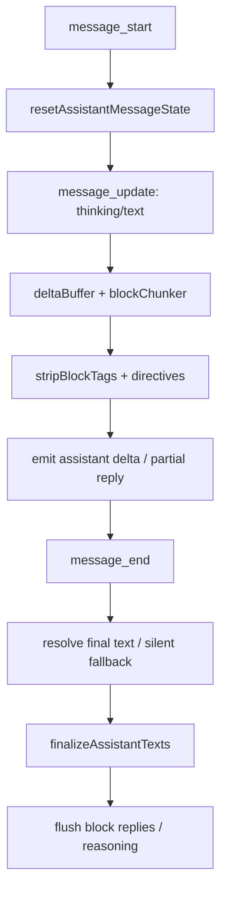

## 64. `src/agents/pi-embedded-subscribe.handlers.tools.ts`：tool handler 层真正控制的是“什么时候把工具输出视为已经发出”

### 64.1 `handleToolExecutionStart(...)`

这个 start handler 干的第一件事不是 emit tool start，而是：

- `flushBlockReplyBuffer()`
- `onBlockReplyFlush?.()`

目的非常明确：在 tool 开始前先把已经积攒的 assistant 块冲出去，防止 tool summary 插到半句 assistant 文本中间。

之后它会：

- 记录 `toolStartData`，保存 `startTime + args`
- 计算 tool meta（包括 exec/bash 的 `pty`、`elevated` 标记）
- 存到 `toolMetaById`
- 发 `tool start` 事件
- 如果允许显示 tool summary，并且这个 toolCallId 还没发过 summary，就发一次 `emitToolSummary(...)`
- 对 messaging tool，只把 `text/target/media` 记到 **pending** map，不立即当成已发送

### 64.2 为什么 messaging tool 只先记 pending

因为 duplicate suppression 的语义是：

- **只有工具真正成功发出消息之后**，assistant 主回复才应该 suppress 自己的重复文本。
- 如果 tool 失败了，但我们提前把它算成“已发出”，最终用户就会同时失去 tool 发出的消息和 assistant fallback。

所以 start 阶段只记 pending；commit 要等到 end 阶段且 `!isToolError`。

### 64.3 `handleToolExecutionUpdate(...)`

这个 update handler 很简单，但作用清晰：

- 对 `partialResult` 做 `sanitizeToolResult(...)`
- 发 `tool update` 事件
- 对外层 `onAgentEvent` 只报 phase/name/toolCallId，不把大对象原样透出

所以 tool update 流是“细节更完整的 internal agent event + 更轻的外部 callback”双轨。

### 64.4 `handleToolExecutionEnd(...)`

这是 tool 语义真正落盘的地方。它会依次做：

1. 规范 tool 名
2. 判定 `isToolError`
3. 取出 startData 和 callSummary
4. 更新 `toolMetas`、`lastToolError`
5. **成功时** commit pending messaging text / target / media
6. 对 mutating tool，如果之前记录的是同一 action 的失败，这次成功会清掉 `lastToolError`
7. `cron add` 成功时累计 `successfulCronAdds`
8. 发 `tool result` 事件
9. 根据 verbose 级别决定是发 raw output、summary 还是只发 media URL
10. 触发 `after_tool_call` hook，并把 `durationMs`、adjusted params 和 sanitized result 带进去

### 64.5 这一层最关键的设计点

- pending -> committed 的两阶段发送语义
- `lastToolError` 不是最近一次 error 的简单覆盖，而是带 mutation identity 的“未解决失败状态”
- `after_tool_call` hook 拿到的是 adjusted params，而不是原始 start args

也就是说 tool handler 层处理的不是“日志事件”，而是工具副作用的确认和会话级错误状态机。

## 65. `src/agents/pi-embedded-subscribe.handlers.lifecycle.ts` + `compaction.ts`：lifecycle handler 负责把 run 的终止语义和 compaction 协调收口

### 65.1 `handleAgentStart(...)`

非常直接：

- 发 `lifecycle:start`
- 通知 `onAgentEvent?.(...)`

### 65.2 `handleAgentEnd(...)`

它不会盲目发 `phase: end`，而是先看：

- `ctx.state.lastAssistant`
- `lastAssistant.stopReason === "error"`

如果是错误结束：

- 用 `formatAssistantErrorText(...)` 把 provider/model/session 上下文转换成更友好的错误文本
- 发 `lifecycle:error`

否则：

- 发普通 `lifecycle:end`

之后无论成功失败，它都会：

- `flushBlockReplyBuffer()`
- `onBlockReplyFlush?.()`，确保 compaction wait 不会把最终回复堵住
- 重置 block state
- 根据 `pendingCompactionRetry` / `compactionInFlight` 决定 resolve 哪个等待 promise

### 65.3 `handleAutoCompactionStart(...)`

compaction start 会：

- 标记 `compactionInFlight = true`
- `ensureCompactionPromise()`
- 发 `compaction:start`
- 调 `before_compaction` hook，把当前 session messages / sessionFile 交给插件

### 65.4 `handleAutoCompactionEnd(...)`

这里最关键的是它区分了 3 种结果：

- 有结果且未中止
  - compactionCount += 1
- `willRetry === true`
  - 说明 compaction 成功，但框架会 retry LLM request
  - 这时要 `noteCompactionRetry()` + `resetForCompactionRetry()`
- `willRetry === false`
  - 说明 compaction 真正结束
  - `maybeResolveCompactionWait()`
  - 清理 session messages 上的 stale assistant usage
  - 跑 `after_compaction` hook

这意味着 compaction 在这里不是一个透明内部优化，而是外层真的可观察、可等待、可重试的阶段。

## 66. `src/gateway/server-methods/agent-job.ts`：`agent.wait` 背后其实有一套 lifecycle terminal snapshot 缓存

这个模块对外只暴露：

- `waitForAgentJob({ runId, timeoutMs, signal?, ignoreCachedSnapshot? })`

但内部维护了 3 张表：

- `agentRunCache`
  已完成 run 的 terminal snapshot cache，TTL 10 分钟。
- `agentRunStarts`
  记录 run 的 start 时间。
- `pendingAgentRunErrors`
  暂挂的 error snapshot。

### 66.1 为什么 error 要暂挂 15 秒

代码里写得非常明确：embedded run 在 auth/model failover 过程中，可能会先发一个 transient lifecycle `error`，随后又发新的 `start`。

所以 `agent-job.ts` 不会立刻把 `error` 当成 terminal snapshot，而是：

- 给它一个 `AGENT_RUN_ERROR_RETRY_GRACE_MS = 15_000`
- 在 grace 窗口内如果收到新的 `start`，就清掉这个 pending error
- 只有超过窗口还没有被新 start 覆盖，才真正把它记进 terminal cache

### 66.2 `waitForAgentJob(...)` 的参数

- `runId`
  目标 run。
- `timeoutMs`
  最长等待时间。
- `signal?`
  外部 abort signal。
- `ignoreCachedSnapshot?`
  是否忽略已有 cached terminal snapshot。

这个 `ignoreCachedSnapshot` 很重要，`chat.send` 场景里如果 runId 复用或 chat run 仍在活跃，旧 snapshot 不能提前把 waiter 唤醒。

### 66.3 它的等待逻辑

`waitForAgentJob(...)` 会：

1. 确保全局 lifecycle listener 已启动
2. 先查 cached snapshot
3. 如果没有，再订阅 `onAgentEvent(...)`
4. 只关心当前 `runId` 的 lifecycle event
5. `start` 会取消 pending error timer
6. `end` 直接记 terminal snapshot 并 resolve
7. `error` 先 schedule pending error finish
8. 超时或 signal abort 则返回 `null`

所以 `agent.wait` 不只是“等一个 event”，而是在等一套经过 error-grace 和 snapshot cache 处理后的 terminal 语义。

### 66.4 `agent.wait` 图

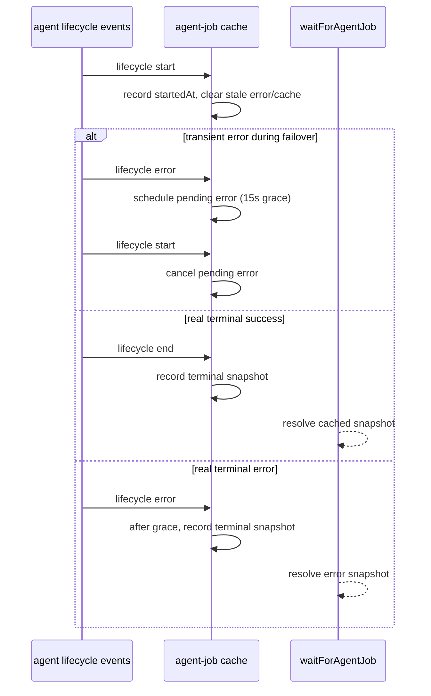

## 67. 额外补齐的 sender / plugin 渠道最后一公里

前面已经深拆过 Slack 和 Telegram。这次补 4 条仍然有代表性的“最后一公里”：

### 67.1 `src/discord/send.outbound.ts`

Discord 的核心特点不是单一 `sendMessage`，而是“按 channel type 切换发送事务”：

- 目标解析
  - `parseAndResolveRecipient(...)`
  - `resolveChannelId(...)`
- forum/media channel 特殊处理
  - 普通 `POST /messages` 发不了 forum/media channel
  - 会自动 `POST /threads(channelId)` 创建 thread post
  - 第一块文本作为 starter message，其余 chunk 再继续发到 thread
- reply/thread 语义
  - 普通发送用 `replyTo`
  - webhook 发送还支持 `thread_id` query 参数 + `message_reference.fail_if_not_exists=false`
- 能力面
  - text / media / sticker / poll / voice message / webhook
- 错误恢复
  - 统一走 `buildDiscordSendError(...)`，把 channel/token/media 上下文包进诊断错误

所以 Discord sender 的核心不是“发一条消息”，而是根据频道类型和发送形态，切换成不同事务：普通消息、forum thread、webhook、voice upload。

### 67.2 `src/signal/send.ts`

Signal sender 的特点是目标模型比线程模型更重要：

- 目标解析
  - `recipient`
  - `group`
  - `username`
- `buildTargetParams(...)` 控制不同 API 是否允许某类目标
- 文本路径
  - 默认 markdown -> Signal style ranges
  - 也支持 `plain` + `textStyles`
- 媒体路径
  - `resolveOutboundAttachmentFromUrl(...)`
  - 如果只有附件没有文字，会注入 `<media:image>` 这类占位文本，避免空 body
- 附加动作
  - `sendTypingSignal(...)`
  - `sendReadReceiptSignal(...)`

和 Telegram/Discord 不同，Signal 这里几乎没有 thread/topic 语义；它更像“目标类型分流 + 样式化文本 + 附件上传”的发送器。

### 67.3 `extensions/matrix/src/outbound.ts` + `extensions/matrix/src/matrix/send.ts`

Matrix 插件的最后一公里有两个鲜明特征：

- 先通过 plugin outbound adapter 暴露统一接口：
  - `sendText`
  - `sendMedia`
  - `sendPoll`
  - `chunker`
  - `deliveryMode: "direct"`
- 真正发送时再进入 Matrix 特有模型：
  - `resolveMatrixRoomId(...)`
  - `enqueueSend(roomId, ...)`，保证同一 room 按顺序发
  - `threadId` -> `buildThreadRelation(...)`
  - `replyToId` -> `buildReplyRelation(...)`
  - 媒体上传时支持加密上传
  - audio 还会做 voice decision
  - poll 用 `M_POLL_START`

所以 Matrix 的“最后一公里”最有代表性的不是错误恢复，而是：**它把 reply/thread/relation 作为一等语义对象处理，而不是只拼 message text。**

### 67.4 `extensions/feishu/src/outbound.ts` + `extensions/feishu/src/send.ts`

Feishu 插件的最后一公里更像“渲染模式 + reply fallback”模型：

- reply/thread 语义
  - `replyToId` 优先
  - 没有 `replyToId` 时把 `threadId` 当 reply target message id
- 渲染模式
  - code block / markdown table 会自动切到 markdown card
  - 普通文本走 message send
- 本地图片兼容 shim
  - 如果 `sendText` 收到的文本本身是一个绝对本地图片路径，会自动改走媒体发送，避免把路径字符串漏发给用户
- sendMedia fallback
  - 上传失败时退回成 `📎 <url>` 链接文本
- reply target 失效
  - `send.ts` 里对 withdrawn / not found reply target 有专门 fallback，必要时改发 direct message

所以 Feishu sender 的关键不是 chunking，而是“渲染降级 + reply 目标失效兜底 + 媒体上传失败兜底”。

### 67.5 现在加上这 4 个 sender 后，最后一公里能怎么归类

- 目标解析主导型
  - Signal
  - Telegram
- 频道类型事务主导型
  - Discord
- relation / thread 语义主导型
  - Matrix
- 渲染模式和 fallback 主导型
  - Feishu
- webhook / upload transaction 主导型
  - Slack / Discord voice/webhook

## 68. 到这里，整个主链的最后几个“黑盒”基本都被打开了

现在再看“用户输入到响应输出”的最后黑盒，已经可以比较清楚地说：

1. handler 层不是被动接收 runtime event，而是在做可见文本、tool 副作用、compaction、reasoning 的状态迁移。
2. `agent.wait` 等待的是一套经过 error grace window 修正过的 terminal 语义，不是原始 lifecycle event。
3. sender 的最后一公里并不存在统一实现；不同渠道真正差异巨大，至少会分化到：
   - target parsing
   - thread/reply model
   - media/upload transaction
   - retry/fallback policy
   - rich content rendering
4. 因此 OpenClaw 的“用户输入 -> 输出”链并不是单一 pipeline，而是：
   - 前半段尽量统一
   - 运行内核和事件投影分层
   - 最后一公里高度渠道化

## 69. 现在还剩什么没拆到“代码穷尽级别”

如果要求的是“主系统级别完全打通”，现在已经基本完成。

如果要求的是“逐文件穷尽级别”，还剩两类尾项：

1. 继续把更多 plugin sender 一个个拆完
   例如 Matrix 之外的 `extensions/msteams`、`extensions/bluebubbles`、`extensions/nextcloud-talk` 等。
2. 把每个 sender 依赖的 target resolver / media helper / retry helper 再下钻一层
   例如 Discord 的 `send.shared.ts`、Matrix 的 `send/targets.ts`、Feishu 的 `send-target.ts`。

但就“Agent 用户输入到响应输出”这个主问题来说，关键控制面、运行时、事件模型、等待模型、持久化模型和最后一公里发送模型，已经都落到了代码事实层面。

## 70. Explorer 补充：`extensions/msteams/src/send.ts` 代表了另一类“状态依赖型”最后一公里

如果前面的 Discord / Signal / Matrix / Feishu 分别代表：

- 频道类型事务主导
- 扁平目标主导
- relation/thread 主导
- 渲染与 fallback 主导

那么 MSTeams 更像：**状态依赖型 proactive outbound**。

### 70.1 目标解析不是 chat id，而是 `ConversationReference`

`extensions/msteams/src/send.ts` 这条 direct outbound 的前提不是“知道目标 id 就能发”，而是：

- 先把 `conversation:` / `user:` 目标解析成 lookup key
- 再从本地 `ConversationReference` 存储里取出历史 reference
- 如果 bot 从未见过这个会话，就不能主动发

这和 Slack/Telegram/Discord 的“有 id 基本就能尝试发送”是很不一样的。

### 70.2 direct outbound 并不真正复用 thread/reply 语义

虽然 Teams 能力面整体支持 thread 风格回复，但这条 direct outbound 路径本身：

- `msteamsOutbound` 不继续往下传 `replyToId` / `threadId`
- 更偏向 top-level proactive send

所以它的复杂度不在 thread，而在“如何拿到可发送的会话上下文”。

### 70.3 媒体路径是多分支 transport，不是单一 upload

根据会话类型和媒体类型不同，Teams 会切换不同发送模式：

- 个人会话小图可走 base64 inline
- 大文件或非图片可走 FileConsentCard
- 群聊/频道更偏 SharePoint 原生文件卡
- 失败时还可能退到 OneDrive 分享链接

这说明 Teams 的最后一公里，本质上是 Bot Framework + Graph/OneDrive/SharePoint 的组合 transport。

### 70.4 这一补充的意义

加上 Teams 这条后，可以把 OpenClaw sender 的最后一公里再补一类：

- 状态依赖型 sender
  - MSTeams

这类 sender 的真正难点不是 chunking、thread 或 markdown，而是：

- 有没有已有会话状态
- 能不能拿到可发送的外部平台上下文
- 平台支持哪种媒体交付协议

到这里，最后一公里的主要模式基本都齐了。

## 71. helper 层补充：为什么真正的复杂度不在 sender 壳子，而在 target / media / payload helper

前面已经把 sender 最后一公里拆开了，但如果再往下看一层，会发现真正决定行为边界的往往不是 `sendXxx(...)` 壳子，而是下面这几类 helper：

- target parser / resolver
  决定 `to` 究竟代表 user、channel、room、alias 还是 DM 会话。
- payload builder
  决定 text、embeds、components、files 能不能一起发，以及哪些只能挂第一条。
- media materializer
  决定 URL/本地文件如何被安全地转成可上传实体。
- retry / error classifier
  决定 transport 错误是重试、降级，还是转成高层可诊断错误。

下面补 4 个最有代表性的 helper 层。

## 72. `src/discord/send.shared.ts` + `src/discord/targets.ts`：Discord 的真正复杂度集中在 shared helper，而不是 outward API 名字

### 72.1 `parseDiscordTarget(...)` / `resolveDiscordTarget(...)`

这组 helper 决定了 Discord 的 `to` 字段语义：

- 支持显式前缀
  - `user:`
  - `channel:`
  - `discord:`
- 支持 mention 形式
  - `<@id>`
  - `<@!id>`
- 纯数字默认是二义性的
  - 没给 `defaultKind` 时会报错，强迫调用方区分 user 和 channel
- 普通字符串会先尝试当用户名做目录解析
  - `resolveDiscordTarget(...)` 会调用 `listDiscordDirectoryPeersLive(...)`
  - 命中用户后再缓存到 `rememberDiscordDirectoryUser(...)`

所以 Discord helper 层的关键点是：**它不把 `to` 当成“已经是最终 id”处理，而是允许 live directory lookup 把用户名解析成可发 DM 的 user id。**

### 72.2 `resolveChannelId(...)`

这个 helper 进一步把“用户目标”转成真正可发送的 channel：

- `recipient.kind === "channel"`
  - 直接返回 channel id
- `recipient.kind === "user"`
  - 走 `POST /users/@me/channels`
  - 自动创建/拿到 DM channel id

所以 Discord 的 sender 表面上支持“发给 user”，本质上是 helper 层先把 user 目标转成 DM channel，再交给统一发信路径。

### 72.3 `buildDiscordMessagePayload(...)`

这个 payload helper 决定了很多“不明显的约束”：

- 如果 components 里含 V2 component，文本和 embeds 的挂载策略会变
- `content`、`components`、`embeds`、`flags`、`files` 不是无脑并排塞进 body
- `resolveDiscordSendComponents(...)` / `resolveDiscordSendEmbeds(...)` 只会在 `isFirst === true` 时返回内容

这直接解释了一个关键行为：

- 多 chunk 文本时，只有第一条会带 components/embeds
- 后续 chunk 只是纯文本继续发

### 72.4 `sendDiscordText(...)` / `sendDiscordMedia(...)`

虽然这两个函数名像真正的 sender，但它们更像 shared transport primitive：

- `sendDiscordText(...)`
  - 先按 `chunkDiscordTextWithMode(...)` 切块
  - 每块都重新 build payload
  - `replyTo` 会转成 `message_reference`，并设置 `fail_if_not_exists: false`
- `sendDiscordMedia(...)`
  - 先 `loadWebMedia(...)`
  - 用第一块文本做 caption
  - 媒体作为 `files` 挂首条消息
  - 后续 chunk 继续调用 `sendDiscordText(...)`

也就是说 Discord 的 helper 层天然把“首条媒体+caption”和“剩余 followup 文本”拆成两个事务。

### 72.5 `buildDiscordSendError(...)`

这层 helper 决定 transport 错误怎么抬升成用户可理解错误：

- `50007`
  - 直接映射为 DM blocked
- `50013`
  - 不只是返回 missing permissions
  - 还会去 `fetchChannelPermissionsDiscord(...)` 探测缺少哪些权限
  - thread channel 会额外要求 `SendMessagesInThreads`
  - media 发送还会额外要求 `AttachFiles`

所以 Discord sender 的“错误语义”主要也是 helper 层定义的，不是 outbound 壳子定义的。

## 73. `extensions/matrix/src/matrix/send/targets.ts`：Matrix 的关键 helper 不是发送，而是 room/direct relation 解析

### 73.1 `resolveMatrixRoomId(...)`

这个 helper 支持的目标语义明显比大多数渠道更丰富：

- `matrix:`
- `room:`
- `channel:`
- `user:`
- `@user:homeserver`
- `#alias:homeserver`
- 以及直接 room id

但最关键的是：对 user target，它不会直接发，而是下沉到 `resolveDirectRoomId(...)`。

### 73.2 `resolveDirectRoomId(...)`

这是真正决定 Matrix DM 路径的 helper。它有 3 层策略：

1. 先查进程内 `directRoomCache`
2. 再查 Matrix account data 里的 `m.direct`
3. 还没有，就扫 joined rooms，找包含这个 user 的 1:1 房间
   - 如果有经典两人房，优先用它
   - 没有就退到第一个包含这个 user 的房间

找到之后，还会：

- `setDirectRoomCached(...)`
- `persistDirectRoom(...)` 回写 `m.direct`

所以 Matrix helper 层真正重要的语义不是“发送到 room”，而是：**当目标是 user 时，如何把它恢复成一个可发送的 direct room。**

### 73.3 `normalizeThreadId(...)`

这个 helper 很小，但作用明确：

- `undefined/null/empty string` -> `null`
- 其余统一成 trimmed string

它让上层在 relation builder 里只需要判断“有 thread id 还是没有”，不用每条 sender 分支都重新处理脏值。

### 73.4 这层 helper 的意义

Matrix sender 的线程/回复能力看起来很强，但真正让它成立的不是 `sendMessageMatrix(...)` 本身，而是：

- `resolveMatrixRoomId(...)`
- `resolveDirectRoomId(...)`
- `normalizeThreadId(...)`

这些 helper 先把目标空间和 relation 语义校准好了，sender 本体才可能简单。

## 74. `extensions/feishu/src/send-target.ts` + `extensions/feishu/src/targets.ts`：Feishu helper 层真正决定的是 receive-id type

Feishu 的 outbound 壳子看起来很简单，但 helper 层实际在解决一个更底层的问题：

- 这次发送到底该用 `chat_id`、`open_id` 还是 `user_id`？

### 74.1 `normalizeFeishuTarget(...)`

这个 helper 先统一清理目标字符串：

- 去掉 provider prefix
  - `feishu:`
  - `lark:`
- 再去掉 route prefix
  - `chat:`
  - `group:`
  - `channel:`
  - `user:`
  - `dm:`
  - `open_id:`

它的职责不是决定 id type，而是把最终 receive id 抽出来。

### 74.2 `resolveReceiveIdType(...)`

真正决定 Feishu transport 语义的是这个 helper：

- `chat:` / `group:` / `channel:` 或 `oc_...`
  - `chat_id`
- `open_id:` 或 `ou_...`
  - `open_id`
- `user:` / `dm:`
  - 再看去前缀后的值是否像 open_id
  - 否则 `user_id`
- 其余默认 `user_id`

所以 Feishu 的 `to` 并不只是“一个目标 id”，它还隐含了“请求参数里的 receive_id_type 应该是什么”。

### 74.3 `resolveFeishuSendTarget(...)`

这个 helper 把前两步串起来，返回一组上层 sender 真正需要的对象：

- `client`
- `receiveId`
- `receiveIdType`

也就是说 Feishu sender 真正依赖的不是复杂的发送分支，而是 helper 层先帮它把 target -> transport tuple 解析好。

## 75. `src/media/outbound-attachment.ts`：Signal 这类 sender 的附件路径之所以“简单”，是因为 helper 已经把 URL/本地路径物化了

`resolveOutboundAttachmentFromUrl(...)` 很短，但它解释了为什么 Signal sender 自身看起来那么“扁平”。

它做的事情只有两步：

1. `loadWebMedia(...)`
   - 带 `buildOutboundMediaLoadOptions(...)`
   - 把 URL / 本地路径 / SSRF / local roots / maxBytes 等问题在 helper 层消化掉
2. `saveMediaBuffer(...)`
   - 把媒体 buffer 落成一份真正可上传的本地文件
   - 返回 `{ path, contentType }`

所以 Signal sender 之所以能直接把 `attachments: [path]` 塞进 RPC，不是因为 Signal 路径天然简单，而是因为“媒体解析和物化”已经在 helper 层提前做完了。

## 76. helper 层补完后，对最后一公里的判断要再修正一次

现在再看 sender 最后一公里，可以更准确地说：

1. sender 本体负责的是“把已经规范好的 target / payload / media tuple 发出去”。
2. 真正决定语义边界的，是 helper 层：
   - Discord：target resolver + payload builder + permission-aware error classifier
   - Matrix：direct room resolver + thread id normalizer
   - Feishu：receive-id / receive-id-type resolver
   - Signal：outbound attachment materializer
3. 所以不同渠道虽然最终都实现了 `sendText/sendMedia/...`，但它们的 helper 层并不一致，不能简单视为“同链路不同壳子”。
4. 反过来说，如果以后要重构最后一公里，最值得抽象的不是 sender API，而是：
   - target resolution contract
   - relation/reply contract
   - outbound media materialization contract
   - transport error classification contract

到这里，最后一公里的 helper 层也基本落到代码事实层面了。

## 77. 这一批 helper 在 embedded runner 里的位置

前面已经把 `runEmbeddedPiAgent(...)`、`run/attempt.ts`、`subscribeEmbeddedPiSession(...)` 和 `runCliAgent(...)` 这些“主干执行链”拆掉了。

这次补的 8 个文件，不再负责主链调度，而是在 embedded runner 里分别承担 4 类 helper 角色：

- 模型解析层
  - `src/agents/pi-embedded-runner/model.ts`
- system prompt / skills 装配层
  - `src/agents/pi-embedded-runner/system-prompt.ts`
  - `src/agents/pi-embedded-runner/skills-runtime.ts`
- provider payload / transport 兼容层
  - `src/agents/pi-embedded-runner/extra-params.ts`
- history / compaction / payload 生成层
  - `src/agents/pi-embedded-runner/history.ts`
  - `src/agents/pi-embedded-runner/compact.ts`
  - `src/agents/pi-embedded-runner/run/params.ts`
  - `src/agents/pi-embedded-runner/run/payloads.ts`

所以这一批 helper 不负责“发起一次 run”，而是决定一次 run **到底用什么模型、带什么 prompt、怎样兼容 provider、保留多少历史、怎样压缩 transcript、最后把结果转成什么 payload**。

## 78. `src/agents/pi-embedded-runner/model.ts`：embedded runner 真正的模型解析器

### 78.1 它暴露了哪些 API

- `buildInlineProviderModels(providers)`
- `resolveModelWithRegistry({ provider, modelId, modelRegistry, cfg? })`
- `resolveModel(provider, modelId, agentDir?, cfg?)`
- `buildModelAliasLines`

真正最重要的是后两个。

### 78.2 `resolveModelWithRegistry(...)` 的参数与用途

参数：

- `provider`
  目标 provider id。
- `modelId`
  目标模型 id。
- `modelRegistry`
  发现后的模型注册表。
- `cfg?`
  OpenClaw 配置，用于 provider/model 覆盖。

它的解析顺序是：

1. 先从 `modelRegistry.find(provider, modelId)` 找已发现模型
2. 如果命中，再套一层 `applyConfiguredProviderOverrides(...)`
3. 没命中时，查 `cfg.models.providers` 里的 inline provider models
4. 再查 `resolveForwardCompatModel(...)`
5. 如果 provider 是 `openrouter`，允许任意 modelId 通过 generic OpenAI-completions transport 兜底
6. 如果 provider config 存在，或者 modelId 以 `mock-` 开头，再生成一个通用 fallback model
7. 全都失败才返回 `undefined`

也就是说这个 resolver 的职责不是“从 models.json 找个模型”，而是：**把发现到的模型、配置覆盖、前向兼容、proxy provider 特例和 mock fallback 合并成一个可运行的 `Model<Api>`。**

### 78.3 `applyConfiguredProviderOverrides(...)` 真正做了什么

这个 helper 会把三层配置合并到 discovered model 上：

- provider 级 `api` / `baseUrl` / `headers`
- model 级 `api` / `reasoning` / `input` / `cost` / `contextWindow` / `maxTokens` / `compat` / `headers`
- discovered model 自身字段

同时还做了一个很重要的安全处理：

- `sanitizeModelHeaders(..., { stripSecretRefMarkers: true })`

这意味着 discovered model 里如果带有 auth marker / secret-ref header 占位符，在真正交给 runtime 前会被剥掉，不会当成真实 header 透传给 provider。

### 78.4 `resolveModel(...)` 的职责比名字更大

`resolveModel(...)` 并不是只返回 model，它同时返回：

- `model?`
- `error?`
- `authStorage`
- `modelRegistry`

它内部会：

- `discoverAuthStorage(...)`
- `discoverModels(...)`
- 再调用 `resolveModelWithRegistry(...)`

所以 `resolveModel(...)` 本质上是 embedded runtime 的“模型发现入口”，而不是纯函数型的 model lookup。

### 78.5 它的几个关键特例

- `openrouter`
  - 允许未预注册 modelId 直接过
  - 自动构造通用 OpenRouter model 定义
- `mock-*`
  - 即使 catalog 没有，也会生成 mock model
- 本地 provider 提示
  - 对 `ollama`、`vllm` 这类 provider，如果 model 不存在，会补带“需要配置 API key 才会注册 provider”的提示文案

### 78.6 model helper 图

```mermaid
flowchart TD
    A[provider/modelId]
    B[discoverAuthStorage + discoverModels]
    C[modelRegistry.find]
    D[applyConfiguredProviderOverrides]
    E[inline provider models]
    F[forward-compat model]
    G[OpenRouter generic fallback]
    H[provider/mock generic fallback]
    I[resolved Model<Api>]
    J[error]

    A --> B --> C
    C -->|hit| D --> I
    C -->|miss| E
    E -->|hit| I
    E -->|miss| F
    F -->|hit| D --> I
    F -->|miss| G
    G -->|hit| I
    G -->|miss| H
    H -->|hit| I
    H -->|miss| J
```

## 79. `src/agents/pi-embedded-runner/system-prompt.ts` + `skills-runtime.ts`：这两层 helper 本身很薄，真正作用是做装配边界

### 79.1 `buildEmbeddedSystemPrompt(...)`

这个函数本身不生成复杂 prompt；它只是把 embedded runtime 关心的所有运行时信息重新打包，再委托给：

- `buildAgentSystemPrompt(...)`

但它很重要，因为它明确了 embedded runtime 的 prompt 输入面：

- workspace / docs / context files
- tools + tool summaries
- model alias lines
- runtimeInfo
- sandboxInfo
- messageToolHints
- owner display / reasoning tag hint / heartbeat prompt / skills prompt / TTS hint
- reaction guidance / channel actions
- timezone / time format / memory citations mode

所以它的作用是：**把 embedded runtime 关心的 prompt 参数收敛成一个稳定边界，避免外层直接拼 prompt。**

### 79.2 `createSystemPromptOverride(...)` / `applySystemPromptOverrideToSession(...)`

这两段 helper 决定了 prompt override 真正如何生效：

- `createSystemPromptOverride(systemPrompt)`
  - 把最终 prompt 固化成 override function
- `applySystemPromptOverrideToSession(session, override)`
  - `session.agent.setSystemPrompt(prompt)`
  - 同时把 `_baseSystemPrompt`、`_rebuildSystemPrompt` 也改掉

也就是说 embedded runtime 不是只改当前 prompt，而是把 session 内部“以后怎么重建 system prompt”的逻辑也强制改成这个 override。

### 79.3 `resolveEmbeddedRunSkillEntries(...)`

这个 helper 只有一个判断，但很关键：

- 如果 `skillsSnapshot` 已经有 `resolvedSkills`
  - 就不再重新 load workspace skill entries
- 否则
  - `loadWorkspaceSkillEntries(...)`

所以 skill helper 层的核心策略是：**优先信任 session 已有的技能快照，避免每次 run 都重新扫描 workspace 技能目录。**

## 80. `src/agents/pi-embedded-runner/extra-params.ts`：真正的 provider 兼容层和 payload wrapper 工厂

这份文件是这批 helper 里最重要的一层之一。它不直接跑模型，但几乎所有 provider-specific payload 差异都从这里进入 runtime。

### 80.1 `resolveExtraParams(...)`

参数：

- `cfg`
- `provider`
- `modelId`
- `agentId?`

它会从两处拿 params：

- `cfg.agents.defaults.models["provider/modelId"].params`
- `cfg.agents.list[].params`（当前 agent）

然后做 merge。

特别值得注意的是：

- `parallel_tool_calls` / `parallelToolCalls`

这两个别名会被统一收敛到 snake_case 字段。说明这个 helper 不只是 merge config，还顺手做 API-level key normalization。

### 80.2 `createStreamFnWithExtraParams(...)`

这是把普通配置转成 `streamFn` wrapper 的第一层。

它会把这些字段转成 runtime stream 参数：

- `temperature`
- `maxTokens`
- `transport`
- `openaiWsWarmup`
- `cacheRetention`
- `provider`（OpenRouter routing object 特例）

如果有 OpenRouter provider routing 配置，它不会直接改 request body，而是把路由对象塞进 `model.compat.openRouterRouting`，让下游 pi-ai 构参时自己生效。

### 80.3 `applyExtraParamsToAgent(...)` 是真正的 wrapper 装配器

这个函数不是简单 `agent.streamFn = ...`，而是一个按 provider/参数串联 wrapper 的流水线。

它做的 wrapper 装配顺序大致是：

1. provider 默认 transport wrapper
   - `openai-codex` -> websocket-first
   - `openai` -> websocket-first + SSE fallback
2. extra params wrapper
3. Anthropic beta headers
4. SiliconFlow thinking=off 兼容修正
5. Moonshot thinking wrapper
6. Anthropic tool payload compatibility
7. OpenRouter wrapper + system cache wrapper
8. Kilocode wrapper
9. Bedrock 非 Anthropic cache 禁用 wrapper
10. Z.AI `tool_stream=true` wrapper
11. Google thinking payload guard
12. OpenAI service tier wrapper
13. OpenAI Responses context management wrapper
14. `parallel_tool_calls` wrapper

所以这层文件的真实定位是：**embedded runner 的 provider transport / payload compatibility middleware stack builder。**

### 80.4 这层 helper 真正解决了哪些问题

- OpenRouter / Kilocode 的 routing / reasoning 差异
- OpenAI / Codex 的 transport 默认值
- Anthropic / Bedrock 的 cache/header/tool payload 兼容
- Google Gemini 3.1 负 thinking budget 修正
- Z.AI tool stream 实时 tool-call 增量
- OpenAI Responses 的 `store/context management` 兼容

换句话说，embedded runtime 之所以能在一套统一 run loop 下跑这么多 provider，核心不是 `run.ts`，而是 `extra-params.ts` 这层 wrapper 工厂。

### 80.5 extra-params helper 图

```mermaid
flowchart TD
    A[cfg + provider/model + agentId]
    B[resolveExtraParams]
    C[merge model params + agent params]
    D[createStreamFnWithExtraParams]
    E[provider-specific wrappers]
    F[agent.streamFn]

    A --> B --> C --> D --> E --> F
    E --> E1[OpenAI/Codex transport]
    E --> E2[Anthropic headers/tool payload]
    E --> E3[OpenRouter/Kilocode routing]
    E --> E4[Moonshot/SiliconFlow thinking]
    E --> E5[Google payload guard]
    E --> E6[Z.AI tool_stream]
    E --> E7[parallel_tool_calls]
```

## 81. `src/agents/pi-embedded-runner/history.ts`：history helper 很小，但它定义了“长会话截断”策略

这份文件只有两个核心函数：

- `limitHistoryTurns(messages, limit)`
- `getHistoryLimitFromSessionKey(sessionKey, config)`

### 81.1 `limitHistoryTurns(...)`

它的策略不是“保留最后 N 条消息”，而是：

- 从后往前数最后 N 个 user turn
- 然后保留从那个 user turn 开始到结尾的所有消息

这意味着它保留的是“最后 N 轮用户回合及其后续 assistant/tool 响应”，而不是简单消息条数窗口。

### 81.2 `getHistoryLimitFromSessionKey(...)`

这个 helper 用 session key 解析 history limit 来源：

- DM/direct session
  - 先查 per-DM override：`channels.<provider>.dms[userId].historyLimit`
  - 再查 provider 的 `dmHistoryLimit`
- channel/group session
  - 查 provider 的 `historyLimit`

还会先做：

- 去掉 `:thread:` / `:topic:` suffix
- 兼容 `direct` 和老的 `dm` 命名

所以 history helper 的关键点是：**history limit 不是全局固定值，而是从 session key 反推出 provider/kind/user，然后走 provider 级配置。**

## 82. `src/agents/pi-embedded-runner/compact.ts`：真正的 transcript compaction 主实现

这是这批 helper 里最大、也最关键的一块之一。

### 82.1 它暴露了两个入口

- `compactEmbeddedPiSessionDirect(params)`
- `compactEmbeddedPiSession(params)`

区别非常重要：

- `compactEmbeddedPiSessionDirect(...)`
  - 核心 compaction 实现
  - 假设自己已经在正确 lane 里
- `compactEmbeddedPiSession(...)`
  - 外层安全入口
  - 先经过 session lane + global lane queueing
  - 再调用 context engine 的 `compact(...)`

所以真正“大逻辑”在 direct 版本里，外层版本主要负责避免死锁和统一调 context engine。

### 82.2 `CompactEmbeddedPiSessionParams` 的核心字段

这份参数对象非常像 mini runtime context，最重要的有：

- session 身份
  - `sessionId`
  - `sessionKey?`
  - `sessionFile`
- 运行上下文
  - `workspaceDir`
  - `agentDir?`
  - `config?`
  - `skillsSnapshot?`
- 模型与权限
  - `provider?`
  - `model?`
  - `authProfileId?`
  - `senderIsOwner?`
- channel / route 上下文
  - `messageChannel?`
  - `messageProvider?`
  - `agentAccountId?`
  - `groupId/groupChannel/groupSpace`
  - `spawnedBy?`
- compaction 控制
  - `customInstructions?`
  - `tokenBudget?`
  - `force?`
  - `trigger?` (`overflow` / `manual`)
  - `attempt?` / `maxAttempts?`
  - `lane?`
  - `enqueue?`
- prompt 相关
  - `extraSystemPrompt?`
  - `ownerNumbers?`

也就是说 compaction 不是一个纯 transcript 压缩器，它是一次“带完整 runtime 语境的特殊 agent run”。

### 82.3 `compactEmbeddedPiSessionDirect(...)` 的真实流程

这条 direct path 大致会做：

1. 解析 compaction model
   - 优先 `cfg.agents.defaults.compaction.model`
   - 再退回调用方 provider/model
2. `resolveModel(...)`
3. `getApiKeyForModel(...)`
4. 建 sandbox / workspace / skills / bootstrap context
5. 重新 build embedded system prompt
6. 拿 session write lock
7. `repairSessionFileIfNeeded(...)`
8. `SessionManager.open(...)`
9. 构造 guarded sessionManager / settingsManager / resourceLoader
10. `createAgentSession(...)`
11. `applySystemPromptOverrideToSession(...)`
12. `sanitizeSessionHistory(...)`
13. `validateGeminiTurns(...)` / `validateAnthropicTurns(...)`
14. `limitHistoryTurns(...)`
15. `sanitizeToolUseResultPairing(...)`
16. 触发 before hooks
17. `compactWithSafetyTimeout(() => session.compact(...))`
18. 记录 compactedCount / tokensAfter / diag metrics
19. 触发 after hooks
20. `flushPendingToolResultsAfterIdle(...)`
21. 释放锁和 session

这说明 compaction 根本不是“删几条旧消息”，而是：**重新创建一个受限的 agent session，用当前 provider/model/system prompt/skills/context 重新执行 `session.compact(...)`。**

### 82.4 这份文件里最关键的策略

- compaction model 可以和主 run model 不同
- 如果 compaction provider 改了，会主动丢掉主 run 的 auth profile，避免错 token
- `sanitizeSessionHistory(...)`、provider-specific turn validation、history limit、tool_use/tool_result repair 都在真正 compaction 前执行
- compaction 前后都会发 internal hook 和 plugin hook
- `flushPendingToolResultsAfterIdle(...)` 说明 compaction 完成后还要把工具结果状态排空，避免 session dispose 前丢状态

### 82.5 为什么这层文件重要

embedded runtime 的“上下文不会无限膨胀”这件事，并不是 `run/attempt.ts` 自己解决的，而是由 `compact.ts` 单独负责一整套受控压缩事务。

## 83. `src/agents/pi-embedded-runner/run/params.ts`：主运行内核的参数合同

`RunEmbeddedPiAgentParams` 是 embedded runtime 的真正输入合同。

它把参数分成几类：

- session / routing
  - `sessionId`, `sessionKey`, `messageChannel`, `messageProvider`, `messageTo`, `messageThreadId`
- channel runtime state
  - `currentChannelId`, `currentThreadTs`, `currentMessageId`
  - `replyToMode`, `hasRepliedRef`
- policy / identity
  - `senderIsOwner`
  - `spawnedBy`
  - `groupId/groupChannel/groupSpace`
  - `requireExplicitMessageTarget`
  - `disableMessageTool`
- content / tools
  - `prompt`, `images`, `clientTools`, `disableTools`
- model / auth / behavior
  - `provider`, `model`, `authProfileId`, `authProfileIdSource`
  - `thinkLevel`, `verboseLevel`, `reasoningLevel`
  - `toolResultFormat`, `suppressToolErrorWarnings`
- delivery / streaming callbacks
  - `onPartialReply`
  - `onAssistantMessageStart`
  - `onBlockReply`
  - `onBlockReplyFlush`
  - `onReasoningStream`
  - `onReasoningEnd`
  - `onToolResult`
  - `onAgentEvent`
- execution control
  - `timeoutMs`
  - `abortSignal`
  - `lane`
  - `enqueue`
  - `allowTransientCooldownProbe`

这份类型的意义很直接：**它把 embedded runtime 需要的“消息、会话、渠道、工具、回调、权限、provider 行为”全部显式化了。**

换句话说，`runEmbeddedPiAgent(...)` 不是只吃 `prompt + model`，而是吃一整份运行上下文对象。

## 84. `src/agents/pi-embedded-runner/run/payloads.ts`：embedded runtime 的最终 payload 生成器

这份文件负责把运行过程中积累的：

- `assistantTexts`
- `toolMetas`
- `lastAssistant`
- `lastToolError`

转换成真正可交给 delivery 层的 payload 数组。

### 84.1 对外主 API

- `buildEmbeddedRunPayloads(params)`

参数里最关键的是：

- `assistantTexts`
- `toolMetas`
- `lastAssistant`
- `lastToolError?`
- `verboseLevel?`
- `reasoningLevel?`
- `toolResultFormat?`
- `inlineToolResultsAllowed`
- `didSendViaMessagingTool?`
- `suppressToolErrorWarnings?`

### 84.2 这份 helper 做的 5 件事

1. assistant error 规范化
   - `formatAssistantErrorText(...)`
   - `formatRawAssistantErrorForUi(...)`
   - billing error / raw API payload 去重
2. inline tool results 注入
   - verbose 打开且允许 inline 时，tool summary 会被拼进 replyItems
3. reasoning payload 注入
   - `reasoningLevel === "on"` 时，把 assistant thinking 格式化成 reasoning item
4. assistant answer 提取
   - 优先 `assistantTexts`
   - 否则 fallback 到 `extractAssistantText(lastAssistant)`
   - 同时 suppress raw API error 文本和 silent reply
5. tool error warning 决策
   - `resolveToolErrorWarningPolicy(...)`
   - mutating tool failure 必须显式警告
   - recoverable tool error 在已有用户回复时可以 suppress

### 84.3 最关键的策略点

- mutating tool 失败的 warning 语义比普通 tool 更强，不允许静默吞掉
- 如果任一 payload 带 `audioAsVoice`，最终会把这个语义传播给含媒体的 payload
- `didSendViaMessagingTool` 会影响最终 assistant/user-facing reply 的组织方式
- 这份 helper 产出的 payload 还没有真正发送，但已经决定了“最终回复面上用户会看到什么、不该看到什么”

### 84.4 它和上游 subscribe 层的分工

- `subscribeEmbeddedPiSession(...)`
  - 负责把 runtime stream 规整成中间状态
- `buildEmbeddedRunPayloads(...)`
  - 负责把中间状态规整成最终 outbound payload 语义

所以这两层不是重复，而是典型的：

- 事件整形层
- 最终输出整形层

## 85. 现在，这一节“agent 真正怎么跑”可以怎样完整收束

如果只看这一节现在的覆盖范围，可以分成三层：

### 85.1 主执行器

- `src/agents/pi-embedded.ts`
- `src/agents/pi-embedded-runner/run.ts`
- `src/agents/pi-embedded-runner/run/attempt.ts`
- `src/agents/cli-runner.ts`

这部分已经说明了：

- embedded runtime 怎么跑
- CLI backend 怎么跑
- 两条路径为什么不是同一种 runtime

### 85.2 事件与状态整形器

- `src/agents/pi-embedded-subscribe.ts`
- `src/agents/pi-embedded-subscribe.handlers.*`
- `src/gateway/server-chat.ts`
- `src/gateway/server-methods/agent-job.ts`

这部分已经说明了：

- runtime 事件怎样变成可见 assistant/tool/chat 事件
- `agent.wait` 怎样等待经过 grace window 处理后的 terminal 状态

### 85.3 helper 控制层

- `src/agents/pi-embedded-runner/model.ts`
- `src/agents/pi-embedded-runner/system-prompt.ts`
- `src/agents/pi-embedded-runner/skills-runtime.ts`
- `src/agents/pi-embedded-runner/extra-params.ts`
- `src/agents/pi-embedded-runner/history.ts`
- `src/agents/pi-embedded-runner/compact.ts`
- `src/agents/pi-embedded-runner/run/params.ts`
- `src/agents/pi-embedded-runner/run/payloads.ts`

这部分已经说明了：

- 模型怎么解析
- prompt 怎么装配
- provider payload 怎么兼容
- history 怎么裁剪
- compaction 怎么真正执行
- embedded runtime 需要哪些输入上下文
- 最终 payload 怎样生成

## 86. 到这里，这一节还剩什么没有穷尽

如果问题是“这一节 `再看 agent 真正怎么跑` 是否已经拆通”，现在可以回答：**是，已经基本拆通。**

如果问题变成“`src/agents/pi-embedded-runner/*` 目录里每个 helper 乃至每个 provider wrapper 都要逐文件穷尽”，那还剩这些尾项：

- `src/agents/pi-embedded-runner/openai-stream-wrappers.ts`
- `src/agents/pi-embedded-runner/anthropic-stream-wrappers.ts`
- `src/agents/pi-embedded-runner/proxy-stream-wrappers.ts`
- `src/agents/pi-embedded-runner/google.ts`
- `src/agents/pi-embedded-runner/session-manager-init.ts`

但这些已经不再是“agent 怎么跑”的主干缺口，而是更细的 provider transport / transcript hygiene 子专题。

所以对这一节本身，可以认为主线已经完整。

## 87. `src/agents/pi-embedded-runner/openai-stream-wrappers.ts`：这不是“OpenAI 流实现”，而是 OpenAI Responses 的 payload 策略中间件

这个文件的定位要先纠正一下：

- 它**不负责**真正的网络流式协议。
- 它负责的是 **OpenAI / Codex 这类 Responses API 请求在真正发出去之前，最后一层 payload 和 transport 默认值改写**。

也就是说，它属于 `streamFn` wrapper 家族，而不是 provider SDK 本体。

当前真正对外暴露的入口只有 5 个：

- `resolveOpenAIServiceTier(extraParams)`
- `createOpenAIResponsesContextManagementWrapper(baseStreamFn, extraParams)`
- `createOpenAIServiceTierWrapper(baseStreamFn, serviceTier)`
- `createCodexDefaultTransportWrapper(baseStreamFn)`
- `createOpenAIDefaultTransportWrapper(baseStreamFn)`

### 这一层最关键的实现事实

第一，`createCodexDefaultTransportWrapper(...)` 和 `createOpenAIDefaultTransportWrapper(...)` 做的是 transport 默认值，不是强制覆盖。

- Codex 路径：默认 `transport="auto"`
- OpenAI 路径：默认 `transport="auto"`，并且默认 `openaiWsWarmup=true`

所以它们的语义是：

- 调用方没指定时，优先走自动 transport
- 调用方显式指定时，不抢占调用方的值

这和 `src/agents/pi-embedded-runner/extra-params.ts` 里的注释是对齐的：

- OpenAI Codex 默认 WebSocket-first
- OpenAI Responses 默认 WebSocket-first，失败再透明 SSE fallback

第二，`resolveOpenAIServiceTier(...)` 只做一件事：

- 把 `serviceTier` / `service_tier` 规范成 `"auto" | "default" | "flex" | "priority"`
- 如果值非法，只记 warning，不抛错

所以这一层不是配置校验器，而是“尽量吞掉脏输入，最后只把合法值往下传”的兼容层。

第三，`createOpenAIServiceTierWrapper(...)` 的注入条件非常窄，不是所有 OpenAI-compatible 都吃：

- `model.api === "openai-responses"`
- `model.provider === "openai"`
- `baseUrl` 必须是 `api.openai.com`

因此下面这些都**不会**注入 `payload.service_tier`：

- Azure OpenAI Responses
- `openai` provider 但 baseUrl 指向代理
- `openai` provider 但 baseUrl 指向 Azure 域名

测试也明确覆盖了这些分支：`src/agents/pi-embedded-runner-extraparams.test.ts`。

第四，`createOpenAIResponsesContextManagementWrapper(...)` 是这个文件最重要的入口，它解决了 3 个实际问题：

- 为直接 OpenAI Responses provider 强制 `payload.store=true`
- 为声明 `compat.supportsStore === false` 的模型剥离 `payload.store`
- 对兼容的 direct OpenAI Responses payload 自动注入 `context_management=[{ type: "compaction", compact_threshold: ... }]`

这里最关键的判断函数是：

- `shouldForceResponsesStore(...)`
- `shouldEnableOpenAIResponsesServerCompaction(...)`
- `shouldStripResponsesStore(...)`

它们的组合说明：

- `store=true` 不是普遍规则，只对 direct OpenAI / direct Azure Responses provider 且 baseUrl 看起来真的是 OpenAI/Azure 域名时生效
- 但 `service_tier` 更严格，只对 public `api.openai.com` 生效
- `context_management` 默认只会自动给 direct `openai` provider 打开；Azure 只有显式配置 `responsesServerCompaction=true` 才会开启

第五，`context_management` 注入是“只在 payload 里还没有时才补”，不是盲覆盖。

也就是说：

- 如果上游已经给了 `context_management`
- wrapper 不会重写它

这一点很重要，因为它说明这层 middleware 的设计哲学是“补默认值”，不是“把上游策略打掉”。

### 这层的真正角色

把这个文件放进整个 embedded runtime 里看，它的职责不是“让 OpenAI 能跑起来”，而是：

- 给 OpenAI/Codex 路径补 transport 缺省值
- 给 OpenAI Responses 路径补 store / service tier / server compaction 策略
- 把 provider-specific 的兼容分支从 `run/attempt.ts` 主循环里抽出去

换句话说，它是 **provider payload policy middleware**。

## 88. `src/agents/pi-embedded-runner/anthropic-stream-wrappers.ts`：Anthropic 这层主要做 header 兼容和 tool payload 兼容

这个文件和 OpenAI 那个很像，定位也不是“真正的 Anthropic 流实现”，而是 Anthropic 系列 provider 的请求包装层。

当前导出的入口有 5 个：

- `resolveCacheRetention(extraParams, provider)`
- `resolveAnthropicBetas(extraParams, provider, modelId)`
- `createAnthropicBetaHeadersWrapper(baseStreamFn, betas)`
- `createAnthropicToolPayloadCompatibilityWrapper(baseStreamFn)`
- `createBedrockNoCacheWrapper(baseStreamFn)`
- `isAnthropicBedrockModel(modelId)`

### 1. `resolveCacheRetention(...)`：Anthropic 的默认 prompt caching 策略入口

它返回的是：

- `"none"`
- `"short"`
- `"long"`
- 或 `undefined`

关键规则是：

- direct Anthropic：默认 `short`
- Anthropic via Bedrock：**没有显式 override 时不默认开启**
- 兼容旧字段 `cacheControlTtl`
  - `5m -> short`
  - `1h -> long`

这说明 OpenClaw 对 Anthropic 直连和 Anthropic-via-Bedrock 采取了不同默认值：

- 直连 Anthropic，默认愿意用 prompt cache
- Bedrock，只在用户显式要求时才传 cacheRetention

测试里也能看到这一点：`src/agents/pi-embedded-runner/extra-params.cache-retention-default.test.ts`。

### 2. `resolveAnthropicBetas(...)`：beta 集合的纯解析层

它做的不是 header 拼装，而只是“算出应该启哪些 beta”。

来源有两路：

- `extraParams.anthropicBeta`
- `extraParams.context1m === true`

但 `context1m` 不是普适的，只允许：

- `claude-opus-4*`
- `claude-sonnet-4*`

否则会 warning 并忽略。

所以这一层已经把“功能开关”和“模型能力边界”耦合在一起了，而不是交给更下游的 SDK 自己报错。

### 3. `createAnthropicBetaHeadersWrapper(...)`：不是覆盖 header，而是 merge header

这个 wrapper 会把 beta 写进 `anthropic-beta` header，但行为非常保守：

- 先保留调用方已有 header
- 再把内部 beta 合并进去
- 去重
- 最终拼成逗号分隔字符串

更重要的是 OAuth 特判。

如果 API key 看起来像 Anthropic OAuth token：

- 自动补上 `claude-code-20250219`、`oauth-2025-04-20` 等 OAuth beta 集
- 如果请求里还要求 `context-1m`，会剥掉它并 warning

这里暴露出的实现事实是：

- OpenClaw 已经把 Anthropic OAuth 看成“和原生 API key 不同的协议子方言”
- 因而 header 层的 beta 组合不是静态表，而是取决于 auth mode

### 4. `createAnthropicToolPayloadCompatibilityWrapper(...)`：真正棘手的是 tool payload 方言差异

这个 wrapper 只在需要 Anthropic-tool-payload compatibility 的模型上生效。

它解决的是一类很具体的问题：

- 某些 Anthropic-messages 路径并不吃 Anthropic 原生 tool schema / tool_choice
- 而是要求 OpenAI 风格的 `function` schema 和 string-mode tool choice

所以它会在 `onPayload` 里改写：

- `payload.tools`
- `payload.tool_choice`

具体包括：

- 把 `{ name, description, input_schema }` 规范成 `{ type: "function", function: { ... } }`
- 把 Anthropic 风格 `tool_choice` 规范成：
  - `"auto"`
  - `"none"`
  - `"required"`
  - 或 `{ type: "function", function: { name } }`

也就是说：

这个文件最有价值的部分，其实不是 beta，而是 **把“Anthropic API”再次拆成了多种 compatibility dialect**。

### 5. `createBedrockNoCacheWrapper(...)`

这个 wrapper 非常简单：

- 直接把 stream options 的 `cacheRetention` 置成 `"none"`

它只会在 `extra-params.ts` 里用于：

- `provider === "amazon-bedrock"`
- 且模型不是 Anthropic Bedrock 模型

这说明 OpenClaw 对 Bedrock 的默认处理是：

- Anthropic Bedrock：允许走 Anthropic 那套 cacheRetention 分支
- 非 Anthropic Bedrock：明确禁用 cacheRetention

## 89. `src/agents/pi-embedded-runner/proxy-stream-wrappers.ts`：代理 provider 这层解决的是 app attribution 和 reasoning payload 方言

这个文件主要处理两类 provider：

- OpenRouter
- Kilocode

表面上看都很小，但实际它们承担了两种关键兼容语义：

- app attribution header
- reasoning payload 规范化

当前导出的入口有：

- `createOpenRouterSystemCacheWrapper(baseStreamFn)`
- `createOpenRouterWrapper(baseStreamFn, thinkingLevel?)`
- `isProxyReasoningUnsupported(modelId)`
- `createKilocodeWrapper(baseStreamFn, thinkingLevel?)`

### 1. OpenRouter：header + reasoning + Anthropic cache_control

`createOpenRouterWrapper(...)` 会做两件事：

- 注入头：
  - `HTTP-Referer: https://openclaw.ai`
  - `X-Title: OpenClaw`
- 在 `onPayload` 里调用 `normalizeProxyReasoningPayload(...)`

而 `normalizeProxyReasoningPayload(...)` 的语义很清楚：

- 删掉遗留的 `reasoning_effort`
- 如果 `thinkingLevel !== off`
  - 且 payload 里没有已有的 `reasoning.max_tokens` / `reasoning.effort`
  - 则写入 `payload.reasoning.effort`

这里映射规则是：

- `off -> none`
- `adaptive -> medium`
- 其他 thinking level 原样透传

所以这层不是“设置推理参数”，而是把 OpenClaw 的 `thinkingLevel` 折叠成代理方理解的 payload 方言。

`createOpenRouterSystemCacheWrapper(...)` 则是另一条独立语义：

- 只对 `provider=openrouter`
- 且 `model.id` 以 `anthropic/` 开头

它会把 `system` / `developer` message 改写成带 `cache_control: { type: "ephemeral" }` 的 content block。

注意这个细节：

- 如果 content 原本是字符串，它会把字符串改成 block 数组
- 如果 content 原本已经是 block 数组，它只给最后一个 block 打 `cache_control`

测试 `src/agents/pi-embedded-runner/extra-params.openrouter-cache-control.test.ts` 对这两种路径都做了覆盖。

### 2. Kilocode：feature header 优先级比调用方更高

`createKilocodeWrapper(...)` 也会做两件事：

- 写 `X-KILOCODE-FEATURE`
- 调用同一个 `normalizeProxyReasoningPayload(...)`

但它和 OpenRouter 不同的地方在于 header merge 顺序：

- OpenRouter 是 `{ ...OPENROUTER_APP_HEADERS, ...options?.headers }`
  - 调用方 header 能覆盖默认 header
- Kilocode 是 `{ ...options?.headers, ...resolveKilocodeAppHeaders() }`
  - wrapper 自己的 feature header 会压过调用方 header

测试 `src/agents/pi-embedded-runner/extra-params.kilocode.test.ts` 也明确断言了这一点。

这说明 Kilocode 把 feature header 当成 runtime contract，而不是建议性 metadata。

### 3. `isProxyReasoningUnsupported(modelId)`

这个 helper 只做一个判断：

- `x-ai/*` 模型不支持 proxy `reasoning.effort`

然后 `extra-params.ts` 会在 OpenRouter / Kilocode 包装阶段拿这个 helper 来跳过 reasoning 注入。

这说明 reasoning wrapper 不是无脑全局启用，而是 provider-specific + model-specific 的能力判定。

## 90. 这三组 provider wrapper 在 `extra-params.ts` 里的装配顺序

`src/agents/pi-embedded-runner/extra-params.ts` 才是这些 wrapper 真正串起来的地方。

关键观察点不是“有哪些 wrapper”，而是“谁先挂、谁后挂”。因为它们都可能改：

- `headers`
- `onPayload`
- `transport`
- 甚至 stream options 本身

当前顺序可以整理成这样：

```mermaid
flowchart TD
    A[base agent.streamFn]
    B[Codex/OpenAI default transport]
    C[generic extraParams wrapper]
    D[Anthropic beta headers]
    E[provider-specific thinking wrappers]
    F[Anthropic tool payload compatibility]
    G[OpenRouter/Kilocode wrappers]
    H[Bedrock no-cache wrapper]
    I[Google thinking payload guard]
    J[OpenAI service_tier]
    K[OpenAI Responses store/context_management]
    L[parallel_tool_calls]

    A --> B --> C --> D --> E --> F --> G --> H --> I --> J --> K --> L
```

这个顺序透露出 3 个关键事实：

第一，OpenAI Responses 的 `store/context_management` 是**很后面**才注入的。

这意味着：

- 它能看到前面绝大多数 wrapper 已经合成好的 payload
- 所以它更像“最后补默认 policy”的尾层

第二，Anthropic tool payload compatibility 在 OpenRouter/Kilocode 之前。

也就是说：

- Anthropic 兼容层先把 payload 方言修好
- 代理 provider 再追加自己的 attribution / reasoning 方言

第三，所有这些 wrapper 最终都会落到同一个 `activeSession.agent.streamFn` 上。

因此真正的执行模型不是“不同 provider 走不同 runner”，而是：

- 统一 runner
- 不同 provider 在 streamFn 上叠加不同 middleware stack

## 91. `src/agents/pi-embedded-runner/google.ts`：这个文件名字很窄，但职责其实是 transcript hygiene 总控

这个文件的文件名会误导人。它并不只是“Google/Gemini 相关 helper”，而是 embedded runtime 里最重要的 transcript hygiene 汇总点之一。

当前暴露的核心入口有：

- `findUnsupportedSchemaKeywords(schema, path)`
- `sanitizeToolsForGoogle({ tools, provider })`
- `logToolSchemasForGoogle({ tools, provider })`
- `onUnhandledCompactionFailure(cb)`
- `applyGoogleTurnOrderingFix({ messages, modelApi, sessionManager, sessionId, warn? })`
- `sanitizeSessionHistory({ ... })`

### 1. `sanitizeToolsForGoogle(...)` 和 `logToolSchemasForGoogle(...)`

这两个入口虽然名字叫 Google，但其实服务的是 `google-gemini-cli` 这一条 provider 路径。

原因在注释里说得很直接：

- Cloud Code Assist 这条路把 `parameters` 当 OpenAPI 3.03 用
- 这个 schema 方言不支持很多 JSON Schema 关键字

所以这层会：

- 只在 `provider === "google-gemini-cli"` 时介入
- 用 `cleanToolSchemaForGemini(...)` 清理 tool schema
- 再用 `findUnsupportedSchemaKeywords(...)` 做日志告警

也就是说：

- `sanitizeToolsForGoogle(...)` 是真的改 schema
- `logToolSchemasForGoogle(...)` 是 observability，不改语义

而 `run/attempt.ts` 和 `compact.ts` 都会在构建工具列表后先跑这一层，再决定真正传给 session 的 tool set。

### 2. `onUnhandledCompactionFailure(...)`

这部分容易被忽略，但它其实把 `google.ts` 从“sanitize helper”抬到了“runtime 失败通知中心”的层级。

实现方式是：

- 建一个本地 `EventEmitter`
- 注册全局 unhandled rejection handler
- 如果异常看起来是 compaction failure，就发 `failure` 事件

所以这层的职责不是修复错误，而是把“逃逸出正常 try/catch 的 compaction 故障”变成可订阅信号。

它的语义是：

- runtime 某些 compaction 故障并不会在当前 call stack 被优雅处理
- 但系统仍然希望上层拿到一个“session 需要恢复/重试”的信号

### 3. `applyGoogleTurnOrderingFix(...)`

这个入口只解决一个非常具体的问题：

- Google 模型拒绝 assistant-first history

所以它会在：

- `modelApi` 是 Google 路径
- 且第一条 message 是 assistant

时调用 `sanitizeGoogleTurnOrdering(...)`，必要时在最前面补一个 bootstrap user turn。

但这个函数的关键不是“补一条 user”，而是它还会：

- 在 sessionManager 里写一个 `google-turn-ordering-bootstrap` marker
- warning 只在第一次真正补 bootstrap 时发一次

测试 `src/agents/pi-embedded-runner.applygoogleturnorderingfix.test.ts` 正在验证这两个点。

### 4. `sanitizeSessionHistory(...)`：这是最重要的入口

这条函数是真正把 transcript hygiene 串起来的地方。

完整顺序如下：

```mermaid
flowchart TD
    A[resolveTranscriptPolicy]
    B[annotateInterSessionUserMessages]
    C[sanitizeSessionMessagesImages]
    D[dropThinkingBlocks if policy says so]
    E[sanitizeToolCallInputs]
    F[sanitizeToolUseResultPairing if enabled]
    G[stripToolResultDetails]
    H[zero stale assistant usage before latest compaction]
    I[ensure assistant usage snapshots]
    J[downgrade OpenAI reasoning/function-call pairs if Responses API]
    K[persist model snapshot if provider/model changed]
    L{applyGoogleTurnOrdering?}
    M[applyGoogleTurnOrderingFix for Google]
    N[sanitizeGoogleTurnOrdering for other strict OpenAI-compatible providers]

    A --> B --> C --> D --> E --> F --> G --> H --> I --> J --> K --> L
    L -->|google model api| M
    L -->|strict non-google path| N
```

这个顺序里最值得记住的是下面几件事。

#### a. 这不是“只给 Google 做清理”

虽然文件叫 `google.ts`，但 `sanitizeSessionHistory(...)` 实际服务很多 provider：

- Google
- OpenAI Responses
- strict OpenAI-compatible providers
- GitHub Copilot / Claude Code 这类会对 thinking/tool ids 很敏感的路径

#### b. inter-session provenance 是在最前面打标

`annotateInterSessionUserMessages(...)` 会把 inter-session user message 改写成带：

- `[Inter-session message]`
- `sourceSession=...`
- `sourceChannel=...`
- `sourceTool=...`

的内容前缀。

也就是说，这种 provenance 不是单独 metadata 通道，而是会被刻进实际 transcript 文本里，确保后续 provider 也能看见。

#### c. stale usage snapshot 会被置零，但结构保留

`stripStaleAssistantUsageBeforeLatestCompaction(...)` 不会删掉旧 usage，而是把旧 assistant usage 归零。

原因写得很明确：

- `pi-coding-agent` 的上下文 accounting 假设 assistant usage 始终存在
- 所以不能直接删字段，只能保留结构但置零

测试 `src/agents/pi-embedded-runner.sanitize-session-history.test.ts` 也覆盖了：

- compaction 之前的 usage 会被归零
- compaction 之后的新 usage 保持有效
- 缺失 usage 的 assistant message 会补 zero snapshot

#### d. OpenAI Responses 不只是“Google turn ordering”问题

对 OpenAI Responses，它还会做：

- `downgradeOpenAIReasoningBlocks(...)`
- `downgradeOpenAIFunctionCallReasoningPairs(...)`

其中一个很关键的测试是：

- 如果 replayable reasoning metadata 缺失
  - tool call id 会从 `call_id|fc_id` 降成 `call_id`
- 如果 reasoning metadata 完整
  - 会保留 canonical pairing

测试文件是：`src/agents/pi-embedded-runner.openai-tool-id-preservation.test.ts`。

所以这层真正修的是“历史 transcript 重放时，OpenAI Responses 是否还能接受这套 tool-call pairing”。

#### e. Google 和 strict OpenAI-compatible 共享 turn-ordering 修复，但 marker 只属于 Google

如果 `policy.applyGoogleTurnOrdering` 为真：

- Google model api：走 `applyGoogleTurnOrderingFix(...)`
  - 会写 marker
  - 会 warning
- 非 Google 但 strict OpenAI-compatible：直接跑 `sanitizeGoogleTurnOrdering(...)`
  - 不写 marker
  - 不走 Google-specific session 标记

测试里也覆盖了 `vllm/gemma` 这种 assistant-first history 被补 bootstrap user turn 的情况。

### 5. 这个文件在 runtime 里的真正位置

`run/attempt.ts` 里，它出现在两个关键点：

- 先 sanitize tools
- 后 sanitize session history

而 `compact.ts` 里也走同一套 sanitize 流程。

所以这个文件的真正地位不是“某个 provider helper”，而是：

- **embedded runtime 的 transcript repair / provider compatibility gate**

## 92. `src/agents/pi-embedded-runner/session-manager-init.ts`：这个文件修的不是业务逻辑，而是底层 transcript 持久化时序 bug

这个文件只暴露一个入口：

- `prepareSessionManagerForRun({ sessionManager, sessionFile, hadSessionFile, sessionId, cwd })`

参数含义也很直接：

- `sessionManager`
  - 当前打开的 `SessionManager` 实例
- `sessionFile`
  - 实际 transcript 文件路径
- `hadSessionFile`
  - 进入本轮运行前，这个 session 文件是否已经存在
- `sessionId`
  - 本轮应使用的 session id
- `cwd`
  - 这次 session 应绑定的工作目录

### 这个函数修的具体问题

文件顶部的注释已经说得很清楚：

- 如果 session file 已经存在
- 但里面还没有 assistant message
- `pi-coding-agent` 的 `SessionManager` 会把自己视为 `flushed=true`
- 结果是第一条 user message 不会被写盘

也就是说，问题不是“agent 不回消息”，而是：

- transcript 文件的第一轮 user turn 会丢
- 直到首个 assistant flush 到来，持久化顺序才可能恢复正常

### 它的两个分支

#### 分支 1：`hadSessionFile === false`

如果文件原本不存在，但内存里已经有 session header：

- 把 header 的 `id` / `cwd` 改成当前 session
- 同步 `sm.sessionId`
- 然后返回

这条路的语义是：

- “新文件还没落地，但内存状态已经建起来了”
- 只需要把 header 补齐，不需要 reset

#### 分支 2：`hadSessionFile === true && header 存在 && 还没有 assistant`

这时它会直接重置 SessionManager 的内部状态：

- 把文件内容清空
- `sm.fileEntries = [header]`
- 清 `byId`
- 清 `labelsById`
- `leafId = null`
- `flushed = false`

这说明它不是温和修复，而是**明确地手工改写 SessionManager 内部字段**，把状态倒回“还没 flush 过第一轮 assistant”的位置。

### 它在哪里被调用

目前我确认到两处：

- `src/agents/pi-embedded-runner/run/attempt.ts`
- `src/commands/agent.ts`

第二处尤其重要：`src/commands/agent.ts` 的 ACP transcript 持久化路径 `persistAcpTurnTranscript(...)` 也会先跑这个修复，再 append user/assistant message。

这说明它修的不是 embedded-only bug，而是：

- **凡是要把 turn 写进 session transcript 的路径，都需要先把 SessionManager 调到可持久化的正确起始态**

## 93. 现在，这 5 个尾项可以怎样整体归类

到这里，这 5 个文件其实可以分成 3 类：

### A. provider payload / header middleware

- `src/agents/pi-embedded-runner/openai-stream-wrappers.ts`
- `src/agents/pi-embedded-runner/anthropic-stream-wrappers.ts`
- `src/agents/pi-embedded-runner/proxy-stream-wrappers.ts`

它们解决的是：

- transport 默认值
- attribution headers
- beta headers
- `service_tier`
- `store`
- `context_management`
- proxy reasoning payload
- Anthropic/OpenAI tool schema 方言

### B. transcript hygiene / provider replay compatibility gate

- `src/agents/pi-embedded-runner/google.ts`

它解决的是：

- tool schema 清理
- session history sanitize
- stale usage 修复
- tool/result pairing 修复
- OpenAI reasoning/function-call transcript 降级
- Google / strict provider turn ordering 修复
- compaction failure 逃逸信号

### C. transcript persistence bootstrap fix

- `src/agents/pi-embedded-runner/session-manager-init.ts`

它解决的是：

- SessionManager 在“文件已存在但还没有 assistant”时的错误 flushed 状态
- 确保首个 user + assistant turn 能按顺序持久化

所以这 5 个文件和前面那批 helper 的关系可以这样理解：

- `model.ts` / `system-prompt.ts` / `run/params.ts` 决定“要跑什么”
- `run/attempt.ts` 决定“怎么跑一轮”
- 这 5 个尾项决定“请求发出去前怎么兼容、历史 transcript 在送进模型前怎么修、session 在写盘前怎么纠正”

## 94. 到这里，这个 provider transport / transcript hygiene 子专题是否已经拆通

现在可以回答：**基本已经拆通。**

如果问题限定为：

- embedded runtime 在 provider 请求前如何包装 payload / header
- transcript 在送进模型前如何 sanitize / downgrade / repair
- session transcript 在首轮落盘前如何修正 SessionManager 状态

那么这 5 个文件的主语义已经完整闭合了。

还可以继续下钻，但那就不再是这一层主线，而会变成更细的局部专题，例如：

- `src/agents/pi-embedded-helpers.ts` 里各种 downgrade / sanitize helper 的逐函数展开
- `@mariozechner/pi-ai` / `@mariozechner/pi-coding-agent` 上游库到底怎样消费这些 wrapper 改写后的 payload
- `sanitizeSessionMessagesImages(...)`、`cleanToolSchemaForGemini(...)` 这些下游 helper 的更细实现

但对 OpenClaw 本仓库自身来说，这一层已经足够支撑“agent 真正怎么跑”的完整理解。

## 95. `src/agents/pi-embedded-helpers.ts` 本身不是实现层，而是 embedded runtime 的 helper 汇聚边界

先说结论：

- `src/agents/pi-embedded-helpers.ts` **不是一个有独立业务逻辑的文件**。
- 它是一个 **barrel / facade**，把 embedded runtime 依赖的一整组 helper 重新导出。

它导出的东西可以分成 7 组：

- bootstrap / session file helper
- errors / failover classifier
- Google turn-ordering helper
- OpenAI transcript downgrade helper
- images / transcript image sanitize helper
- thinking fallback helper
- turn validation helper

这意味着：

- `run.ts`、`run/attempt.ts`、`google.ts`、`compact.ts` 并不是直接散着 import 一堆底层文件
- 它们多数通过 `pi-embedded-helpers.ts` 这个 facade 拿到“runtime 需要的兼容和修复动作”

所以从架构上说，这个 barrel 的意义不是封装逻辑，而是定义了：

- **embedded runtime 依赖哪些 transcript / failover / compatibility helper 作为标准工具箱**

## 96. `src/agents/pi-embedded-helpers/openai.ts`：OpenAI transcript downgrade 的真正实现

前一轮在 `src/agents/pi-embedded-runner/google.ts` 里已经看到两个关键入口：

- `downgradeOpenAIFunctionCallReasoningPairs(...)`
- `downgradeOpenAIReasoningBlocks(...)`

真正实现都在这里。

### 1. `downgradeOpenAIFunctionCallReasoningPairs(...)`

这个函数解决的问题非常具体：

- OpenAI Responses 在重放 transcript 时
- 如果 assistant turn 里的 tool call id 带 `|fc_*` 后缀
- 但同一 assistant turn 中没有可重放的 `reasoning` item
- 请求可能被拒绝

所以它的策略不是“删 reasoning”，而是：

- 扫 assistant turn
- 如果看到 `toolCall/toolUse/functionCall` 且 id 形如 `call_id|fc_id`
- 但在这条 assistant turn 里没有先出现带可解析 `thinkingSignature` 的 reasoning block
- 就把 id 改写成纯 `call_id`
- 然后把紧随其后的 `toolResult.toolCallId / toolUseId` 同步改掉

这里最重要的设计点有两个：

- 它是 **局部 turn 级 rewrite**，不是全 transcript 全局搜索替换
- `pendingRewrittenIds` 只影响当前 assistant turn 后面那组 toolResult，不会跨 turn 污染

测试 `src/agents/pi-embedded-helpers.sanitizeuserfacingtext.test.ts` 也明确验证了：

- 没 replayable reasoning 时会 strip `fc_*`
- 有 replayable reasoning 时保留原始 pairing
- 只重写与当前 assistant turn 对应的 toolResult

### 2. `downgradeOpenAIReasoningBlocks(...)`

这个函数解决的是另一个更细的问题：

- OpenAI Responses API 可能拒绝“孤立的 reasoning item”
- 如果 transcript 里存在带 `rs_*` reasoning signature 的 thinking block
- 但这个 thinking block 后面没有任何 non-thinking 内容
- 这个 reasoning block 就不可重放

所以它的规则是：

- 只看 assistant turn
- 只处理 `type === "thinking"`
- `thinkingSignature` 必须能解析成 `{ id: "rs_*", type: "reasoning" | "reasoning.*" }`
- 如果后面已经有 non-thinking block，就保留
- 如果后面没有，就丢掉这个 thinking block

注意这个函数的行为很克制：

- 非 `rs_*` 的签名不动
- 非 reasoning 类型不动
- 只有 orphaned reasoning block 会被删

测试也覆盖了：

- 跟着 text 时保留
- 单独 orphan 时删除
- object-form signature 一样会删
- 幂等，跑两次结果不再变化

### 3. 这一层和 `sanitizeSessionHistory(...)` 的关系

`src/agents/pi-embedded-runner/google.ts` 中：

- 先 `downgradeOpenAIReasoningBlocks(...)`
- 再 `downgradeOpenAIFunctionCallReasoningPairs(...)`

这个顺序很关键。

因为只有先把“孤儿 reasoning block”删掉，后面才能知道哪些 `call_id|fc_id` pairing 真正缺失 replayable reasoning 支撑。

所以这两个函数不是并列的小工具，而是一条有顺序依赖的 transcript downgrade pipeline。

## 97. `src/agents/pi-embedded-helpers/bootstrap.ts`：这里不只是 bootstrap 文件注入，还放了 Google turn-ordering 和 thought signature 清理

这个文件有 3 组职责。

### A. workspace bootstrap 文件注入

导出的核心入口有：

- `resolveBootstrapMaxChars(cfg)`
- `resolveBootstrapTotalMaxChars(cfg)`
- `resolveBootstrapPromptTruncationWarningMode(cfg)`
- `buildBootstrapContextFiles(files, opts)`
- `ensureSessionHeader({ sessionFile, sessionId, cwd })`

`buildBootstrapContextFiles(...)` 的语义不是简单截断，而是一个预算分配器：

- 单文件默认 `20_000` chars 上限
- 总预算默认 `150_000` chars
- head / tail 保留比是 `0.7 / 0.2`
- 中间插入截断标记
- 如果剩余预算太低，会停止继续注入更多 bootstrap 文件

所以这一层不是文件读取器，而是“把 workspace bootstrap 素材打包进 agent 上下文”的限额控制器。

`ensureSessionHeader(...)` 则负责：

- 如果 session file 不存在，就先落一个 `type: "session"` header
- 把 `version/id/timestamp/cwd` 写进去

也就是说，这个文件里既有“给模型看的 bootstrap 上下文”，也有“给 transcript 文件落盘的 header”。

### B. `stripThoughtSignatures(...)`

这个 helper 的用途是清理 Claude/Gemini 风格 thought signature。

它支持两种模式：

- 默认模式：只剥掉 `msg_*` 这类 Claude-style signature
- `allowBase64Only=true`：只允许 base64 / base64url 风格签名留下

同时它还能按配置决定是否连 `thoughtSignature` camelCase 字段也一起处理。

这和 `src/agents/pi-embedded-helpers/images.ts` 里 `sanitizeSessionMessagesImages(...)` 的调用是连着的：

- preserveSignatures 为真时保留
- 否则为了 Gemini 兼容，会先 strip 再进图片 sanitize

### C. `sanitizeGoogleTurnOrdering(...)`

这个函数虽然最终通过 `src/agents/pi-embedded-helpers/google.ts` 暴露，但真正实现就在 `bootstrap.ts`。

它的规则极简单：

- 如果第一条已经是 `user: (session bootstrap)`，不动
- 如果第一条不是 assistant，不动
- 如果第一条是 assistant，则 prepend 一个：
  - `role: "user"`
  - `content: "(session bootstrap)"`
  - `timestamp: Date.now()`

这说明：

- Google turn ordering 修复本质上是 transcript bootstrap 修复
- 因此放在 `bootstrap.ts` 其实是合理的，而不只是“Google helper”

## 98. `src/agents/pi-embedded-helpers/errors.ts`：这一层是 embedded runtime 的错误分类器，不只是格式化文案

这个文件非常重要，因为它不只是 UI copy 工具，而是：

- failover 状态机的分类器
- compaction / overflow 识别器
- image repair 分支的错误解析器
- user-facing error 文案重写器

### 1. context overflow / compaction overflow 判定

最关键的几个入口是：

- `isContextOverflowError(...)`
- `isLikelyContextOverflowError(...)`
- `isCompactionFailureError(...)`

这 3 个函数是分层的：

- `isContextOverflowError(...)`
  - 识别比较确定的上下文溢出模式
- `isLikelyContextOverflowError(...)`
  - 用更宽的启发式正则识别“像上下文溢出”的错误
  - 但会先排除 rate limit、reasoning-required、context-window-too-small 这些假阳性
- `isCompactionFailureError(...)`
  - 要求同时出现 compaction/summarization 词和 overflow 形态

测试里也明确卡住了边界：

- `"Context overflow: prompt too large"` 不能被误判成 compaction failure
- `"request reached organization TPD rate limit"` 不能被误判成 likely context overflow
- reasoning mandatory 不能落进 overflow lane

这组函数直接被 `src/agents/pi-embedded-runner/run.ts:969`、`src/agents/pi-embedded-runner/run.ts:994` 使用，用来决定：

- 是不是要进 overflow compaction 重试分支
- 这次 overflow 是 prompt overflow 还是 compaction failure

### 2. failover classifier

真正的状态机入口是：

- `classifyFailoverReason(raw)`
- `classifyFailoverReasonFromHttpStatus(status, message?)`
- `isFailoverErrorMessage(raw)`

它最终会把错误分成：

- `auth`
- `auth_permanent`
- `billing`
- `rate_limit`
- `overloaded`
- `timeout`
- `format`
- `model_not_found`
- `session_expired`
- 或 `null`

这里最细也最关键的是 `402 Payment Required` 的拆分。

OpenClaw 并不把所有 402 都当 billing：

- 周/月/日 limit exhausted、workspace/organization limit reached 这类会被改判成 `rate_limit`
- 但明确出现 credits / balance / top up / upgrade plan 等信号时仍判为 `billing`

测试 `src/agents/pi-embedded-helpers.isbillingerrormessage.test.ts` 对这块覆盖得非常密。

这就是为什么 runtime 在看到 402 时并不是“一律停机换 key”，而是可能进入 cooldown / retry / failover 链。

### 3. image 相关错误解析

两个入口：

- `parseImageDimensionError(raw)`
- `parseImageSizeError(raw)`

语义分别是：

- dimension error：解析 Anthropic many-image 限制，拿到 `maxDimensionPx/messageIndex/contentIndex`
- size error：解析 `image exceeds X MB`，拿到 `maxMb`

它们的重要性在于：

- 这些错误不会落到 generic failover lane
- 而是被 `run.ts` 拿去走更精确的 image-specific 用户反馈或修复路径

例如 `src/agents/pi-embedded-runner/run.ts:1180` 之后：

- `parseImageSizeError(...)` 命中时，直接回用户友好的“图片太大，请压缩”消息，不继续重试

### 4. user-facing error 文案重写

两个入口：

- `formatAssistantErrorText(msg, opts?)`
- `sanitizeUserFacingText(text, opts?)`

这两层不是纯 UI，而是把 provider/raw transport 错误收束成：

- 安全、可读、可行动的用户文案
- 同时避免把 HTML 错误页、JSON payload、长错误串直接暴露给用户

所以这个文件在系统里的地位，应该理解成：

- **runtime error classification + user-safe rewriting engine**

## 99. `src/agents/pi-embedded-helpers/images.ts`：它不只是“缩图”，而是历史 transcript 的图片和 block 清洁器

`sanitizeSessionMessagesImages(...)` 是这个文件最核心的入口。

它处理的不是“本轮上传图片”，而是：

- **历史 transcript 里已经存在的 user / toolResult / assistant content blocks**

它做的事情有 4 类：

### 1. 图片 sanitize

对这些角色会跑 `sanitizeContentBlocksImages(...)`：

- `toolResult`
- `user`
- `assistant`

这就是为什么 `google.ts` 会在 sanitizeSessionHistory 最前面先走图片 sanitize：

- Anthropic / strict provider 可能会因为历史 transcript 里带 oversized base64 image 而拒绝整个请求

### 2. tool call id sanitize

如果开启：

- `sanitizeToolCallIds: true`
- `toolCallIdMode: "strict" | "strict9"`

它会先调用 `sanitizeToolCallIdsForCloudCodeAssist(...)`，把 transcript 里的 tool IDs 规范成 provider 能接受的形状。

测试明确说明：

- 默认不改 ID
- strict 模式会去掉非字母数字字符
- `images-only` 模式下也可以显式启用 tool id sanitize

### 3. assistant content 清理

在 `sanitizeMode === "full"` 时，它还会做非图片类清理：

- strip thought signatures
- 删除空 text block
- 如果 assistant content 最终全空，就直接丢掉整条 assistant message
- 但 `stopReason === "error"` 的 assistant message 即使内容空也保留

这一点很关键：

- runtime 不会为了 transcript“干净”而把错误态 assistant turn 删掉
- 否则会破坏后续错误恢复和 turn alternation

### 4. preserveSignatures 开关

这里的逻辑是：

- 对 Antigravity Claude 这种需要 signature 的路径，可以保留 signature
- 对 Gemini 兼容路径，则要 strip 再传

所以它不是单纯 sanitizer，而是带 provider policy 分支的 sanitizer。

## 100. `src/agents/pi-embedded-helpers/thinking.ts`：thinking fallback helper 很小，但它直接参与 retry 状态机

`pickFallbackThinkingLevel({ message, attempted })` 看起来很小，但在 `src/agents/pi-embedded-runner/run.ts:1237` 和 `src/agents/pi-embedded-runner/run.ts:1264` 直接参与 retry 决策。

它的规则是：

- 从错误消息里抽 `Supported values are: ...`
- 规范成 `ThinkLevel`
- 跳过已经试过的 level
- 返回第一个还没试过的 level

如果错误只说“不支持”但不列 supported values，则：

- 默认回退到 `off`
- 但前提是 `off` 还没试过

这说明 thinking fallback 不是硬编码 provider 表，而是：

- **从 provider 返回的错误消息里现场反推下一个可尝试的 thinking level**

## 101. `src/agents/pi-embedded-helpers/turns.ts`：这里是 provider turn-order contract 修复层

这个文件主要有 3 条对外语义：

- `validateGeminiTurns(messages)`
- `mergeConsecutiveUserTurns(previous, current)`
- `validateAnthropicTurns(messages)`

### 1. `validateGeminiTurns(...)`

它做的是：

- 合并连续 assistant turn

因为 Gemini 要求更严格的 turn alternation。这里不是删 turn，而是 merge assistant content，并保留较新的：

- `usage`
- `stopReason`
- `errorMessage`

### 2. `validateAnthropicTurns(...)`

Anthropic 这条更复杂，分两步：

- 先 `stripDanglingAnthropicToolUses(...)`
- 再 merge consecutive user turns

`stripDanglingAnthropicToolUses(...)` 的具体规则是：

- 看 assistant message 里的 `toolUse`
- 只保留那些在紧随其后的 user message 中有 matching `toolResult.toolUseId` 的 block
- 如果全删空了，就塞一个 `[tool calls omitted]` 文本块，避免整条 assistant turn 消失

这块很重要，因为它是在 turn validation 阶段就修复 Anthropic 的：

- `tool_use ids found without tool_result blocks`

也就是说，turn validation 不只是“合并相邻 role”，还承担了 provider transcript repair 的一部分。

## 102. 这些 helper 在 `src/agents/pi-embedded-runner/run.ts` 里的实际作用点

如果只看 helper 文件，很容易觉得它们只是工具库。实际上 `run.ts` 直接拿它们驱动主状态机。

```mermaid
flowchart TD
    A[promptError / assistantError]
    B[isLikelyContextOverflowError]
    C[isCompactionFailureError]
    D[overflow compaction retry branch]
    E[parseImageSizeError / parseImageDimensionError]
    F[image-specific user/error branch]
    G[classifyFailoverReason]
    H[auth profile failover / model failover]
    I[pickFallbackThinkingLevel]
    J[retry with new thinking level]

    A --> B
    B -->|true| C
    C --> D
    A --> E
    E --> F
    A --> G
    G --> H
    A --> I
    I --> J
```

从 `src/agents/pi-embedded-runner/run.ts` 里的调用位置看：

- `isLikelyContextOverflowError(...)`
  - 决定是不是进入 overflow compaction 分支
- `isCompactionFailureError(...)`
  - 区分“普通 context overflow”还是“compaction 自己也炸了”
- `parseImageSizeError(...)`
  - 直接把错误转换成用户可操作的图片压缩提示
- `classifyFailoverReason(...)`
  - 决定 auth profile failover / outer model fallback 的 reason lane
- `pickFallbackThinkingLevel(...)`
  - 决定 unsupported thinking level 时是否立即在本轮 run loop 内重试

所以这些 helper 不是外围工具，而是 embedded runtime 控制流的一部分。

## 103. 到这里，`pi-embedded-helpers` 这一层应该怎么理解

现在可以把这一层整体理解成 4 类能力：

### A. transcript compatibility repair

- `openai.ts`
- `bootstrap.ts` 里的 `sanitizeGoogleTurnOrdering(...)`
- `images.ts`
- `turns.ts`

### B. runtime error classification

- `errors.ts`
- `thinking.ts`

### C. bootstrap / session bootstrap utilities

- `bootstrap.ts` 里的 context-file 和 session header helper

### D. barrel / facade

- `pi-embedded-helpers.ts`

所以这层不是“杂项工具箱”，而是：

- **embedded runtime 的 transcript-repair + error-routing + bootstrap-support 标准库**

## 104. 到这里，这个 helper 子专题还剩什么值得继续挖

如果目标是“把 OpenClaw 仓库内部这条主链拆通”，现在这一层也已经够用了。

还可以继续下钻，但那会进入更细的局部：

- `src/agents/pi-embedded-helpers/failover-matches.ts`
  - 继续看各种 provider 错误正则从哪来
- `src/agents/tool-images.ts`
  - 继续看图片 sanitize 到底如何重采样 / 限制大小
- `src/agents/session-transcript-repair.ts`
  - 继续看 toolResult detail stripping 和 tool_use/tool_result pairing 的底层实现

但对“agent 真正怎么跑”这条主线来说，这一层现在已经基本闭合。

## 105. `src/agents/pi-embedded-helpers/failover-matches.ts`：这里不是最终错误分类器，而是底层 pattern matcher

这个文件的定位要先说清楚：

- 它**不负责**做完整的 failover 语义决策。
- 它负责的是：给 `src/agents/pi-embedded-helpers/errors.ts` 提供一组相对“原始”的 pattern matcher。

当前暴露的入口只有 7 个：

- `matchesFormatErrorPattern(raw)`
- `isRateLimitErrorMessage(raw)`
- `isTimeoutErrorMessage(raw)`
- `isPeriodicUsageLimitErrorMessage(raw)`
- `isBillingErrorMessage(raw)`
- `isAuthPermanentErrorMessage(raw)`
- `isAuthErrorMessage(raw)`
- `isOverloadedErrorMessage(raw)`

### 1. 这是一个“正则 + 字符串子串”混合表驱动分类器

内部核心是：

- `type ErrorPattern = RegExp | string`
- `ERROR_PATTERNS = { rateLimit, overloaded, timeout, billing, authPermanent, auth, format }`
- `matchesErrorPatterns(raw, patterns)`

所以这一层的设计不是 if/else 大串，而是：

- 每个错误维度维护一组 pattern
- 统一 lower-case compare
- `RegExp` 和 substring 一起支持

这说明仓库作者把它明确当成“可维护的特征表”，而不是一次性写死的判断逻辑。

### 2. rate limit / overloaded / timeout 的边界在这里先做了第一次切分

例如：

- `rateLimit`
  - `rate limit`
  - `too many requests`
  - `429`
  - `quota exceeded`
  - `resource_exhausted`
  - `usage limit`
  - `tpm`
  - `tokens per minute`
  - `tokens per day`
- `overloaded`
  - `overloaded_error`
  - `overloaded`
  - `service unavailable` 只有跟 `overload/capacity/high demand` 同时出现时才算 overloaded
  - `high demand`
- `timeout`
  - `timeout`
  - `timed out`
  - `service unavailable`
  - `deadline exceeded`
  - `connection error`
  - `fetch failed`
  - `ECONN*`
  - `ENOTFOUND`
  - `EAI_AGAIN`
  - `Unhandled stop reason: abort/error`

最值得注意的是 overloaded / timeout 的界线：

- 这里**故意**把裸 `service unavailable` 放进 timeout
- 只有当它跟 `overload/capacity/high demand` 共现时，才算 overloaded

这和 `src/agents/pi-embedded-helpers/errors.ts` 里最终把 generic `503 service unavailable` 保留在 timeout lane 的行为是一致的。

### 3. `isBillingErrorMessage(...)` 比其他 matcher 更谨慎

它不是简单 pattern hit 就算 billing。

它还多了两层保护：

- `BILLING_ERROR_MAX_LENGTH = 512`
  - 太长的字符串，不做广义 billing 匹配
  - 只信强信号 `402/payment` 这种 hard 402 marker
- `BILLING_ERROR_HEAD_RE`
  - 对非显式 billing 文本，要求前缀上也长得像 billing error 才继续放行

这说明作者已经遇到过“长错误 payload 里顺手提到 credits/plan/payment，结果被误判成 billing”的问题，所以给 billing 单独加了长度/头部约束。

### 4. `isPeriodicUsageLimitErrorMessage(...)` 其实是给 `errors.ts` 里的二次分类预留信号

这个 matcher 只做一件事：

- 识别 `daily/weekly/monthly usage limit` 这类周期性限制文本

它本身不决定最后是 `billing` 还是 `rate_limit`。

真正的最终语义在 `src/agents/pi-embedded-helpers/errors.ts` 里：

- 周期性 limit + billing 信号 -> `billing`
- 周期性 limit 但更像临时额度耗尽 -> `rate_limit`

所以这层更像“感知器”，上层才是“裁决器”。

## 106. `src/agents/tool-images.ts`：这不是简单的图片压缩器，而是 transcript/image payload 保底修复器

这个文件主要暴露 3 个入口：

- `sanitizeContentBlocksImages(blocks, label, opts?)`
- `sanitizeImageBlocks(images, label, opts?)`
- `sanitizeToolResultImages(result, label, opts?)`

### 1. 核心职责不是“优化图片”，而是避免历史 transcript 因图片 block 失效

这个文件的注释已经把场景写得很清楚：

- Anthropic 多图请求里，单边过大可能失败
- 大于约 5MB 的图会被 API 拒绝
- 这些问题会让整条 session history 不可重放

所以它的根本目标不是更漂亮，而是：

- **让历史消息里的 image block 还能被 provider 接受**

### 2. `sanitizeContentBlocksImages(...)` 的真实行为不是“总是返回 image”

它的执行顺序大致是：

- 解析 text block 里的 `MEDIA:` path，当成后续日志文件名 hint
- 对每个 image block：
  - trim data
  - `canonicalizeBase64(...)`
  - infer MIME type
  - 推断 file name
  - `resizeImageBase64IfNeeded(...)`
- 如果任一步失败，不抛错给调用方，而是把 image block 改成一个 text block：
  - `[label] omitted image payload: ...`

这个设计非常关键：

- transcript sanitize 阶段不应该因为单个坏图直接炸整条消息链
- 所以失败时选择“降级成文本说明”而不是 throw

测试 `src/agents/tool-images.test.ts` 也明确覆盖了：

- 非法 base64 会被替换成文本说明
- oversized / over-dimension 图片会被压成 JPEG 并控制到限制内

### 3. `resizeImageBase64IfNeeded(...)` 是一个搜索器，不是单次 resize

它不是“缩到 1200px 然后试一次”，而是：

- 先读元数据
- 判断是尺寸超限还是字节超限
- 用 `buildImageResizeSideGrid(...)` 生成一串候选 side
- 再配合 `IMAGE_REDUCE_QUALITY_STEPS` 逐档质量尝试
- 找到第一个满足 `maxBytes` 的版本就停
- 如果都不满足，保留 smallest candidate 的日志信息并抛错

也就是说它是一个：

- **bounded search over (maxSide, quality)**

这也解释了为什么 `tool-images.ts` 会有比较详细的 info/warn 日志，甚至尝试带上文件名。

### 4. 文件名推断和日志不是边角料，而是调试 UX 的一部分

这一层还专门做了：

- `parseMediaPathFromText(...)`
- `fileNameFromPathLike(...)`
- `inferImageFileName(...)`

并且 `src/agents/tool-images.log.test.ts` 专门验证：

- `MEDIA:/tmp/.../camera-front.png` 这种提示会进入日志
- `read:/tmp/.../sample-diagram.png` 这种 label 也会进入日志

这说明它不是只有技术语义，还承担“出了问题时能知道是哪张图”的调试职责。

### 5. 另外两个导出入口只是不同粒度的包装

- `sanitizeImageBlocks(...)`
  - 输入是纯 `ImageContent[]`
  - 输出 `{ images, dropped }`
  - 用于只关心图像数组的调用方
- `sanitizeToolResultImages(...)`
  - 输入是完整 `AgentToolResult`
  - 只在 result.content 里存在 image/text block 时才真正 sanitize

所以 `sanitizeContentBlocksImages(...)` 才是核心，另外两个只是 adapter。

## 107. `src/agents/session-transcript-repair.ts`：这是 transcript hygiene 的底层手术层

这一层暴露的核心入口有：

- `stripToolResultDetails(messages)`
- `repairToolCallInputs(messages, options?)`
- `sanitizeToolCallInputs(messages, options?)`
- `sanitizeToolUseResultPairing(messages)`
- `repairToolUseResultPairing(messages)`
- `makeMissingToolResult(...)`

它和上一层 `google.ts` 的关系是：

- `google.ts` 负责 orchestrate sanitize pipeline
- `session-transcript-repair.ts` 负责真正对 tool-call / tool-result transcript 做“外科手术”

## 108. `stripToolResultDetails(...)`：最简单，但用途很明确

这个函数只做一件事：

- 对 `role === "toolResult"` 的 message 删除 `details`
- 其他 role 不动
- 如果整个数组都没改，原样返回同一个引用

测试也明确覆盖了：

- 只有 toolResult 的 `details` 会被删
- 没有 `details` 时返回同一数组引用

这说明它的目标不是 normalize transcript，而是：

- **去掉 tool result 里不该持久化/重放的细节字段，同时尽量不制造额外 churn**

## 109. `repairToolCallInputs(...)`：这层修的是“不合法的 tool call block 不能进历史 transcript”

这个函数做的事比名字多很多。

### 1. 它会直接丢弃坏 tool call

丢弃条件包括：

- 没有 `input` / `arguments`
- 没有有效 id
- 没有有效 name
- name 太长
- name 含非法字符
- name 不在 allowlist 中

而且如果整条 assistant message 只剩这些坏 tool call，整个 assistant message 会被一起丢掉。

这说明它不是“修一修字段”，而是：

- **宁可丢 transcript 中这部分工具调用，也不把坏 tool call 带进后续重放**

### 2. 它会 trim tool name，但不会擅自改 tool shape

对普通工具调用：

- 只 trim 前后空白
- 保留原有 `toolCall / toolUse / functionCall` 结构
- 不擅自把 `input` 变 `arguments` 或反之

测试也明确说明：

- 这层会保留 provider-specific shape
- 只是做最小必要清理

### 3. `sessions_spawn` 是唯一的特殊工具

对于 `sessions_spawn`，它会专门走：

- `sanitizeToolCallBlock(...)`
- `redactSessionsSpawnAttachmentsArgs(...)`

规则是：

- 无论 attachments 出现在 `.arguments` 还是 `.input`
- 其中每个 attachment 的 `content` 都会被替换成 `__OPENCLAW_REDACTED__`

测试 `src/agents/session-transcript-repair.attachments.test.ts` 专门覆盖了这点。

这说明 OpenClaw 已经明确把 `sessions_spawn.attachments[].content` 当成：

- 体积大
- 敏感
- 不应持久化到 transcript

的字段。

所以这一层不仅是 transcript repair，也是 **敏感内容持久化削减层**。

## 110. `repairToolUseResultPairing(...)`：这是 transcript 修复里最重要的一段状态机

这个函数的注释已经把目标说得很直接：

- assistant tool calls 必须紧接 matching tool results
- session files 里可能出现 displaced result、duplicate result、missing result
- 需要修成 strict provider 可接受的形状

它的行为可以画成这样：

```mermaid
flowchart TD
    A[scan messages]
    B{message.role}
    C[keep non-toolResult non-assistant]
    D[drop free-floating toolResult as orphan]
    E[assistant]
    F{assistant has tool calls and not error/aborted}
    G[collect toolCall ids]
    H[scan until next assistant]
    I[collect matching toolResults by id]
    J[drop duplicate or orphan toolResults]
    K[emit assistant]
    L{for each toolCall}
    M[emit existing matching toolResult]
    N[or insert synthetic missing toolResult]
    O[emit remainder non-toolResult messages]

    A --> B
    B -->|user/system/etc.| C
    B -->|toolResult| D
    B -->|assistant| E
    E --> F
    F -->|no| C
    F -->|yes| G --> H --> I --> J --> K --> L
    L --> M
    L --> N
    M --> O
    N --> O
```

### 1. 它会把 matching toolResult 挪到 assistant 后面

不是简单检测，而是重排：

- 找到当前 assistant turn 的 tool call ids
- 向后扫到下一个 assistant 为止
- 把匹配的 toolResult 先收集起来
- 输出时把它们直接放到当前 assistant 后面
- 其他 remainder message 再放后面

所以它真正修的是 provider 对 strict adjacency 的要求。

### 2. 它会补 synthetic missing toolResult

如果某个 toolCall 没有 matching result，它会插：

- `role: "toolResult"`
- `isError: true`
- text 为 `[openclaw] missing tool result in session history; inserted synthetic error result for transcript repair.`

这说明系统宁愿显式承认 transcript 缺口，也不让 provider 看到 dangling tool call。

### 3. 它会 drop duplicate / orphan toolResult

这里有两类 drop：

- duplicate：同一个 tool result id 在 transcript 里重复出现
- orphan：toolResult 不匹配当前 assistant tool call，或自由漂浮在 transcript 里

测试明确覆盖了：

- span 内 duplicate
- 跨 transcript duplicate
- free-floating orphan

### 4. `stopReason === error/aborted` 的 assistant 不会触发 synthetic result 注入

这是实现里非常重要的保护：

- 如果 assistant turn 是 `error` 或 `aborted`
- 其中的 tool_use 可能是不完整/partialJson 的
- 这时绝不能合成 synthetic toolResult
- 否则会引发更糟的 API 400：`unexpected tool_use_id found in tool_result blocks`

测试也专门覆盖了这条边界。

### 5. 它还顺手修 toolResult 的 `toolName`

若 matching toolResult 的 `toolName` 是空白或缺失：

- 会从 assistant tool call name 回填
- 否则回填 `unknown`

所以 pairing repair 还顺带做了小规模 normalization。

## 111. 这 3 个底层文件和上一层 helper 的关系

现在可以把关系彻底说清楚了。

### A. `failover-matches.ts`

角色：

- **primitive matcher layer**

上层消费者：

- `src/agents/pi-embedded-helpers/errors.ts`

### B. `tool-images.ts`

角色：

- **image payload sanitize / downgrade layer**

上层消费者：

- `src/agents/pi-embedded-helpers/images.ts`
- 再往上是 `src/agents/pi-embedded-runner/google.ts`

### C. `session-transcript-repair.ts`

角色：

- **tool-call / tool-result transcript surgery layer**

上层消费者：

- `src/agents/pi-embedded-runner/google.ts`
- `src/agents/pi-embedded-helpers/turns.ts`
- `src/agents/pi-embedded-runner.guard.test.ts` 也证明了 guardSessionManager 与这一层的契约是一致的

所以现在这条链已经能完整写成：

```mermaid
flowchart TD
    A[raw persisted transcript / runtime errors / image blocks]
    B[failover-matches.ts]
    C[errors.ts]
    D[tool-images.ts]
    E[images.ts]
    F[session-transcript-repair.ts]
    G[google.ts sanitizeSessionHistory]
    H[run.ts / run-attempt.ts]

    A --> B --> C --> H
    A --> D --> E --> G --> H
    A --> F --> G --> H
```

## 112. 到这里，这一层还剩什么值得继续挖

对 OpenClaw 仓库自身来说，这一圈已经很接近“embedded runtime transcript / failover hygiene 全闭环”了。

如果还要继续下钻，剩下最值的就是更外层的两个边界：

- `src/agents/tool-call-id.ts`
  - 因为现在很多 repair 都依赖它来抽取 / 规范 tool ids
- 上游库
  - `@mariozechner/pi-agent-core`
  - `@mariozechner/pi-ai`
  - `@mariozechner/pi-coding-agent`

前者能补“OpenClaw 内部 contract”，后者能补“这些 transcript / payload 修复为什么会被上游接受”。

但就 OpenClaw 本仓库的主实现来说，到这里已经足够把 agent runtime 的 transcript hygiene / failover hygiene 路径看清了。

## 113. `src/agents/tool-call-id.ts`：这是 transcript tool-call identifier contract 的中心文件

如果说上一轮的 `session-transcript-repair.ts` 负责修 transcript 里的 tool call / tool result 结构，那么 `src/agents/tool-call-id.ts` 负责的就是：

- tool call id 应该长成什么样
- assistant 里怎么抽 tool call
- toolResult 里怎么抽对应 id
- transcript 级 id 重写如何保持稳定与不冲突

当前对外暴露的关键入口有：

- `sanitizeToolCallId(id, mode?)`
- `extractToolCallsFromAssistant(msg)`
- `extractToolResultId(msg)`
- `isValidCloudCodeAssistToolId(id, mode?)`
- `sanitizeToolCallIdsForCloudCodeAssist(messages, mode?)`

这里最重要的结论先说：

- 它虽然名字叫 `CloudCodeAssist`，但实际上已经成了 OpenClaw 对“strict provider tool-call id contract”的统一实现。

## 114. `sanitizeToolCallId(...)` 和 `sanitizeToolCallIdsForCloudCodeAssist(...)` 的分工

这两个名字很像，但职责不同。

### 1. `sanitizeToolCallId(id, mode)` 是单个 ID 的纯函数

它支持两种模式：

- `strict`
  - 只允许 `[a-zA-Z0-9]`
- `strict9`
  - 只允许 `[a-zA-Z0-9]`
  - 长度必须是 9

细节上：

- `strict`
  - 去掉所有非字母数字
  - 如果清完为空，回退 `sanitizedtoolid`
- `strict9`
  - 先去掉所有非字母数字
  - 长度够就截到 9
  - 长度不够则走 `shortHash(...)`
  - 如果原始内容几乎不可用，也会哈希出固定长度结果

所以这个函数的定位是：

- **把单个原始 id 正规化到 provider 可接受的字符约束里**

### 2. `sanitizeToolCallIdsForCloudCodeAssist(messages, mode)` 是 transcript 级稳定重写器

这才是最重要的入口。

因为单个 `sanitizeToolCallId(...)` 会引入一个大问题：

- 不同原始 id sanitize 后可能碰撞

例如测试里故意举的：

- `call_a|b`
- `call_a:b`

在 strict 模式下都会掉成类似 `callab`

所以 transcript 级 sanitize 必须额外做：

- 全 transcript 维护 `Map<rawId, sanitizedId>`
- 维护 `used` 集合
- 如果 sanitize 结果冲突，就用 hash/suffix 继续造唯一 id
- assistant/toolResult 两边都统一用同一映射

这就是 `makeUniqueToolId(...)` 的职责。

所以正确理解应该是：

- `sanitizeToolCallId(...)` 负责**合法化**
- `sanitizeToolCallIdsForCloudCodeAssist(...)` 负责**合法化 + 去碰撞 + transcript 一致性**

## 115. 这个文件的两个“抽取函数”实际上定义了 repair/guard 层的主数据接口

### 1. `extractToolCallsFromAssistant(...)`

它会扫描 assistant message 的 `content`，只抽这些 block：

- `toolCall`
- `toolUse`
- `functionCall`

并且只返回：

- `id`
- `name`

这说明 repair/guard 层关心的核心最小信息就是：

- 哪些 tool call 发出去了
- 它们的 identity 是什么
- 可选地，它们叫什么

### 2. `extractToolResultId(...)`

它会优先取：

- `toolCallId`

否则 fallback：

- `toolUseId`

这意味着在 OpenClaw 自己的 transcript repair contract 里：

- `toolCallId` 和 `toolUseId` 被视为“同一类 binding key 的两个变体”

这个抽象很关键，因为：

- `session-transcript-repair.ts`
- `session-tool-result-guard.ts`
- `compaction-safeguard.ts`

都靠这两个 extractor 把 provider-specific block shape 抽象成统一 pairing key。

## 116. `tool-call-id.ts` 在系统里的真实上游：`transcript-policy.ts` + `provider-capabilities.ts`

`tool-call-id.ts` 本身只定义了模式，但“什么时候启 strict / strict9”并不是在这里决定的。

真正的策略层在：

- `src/agents/provider-capabilities.ts`
- `src/agents/transcript-policy.ts`

### 1. `provider-capabilities.ts` 提供 provider/model hint

当前最关键的一条能力声明是：

- `mistral`
  - `transcriptToolCallIdMode: "strict9"`
  - 以及一组 model hint：`mistral / mixtral / codestral / pixtral / devstral / ministral / mistralai`

也就是说：

- `strict9` 不是全局规则
- 它是 provider capability 层对某些家族模型暴露出的 transcript constraint

### 2. `transcript-policy.ts` 决定运行时是否启用 sanitize

这里的关键规则是：

- Google -> `sanitizeToolCallIds = true`
- Anthropic -> `sanitizeToolCallIds = true`
- Mistral -> `sanitizeToolCallIds = true`, `toolCallIdMode = "strict9"`
- OpenAI provider + OpenAI native api -> `sanitizeToolCallIds = false`
- 但 `openai-completions` 这类 strict OpenAI-compatible 路径 -> `sanitizeToolCallIds = true`, `toolCallIdMode = "strict"`

测试也明确验证了这些分支：

- `src/agents/transcript-policy.test.ts`
- `src/agents/transcript-policy.policy.test.ts`
- `src/agents/pi-embedded-runner.sanitize-session-history.test.ts:178`

所以系统不是“总 sanitize tool id”，而是：

- **按 provider transcript policy 决定是否需要 tool-call-id normalization**

## 117. `tool-call-id.ts` 在系统里的真实下游：history sanitize、live stream guard、compaction safeguard

### A. history sanitize

`src/agents/pi-embedded-helpers/images.ts` 里：

- `sanitizeSessionMessagesImages(...)`
  - 在需要时先跑 `sanitizeToolCallIdsForCloudCodeAssist(...)`

然后更上层：

- `src/agents/pi-embedded-runner/google.ts`
  - 调 `sanitizeSessionMessagesImages(...)`

所以历史 transcript 的 tool ids，是在 session sanitize 阶段统一被规范化的。

### B. live stream guard

`src/agents/pi-embedded-runner/run/attempt.ts:1323` 之后：

- 如果 `transcriptPolicy.sanitizeToolCallIds && toolCallIdMode`
- 会把 `activeSession.agent.streamFn` 再包一层
- 对每次 outbound request 的 `context.messages` 做 `sanitizeToolCallIdsForCloudCodeAssist(...)`

也就是说：

- 不只是历史 transcript 会 sanitize
- agent loop 内部新产生的 tool_call → tool_result 循环，也会在 send-time 再做一次 tool id compatibility 修复

### C. session write guard

`src/agents/session-tool-result-guard.ts` 使用：

- `extractToolCallsFromAssistant(...)`
- `extractToolResultId(...)`

这里它并不重写 id，而是把这些 extractor 当作 pending tool call state 的键来源。也就是说：

- `tool-call-id.ts` 不只是 sanitize 层
- 也是 live pending-state 跟踪层的 identity contract

### D. compaction safeguard

`src/agents/pi-extensions/compaction-safeguard.ts:323` 之后：

- 用 `extractToolCallsFromAssistant(...)` 收 preserved assistant turn 里的 tool call ids
- 再用 `extractToolResultId(...)` 把对应 toolResult 一起保留下来
- 之后还会对 summarizableMessages 再跑 `repairToolUseResultPairing(...)`

这说明 tool-call-id contract 还直接参与 compaction 边界控制：

- 哪些 tool result 需要跟着 preserved assistant turn 一起活下来

## 118. 到这里，`tool-call-id` 这一层应该怎么理解

现在可以把它理解成 3 层职责叠加：

### A. provider-compatible identifier normalization

- `sanitizeToolCallId(...)`
- `sanitizeToolCallIdsForCloudCodeAssist(...)`

### B. transcript identity extraction contract

- `extractToolCallsFromAssistant(...)`
- `extractToolResultId(...)`

### C. transcript-wide collision-safe remapping

- `makeUniqueToolId(...)`
- stable map + used set

所以它不是“小工具函数集合”，而是：

- **OpenClaw 对 tool-call identity 的统一 contract 文件**

这一层把：

- provider 的 id 约束
- transcript 的 pairing 约束
- pending tool state 的键
- compaction preserve 的关联键

统一到了同一套抽象上。

另外，我顺手确认了当前仓库根 `package.json` 依赖版本：

- `@mariozechner/pi-agent-core`: `0.57.1`
- `@mariozechner/pi-ai`: `0.57.1`
- `@mariozechner/pi-coding-agent`: `0.57.1`

但本地当前没有 `node_modules/@mariozechner/*` 源码，所以这轮没有继续做上游库源码级拆解。

## 119. 到这里，主链还剩什么值得继续挖

如果继续沿“Agent 用户输入 -> 响应输出”这条主线往外补，下一步最值的是两个方向：

- `src/agents/session-tool-result-state.ts` + `src/agents/session-tool-result-guard.ts`
  - 这会把“pending tool call state 如何在 live transcript 里维护”彻底补齐
- 如果你还想看更外部边界
  - `src/agents/model-auth.ts`
  - `src/agents/auth-profiles.ts`
  - `src/agents/model-fallback.ts`

前者会补 transcript/live-state 闭环，后者会补 provider/auth/fallback 闭环。

## 120. `src/agents/session-tool-result-state.ts`：这个文件很小，但它定义了 live transcript pending-tool-state 的状态接口

这个文件的实现非常薄，但意义不小。

它只暴露两样东西：

- `PendingToolCall`
- `createPendingToolCallState()`

返回的 `PendingToolCallState` 接口包括：

- `size()`
- `entries()`
- `getToolName(id)`
- `delete(id)`
- `clear()`
- `trackToolCalls(calls)`
- `getPendingIds()`
- `shouldFlushForSanitizedDrop()`
- `shouldFlushBeforeNonToolResult(nextRole, toolCallCount)`
- `shouldFlushBeforeNewToolCalls(toolCallCount)`

### 1. 这不是复杂状态机，而是“决策最小化”的状态容器

内部只有一个：

- `Map<string, string | undefined>`
  - key: tool call id
  - value: tool name

所以它故意不做重逻辑，只提供：

- pending tool call 是否存在
- 当前 pending 的 name 是什么
- 在哪些边界场景应该 flush

这说明设计意图很明确：

- 复杂控制流在 guard 层
- 状态对象只保留最小判断能力

### 2. 三个 `shouldFlush*` 方法定义了 guard 的关键边界

- `shouldFlushForSanitizedDrop()`
  - 只要当前有 pending，就该 flush
  - 场景：assistant message 被 sanitize 后整条丢掉
- `shouldFlushBeforeNonToolResult(nextRole, toolCallCount)`
  - 当前有 pending
  - 且接下来不是 assistant，或者 assistant 里没有新 tool call
  - 就该 flush
- `shouldFlushBeforeNewToolCalls(toolCallCount)`
  - 当前有 pending
  - 且新 assistant 又来了新的 tool call
  - 也该先 flush 旧的

所以这一层本质上定义了：

- **pending tool call 何时必须被结算，否则 transcript 会进入不一致状态**

## 121. `src/agents/session-tool-result-guard.ts`：这是 live transcript 持久化的真正守门员

如果前面的 `session-transcript-repair.ts` 解决的是“已经落到 transcript 里的坏历史怎么修”，那这个文件解决的是：

- **坏 transcript 尽量不要先被写进去**

它暴露的主入口只有一个：

- `installSessionToolResultGuard(sessionManager, opts?)`

返回对象里暴露：

- `flushPendingToolResults()`
- `clearPendingToolResults()`
- `getPendingIds()`

而它做的事远不止 tool-result guard。

### 1. 它 monkey-patch 了 `SessionManager.appendMessage`

这点非常关键。

它不是外围 observer，而是直接接管：

- `sessionManager.appendMessage`

也就是说：

- 所有写 transcript 的消息，在真正持久化前都经过这层

这就是为什么它能同时做：

- tool-call sanitize
- pending tool state 跟踪
- synthetic toolResult 补齐
- toolResult size cap
- before_message_write hook
- transcript update emit

### 2. assistant message 进入时先做 `sanitizeToolCallInputs(...)`

guard 对 assistant message 的第一步不是 track tool call，而是：

- 调 `sanitizeToolCallInputs([message], { allowedToolNames })`

如果 sanitize 完整个 assistant message 都没了：

- 如果还有 pending，就先 flush
- 然后直接不写这条 message

测试也明确覆盖了：

- malformed tool call missing input -> 不落盘
- invalid tool name token -> 不落盘
- 不在 `allowedToolNames` 里的 tool -> 不落盘
- 第二条 assistant 被 sanitize 掉时，前面 pending 的 tool call 会被结算

所以这层不是“写进去再修”，而是 pre-persistence gate。

### 3. toolResult 进入时，会做 4 步

当 `nextRole === "toolResult"`：

1. 用 `extractToolResultId(...)` 拿 pairing id
2. 从 pendingState 里查 name，并把该 id 从 pending 删除
3. `normalizePersistedToolResultName(...)`
   - blank name 用 pending tool name 回填
4. `capToolResultSize(...)`
   - 超大文本结果先截断再落盘
5. 过 `before_message_write` hook
6. 最后才真正 `originalAppend(...)`

也就是说，它把 toolResult persistence 变成了一个小流水线。

### 4. synthetic toolResult 的插入时机

`flushPendingToolResults()` 的逻辑是：

- 如果 pending 为空，什么也不做
- 如果 `allowSyntheticToolResults !== false`
  - 为每个 pending id 调 `makeMissingToolResult(...)`
  - 再走 `persistMessage` / `persistToolResult` / `beforeWrite` 这套链
  - 再 append
- 最后无论如何都 `pendingState.clear()`

这里最重要的点是：

- synthetic toolResult 不是只在“用户中断”时才插
- 任何需要清算 pending 的边界，只要允许 synthetic，都可能插

### 5. 为什么它要跳过 `stopReason === error/aborted` 的 assistant

这条保护和 `session-transcript-repair.ts` 保持完全一致：

- error/aborted assistant 里的 tool_use 可能是不完整的
- 给这些半成品 tool call 自动补 synthetic result，会制造更坏的 transcript
- 会触发 strict provider 的 API 400

所以 live guard 和 history repair 在这条边界上是刻意对齐的。

### 6. tool result size cap 是 live path 的一部分

`capToolResultSize(...)` 使用：

- `truncateToolResultMessage(...)`
- `HARD_MAX_TOOL_RESULT_CHARS`
- 固定 truncation suffix

所以“超大 tool result 不要把后续上下文撑爆”这个策略，不是靠 history sanitize 兜底，而是在**第一次写 session transcript 时就已经执行**。

## 122. `src/agents/session-tool-result-guard-wrapper.ts`：wrapper 的作用是把 guard 嵌进 plugin hook 和 input provenance 体系

这个 wrapper 暴露：

- `guardSessionManager(sessionManager, opts?)`

它做的不是新逻辑，而是把 `installSessionToolResultGuard(...)` 接到 OpenClaw 自己的更外层 runtime contract 上。

### 它补了 3 个额外集成点

#### 1. `before_message_write` plugin hook

如果全局 hook runner 有 `before_message_write`：

- wrapper 会把它接成 guard 的 `beforeMessageWriteHook`
- hook 可以 block message 或 rewrite message

#### 2. `tool_result_persist` plugin hook

如果 hook runner 有 `tool_result_persist`：

- wrapper 会把它接成 guard 的 `transformToolResultForPersistence`
- 并把 `toolName/toolCallId/isSynthetic` 这类 meta 一起交给 hook

测试 `src/agents/session-tool-result-guard.tool-result-persist-hook.test.ts` 也说明：

- 有 hook 时 persistence 仍然得保持有效 toolResult shape
- 没 hook 时 toolResult 默认原样保留，甚至 `details` 也保留

#### 3. input provenance 写入 user message

wrapper 会用：

- `applyInputProvenanceToUserMessage(...)`

把 provenance 写回 user message 持久化路径。

所以 wrapper 的真正意义是：

- **把低层 transcript guard 接到插件系统和会话 provenance 体系里**

### 另外一个很重要的细节

`guardSessionManager(...)` 会确保只 guard 一次：

- 如果实例上已经有 `flushPendingToolResults`，就直接返回

这避免了重复 monkey-patch 同一个 `SessionManager`。

## 123. `src/agents/pi-embedded-runner/wait-for-idle-before-flush.ts`：这是 live pending-tool-state 闭环最后一块

如果没有这层，guard 的一个问题就很明显：

- tool call 发出后，真正的 tool result 可能稍后才到
- 但如果 runtime 在 tool 执行仍未稳定时就 flush pending
- 很容易错误地插入 synthetic toolResult

这个文件专门解决这个时序问题。

它暴露两个东西：

- `DEFAULT_WAIT_FOR_IDLE_TIMEOUT_MS = 30000`
- `flushPendingToolResultsAfterIdle({ agent, sessionManager, timeoutMs?, clearPendingOnTimeout? })`

### 1. 核心逻辑

先 `waitForAgentIdleBestEffort(agent, timeoutMs)`：

- 如果 agent 有 `waitForIdle()`，就等
- 同时启动 timeout
- 先 resolve 谁算谁
- 返回值表示“是不是 timeout 了”

然后：

- 如果 timeout 且 `clearPendingOnTimeout=true`
  - `sessionManager.clearPendingToolResults()`
  - 不插 synthetic result
- 否则
  - `sessionManager.flushPendingToolResults()`

### 2. 这层的真实意义

它不是“优雅一点再 flush”，而是：

- **尽量等真实 tool result 落盘，再决定是否需要 synthetic repair**

测试 `src/agents/pi-embedded-runner.guard.waitforidle-before-flush.test.ts` 明确覆盖了：

- idle 先完成 -> 真 toolResult 先落盘，synthetic 不会出现
- idle 永远不完成 -> timeout 后走 synthetic flush
- timeout + clearPendingOnTimeout -> 丢 pending，不插 synthetic

所以这层完成了 live transcript 状态机最重要的最后一步：

- pending state 的结算不是立刻，而是“等待 idle 后再做 best-effort 结算”

## 124. live transcript pending-tool-state 的完整闭环

到这里，这条 live path 已经能画完整了。

```mermaid
flowchart TD
    A[assistant message with tool calls]
    B[sanitizeToolCallInputs]
    C[persist assistant]
    D[pendingState.trackToolCalls]
    E[real toolResult arrives?]
    F[normalize name + cap size + persist toolResult]
    G[pendingState.delete(id)]
    H[non-tool message / new tool call / sanitized drop / teardown]
    I[waitForIdleBestEffort]
    J{timeout?}
    K[flushPendingToolResults -> synthetic toolResult]
    L[clearPendingToolResults]

    A --> B --> C --> D --> E
    E -->|yes| F --> G
    E -->|not yet / lifecycle boundary| H --> I --> J
    J -->|no or clearPendingOnTimeout=false| K
    J -->|yes and clearPendingOnTimeout=true| L
```

这个状态机回答了一个之前还没闭合的问题：

- OpenClaw 是怎么避免 tool call 发出去后，transcript 中长期留下 dangling pending tool call 的？

答案是三层一起做：

- pre-persistence sanitize：坏 tool call 先别写进去
- live pending map：好 tool call 先跟踪住
- idle-aware flush：等真实结果，等不到再 synthetic repair 或 clear

## 125. 这条 live transcript 线与 history repair 线的关系

现在可以把两条线彻底区分开了：

### A. live transcript guard 线

核心文件：

- `src/agents/session-tool-result-state.ts`
- `src/agents/session-tool-result-guard.ts`
- `src/agents/session-tool-result-guard-wrapper.ts`
- `src/agents/pi-embedded-runner/wait-for-idle-before-flush.ts`

职责：

- 坏消息别写进去
- pending tool call 先跟踪
- 尽可能等真 toolResult
- 必要时插 synthetic 或 clear

### B. history sanitize / repair 线

核心文件：

- `src/agents/session-transcript-repair.ts`
- `src/agents/pi-embedded-runner/google.ts`
- `src/agents/pi-embedded-helpers/images.ts`
- `src/agents/pi-embedded-helpers/openai.ts`
- `src/agents/pi-embedded-helpers/turns.ts`

职责：

- 历史 transcript 进模型前再清洗一遍
- 修 dangling tool_result / tool_use
- 修 tool id / reasoning / turn ordering / images

所以这两条线不是重复实现，而是前后两道防线：

- live path 尽量别写坏
- history path 兜底修已经写坏的

## 126. 到这里，主链最值得继续补的只剩哪一块

如果继续沿“Agent 用户输入 -> 响应输出”这条主线补，现在最值得的只剩外层 provider/auth/fallback 闭环了，也就是：

- `src/agents/model-auth.ts`
- `src/agents/auth-profiles.ts`
- `src/agents/model-fallback.ts`

因为 transcript/live-state 这一圈现在已经比较完整了。

## 127. `src/agents/auth-profiles/types.ts` + `src/agents/auth-profiles.ts`：这一层定义的是 auth profile 子系统的正式 contract

如果把前面那一大圈 transcript / tool-result / provider hygiene 看成 agent runtime 的“内环”，那这一层就是 runtime 外环里最重要的另一部分：

- **provider/model 要拿什么凭证跑**
- **有多份凭证时按什么顺序轮换**
- **失败后什么时候 cooldown，什么时候 disable**
- **subagent / secrets runtime / main agent 之间怎么继承和持久化**

`src/agents/auth-profiles/types.ts` 定义了这套子系统的正式数据合同：

- `ApiKeyCredential`
  - `type: "api_key"`
  - `provider`
  - `key?`
  - `keyRef?`
  - `email?`
  - `metadata?`
- `TokenCredential`
  - `type: "token"`
  - `provider`
  - `token?`
  - `tokenRef?`
  - `expires?`
  - `email?`
- `OAuthCredential`
  - `type: "oauth"`
  - `provider`
  - `access`
  - `refresh`
  - `expires`
  - 可选 `clientId` / `email`
- `AuthProfileStore`
  - `version`
  - `profiles`
  - `order?`
  - `lastGood?`
  - `usageStats?`

这里最重要的判断是：

- **auth profile store 不是“凭证仓库”这么简单**

它同时还承担：

- per-agent order override
- cooldown / disable 状态
- round-robin 的 `lastUsed`
- provider 故障原因聚合

`src/agents/auth-profiles.ts` 则是 facade/barrel：

它把这套子系统对外暴露成统一 API 面，例如：

- store lifecycle
- eligibility/order
- oauth/api-key resolve
- failure/cooldown bookkeeping
- display/doctor hint

所以从运行时角度看，`auth-profiles.ts` 是 agent 外层鉴权控制面的正式入口。

## 128. `src/agents/auth-profiles/store.ts`：这里真正实现的是“多来源 auth store + runtime snapshot + subagent 继承”

这个文件的功能比文件名大得多。

### 1. 它要解决的不是单一文件读写

它同时处理了 5 件事：

- `auth-profiles.json` 新格式加载
- `auth.json` legacy 迁移
- `oauth.json` 向 auth-profiles 迁移/并入
- main agent -> subagent 的 auth 继承
- secrets runtime 激活后的只读快照覆盖

### 2. 最重要的几组 API

- `loadAuthProfileStore()`
  读 main store；必要时从 legacy `auth.json` 迁移；并同步 external CLI credentials。
- `loadAuthProfileStoreForRuntime(agentDir?, options?)`
  读 agent store；如果是 subagent，还会把 main store 合并进来。
- `loadAuthProfileStoreForSecretsRuntime(agentDir?)`
  用 `readOnly: true` 路径加载，保证 secrets runtime 激活时不会把解析后的明文又写回磁盘。
- `ensureAuthProfileStore(agentDir?, options?)`
  运行时主入口。优先使用 in-memory runtime snapshot，否则从磁盘加载；subagent 时会自动 merge main store。
- `saveAuthProfileStore(store, agentDir?)`
  保存时会专门去掉 `keyRef/tokenRef` 对应的 inline 明文，避免 runtime snapshot 解出来的明文被写回磁盘。
- `replaceRuntimeAuthProfileStoreSnapshots(...)` / `clearRuntimeAuthProfileStoreSnapshots()`
  让 secrets runtime 能把“已解析 secret 的 store 快照”挂进运行时，而不是污染原文件。

### 3. 它的两个实现要点

第一，subagent auth 不是完全隔离的。

`loadAuthProfileStoreForRuntime(agentDir)` 对 subagent 会做：

- 读 subagent 自己的 `auth-profiles.json`
- 再读 main agent store
- 最后 merge

这意味着 subagent 可以继承 main agent 凭证，但也可以局部 override。

第二，runtime snapshot 和磁盘落盘被明确分开。

测试 `src/agents/auth-profiles.runtime-snapshot-save.test.ts` 证明了一点：

- runtime 中 `keyRef -> key` 已经被解析成明文后
- 再调用 `markAuthProfileUsed(...)`
- 落盘时仍然不会把明文 key 写回 `auth-profiles.json`

所以这里真正要防的是：

- **运行时为了解 secret 而临时持有的明文，不能因为 usageStats 更新而泄漏到持久层**

## 129. `src/agents/auth-profiles/credential-state.ts` + `order.ts`：这一层定义了“哪些 profile 还能用，以及以什么顺序用”

`credential-state.ts` 很小，但它定义了 eligibility 的底层标准：

- `evaluateStoredCredentialEligibility({ credential, now? })`
- `resolveTokenExpiryState(expires, now?)`

它把 profile 的“能不能用”先分成几种 reason：

- `missing_credential`
- `invalid_expires`
- `expired`
- `ok`

在这之上，`order.ts` 再加两层约束：

- provider 是否匹配
- config 里的 mode/provider 声明是否兼容

所以 `resolveAuthProfileEligibility(...)` 最终会给出：

- `profile_missing`
- `provider_mismatch`
- `mode_mismatch`
- 或 credential-state 给出的 reason

### 1. `resolveAuthProfileOrder(...)` 的真实排序规则

它不是简单“按配置顺序返回”。顺序实际分 3 层：

1. 先确定 base order
   - `store.order[provider]`
   - 否则 `cfg.auth.order[provider]`
   - 否则 `cfg.auth.profiles` 里的 provider profile ids
   - 否则 store 里同 provider 的所有 profiles

2. 再做 eligibility 过滤
   - provider 不匹配的去掉
   - mode 不兼容的去掉
   - credential 缺失/过期/非法的去掉

3. 最后才做排序
   - 有 explicit order：保留显式顺序，但把 cooldown/disabled 的 profile 推到后面
   - 无 explicit order：按 mode preference + `lastUsed` 做 round-robin

### 2. round-robin 的优先级

当没有显式顺序时，`orderProfilesByMode(...)` 用的是：

- `oauth`
- `token`
- `api_key`

然后同一 mode 内部按 `lastUsed` 最旧优先。

这说明它不是“谁 lastGood 就先上”，而是：

- **先偏向更强的 auth mode，再在同 mode 里做 round-robin**

测试 `src/agents/auth-profiles.resolve-auth-profile-order.does-not-prioritize-lastgood-round-robin-ordering.test.ts` 也明确确认：

- `lastGood` 不会打破 round-robin

### 3. 这一层两个很重要的兼容点

第一，`mode: oauth` config 会接受 stored `token` credential。

这不是 bug，而是明确设计：

- oauth 和 token 在这里都属于 bearer-style auth path

第二，config profile-id 漂移会触发 repair 式 fallback。

测试 `src/agents/auth-profiles.resolve-auth-profile-order.uses-stored-profiles-no-config-exists.test.ts` 证明：

- 如果 config 里写的 profile id 已经和 store 脱节
- 但 store 里还有同 provider 的有效 profile
- 会 fallback 到 store 中真实存在的 profile ids

所以这一层不是死板配置查表，而是“显式配置优先 + 合法性修复 + 轮换排序”的组合器。

## 130. `src/agents/auth-profiles/usage.ts`：这里实现的是 auth profile 的 cooldown / disable circuit breaker

如果说 `order.ts` 决定“候选顺序”，那 `usage.ts` 决定“哪些候选现在不该上”。

### 1. 它的两种不可用窗口

- `cooldownUntil`
  用于 transient 问题，例如：
  - `rate_limit`
  - `overloaded`
  - `timeout`
  - `format`
  - `model_not_found`
- `disabledUntil`
  用于更强的不可用状态，例如：
  - `billing`
  - `auth_permanent`

`resolveProfileUnusableUntil(...)` 会取两者中的最大值；`isProfileInCooldown(...)` 用这个值判断当前是否不可用。

### 2. 它不是对所有 provider 一视同仁

`openrouter` 和 `kilocode` 被明确豁免：

- `isAuthCooldownBypassedForProvider(...)`

也就是说：

- 即使 store 里遗留了 cooldown/disabled markers
- 对这两个 provider 也不当真

测试 `src/agents/auth-profiles/usage.test.ts` 和 `src/agents/model-fallback.test.ts` 都覆盖了这一点。

### 3. failure bookkeeping 的真实语义

- `markAuthProfileUsed(...)`
  - 重置 `errorCount`
  - 清掉 cooldown/disabled 状态
  - 更新 `lastUsed`
- `markAuthProfileFailure(...)`
  - transient reason -> `cooldownUntil`
  - `billing` / `auth_permanent` -> `disabledUntil`
- `resolveProfilesUnavailableReason(...)`
  - 当某 provider 全部 profiles 都不可用时，推断“主要不可用原因”

这里有两个很关键的实现细节。

第一，活跃窗口不会因为重试而无限延长。

`keepActiveWindowOrRecompute(...)` 会保证：

- cooldown/disabled 还在窗口内时
- 再次失败不会把恢复时间继续往后推

所以这层显式避免了“每次重试都把冷却时间越推越远”。

第二，冷却过期会自动清理 error state。

`clearExpiredCooldowns(store, now)` 会：

- 清掉已过期 `cooldownUntil/disabledUntil`
- 如果没有任何活动窗口了，就把 `errorCount/failureCounts` 一并重置

测试 `src/agents/auth-profiles.cooldown-auto-expiry.test.ts` 说明这正是为了解掉一个很重要的问题：

- 过期 cooldown 如果不清 errorCount
- 下一次 transient failure 会直接跳到过大的 backoff

所以这层本质上就是 auth profile 的 circuit breaker + half-open reset 机制。

## 131. `src/agents/auth-profiles/oauth.ts`：这个文件其实是“任意 auth profile -> 可用 API key”的统一解析器

虽然文件名是 `oauth.ts`，但真正暴露的核心函数是：

- `resolveApiKeyForProfile({ cfg?, store, profileId, agentDir? })`

它不是只处理 OAuth，而是统一处理 3 类 stored credential：

- `api_key`
- `token`
- `oauth`

### 1. `api_key` / `token` 分支的真实职责

对 `api_key` 和 `token`，它都先调用：

- `resolveProfileSecretString(...)`

这层会按顺序尝试：

- inline string
- inline string 里如果其实是 secret ref，就解 ref
- 如果还没有，再看 `keyRef/tokenRef`

所以 profile 里的 secret 可以是：

- 直接明文
- inline ref string
- 显式 `keyRef/tokenRef`

对 `token` 还会额外先做 expiry 检查：

- `expired`
- `invalid_expires`

都会直接返回 `null`，不参与候选。

### 2. OAuth 分支的 4 层恢复策略

OAuth 路径复杂得多，顺序大致是：

1. 如果是 subagent，先尝试 `adoptNewerMainOAuthCredential(...)`
   - main agent 有更新鲜的同 profile credential，就直接 adopt 并保存到 subagent

2. 如果当前 access token 还没过期
   - 直接返回

3. 过期了就 `refreshOAuthTokenWithLock(...)`
   - 带文件锁刷新，避免多进程并发刷新踩踏

4. refresh 失败后再走 recovery chain
   - 重新加载 fresh store，看是不是别的进程已经刷新成功
   - 尝试 legacy default profile-id repair fallback
   - 如果是 subagent，再从 main agent 继承 fresh OAuth credential
   - 如果是 `openai-codex` 特定错误，还允许 fallback 到 cached access token
   - 最后才抛带 doctor hint 的错误

所以这一层不是“refresh token 一次失败就报错”，而是一条很长的恢复链。

### 3. 这层的真实定位

它不是 OAuth helper，而是：

- **stored credential materializer + refresh orchestrator + profile-level recovery chain**

因此 `model-auth.ts` 往下沉时，真正依赖的不是 raw store，而是这层的“把 profile 变成当前可用 auth material”的能力。

## 132. `src/agents/model-auth.ts`：这是 provider 级 auth 解析总入口

这一层对运行时最重要的函数是：

- `resolveApiKeyForProvider({ provider, cfg?, profileId?, preferredProfile?, store?, agentDir? })`

它实现的是 provider 级解析链，而不是 profile 级解析。

### 1. 它的解析优先级是固定的

顺序可以直接概括成：

1. `profileId` 显式指定
   - 直接走 `resolveApiKeyForProfile(...)`

2. provider config 显式要求 `auth: "aws-sdk"`
   - 直接返回 `aws-sdk` 模式，不再找 key

3. `resolveAuthProfileOrder(...)`
   - 按排序后的 profile ids 逐个尝试 `resolveApiKeyForProfile(...)`

4. `resolveEnvApiKey(provider)`
   - 从 provider 对应 env vars 解析

5. `models.providers.<provider>.apiKey`
   - 自定义 provider config 里的 key

6. synthetic local provider auth
   - 当前只有 `ollama`
   - 只要 provider config 存在并像本地 provider，就返回 synthetic marker

7. bedrock 隐式 aws-sdk
   - 即使没显式写 `auth: "aws-sdk"`
   - 只要 provider 归一化后是 `amazon-bedrock`
   - 也直接走 aws-sdk 模式

8. 特定 provider hint
   - 例如 `openai` 缺 key 但 store 里有 `openai-codex` OAuth 时，给出明确提示

9. 最终 hard error
   - 带 auth store path 和 CLI hint

### 2. 这里两个特殊分支非常重要

第一，AWS Bedrock 不是普通 API key provider。

`resolveAwsSdkEnvVarName(...)` / `resolveAwsSdkAuthInfo()` 体现了它的优先级：

- `AWS_BEARER_TOKEN_BEDROCK`
- `AWS_ACCESS_KEY_ID + AWS_SECRET_ACCESS_KEY`
- `AWS_PROFILE`
- 最后是 `aws-sdk default chain`

第二，Ollama local provider 会拿 synthetic key。

这说明在 OpenClaw 运行时里：

- 有些 provider 不要求真实 secret
- 但上层执行栈仍然要一个“可满足统一接口”的 auth material

所以 `OLLAMA_LOCAL_AUTH_MARKER` 的真实用途是：

- **让上层统一继续把它当 `api-key mode` 走，而不是为本地 provider 再开一套鉴权接口**

## 133. `resolveModelAuthMode(...)` + `requireApiKey(...)`：这一层决定的是“上层 UI / runner 看见的 auth 语义”

`resolveModelAuthMode(provider, cfg?, store?)` 不负责拿 key，而是给出这个 provider 当前对外应该显示成什么 auth mode：

- `oauth`
- `token`
- `api-key`
- `mixed`
- `aws-sdk`
- `unknown`

这个 mode 不是简单从 config 抄，而是综合：

- provider auth override
- auth profile store 中该 provider 下 profile types 的分布
- env/provider config 是否存在
- bedrock implicit aws-sdk 规则

所以它更多是：

- **provider 当前 auth posture 的摘要**

另一方面，`requireApiKey(auth, provider)` 很小，但它定义了一个关键边界：

- 上一层既可以接受“mode=aws-sdk, apiKey=undefined”这种 auth object
- 也可以在需要明确 key string 的地方，强制调用 `requireApiKey(...)`

这让 OpenClaw 把：

- provider auth resolution
- 对 key string 的刚性需求

拆成了两个层次，而不是在一开始就全都挤成字符串。

## 134. `src/agents/model-fallback.ts`：这层真正实现的是“模型候选链 + auth-cooldown 感知的 failover 状态机”

`runWithModelFallback(...)` 比单纯 retry 复杂很多。

### 1. 候选链生成规则

先 `resolveFallbackCandidates(...)`：

- 当前请求的 `provider/model` 总是第一候选
- `fallbacksOverride` 如果传了，就完全取代 `agents.defaults.model.fallbacks`
- 如果当前模型是 config primary，就接 configured fallbacks
- 如果当前模型是某个 configured fallback，也保留整条 configured chain
- 显式 fallback 不受 allowlist 限制
- 如果 `fallbacksOverride` 明确给了空数组，就表示彻底禁用全局 fallback

所以它不是“永远 primary -> configured fallbacks -> configured primary”这么死板，而是会根据当前请求是不是 override / 是不是已在 fallback chain 里来调整。

### 2. 每个 candidate 不是直接跑，而是先过 auth availability gate

如果当前启用了 config，`runWithModelFallback(...)` 会先：

- `ensureAuthProfileStore(...)`
- `resolveAuthProfileOrder(...)`
- 看某 provider 的所有 candidate profiles 是否都在 cooldown/disabled

如果不是全部不可用，就直接尝试 run。

如果全部不可用，就不一定立刻跳过，而是进入：

- `resolveCooldownDecision(...)`

这里会结合：

- 当前是不是 primary
- 有没有 fallback candidates
- 当前 requested model 是否就是用户要求的模型
- `resolveProfilesUnavailableReason(...)` 推断出的原因
- probe 节流状态
- 距最早 cooldown 过期时间还有多久

最终只产生两种结果：

- `skip`
- `attempt`

### 3. probe 不是普通 retry，而是受节流和窗口控制的 half-open probe

probe 相关状态机主要由这些量控制：

- `lastProbeAttempt`
- `MIN_PROBE_INTERVAL_MS = 30000`
- `PROBE_MARGIN_MS = 2 * 60 * 1000`
- `resolveProbeThrottleKey(provider, agentDir?)`

只有 primary provider 满足一定条件时，才会在 cooldown 窗口临近结束或刚结束时允许试探一次。

而且 probe key 还带 `agentDir` scope，这意味着：

- 不同 agent 的 probe 节流不是强行共用一个全局 key

## 135. `runWithModelFallback(...)` 里的 cooldown / probe / fallback 状态机

这一段现在可以直接画出来。

```mermaid
flowchart TD
    A[build fallback candidates]
    B[for each candidate]
    C[resolveAuthProfileOrder for candidate.provider]
    D{all profiles unavailable?}
    E[run candidate]
    F[resolveProfilesUnavailableReason]
    G{auth/auth_permanent?}
    H[skip provider entirely]
    I{billing?}
    J{primary + has fallbacks + probe allowed?}
    K[attempt probe]
    L[skip provider]
    M{primary probe or same-provider transient fallback allowed?}
    N[attempt with allowTransientCooldownProbe]
    O[skip candidate]
    P{success?}
    Q[record attempt + continue]
    R[return success]
    S[throw aggregated summary]

    A --> B --> C --> D
    D -->|no| E --> P
    D -->|yes| F --> G
    G -->|yes| H --> B
    G -->|no| I
    I -->|yes| J
    J -->|yes| K --> P
    J -->|no| L --> B
    I -->|no| M
    M -->|yes| N --> P
    M -->|no| O --> B
    P -->|yes| R
    P -->|no| Q --> B
    B -->|all exhausted| S
```

### 1. 哪些 reason 会直接改变 fallback 形状

- `auth` / `auth_permanent`
  - 直接跳过该 provider 的所有 models
- `billing`
  - 默认也跳过，但 primary 在有 fallback 候选且 probe 允许时可以试一次
- `rate_limit` / `overloaded`
  - 允许 primary probe
  - 同 provider fallback 也可能继续试

### 2. 一个很重要的边界

context overflow 不走 model fallback。

`runWithModelFallback(...)` 在捕获错误后会先检查：

- `isLikelyContextOverflowError(errMessage)`

命中就直接 rethrow。

这意味着：

- **context overflow 属于内层 compaction/retry 逻辑，不属于外层 model fallback 逻辑**

这是 OpenClaw 内外两层状态机最清楚的分界线之一。

## 136. auth profile 子系统和 model fallback 的真实交互关系

把这一圈合起来之后，可以看到它们并不是松散 helper，而是一套完整外环：

```mermaid
flowchart LR
    A[request provider/model]
    B[model-auth.ts
resolveApiKeyForProvider]
    C[auth-profiles/order.ts
resolveAuthProfileOrder]
    D[auth-profiles/oauth.ts
resolveApiKeyForProfile]
    E[auth-profiles/usage.ts
cooldown/disable state]
    F[runner attempt]
    G[failover classification]
    H[model-fallback.ts
candidate loop]
    I[mark profile used/failure]

    A --> B
    B --> C
    C --> D
    C --> E
    B --> F
    F --> G --> H
    H --> C
    H --> F
    F --> I
    I --> E
```

这张图里最关键的事实是：

- `model-auth.ts` 决定“这次尝试拿哪个 auth material”
- `auth-profiles/usage.ts` 决定“哪些 profile/provider 当前不该上”
- `model-fallback.ts` 决定“当本次模型/provider 失败时，下一步切到哪里”

也就是说：

- **auth profile rotation 和 model fallback 不是两套独立机制，而是同一个外层恢复回路的两半**

一半解决“同 provider 下用哪个 credential”，另一半解决“这个 provider/model 不行时换哪个 candidate”。

## 137. 到这里，这条主链还剩什么值得继续补

如果继续沿着“Agent 用户输入 -> 响应输出”这条主线往下补，现在真正还没拆到底的，已经不是 OpenClaw 自己的主链骨架了，而更像两类尾项：

- 上游库内部实现
  - `@mariozechner/pi-agent-core`
  - `@mariozechner/pi-ai`
  - `@mariozechner/pi-coding-agent`
- 更外围的调用方适配
  - 某些具体 command / UI surface / node surface 怎样消费这套 auth + fallback contract

就 OpenClaw 仓库内部来说：

- runtime 内环：transcript / tool-result / provider hygiene
- runtime 外环：auth profile / model auth / model fallback

现在都已经基本闭合了。

## 138. 这一节的分析边界：这里拆的是 OpenClaw 站在 `@mariozechner/*` 之上的运行机制，不是直接拆上游库内部源码

先把边界说清楚。

这一节回答的问题不是：

- `@mariozechner/pi-agent-core` 内部是怎么实现的
- `@mariozechner/pi-ai` 内部是怎么发 HTTP / WS 的
- `@mariozechner/pi-coding-agent` 内部 agent loop 的每一行源码是什么

而是：

- **OpenClaw 是怎样把这些上游包拼成自己的 embedded agent runtime 的**

也就是说，这里拆的是：

- OpenClaw 调用了上游包的哪些 runtime 能力
- OpenClaw 在这些能力外面又加了哪些自己的控制层
- 最终这些层怎样组合成“可在多渠道/Gateway/session/transcript 环境中运行的 agent”

所以这一节本质上是：

- **OpenClaw-on-top-of-`@mariozechner/*`**

而不是：

- **`@mariozechner/*` 自身实现白盒拆解**

这一点很重要，因为如果不先区分边界，很容易把：

- 上游 runtime 提供的基础执行能力
- OpenClaw 自己提供的 orchestration / hygiene / delivery / auth / fallback 控制层

混成一层看。

## 139. 这 3 个上游包在 OpenClaw 里的角色分工

从当前代码看，这 3 个包在 OpenClaw 里分工很明确。

### 1. `@mariozechner/pi-agent-core`

它在 OpenClaw 里主要是：

- **agent message / tool / event / stream 协议层**

OpenClaw 大量从它这里引用：

- `AgentMessage`
- `AgentEvent`
- `AgentTool`
- `AgentToolResult`
- `StreamFn`
- `ThinkingLevel`

但注意一个关键事实：

- 在当前仓库生产代码里，`pi-agent-core` 基本上被当成 **类型与协议定义层** 使用
- 我没有看到 OpenClaw 在生产路径里大量直接调用它的 runtime value exports

所以可以把它理解成：

- **上游 agent 协议语言**

OpenClaw 在这个语言之上加自己的 transcript repair、tool-id sanitize、event projection、tool guard 和 delivery 语义。

### 2. `@mariozechner/pi-ai`

它在 OpenClaw 里主要是：

- **模型/流接口层**

最关键的 runtime 值包括：

- `streamSimple`
- `createAssistantMessageEventStream`
- `complete`
- `getEnvApiKey`
- OAuth 相关：`getOAuthApiKey`、`getOAuthProviders`、`loginOpenAICodex`

所以它更像：

- **provider API / stream transport / message format 入口层**

OpenClaw 在它之上做了：

- provider payload wrappers
- OpenAI WS 替换
- Ollama 原生流替换
- custom api registry 注入
- transcript/payload hygiene
- auth/profile/fallback 外环

### 3. `@mariozechner/pi-coding-agent`

它在 OpenClaw 里主要是：

- **session / model registry / auth storage / tool / compaction / extension runtime 骨架层**

最关键的 runtime 值包括：

- `createAgentSession`
- `SessionManager`
- `DefaultResourceLoader`
- `AuthStorage`
- `ModelRegistry`
- `codingTools`
- `createReadTool` / `createWriteTool` / `createEditTool`
- `SettingsManager`
- `generateSummary`
- `estimateTokens`
- `loadSkillsFromDir`

这说明 OpenClaw 的 embedded path 并不是自己从零造一个 agent loop，而是：

- 让 `pi-coding-agent` 提供 session/tool/registry/resource 的主骨架
- 然后在骨架外再加非常厚的 OpenClaw orchestration 层

## 140. OpenClaw 在生产代码里实际用了哪些“上游 runtime 值”

如果只看生产代码而不是测试，当前最重要的 runtime 值映射大致如下。

### A. 来自 `@mariozechner/pi-agent-core`

当前生产代码里，几乎都是类型引用：

- `AgentMessage`
- `AgentEvent`
- `AgentTool`
- `AgentToolResult`
- `StreamFn`

这意味着：

- **`pi-agent-core` 在 OpenClaw 里更像协议/类型基座，而不是主运行时对象提供者**

### B. 来自 `@mariozechner/pi-ai`

当前生产代码里实际用到的 runtime 值主要是：

- `streamSimple`
  - `src/agents/pi-embedded-runner/run/attempt.ts`
  - `src/agents/pi-embedded-runner/extra-params.ts`
  - `src/agents/pi-embedded-runner/openai-stream-wrappers.ts`
  - `src/agents/pi-embedded-runner/anthropic-stream-wrappers.ts`
  - `src/agents/pi-embedded-runner/proxy-stream-wrappers.ts`
  - `src/agents/openai-ws-stream.ts`
- `createAssistantMessageEventStream`
  - `src/agents/openai-ws-stream.ts`
  - `src/agents/ollama-stream.ts`
- `complete`
  - `src/agents/tools/image-tool.ts`
  - `src/agents/tools/pdf-tool.ts`
- `getEnvApiKey`
  - `src/agents/model-auth.ts`
- OAuth helpers
  - `src/agents/auth-profiles/oauth.ts`
  - `src/commands/openai-codex-oauth.ts`

### C. 来自 `@mariozechner/pi-coding-agent`

当前生产代码里实际用到的 runtime 值主要是：

- `createAgentSession`
  - `src/agents/pi-embedded-runner/run/attempt.ts`
  - `src/agents/pi-embedded-runner/compact.ts`
- `SessionManager`
  - `src/agents/pi-embedded-runner/run/attempt.ts`
  - `src/commands/agent.ts`
  - `src/auto-reply/reply/session-fork.ts`
  - `src/auto-reply/reply/commands-export-session.ts`
  - `src/gateway/server-methods/chat-transcript-inject.ts`
- `DefaultResourceLoader`
  - `src/agents/pi-embedded-runner/run/attempt.ts`
  - `src/agents/pi-embedded-runner/compact.ts`
- `AuthStorage` / `ModelRegistry`
  - 通过 `src/agents/pi-model-discovery.ts` bridge 构造
- `codingTools`
  - `src/agents/pi-tools.ts`
- `createReadTool` / `createWriteTool` / `createEditTool`
  - `src/agents/pi-tools.ts`
  - `src/agents/pi-tools.read.ts`
- `SettingsManager`
  - `src/agents/pi-project-settings.ts`
- `generateSummary` / `estimateTokens`
  - `src/agents/compaction.ts`
- `loadSkillsFromDir`
  - `src/agents/skills/bundled-context.ts`
- `registerApiProvider` 不在这里，而是在 `pi-ai`

所以如果只看 runtime 依赖密度：

- `pi-coding-agent` 是 OpenClaw embedded runtime 的骨架层
- `pi-ai` 是 transport/provider 层
- `pi-agent-core` 是协议/类型层

## 141. OpenClaw 站在上游包之上的总体分层

把这三层和 OpenClaw 自己的控制层合起来，大致是下面这个结构：

```mermaid
flowchart TD
    A[pi-agent-core
message/tool/event protocol]
    B[pi-ai
model transport + streamSimple + oauth]
    C[pi-coding-agent
session/tool/registry/resource skeleton]

    D[OpenClaw bridges
pi-model-discovery
pi-auth-credentials
model.ts]
    E[OpenClaw runtime assembly
run.ts + run/attempt.ts]
    F[OpenClaw control layers
auth profiles
fallback
session hygiene
tool guards
provider wrappers]
    G[OpenClaw projection layers
subscribe
chat events
outbound payloads]

    A --> F
    B --> D
    B --> E
    C --> D
    C --> E
    D --> E --> F --> G
```

这张图最重要的点有两个：

- OpenClaw 不是直接把用户请求“塞给上游 agent runtime”就完了
- 它真正的价值在 `bridges + assembly + control layers + projection layers`

也就是说：

- 上游包提供“能跑的骨架”
- OpenClaw 提供“能在真实多渠道/Gateway/会话环境里稳定跑”的控制面

## 142. `src/agents/pi-model-discovery.ts` + `src/agents/pi-auth-credentials.ts`：OpenClaw 先把自己的 auth/profile 世界翻译成 `pi-coding-agent` 能读的 `AuthStorage/ModelRegistry`

这一步是整个桥接层的起点。

### 1. `resolvePiCredentialMapFromStore(store)`

`src/agents/pi-auth-credentials.ts` 做的第一件事是把 OpenClaw 的 `AuthProfileStore` 映射成上游可理解的 `PiCredentialMap`。

映射规则是：

- `api_key` -> `{ type: "api_key", key }`
- `token` -> 也降成 `{ type: "api_key", key }`
- `oauth` -> `{ type: "oauth", access, refresh, expires }`

并且按 provider 归一化后只取第一个可用 credential。

也就是说：

- **OpenClaw 的 auth profile 模型比上游 `AuthStorage` 更丰富**
- 在喂给 `pi-coding-agent` 前，先被压缩成 provider -> credential map

### 2. `discoverAuthStorage(agentDir)`

`src/agents/pi-model-discovery.ts` 再把这个 `PiCredentialMap` 塞进上游 `AuthStorage`。

这里做了好几层兼容：

- 优先尝试 `AuthStorage.inMemory(...)`
- 没有的话尝试 `fromStorage(...)`
- 再没有才回到构造真实 path-backed `AuthStorage`
- 如果实例支持 `setRuntimeApiKey(...)`，还会用 runtime override 注入

这说明 OpenClaw 并不假定 `pi-coding-agent` 的 `AuthStorage` 只有一个固定形态，而是自己写了一层兼容 bridge。

### 3. `discoverModels(authStorage, agentDir)`

同一个文件里，`discoverModels(...)` 再构造 `ModelRegistry`：

- 上游 registry 读 `agentDir/models.json`
- 但 auth 由 OpenClaw 刚刚 bridge 出来的 `AuthStorage` 提供

所以这里的真实关系是：

- `auth-profiles.json` / OpenClaw config / runtime snapshot
  -> OpenClaw bridge
  -> `pi-coding-agent.AuthStorage`
  -> `pi-coding-agent.ModelRegistry`

这一步很关键，因为它意味着：

- 上游 `ModelRegistry` 看到的世界，已经不是原始磁盘配置，而是 OpenClaw 过滤/归一化/补齐后的版本

## 143. `src/agents/pi-embedded-runner/model.ts`：上游 `ModelRegistry` 只是起点，最终模型对象由 OpenClaw 再加工一次

`resolveModelWithRegistry(...)` 说明了一件很重要的事：

- **OpenClaw 并不完全信任/照搬 `pi-coding-agent.ModelRegistry` 找到的模型对象**

它会在上游模型对象之上再做 4 层处理：

### 1. provider config override

- baseUrl
- api
- reasoning
- input
- cost
- contextWindow
- maxTokens
- headers
- compat

这意味着：

- registry 给的是基础 catalog
- OpenClaw config 给的是本地 override

### 2. inline provider / model fallback

如果 registry 没找到，OpenClaw 还会看自己 config 里的 inline provider models。

### 3. forward-compat model synthesis

`src/agents/model-forward-compat.ts` 里还会为上游 catalog 尚未收录的新模型动态克隆模板，例如：

- `gpt-5.4`
- `claude-opus-4-6`
- `glm-5`
- 新的 Gemini minor 版本

所以：

- **OpenClaw 用上游 registry，但并不受上游 catalog 更新速度完全限制**

### 4. compatibility normalization

`src/agents/model-compat.ts` 会再修：

- 非原生 OpenAI endpoint 禁掉 `developer` role / usage stream 假设
- Anthropic `baseUrl` trailing `/v1` 修正

因此最终喂给 agent session 的 `Model<Api>`，是：

- 上游 registry 结果
- 再经过 OpenClaw 的 provider override / forward-compat / compat normalization

之后才真正进入运行时。

## 144. `src/agents/pi-embedded-runner/run.ts`：这是 OpenClaw 站在上游 runtime 之上的“外层调度器”

如果说 `run/attempt.ts` 是一轮 embedded attempt 的事务体，那么 `run.ts` 就是把上游 runtime 放进 OpenClaw 系统里的外层调度器。

### 1. 它在 `resolveModel(...)` 之后立刻接上自己的 auth profile 世界

在 [src/agents/pi-embedded-runner/run.ts:362](src/agents/pi-embedded-runner/run.ts#L362) 拿到：

- `model`
- `authStorage`
- `modelRegistry`

之后，[src/agents/pi-embedded-runner/run.ts:409](src/agents/pi-embedded-runner/run.ts#L409) 又回到 OpenClaw 自己的 `AuthProfileStore`：

- 计算 `lockedProfileId`
- 计算 `profileOrder`
- 形成 `profileCandidates`

这意味着：

- `pi-coding-agent.AuthStorage` 只是下层 runtime 用的 provider credential backend
- 真正决定“这一轮该用哪个 profile”的，仍然是 OpenClaw 自己的 auth profile 状态机

### 2. 它自己实现 auth-profile 轮换，不交给上游 runtime

例如：

- `applyApiKeyInfo(...)` 会把当前 candidate 的 auth material 注入 `authStorage`
- `advanceAuthProfile()` 决定什么时候切到下一个 profile
- `maybeMarkAuthProfileFailure(...)` / `markAuthProfileGood(...)` / `markAuthProfileUsed(...)` 维护 usage/cooldown 状态

见 [src/agents/pi-embedded-runner/run.ts:592](src/agents/pi-embedded-runner/run.ts#L592) 到 [src/agents/pi-embedded-runner/run.ts:766](src/agents/pi-embedded-runner/run.ts#L766)，以及 [src/agents/pi-embedded-runner/run.ts:1453](src/agents/pi-embedded-runner/run.ts#L1453) 到 [src/agents/pi-embedded-runner/run.ts:1459](src/agents/pi-embedded-runner/run.ts#L1459)。

所以这一层很清楚：

- **上游 `AuthStorage` 只负责存/取当前 provider 的 runtime credential**
- **OpenClaw 自己负责 profile 轮换与健康状态机**

### 3. 它还自己实现 run-loop / retry / compaction / fallback 协调

`run.ts` 负责：

- prompt-side failover 错误分类
- thinking-level fallback
- overload backoff
- overflow -> context engine compaction
- oversized tool result truncation
- 最终把 failover error 抛给更外层 `model-fallback.ts`

这说明：

- `pi-coding-agent` 提供的是一轮 session run 的骨架
- **OpenClaw 在它外面包了一层更大的 run control loop**

## 145. `src/agents/pi-embedded-runner/run/attempt.ts`：这里才是真正把 `pi-coding-agent` session 骨架装成 OpenClaw runtime 的核心装配点

这个文件最关键的一段在 [src/agents/pi-embedded-runner/run/attempt.ts:1086](src/agents/pi-embedded-runner/run/attempt.ts#L1086) 到 [src/agents/pi-embedded-runner/run/attempt.ts:1190](src/agents/pi-embedded-runner/run/attempt.ts#L1190)。

装配顺序可以明确写出来：

1. repair / prewarm session file
2. `SessionManager.open(...)`
3. `guardSessionManager(...)`
4. `prepareSessionManagerForRun(...)`
5. `createPreparedEmbeddedPiSettingsManager(...)`
6. `buildEmbeddedExtensionFactories(...)`
7. 必要时构造 `DefaultResourceLoader`
8. `splitSdkTools(...)`
9. 把 client tools 适配成 `ToolDefinition`
10. `createAgentSession(...)`
11. session 上继续安装 OpenClaw 的 streamFn / guards / wrappers / subscription

换句话说：

- `createAgentSession(...)` 不是最开始发生的
- 它前后各有一整圈 OpenClaw 特有的装配逻辑

## 146. `SessionManager` 在 OpenClaw 里不是原样拿来就用，而是被包成受控 transcript 持久化层

这条链很关键。

### 1. 打开方式

OpenClaw 用的是：

- `SessionManager.open(sessionFile)`

但立刻就包上：

- `guardSessionManager(...)`

见 [src/agents/pi-embedded-runner/run/attempt.ts:1086](src/agents/pi-embedded-runner/run/attempt.ts#L1086)。

### 2. guard 做的事

这一层前面已经深拆过，但站在“上游之上”的角度，它的意义是：

- 上游 `SessionManager` 负责 transcript 存储骨架
- OpenClaw 再给它加：
  - tool call sanitize
  - pending toolResult tracking
  - synthetic toolResult repair
  - input provenance / hook integration

所以这里不是“直接用上游 session store”，而是：

- **把上游 `SessionManager` monkey-patch 成符合 OpenClaw transcript hygiene 契约的持久化层**

### 3. `prepareSessionManagerForRun(...)`

随后又在 [src/agents/pi-embedded-runner/run/attempt.ts:1106](src/agents/pi-embedded-runner/run/attempt.ts#L1106) 调：

- `prepareSessionManagerForRun(...)`

这一步负责修 `SessionManager` 的初始化/flush/persistence 时序问题。

因此在 OpenClaw 里：

- `SessionManager` 是上游类
- 但真实语义已经被 OpenClaw 重新定义了：
  - repair before use
  - guard while writing
  - sanitize on history replay

## 147. `SettingsManager` + `DefaultResourceLoader` + extension factories：OpenClaw 在 `pi-coding-agent` 的资源骨架之上再加了 project-settings 策略和 compaction/context-pruning 扩展

这块是很多人第一次看代码时容易忽略的。

### 1. `SettingsManager`

OpenClaw 不是直接把 `SettingsManager.create(...)` 原样塞进去。

`src/agents/pi-project-settings.ts` 先实现：

- `trusted`
- `sanitize`
- `ignore`

三种 project settings policy。

默认是 `sanitize`，会专门去掉：

- `shellPath`
- `shellCommandPrefix`

也就是说：

- **workspace-local pi settings 不能任意改 OpenClaw 的 shell 执行行为**

这是 OpenClaw 对上游 settings 能力做的安全收紧。

### 2. `DefaultResourceLoader`

只有当存在 extension factories 时，OpenClaw 才显式 new 一个 `DefaultResourceLoader`，见 [src/agents/pi-embedded-runner/run/attempt.ts:1133](src/agents/pi-embedded-runner/run/attempt.ts#L1133) 到 [src/agents/pi-embedded-runner/run/attempt.ts:1144](src/agents/pi-embedded-runner/run/attempt.ts#L1144)。

也就是说：

- 上游 resource loader 是 extension/resource 注入的骨架
- OpenClaw 把自己的 compaction safeguard/context pruning extension 装进去

### 3. `buildEmbeddedExtensionFactories(...)`

`src/agents/pi-embedded-runner/extensions.ts` 会根据 OpenClaw config 决定是否启：

- `compaction-safeguard`
- `context-pruning`

所以这里体现得很清楚：

- `pi-coding-agent` 提供 extension factory 机制
- OpenClaw 用它来把自己的 transcript/context control 策略插进 agent session

## 148. Tool 系统也不是简单继承上游 `codingTools`，而是被 OpenClaw 重组、包裹、收紧后再交给 `createAgentSession(...)`

最直观的证据在 [src/agents/pi-tools.ts:350](src/agents/pi-tools.ts#L350) 开始的工具构造逻辑。

### 1. 以上游 `codingTools` 为 base，但会重写关键工具

例如：

- `read`
  - 用 `createReadTool(...)` 重新构造
  - 再包 `createOpenClawReadTool(...)`
  - 再叠 workspace root guard / image sanitize / adaptive paging
- `write` / `edit`
  - 改成 host workspace 版本或 sandboxed 版本
- `bash` / `exec`
  - 干脆从上游 base tools 中移除，换成 OpenClaw 自己的 `createExecTool(...)`

所以这里并不是“用上游默认工具箱”，而是：

- **把上游工具箱作为原材料，再加工成符合 OpenClaw policy/sandbox/message semantics 的工具集**

### 2. 继续往工具列表里拼 OpenClaw 自己的工具

除了上游 coding tools，还会再加入：

- `process` tool
- `apply_patch` tool
- channel-defined agent tools
- OpenClaw 自己的 browser/message/nodes/security 等工具

因此真正喂给 `createAgentSession(...)` 的工具集合，是：

- 上游 coding tools 的变体
- OpenClaw 自己的 host/sandbox tools
- OpenClaw 的 product/domain tools

### 3. 再经过 ToolDefinition adapter

`src/agents/pi-tool-definition-adapter.ts` 还会把 OpenClaw 自己的 `AgentTool` 再适配成上游 `ToolDefinition`，同时插入：

- before_tool_call hook
- legacy/current 参数布局兼容
- result normalization
- tool error JSON envelope

所以 tool 执行 contract 也是一层厚适配，不是直接用上游默认接口。

## 149. 模型调用层：OpenClaw 以上游 `streamSimple` 为默认 transport，但又自己实现了替代 transport 和 payload middleware

这一层主要建立在 `pi-ai` 之上。

### 1. `streamSimple` 是默认底座

默认情况下，OpenClaw 最终会把 `activeSession.agent.streamFn` 设成：

- `streamSimple`

见 [src/agents/pi-embedded-runner/run/attempt.ts:1248](src/agents/pi-embedded-runner/run/attempt.ts#L1248) 到 [src/agents/pi-embedded-runner/run/attempt.ts:1252](src/agents/pi-embedded-runner/run/attempt.ts#L1252)。

这说明：

- 上游 `pi-ai.streamSimple` 是标准 provider transport baseline

### 2. 但 OpenClaw 会替换 transport

例如：

- `model.api === "ollama"`
  - 改用 `createConfiguredOllamaStreamFn(...)`
  - 直接走 Ollama `/api/chat`
- `openai-responses + provider=openai`
  - 尝试 `createOpenAIWebSocketStreamFn(...)`
  - 失败再 fallback 到 `streamSimple`

见 [src/agents/pi-embedded-runner/run/attempt.ts:1227](src/agents/pi-embedded-runner/run/attempt.ts#L1227) 到 [src/agents/pi-embedded-runner/run/attempt.ts:1248](src/agents/pi-embedded-runner/run/attempt.ts#L1248)。

也就是说：

- OpenClaw 不是被动接受上游 transport
- 它会根据 provider/api 选择更适合自己的 transport path

### 3. 还会注册 custom api provider

`src/agents/custom-api-registry.ts` 通过 `pi-ai.registerApiProvider(...)` 把 OpenClaw 自己的 `streamFn` 注册进上游 API registry。

这说明：

- OpenClaw 甚至会反过来把自己的 transport 注入到 `pi-ai` 的 provider registry 体系里

### 4. 最后再叠 payload middleware

在 transport 选定后，OpenClaw 还会继续 `applyExtraParamsToAgent(...)`，把：

- OpenAI Responses policy wrapper
- Anthropic beta/cache/tool payload wrapper
- OpenRouter/Kilocode proxy wrapper
- Moonshot wrapper
- Ollama compat `num_ctx` 注入
- transcript-policy 驱动的 message sanitation

一层层包上去。

所以模型调用层的真实结构是：

- `streamSimple` / WS / Ollama native 作为底座
- OpenClaw 再叠一堆 provider-aware middleware

## 150. 这条 transport + wrapper 链现在可以画成图

```mermaid
flowchart LR
    A[pi-ai streamSimple]
    B[OpenAI WS streamFn]
    C[Ollama native streamFn]
    D[custom api registry]
    E[extra params wrappers]
    F[drop thinking blocks]
    G[sanitize tool call ids]
    H[cache trace / payload logs]
    I[activeSession.agent.streamFn]

    A --> E
    B --> E
    C --> D --> E
    E --> F --> G --> H --> I
```

这张图说明的关键点是：

- OpenClaw 从来不是“拿一个上游 streamFn 原样直跑”
- 最终进入 agent runtime 的 `streamFn`，通常已经经过多轮替换和包装

## 151. 事件层：上游 session/event 流不会直接暴露给 Gateway/UI，而是先被 OpenClaw 投影成自己的事件语义

这一步的关键在 [src/agents/pi-embedded-runner/run/attempt.ts:1509](src/agents/pi-embedded-runner/run/attempt.ts#L1509)：

- `subscribeEmbeddedPiSession(...)`

它说明：

- 上游 agent session 已经开始跑了
- 但 OpenClaw 不会把上游 session event 原样往外丢
- 而是先订阅，然后重组

### 1. `subscribeEmbeddedPiSession(...)` 做的事

它维护自己的 state：

- `assistantTexts`
- `toolMetas`
- `toolMetaById`
- `deltaBuffer`
- `blockBuffer`
- `reasoning stream state`
- `messaging tool sent texts/targets/media`
- `compaction retry promises`

也就是说：

- **它不是转发器，而是中间状态机**

### 2. message handler

`src/agents/pi-embedded-subscribe.handlers.messages.ts` 会把上游 assistant message / text_delta / thinking 事件，投影成：

- partial assistant delta
- cleaned assistant text
- reasoning stream
- block reply chunks
- final reply directives

### 3. tool handler

`src/agents/pi-embedded-subscribe.handlers.tools.ts` 会把上游 tool_execution 事件，投影成：

- tool start/finish summaries
- sanitized tool output
- after_tool_call hook 触发点
- messaging tool duplicate suppression

### 4. lifecycle handler

`src/agents/pi-embedded-subscribe.handlers.lifecycle.ts` 再把 agent start/end/error 整理成：

- lifecycle start
- lifecycle end
- lifecycle error

所以在事件层：

- 上游 runtime 给的是 agent session 内部事件
- OpenClaw 给 Gateway/channel/UI 的，是重新整理后的 lifecycle/tool/assistant/reasoning/block-reply 事件

## 152. 这条“上游 session -> OpenClaw event”投影链可以直接画出来

```mermaid
sequenceDiagram
    participant Up as pi-coding-agent session
    participant Sub as subscribeEmbeddedPiSession
    participant Msg as message/tool/lifecycle handlers
    participant EVT as OpenClaw agent events
    participant UI as Gateway chat / TUI / outbound pipeline

    Up->>Sub: assistant text/thinking/tool/lifecycle events
    Sub->>Msg: update local state machine
    Msg->>Msg: sanitize / dedupe / block-chunk / directive parse
    Msg->>EVT: emit assistant/tool/lifecycle streams
    EVT->>UI: chat deltas, tool summaries, reasoning, final text
```

这里最关键的一点是：

- OpenClaw 对“用户最终看见什么流”拥有自己的定义权
- 不是上游 runtime 输出什么，前端/渠道就直接看到什么

## 153. Compaction 也不是上游默认能力直接暴露，而是被 OpenClaw 包成自己的 transcript recovery 子系统

`src/agents/compaction.ts` 说明了另一点：

- OpenClaw 确实直接使用 `pi-coding-agent` 的 `estimateTokens` 和 `generateSummary`
- 但它外面又包了一整层自己的 compaction control 逻辑

最直接的点是：

- `estimateMessagesTokens(...)` 先调用 `stripToolResultDetails(...)`
- `summarizeChunks(...)` 会分 chunk、加额外 summarization instructions、做 retryAsync
- `summarizeWithFallback(...)` 还会在 full summarize 失败后切到 partial summarize

见 [src/agents/compaction.ts:226](src/agents/compaction.ts#L226) 到 [src/agents/compaction.ts:317](src/agents/compaction.ts#L317)。

这说明：

- 上游提供的是 token estimation 和 summary primitive
- OpenClaw 真正实现的是“可在 transcript hygiene 约束下落地的 compaction subsystem”

而且 `src/agents/pi-embedded-runner/compact.ts` 还会再次用：

- `createAgentSession(...)`
- `DefaultResourceLoader`
- `estimateTokens(...)`

来执行 compaction 专用 session。

所以 compaction 也不是外围工具函数，而是：

- **建立在上游 primitives 之上的第二套受控 session 运行机制**

## 154. 技能、项目设置、模型目录这些外围能力，也都是“借上游骨架，按 OpenClaw 语义重定义”

这一层常常被忽视，但也很关键。

### 1. skills

`src/agents/skills/bundled-context.ts` 用 `loadSkillsFromDir(...)` 扫 bundled skills。

但真正定义：

- bundled dir 在哪里
- 什么时候 cache
- 找不到时如何告警

都是 OpenClaw 决定的。

### 2. project settings

`src/agents/pi-project-settings.ts` 用 `SettingsManager`，但加了：

- `trusted/sanitize/ignore`
- shell 相关 key sanitize
- compaction settings merge

### 3. model discovery

`src/agents/model.ts` 里的 `ModelRegistry` 只是入口，最终模型仍由 OpenClaw 自己 forward-compat / compat normalize / provider override。

所以这些外围能力也同样遵循一个模式：

- 上游给 primitive / storage / scan / registry
- OpenClaw 给真正的产品语义

## 155. 现在可以回答“这是不是薄封装”了

到这里可以非常明确地下结论：

### 1. 哪些层算相对薄一些

相对薄的层主要是这些：

- `pi-model-discovery.ts`
  - 主要是 bridge / compatibility shim
- `custom-api-registry.ts`
  - 主要是 registry injection shim
- `skills/bundled-context.ts`
  - 主要是 scan/caching shim

这些层更接近：

- “把 OpenClaw 世界接到上游接口上”

### 2. 哪些层绝对不算薄封装

真正厚的层是：

- `src/agents/pi-embedded-runner/run.ts`
- `src/agents/pi-embedded-runner/run/attempt.ts`
- `src/agents/pi-tools.ts`
- `src/agents/pi-tool-definition-adapter.ts`
- `src/agents/pi-embedded-subscribe.ts`
- `src/agents/session-tool-result-guard.ts`
- `src/agents/session-transcript-repair.ts`
- `src/agents/model-auth.ts`
- `src/agents/model-fallback.ts`
- `src/agents/compaction.ts`

这些层已经不是“包一下上游接口”，而是：

- **重新定义 agent 在 OpenClaw 这个产品里的运行语义**

### 3. 准确说法应该是什么

最准确的说法不是：

- OpenClaw 是 `@mariozechner/*` 的薄封装

而是：

- **OpenClaw 以 `@mariozechner/*` 为 embedded runtime 底座，在其之上实现了一套厚的 orchestration/control/projection runtime**

## 156. 如果把这整套机制压成一句话，应该怎么理解

一句话版可以这样说：

- `pi-agent-core` 定义 agent 协议语言
- `pi-ai` 提供模型 transport primitive
- `pi-coding-agent` 提供 session/tool/registry 骨架
- **OpenClaw 则把这三者装配成一个带 auth profile、fallback、session hygiene、tool policy、provider wrapper、event projection、channel delivery 语义的完整多渠道 agent runtime**

也就是说：

- 没有 `@mariozechner/*`，OpenClaw 很难快速拥有当前这套 embedded runtime 基座
- 但如果没有 OpenClaw 自己这一圈厚控制层，它也不会变成现在这个能在 Gateway/多渠道/多设备/多 provider 环境里稳定运行的系统

## 157. 到这里，关于 `@mariozechner/*` 之上的实现机制，还剩什么值得继续补

如果继续沿这条线往下挖，真正剩下的高价值问题已经不是 OpenClaw 自己的主骨架了，而是两个更深入的子题：

- 上游内部源码级机制
  - `createAgentSession(...)` 内部到底怎样组织 agent loop
  - `streamSimple(...)` 内部 provider transport 细节
  - `SessionManager` 内部落盘和 event 分发细节
- OpenClaw 对上游版本漂移的兼容策略
  - 哪些 shim 是为兼容 `pi-coding-agent` 某些版本差异而加的
  - 哪些 transcript/provider wrappers 是为了掩盖上游 + provider 方言不一致

但就 OpenClaw 仓库内部这条“站在 `@mariozechner/*` 之上的完整运行机制”来说，到这里主框架已经可以算比较完整了。

## 158. 继续往下挖时，首先要重新对齐这三层上游包的职责边界

如果只看 OpenClaw 仓库自己的代码，很容易把 `@mariozechner/*` 混成一团。

但把上游包本身打开后，边界其实非常清楚：

- `node_modules/@mariozechner/pi-agent-core/dist/agent.js`
  - 提供最小 agent runtime：`Agent`
  - 负责 prompt / continue / steer / followUp / abort / event subscribe
  - 负责真正的 turn loop 调度，实现在 `node_modules/@mariozechner/pi-agent-core/dist/agent-loop.js`
- `node_modules/@mariozechner/pi-ai/dist/stream.js`
  - 提供 provider transport 抽象：`stream` / `streamSimple` / `complete` / `completeSimple`
  - 提供 model catalog、provider registry、event stream 基础设施
  - provider 细节散落在 `node_modules/@mariozechner/pi-ai/dist/providers/*`
- `node_modules/@mariozechner/pi-coding-agent/dist/core/sdk.js`
  - 提供 session/tool/model/auth/resource 的装配骨架
  - 负责把 `Agent`、`SessionManager`、`ModelRegistry`、`AuthStorage`、`ResourceLoader` 装成一个可工作的 `AgentSession`

所以更准确的依赖关系是：

- `pi-agent-core` 提供最小 loop 机器
- `pi-ai` 提供 provider transport 和 model registry primitive
- `pi-coding-agent` 把它们装成一个本地 coding-agent 壳
- **OpenClaw 再把这个壳改造成自己的多渠道 runtime**

```mermaid
flowchart TD
    A[pi-agent-core\nAgent + agentLoop + event protocol]
    B[pi-ai\nmodel catalog + provider registry + streamSimple]
    C[pi-coding-agent\ncreateAgentSession + AgentSession + SessionManager]
    D[OpenClaw\nauth profiles + fallback + transcript hygiene + delivery]

    B --> A
    A --> C
    B --> C
    C --> D
```

## 159. `pi-agent-core` 的 `Agent` 类，本质上只是一个最小可编排 loop 壳

`node_modules/@mariozechner/pi-agent-core/dist/agent.js` 里的 `Agent` 并不理解 Gateway、channel、session file、auth profile、delivery plan 这些产品语义。

它只关心 4 类事情：

- 当前 state
  - `systemPrompt`
  - `model`
  - `thinkingLevel`
  - `tools`
  - `messages`
  - `isStreaming`
  - `streamMessage`
  - `pendingToolCalls`
  - `error`
- 队列能力
  - `steeringQueue`
  - `followUpQueue`
- runtime 注入点
  - `convertToLlm`
  - `transformContext`
  - `streamFn`
  - `getApiKey`
  - `onPayload`
- 基础控制方法
  - `prompt(...)`
  - `continue()`
  - `steer(...)`
  - `followUp(...)`
  - `abort()`
  - `waitForIdle()`
  - `setModel(...)` / `setThinkingLevel(...)` / `setTools(...)`

这意味着：

- 它是一个“可插拔 loop 容器”
- 它不负责 session 持久化
- 它不负责 provider 选择和 auth profile 轮换
- 它不负责 tool policy
- 它不负责 UI/chat 事件投影

OpenClaw 之所以能把它接入自己的系统，正是因为它把最核心的边界都做成了可注入接口。

## 160. `pi-agent-core` 真正的心脏在 `agent-loop.js`，而且它是一个双循环状态机

`node_modules/@mariozechner/pi-agent-core/dist/agent-loop.js` 里的主逻辑可以压成两层循环：

- 外层循环
  - 负责“agent 原本已经要停了，但 follow-up queue 里又来了新消息”
- 内层循环
  - 负责“当前 turn 内 assistant 回复、tool call 执行、steering 插队、继续下一轮 assistant”

顺序是：

1. `agentLoop(...)` 或 `agentLoopContinue(...)` 建 `EventStream`
2. 先把新的 user prompt 作为 `message_start/message_end` 事件推出来
3. `runLoop(...)` 开始执行
4. 每一轮 turn：
   - 先把 pending steering message 注入 context
   - 再调用 `streamAssistantResponse(...)`
   - 拿到 assistant message 后找 `toolCall`
   - 若有 tool call，就逐个 `executeToolCalls(...)`
   - tool result 回写到 context
   - turn 结束后再检查 steering queue
5. 当 inner loop 没有 tool 也没有 steering 时，outer loop 再看有没有 follow-up
6. 没有 follow-up 才真正 `agent_end`

最关键的是：

- `steer` 会打断剩余 tool call
- 被打断的 tool call 会被显式写成 skipped tool result
- `continue()` 不是重新发 prompt，而是从当前 context 继续跑 loop

```mermaid
sequenceDiagram
    participant Caller as OpenClaw / AgentSession
    participant Agent as pi-agent-core Agent
    participant Loop as agent-loop.js
    participant Provider as streamFn / streamSimple
    participant Tool as Tool executor

    Caller->>Agent: prompt(messages)
    Agent->>Loop: agentLoop(...)
    Loop->>Loop: emit agent_start + turn_start
    Loop->>Loop: append user/custom messages
    Loop->>Provider: streamAssistantResponse(context)
    Provider-->>Loop: start / delta / end
    Loop-->>Caller: message_start/update/end

    alt assistant contains tool calls
        Loop->>Tool: execute(toolCall)
        Tool-->>Loop: toolResult
        Loop-->>Caller: tool_execution_* + toolResult message
        alt steering queue not empty
            Loop->>Loop: skip remaining tool calls
            Loop->>Loop: inject steering messages
        end
        Loop->>Provider: next assistant turn
    end

    alt no tools and no steering
        Loop->>Loop: check follow-up queue
    end

    Loop-->>Caller: agent_end
```

## 161. `pi-ai` 顶层并不复杂，它更像 provider registry + streaming primitive

`node_modules/@mariozechner/pi-ai/dist/stream.js` 很薄，核心只有几件事：

- `stream(model, context, options)`
  - 通过 `getApiProvider(model.api)` 找 provider
  - 调 `provider.stream(...)`
- `streamSimple(model, context, options)`
  - 通过 `getApiProvider(model.api)` 找 provider
  - 调 `provider.streamSimple(...)`
- `complete(...)`
  - 本质就是 `await stream(...).result()`
- `completeSimple(...)`
  - 本质就是 `await streamSimple(...).result()`

所以 `pi-ai` 顶层不是一大套业务逻辑，它更像：

- model / provider catalog
- provider runtime registry
- async event stream 基础设施
- 不同 provider 协议的适配实现

另外：

- `node_modules/@mariozechner/pi-ai/dist/models.js`
  - 维护静态内置 model registry
  - 暴露 `getModel/getModels/getProviders`
  - `supportsXhigh(...)` 也在这里
- `node_modules/@mariozechner/pi-ai/dist/env-api-keys.js`
  - 维护 provider -> env var 映射
  - 特殊处理 Vertex ADC、Bedrock、多种 AWS auth 来源、Copilot/GitHub token

这意味着：

- `pi-ai` 决定“某个 provider API 怎么发请求、怎么把流转成统一 assistant event”
- 但它不决定“本轮应该用哪个 provider/model/auth profile”
- 这些决策在 OpenClaw 自己外层完成

## 162. `pi-ai` provider 实现输出的是统一 assistant event stream，而不是产品级语义

以这两个文件为例：

- `node_modules/@mariozechner/pi-ai/dist/providers/openai-completions.js`
- `node_modules/@mariozechner/pi-ai/dist/providers/openai-responses.js`

它们都遵循同一种模式：

1. 创建 `AssistantMessageEventStream`
2. 先构造一个还在增长中的 `output assistant message`
3. 调 OpenAI SDK 建流
4. 把 provider 原始 chunk 归一化成：
   - `start`
   - `text_start/text_delta/text_end`
   - `thinking_start/thinking_delta/thinking_end`
   - `toolcall_start/toolcall_delta/toolcall_end`
   - `done`
   - `error`
5. 在 final message 上补 usage/cost/stopReason/errorMessage

所以 provider 适配层只负责两件事：

- 请求 payload 构造
- provider chunk -> 统一 assistant stream 事件

它不理解：

- OpenClaw 的 session transcript policy
- Gateway chat event
- 哪些 tool result 要不要发到渠道
- 哪些 assistant block 最终算“可见输出”

这些都发生在 provider 流之上。

另外 `onPayload` 这个 hook 很关键：

- provider 构造好 payload 后，会把它交给调用方二次改写
- OpenClaw 就是用这条缝，把 OpenAI/Anthropic/Google/OpenRouter/Kilocode 等 payload wrapper 链塞进去

## 163. `pi-coding-agent` 的 `createAgentSession(...)` 才是上游真正的装配器

`node_modules/@mariozechner/pi-coding-agent/dist/core/sdk.js` 的 `createAgentSession(...)` 是上游骨架最关键的入口。

它负责同时装配：

- `AuthStorage`
- `ModelRegistry`
- `SettingsManager`
- `SessionManager`
- `DefaultResourceLoader`
- `Agent`
- `AgentSession`

具体顺序是：

1. 解析 `cwd` 和 `agentDir`
2. 创建或接收外部注入的：
   - `authStorage`
   - `modelRegistry`
   - `settingsManager`
   - `sessionManager`
   - `resourceLoader`
3. 读取已有 session：`sessionManager.buildSessionContext()`
4. 恢复 model / thinkingLevel
5. 如果恢复失败，再跑 `findInitialModel(...)`
6. 构造 `Agent`
   - `convertToLlm`
   - `onPayload`
   - `transformContext`
   - `sessionId`
   - `steeringMode`
   - `followUpMode`
   - `transport`
   - `thinkingBudgets`
   - `maxRetryDelayMs`
   - `getApiKey(provider)`
7. 把已有 messages 恢复进 agent state
8. 用这个 agent 构造 `AgentSession`

也就是说：

- `pi-agent-core` 只提供 loop primitive
- `pi-coding-agent` 才负责把这个 primitive 变成一个“有 session、有 settings、有 resource、有 extension”的本地 agent 壳

## 164. `pi-coding-agent` 的 `AgentSession` 是一个非常厚的操作壳，而不只是 event 代理

`node_modules/@mariozechner/pi-coding-agent/dist/core/agent-session.js` 的职责比名字看起来大得多。

它不是简单包装 `Agent`，而是额外做了 6 类事情：

- event 持久化
  - `message_end` 时把 user/assistant/toolResult/custom message 落到 `SessionManager`
- extension 事件转发
  - 把 agent event 重新翻译成 extension runner 能消费的事件
- prompt 输入编排
  - extension command
  - input transform
  - skill expansion
  - prompt template expansion
  - streaming 时 steer/followUp queue
  - before_agent_start 扩展改写 system prompt
- compaction
  - 手动 compaction
  - threshold auto-compaction
  - overflow auto-compaction + auto-retry
- session 操作
  - switch session
  - fork
  - tree navigate + branch summary
- runtime control
  - active tools 切换
  - thinking/model restore
  - retryable error 管理

最关键的是：

- `AgentSession.prompt(...)` 其实已经是一层高阶输入编排器
- `AgentSession.compact(...)` / `_runAutoCompaction(...)` 已经是一层高阶 transcript 管理器
- `AgentSession.switchSession(...)` / `fork(...)` / `navigateTree(...)` 已经是一层高阶 session tree 控制器

所以 OpenClaw 站上来的时候，并不是在裸 `Agent` 上直接干活，而是站在一个已经很厚的 `AgentSession` 壳上继续加自己的控制层。

## 165. `SessionManager` 本质上是一个 append-only 的分叉会话事件树

`node_modules/@mariozechner/pi-coding-agent/dist/core/session-manager.js` 很重要，因为它决定“session 到底是什么”。

它不是简单的 messages array 持久化，而是：

- JSONL append-only event log
- 每个 entry 有 `id` 和 `parentId`
- 当前 active leaf 决定“当前分支视图”
- `buildSessionContext(...)` 根据 leaf 向上回溯，再重建当前有效 context

它还自带：

- `CURRENT_SESSION_VERSION = 3`
- 历史迁移
  - v1 -> v2：从线性记录升级到树结构
  - v2 -> v3：`hookMessage` -> `custom`
- compaction entry 语义
- branch summary entry 语义
- session info / label 等控制面 entry

最重要的 rebuild 规则有两个：

- 没有 compaction 时：按当前 branch path 线性展开
- 有 compaction 时：
  - 先放 compaction summary
  - 再放 kept messages
  - 再放 compaction 之后的新消息

这说明上游 session 本身就是 event-sourced 的分叉树，不是简单 transcript 文件。

```mermaid
flowchart TD
    A[Session JSONL entries]
    B[leafId]
    C[walk leaf -> root]
    D[extract thinking/model state]
    E{has compaction?}
    F[emit full branch messages]
    G[emit compaction summary]
    H[emit kept messages]
    I[emit post-compaction messages]
    J[resolved session context]

    A --> C
    B --> C
    C --> D
    C --> E
    E -->|no| F --> J
    E -->|yes| G --> H --> I --> J
```

## 166. `AuthStorage` 和 `ModelRegistry` 构成了上游自己的 provider/auth 控制面

`node_modules/@mariozechner/pi-coding-agent/dist/core/auth-storage.js` 负责：

- `auth.json` 读写
- OAuth refresh with lock
- runtime override key
- env fallback
- custom fallback resolver

它的 `getApiKey(provider)` 优先级非常清晰：

1. runtime override
2. `auth.json` 的 `api_key`
3. `auth.json` 的 OAuth credential（必要时 refresh）
4. env var
5. fallback resolver

这说明：

- 上游已经有一层 provider auth 抽象
- 但它默认只理解自己的 `auth.json` / OAuth / env 语义

`node_modules/@mariozechner/pi-coding-agent/dist/core/model-registry.js` 则负责：

- 载入内置 models
- 载入 `models.json`
- provider-level/model-level override
- 自定义 provider 注册
- OAuth provider 注册
- `registerApiProvider(...)` 接入新的 transport

所以从上游的设计来看：

- `AuthStorage` 解决“这个 provider 的 credential 从哪来”
- `ModelRegistry` 解决“有哪些 model / provider，怎么注册新的 provider”
- 这两者已经是一个小型本地控制面

OpenClaw 做的不是替换掉它们，而是把自己的 auth profile / dynamic transport 体系灌进去。

## 167. 上游其实已经自带 compaction 和 branch summarization，但 OpenClaw 没有直接照单全收

`node_modules/@mariozechner/pi-coding-agent/dist/core/compaction/compaction.js` 和 `branch-summarization.js` 说明：

- 上游已经有 context token 估算
- 已经有 threshold compaction
- 已经有 overflow recovery 语义
- 已经有 branch summary 生成
- 总结请求也走 `completeSimple(...)`

这意味着 OpenClaw 自己做 compaction/transcript hygiene 不是因为上游完全没有，而是因为：

- provider 方言更多
- transcript 异常情况更多
- tool/result pairing 更复杂
- channel delivery / Gateway event projection 需要更强稳定性

所以 OpenClaw 的策略不是“自己重写一个上游没有的 compaction”，而是：

- 保留上游 compaction/session tree 骨架
- 在它前后加更厚的 sanitize / guard / compatibility 层

## 168. OpenClaw 的第一个关键插点，是把自己的 auth profile store 映射成上游 `AuthStorage`

这件事主要发生在两个文件：

- `src/agents/pi-model-discovery.ts`
- `src/agents/pi-auth-credentials.ts`

具体做法是：

- `resolvePiCredentialMapFromStore(...)`
  - 把 OpenClaw 的 `api_key` / `token` / `oauth` 认证档案转换成上游能理解的 `PiCredentialMap`
- `discoverAuthStorage(...)`
  - 优先走 `AuthStorage.inMemory(...)` 或 `AuthStorage.fromStorage(...)`
  - 兼容不同版本 `pi-coding-agent` 的构造方式
  - 还会 scrub 旧的静态 `auth.json` 兼容残留
- `discoverModels(...)`
  - 基于这个 `AuthStorage` 创建上游 `ModelRegistry`

所以 OpenClaw 不是直接采用上游默认的 `~/.pi/auth.json` 思维，而是：

- 先把自己的 auth profile store 变成上游可消费形态
- 再把这个结果塞进上游 runtime

也就是说：

- 上游 `AuthStorage` 仍然在工作
- 但它吃到的数据来源已经被 OpenClaw 改写了

## 169. OpenClaw 的第二个关键插点，是保留上游 shell，但改写 model/auth/transport 决策

这部分主要发生在：

- `src/agents/pi-embedded-runner/model.ts`
- `src/agents/pi-embedded-runner/run.ts`
- `src/agents/pi-embedded-runner/run/attempt.ts`
- `src/agents/custom-api-registry.ts`
- `src/agents/openai-ws-stream.ts`
- `src/agents/ollama-stream.ts`

顺序大概是：

1. `resolveModel(...)`
   - 用 OpenClaw 的配置和 auth store 构建上游 `AuthStorage/ModelRegistry`
   - 再叠加 OpenClaw 的 provider override / inline model / forward-compat / OpenRouter pass-through 语义
2. `run.ts`
   - 在真正进上游 runtime 之前先跑 auth profile order、cooldown、failover probe、runtime api key 注入
3. `run/attempt.ts`
   - 打开并修复 `SessionManager`
   - 调 `createAgentSession(...)` 拿到上游 `AgentSession`
   - 然后重写 `activeSession.agent.streamFn`
4. transport 替换
   - `ollama`：直接绕开上游默认 transport，改用 `src/agents/ollama-stream.ts`
   - `openai-responses + openai`：可改成 `src/agents/openai-ws-stream.ts`
   - 其它 provider：继续使用上游 `streamSimple`
5. 额外 payload wrapper
   - `applyExtraParamsToAgent(...)` 再往 provider payload 外套一圈 OpenClaw wrapper

这里最重要的点是：

- OpenClaw 并没有重写 `Agent` loop
- 它主要重写的是“进入 loop 之前和调用 provider 这一层的上下文与 transport”

## 170. `custom-api-registry`、`openai-ws-stream`、`ollama-stream` 说明 OpenClaw 直接复用了 `pi-ai` 的 transport contract

`src/agents/custom-api-registry.ts` 很关键，因为它证明 OpenClaw 接缝接得很底：

- 它直接调用 `pi-ai` 的 `registerApiProvider(...)`
- 把 OpenClaw 自己的 `StreamFn` 包成 provider
- 让后续 `stream` / `streamSimple` 像处理原生 provider 一样处理它

这意味着：

- OpenClaw 没有绕过 `pi-ai` 去造另一套 provider registry
- 它是直接把自定义 transport 插到 `pi-ai` 的原生 registry 里

而 `src/agents/openai-ws-stream.ts` 和 `src/agents/ollama-stream.ts` 进一步说明：

- 只要输出形状符合 `AssistantMessageEventStream`
- 它们就能被无缝插到上游 `Agent` loop 里

所以 OpenClaw 对上游 transport contract 的利用非常深：

- 不只是“调用 `streamSimple`”
- 而是“把自己的 transport 伪装成 `pi-ai` 原生 provider stream”

## 171. 如果把“OpenClaw 站在上游包之上的完整运行机制”画成一条完整链，应该是这样

```mermaid
sequenceDiagram
    participant User as OpenClaw caller
    participant OC as OpenClaw orchestration
    participant OCAuth as OpenClaw auth/fallback
    participant PiSDK as pi-coding-agent createAgentSession
    participant PiSess as pi-coding-agent AgentSession
    participant PiAgent as pi-agent-core Agent/loop
    participant PiAI as pi-ai provider registry
    participant Provider as model provider

    User->>OC: prompt / inbound message
    OC->>OCAuth: resolve provider/model/auth profile
    OCAuth->>OCAuth: cooldown / failover / runtime api key inject
    OC->>PiSDK: createAgentSession(...)
    PiSDK->>PiSDK: build AuthStorage / ModelRegistry / SessionManager / ResourceLoader
    PiSDK->>PiAgent: construct Agent(...)
    PiSDK-->>PiSess: return AgentSession
    OC->>PiSess: rewrite streamFn / apply wrappers / sanitize session
    OC->>PiSess: prompt(...)
    PiSess->>PiAgent: agent.prompt(messages)
    PiAgent->>PiAgent: agentLoop / tool loop / steer/followUp loop
    PiAgent->>PiAI: streamFn or streamSimple
    PiAI->>Provider: provider request
    Provider-->>PiAI: stream chunks
    PiAI-->>PiAgent: assistant event stream
    PiAgent-->>PiSess: agent events
    PiSess-->>OC: persisted messages + raw runtime events
    OC-->>OC: transcript hygiene + event projection + delivery planning
```

## 172. 所以现在可以把“薄封装 vs 厚运行时”说得更精确一点

精确说法应该是：

- 在 **loop primitive** 层，OpenClaw 是站在上游 `Agent` / `agentLoop` 之上的
- 在 **provider transport** 层，OpenClaw 大量复用 `pi-ai`，但也会把自己的 transport 注册进去
- 在 **session/tool/resource shell** 层，OpenClaw 是站在 `AgentSession` / `SessionManager` / `ModelRegistry` / `AuthStorage` 之上的
- 但在 **产品运行语义** 层，OpenClaw 加的是一整套厚控制面：
  - auth profiles
  - model fallback
  - transcript hygiene
  - provider compatibility wrappers
  - tool policy
  - event projection
  - channel delivery
  - Gateway integration

所以它既不是：

- 完全自研 runtime

也不是：

- 只在上游外面包一层 CLI 薄壳

而是：

- **以 `@mariozechner/*` 为 runtime substrate，在其上实现了 OpenClaw 自己的 orchestration runtime**

## 173. 到这里，再继续往下挖的话，真正剩下的高价值问题是什么

如果还要继续深挖，现在剩下的高价值问题已经不再是“OpenClaw 怎么站在上游之上”，而是更底层的两个方向：

- `pi-agent-core` 自己的内部策略
  - 比如 retry/backpressure/abort 细节还能不能继续拆得更底
- `pi-ai` 某个具体 provider 的 transport 方言
  - 比如 `google-generative-ai`、`anthropic-messages`、`bedrock-converse-stream` 的细枝末节

但就 OpenClaw 自己这边来说：

- 它依赖哪些上游层
- 每层负责什么
- OpenClaw 在哪几层插钩子、替换 transport、重写 auth/model/session 语义

到这里已经可以算比较完整地闭合了。

## 174. 继续深挖 `pi-agent-core` 时，第一件要确认的事是：它有没有自己的复杂重试和背压状态机

答案是：

- **有 queue/串行化状态机**
- **没有产品级 auto-retry/failover 状态机**

`node_modules/@mariozechner/pi-agent-core/dist/agent.js` 的 `Agent` 自己负责的只有：

- 同一时刻只允许一个 active run
- streaming 时拒绝再次 `prompt(...)`
- 允许把新输入放进：
  - `steeringQueue`
  - `followUpQueue`
- 把 `AbortController.signal` 传给 loop、provider 和 tool
- 用 `runningPrompt` / `waitForIdle()` 暴露“当前 run 是否结束”

但它**不会**自己做：

- auth profile 轮换
- model fallback
- 多 provider failover
- 指数退避 auto-retry
- UI 级排队策略

所以如果把 `pi-agent-core` 看成最底座，它的背压策略其实非常朴素：

- `prompt(...)` 时如果 `isStreaming`，直接抛错
- 调用方必须显式改用 `steer(...)` 或 `followUp(...)`
- 没有“无限输入队列 + 自动调度”这种高层语义

## 175. `pi-agent-core` 的 queue 不是通用消息队列，而是两类语义完全不同的插队槽位

`Agent` 里真正的排队只有两种：

- `steeringQueue`
  - 用来“尽快打断当前轨迹”
  - 当前 tool 执行完后就会插入
  - 剩余 tool call 会被标成 skipped
- `followUpQueue`
  - 只有当 agent 本轮已经没有 tool、没有 steering，要停下时才会送进去
  - 更像“下一轮继续说”

并且这两个队列都只有两种出队模式：

- `one-at-a-time`
- `all`

也就是说：

- `pi-agent-core` 的 queue 不是 Kafka/Job Queue 式抽象
- 它是专门为 LLM turn loop 设计的“当前打断”与“回合后续”两种槽位

```mermaid
flowchart TD
    A[prompt while idle] --> B[start runLoop]
    C[prompt while streaming] --> D[throw error]
    E[steer] --> F[steeringQueue]
    G[followUp] --> H[followUpQueue]

    B --> I[assistant response]
    I --> J{tool calls?}
    J -->|yes| K[execute tool calls]
    K --> L{steering queued?}
    L -->|yes| M[skip remaining tools + inject steering]
    L -->|no| I
    J -->|no| N{followUp queued?}
    N -->|yes| O[start next outer-loop turn]
    N -->|no| P[agent_end]
```

## 176. `pi-agent-core` 的 abort 也是最小语义：它只负责打断当前 run，不负责恢复策略

`Agent.abort()` 做的事非常简单：

- 调用当前 `AbortController.abort()`

然后影响会顺着两条路径往下传：

- provider 请求
  - `streamFn(..., { signal })`
- tool 执行
  - `tool.execute(..., signal, onPartial)`

也就是说：

- provider 是否能优雅中断，取决于 provider 实现
- tool 是否能优雅中断，取决于 tool 自己是否响应 signal
- `Agent` 本身不会对这些“被中断后怎样恢复”做高层处理

它在 finally 里只做统一收尾：

- `isStreaming = false`
- `streamMessage = null`
- `pendingToolCalls = new Set()`
- resolve `runningPrompt`

因此 `abort` 的本质是：

- **结束当前一次 loop**
- **把控制权交还给外层**
- 而不是“自己决定下一步怎么 retry / fallback / compact”

## 177. `pi-agent-core` 的 `pendingToolCalls` 更像可观测状态，不是调度器本身

`pendingToolCalls` 在 `Agent` 里只是：

- `tool_execution_start` 时加进去
- `tool_execution_end` 时删掉

它的用途是：

- 暴露当前有哪些 tool 正在执行
- 方便 UI 或调用方观察“是不是还在 tool 阶段”

但它不承担：

- tool 调度顺序选择
- tool 并发控制
- tool 失败恢复

这些实际都在更外层完成。

所以如果从系统设计上看：

- `pi-agent-core` 负责“把 tool execution 事件发出来”
- `pi-coding-agent` 和 OpenClaw 才负责“如何把这些事件变成 session/transcript/UI/delivery 语义”

## 178. `pi-agent-core` 并没有自己的 auto-retry；真正的 retry 在更上层

这个边界非常关键。

从代码上看：

- `Agent` 确实有 `maxRetryDelayMs`
- 但它只是把这个值透传进 provider options
- `Agent` 自己没有“遇到 error 后 sleep/backoff/重试”这套状态机

真正的 auto-retry 在：

- `node_modules/@mariozechner/pi-coding-agent/dist/core/agent-session.js`
  - `_isRetryableError(...)`
  - `_handleRetryableError(...)`

也就是说：

- `pi-agent-core` 是最小 loop primitive
- `pi-coding-agent` 才在它之上加了“遇到 429/503/overloaded 等错误后指数退避、再 `agent.continue()` 一次”的自动重试能力
- OpenClaw 又在更外面叠了更大的 auth profile / model fallback / provider failover 语义

所以 retry 分层应该这样理解：

- provider transport retry：`pi-ai` 某些 provider 自己处理
- session-level auto-retry：`pi-coding-agent/AgentSession`
- auth/model failover：OpenClaw 外层 run loop

## 179. `pi-ai` 的 provider 方言真正开始之前，还会先经过一个统一的 transcript 正常化层

这个层在：

- `node_modules/@mariozechner/pi-ai/dist/providers/transform-messages.js`

它很重要，因为它说明：

- 上游 provider 自己也知道“跨 provider replay 是会坏的”

这个 transform 会统一做几件事：

- tool call id normalization
  - 例如 OpenAI Responses 那种超长 id，在别的 provider 上不合法
- cross-model thinking downgrade
  - 同 model 才保留 reasoning/thinking block
  - 跨 model 时通常降成 plain text 或直接丢掉 redacted thinking
- toolResult id 映射
  - 如果 tool call id 被改了，tool result 也要跟着改
- synthetic tool result 注入
  - 遇到 orphaned tool call，会补一个 `No result provided` 的 synthetic tool result
- errored/aborted assistant turn 跳过
  - 避免把不完整响应 replay 给下一个 provider

这非常关键，因为它说明：

- OpenClaw 的 transcript hygiene 很厚没错
- 但上游 `pi-ai` 自己也已经有一层 provider replay hygiene
- OpenClaw 不是从零开始做 transcript 修复，而是在上游已有 normalize 之上继续加 stricter policy

```mermaid
flowchart TD
    A[AgentMessage history]
    B[transformMessages]
    C[normalize toolCallId]
    D[cross-model thinking downgrade]
    E[skip errored/aborted assistant turns]
    F[insert synthetic tool results]
    G[provider-specific convertMessages]
    H[provider payload]

    A --> B
    B --> C --> D --> E --> F --> G --> H
```

## 180. Anthropic 方言的第一个核心特征，是它把 transcript 解释成 Claude 自己的 block 语言

`node_modules/@mariozechner/pi-ai/dist/providers/anthropic.js` 的 `convertMessages(...)` 做的不是简单 role map，而是把内容块映射成 Anthropic 自己的 block 体系：

- user 文本/图片 -> `text` / `image`
- assistant text -> `text`
- assistant thinking -> `thinking` 或 `redacted_thinking`
- assistant tool call -> `tool_use`
- tool result -> 单独包成 user message 里的 `tool_result`

特别要注意两个细节：

- consecutive `toolResult` 会被折叠到**一个 user message**里
  - 这是为了兼容 Anthropic / z.ai 这类 endpoint 的要求
- thinking block 如果缺 signature
  - 不会继续当 thinking replay
  - 而是降成普通 text，避免 API rejection

所以 Anthropic 方言的核心约束其实是：

- transcript 必须能重放成 Claude block 协议
- tool use / tool result pairing 必须满足 Claude 的 turn contract
- reasoning replay 必须带合法 signature，否则就降级

## 181. Anthropic 方言的第二个核心特征，是 OAuth / Copilot / API key 三套身份会改变 payload 语义

Anthropic provider 里 `createClient(...)` 和 `buildParams(...)` 暴露出一个很强的实现事实：

- **不同 auth 形态，不只是换 token，连 request identity 都会变**

分成三条路：

- Copilot
  - Bearer auth
  - selective beta headers
- Anthropic OAuth token
  - Bearer auth
  - Claude Code identity headers
  - `user-agent: claude-cli/...`
  - `x-app: cli`
  - `anthropic-beta: claude-code-...,oauth-...`
  - tool 名还会映射成 Claude Code canonical casing
- 普通 API key
  - 走标准 Anthropic API key auth

这意味着 Anthropic 这条 provider 不只是 transport 差异，而是：

- **同一 provider 会因为身份形态不同而切换协议人格**

这也解释了为什么 OpenClaw 外层要做这么多 auth profile / payload wrapper / tool name compatibility。

## 182. Anthropic 的 thinking 模式不是一种，而是 adaptive 和 budget-based 两套

Anthropic provider 里对 reasoning 的处理分两类：

- 新模型
  - Opus 4.6 / Sonnet 4.6
  - 走 `thinking: { type: "adaptive" }`
  - `xhigh` 在 Opus 4.6 上还能映射成 `effort: max`
- 老模型
  - 走 `thinking: { type: "enabled", budget_tokens: ... }`
  - `adjustMaxTokensForThinking(...)` 会把输出 token 空间和 thinking budget 重新平衡

这说明：

- “thinking level” 在上游并不是抽象常量
- 它会根据 provider + model family 落到完全不同的 payload 形态

所以 OpenClaw 的 `thinkLevel` 虽然看起来统一，但最终落到具体 provider 上，其实会经历一轮 provider-specific lowering。

## 183. Google 方言最难的地方不是 SSE 本身，而是 thought signature 和 functionResponse contract

Google 这条线主要看两个文件：

- `node_modules/@mariozechner/pi-ai/dist/providers/google.js`
- `node_modules/@mariozechner/pi-ai/dist/providers/google-shared.js`

最关键的约束在 `google-shared.js`：

- `thoughtSignature` 不是“thinking block 的标志”，而是 reasoning replay 的底层凭证
- 同 provider 且同 model 才会保留这些 signature
- Gemini 3 对 function call 的 thought signature 更严格
  - 没有 signature 时会塞 `skip_thought_signature_validator`
- 某些模型必须显式携带 tool call id
  - `claude-*`
  - `gpt-oss-*`
- tool result 要编码成 `functionResponse`
  - Gemini 3 还能把图片嵌进 `functionResponse.parts`
  - 老模型不支持时，要额外拆成一条 user image message

所以 Google provider 的真正难点不是“把 JSON 发出去”，而是：

- **如何在 thought signature、function call id、function response、multimodal tool result 之间保持协议一致性**

## 184. Google Generative AI 原生 provider 和 Google Gemini CLI / Antigravity 其实是两套不同 transport 世界

`google.js` 这条线：

- 直接用 `@google/genai`
- 走 `models.generateContentStream(...)`
- 思维级别要么映射到 Gemini 3 的 `thinkingLevel`，要么映射成 `thinkingBudget`

`google-gemini-cli.js` / `google-antigravity` 这条线：

- 本质上不是普通 Gemini API
- 而是 Cloud Code Assist 风格 endpoint
- 请求里还会带：
  - `projectId`
  - 特定 `User-Agent`
  - `Client-Metadata`
  - 对 Antigravity 还会加额外 system instruction

这条线还有非常实在的 transport 策略：

- 403/404 时 endpoint 级联切换
- 429/5xx/network error 时指数退避
- 读 `Retry-After` / body 里的 `retryDelay`
- `maxRetryDelayMs` 真正就在这里生效
- 还会对“空流返回”做额外重试

所以 `maxRetryDelayMs` 这个字段虽然从 `pi-agent-core` 透传下来，但**真正消费它的是具体 provider transport**，不是 core loop 本身。

```mermaid
sequenceDiagram
    participant Agent as pi-agent-core Agent
    participant Provider as pi-ai google-gemini-cli
    participant Endpoint as CCA / Antigravity endpoint

    Agent->>Provider: streamFn(..., maxRetryDelayMs)
    Provider->>Endpoint: POST streamGenerateContent
    alt 403/404 and fallback endpoint exists
        Provider->>Endpoint: try next endpoint immediately
    else 429/5xx/retryable error
        Endpoint-->>Provider: retry-after / retryDelay / error text
        Provider->>Provider: compute delay
        alt delay > maxRetryDelayMs
            Provider-->>Agent: error
        else delay allowed
            Provider->>Endpoint: retry after backoff
        end
    else empty stream
        Provider->>Endpoint: retry same request with empty-stream backoff
    end
```

## 185. Google 方言还有一个容易忽略的点：Cloud Code Assist 下 Claude 模型的 tool schema 要降级

这个点藏在 `google-shared.js` 和 `google-gemini-cli.js` 的组合里。

正常 Gemini tool schema 会优先走：

- `parametersJsonSchema`

但 Cloud Code Assist 上的 Claude 模型需要：

- legacy `parameters`

原因不是 OpenClaw 自己的偏好，而是：

- Google 这层会再把 schema 翻译成 Anthropic 的 `input_schema`
- 如果仍然传 `parametersJsonSchema`，这条代理链可能不兼容

这意味着在 Google 体系里：

- 同样叫 function calling
- 具体 schema 方言也会因为“后面接的是 Gemini 还是 Claude”而改变

所以这不是单纯 provider 差异，而是**provider 内部代理到别家模型时的二次协议折叠**。

## 186. 如果把这次深挖压成一句话，`pi-agent-core` 和 `pi-ai` 的真实定位应该怎么说

最精确的说法是：

- `pi-agent-core`
  - 是一个最小、显式、可插拔的 LLM turn loop 内核
  - 负责串行执行、steer/followUp、tool loop、abort signal 传播
  - 不负责高层 retry/failover/control-plane 语义
- `pi-ai`
  - 是一个带 transcript normalization 的 provider transport 层
  - 负责把统一 message/tool/context 变成 provider 方言 payload
  - 再把 provider chunk 流变回统一 assistant event stream

而 OpenClaw 站在它们之上做的事就是：

- 不改 loop primitive 本身
- 但极大地改写：
  - loop 之前喂进去的 transcript
  - loop 期间调用的 transport
  - loop 之后投影出来的事件与 delivery 语义

## 187. 到这里，再继续往下的话，真正剩下的最深问题只剩 3 类

如果还要继续深挖，现在剩下的高价值底层问题主要是：

- `pi-agent-core` 的 type contract 本身
  - `AgentEvent` / `AgentMessage` / `AgentToolResult` 的严格边界还能继续拆
- `pi-ai` 更多 provider 方言
  - 尤其 Bedrock、OpenAI Responses、Google Vertex 这些代理层更厚的实现
- OpenClaw 如何系统性覆盖上游版本漂移
  - 哪些 wrapper 是 transcript 兼容层
  - 哪些 wrapper 是 provider 协议修补层

但就“OpenClaw 依赖的上游底座到底怎么跑”这个问题来说：

- core loop
- queue/abort 边界
- provider normalization
- Anthropic 方言
- Google 方言

到这里已经基本闭合了。

## 188. 先把 `pi-agent-core` 的 type contract 摊开：OpenClaw 真正接住的是哪一组协议

`@mariozechner/pi-agent-core/dist/types.d.ts` 这一层给出的不是“完整产品 API”，而是一组非常克制的运行时协议。

最关键的类型只有 8 组：

- `StreamFn`
  - 本质是对 `pi-ai` 的 `streamSimple(...)` 做了一层可同步/可异步的包装签名
  - 这意味着上层可以在每次真正发请求前再做一次动态决策，例如：
    - 现取 API key
    - 动态换 transport
    - 动态改 payload
- `AgentLoopConfig`
  - 这是最重要的装配合同
  - 它决定 core loop 每一轮怎样把内部 `AgentMessage[]` 变成 provider 可接受的 `Message[]`
- `ThinkingLevel`
  - 只定义 reasoning 档位，不定义任何 provider 具体预算语义
  - 预算映射完全下沉给 transport/provider 层
- `AgentMessage`
  - 不是死板等于 LLM message
  - 它允许在标准 `Message` 之外再并入 `CustomAgentMessages`
- `AgentState`
  - 是 loop 的内存态快照，不是持久会话模型
- `AgentToolResult<T>`
  - 同时承载给模型看的 `content[]` 和给 UI/上层看的 `details`
- `AgentTool<TParameters, TDetails>`
  - 工具执行 contract，同时支持增量 `onUpdate(...)`
- `AgentEvent`
  - 是最细粒度的 UI/runtime 事件总线

OpenClaw 真正接住的是这组 contract，而不是上游某个“现成 Agent App”。

所以更准确地说：

- `pi-agent-core` 提供的是 **typed loop substrate**
- OpenClaw 负责把自己的 session/channel/delivery/world state 投影进这组 substrate

## 189. `AgentLoopConfig` 的每个字段分别意味着什么，OpenClaw 又是怎么填的

从 `types.d.ts` 看，`AgentLoopConfig` 继承 `SimpleStreamOptions`，再额外要求：

- `model`
  - 当前这轮真正要打到哪个 model/provider/api
  - OpenClaw 会在进入 loop 之前先做：
    - provider 解析
    - auth profile 选择
    - fallback 候选决策
    - compat/forward-compat 修正
- `convertToLlm(messages)`
  - 每次调用模型前，把 `AgentMessage[]` 转成 provider 可回放的 `Message[]`
  - 这是 OpenClaw transcript hygiene 最终落点之一
- `transformContext(messages, signal?)`
  - 在 `convertToLlm` 之前先做上下文变换
  - token 裁剪、上下文补注、旧消息修复都应该放这一层
  - OpenClaw 这里会接入 history sanitize / context-engine / compaction 前后的 transcript 整理
- `getApiKey(provider)`
  - 每次 LLM call 都可动态取 key
  - 这是 OpenClaw auth profile / OAuth refresh / runtime key override 能成立的根基
- `getSteeringMessages()`
  - tool 执行间隙检查是否有用户中途插话
  - OpenClaw 的 `steer`、live followup lane、queue drain 都依赖这个钩子语义
- `getFollowUpMessages()`
  - 当 agent 原本要停时，再检查是否有 follow-up 要接着跑
  - OpenClaw 的 followup queue 不是另起 runtime，而是接在这里

这里最重要的设计点是：

- `AgentLoopConfig` 并不直接暴露“session store”“queue manager”“UI broadcaster”
- 它只暴露 loop 真正需要的几个 runtime callback

所以 `pi-agent-core` 是 deliberately thin 的：

- 它只定义 loop 必需接口
- 不偷吃产品层语义

## 190. `AgentState` / `AgentEvent` 为什么重要：这是 OpenClaw 后面事件投影链的原始语义源

`AgentState` 里真正重要的字段是：

- `messages`
  - 完整上下文消息树
- `isStreaming`
  - 当前是否正在跑一轮
- `streamMessage`
  - 当前正在流式生成的那条 assistant message
- `pendingToolCalls`
  - 当前还没完成的 tool call id 集合
- `error`
  - 当前 loop 级错误字符串

这说明在 `pi-agent-core` 的世界里：

- 没有 chat buffer
- 没有 UI run registry
- 没有 gateway stateVersion
- 没有 transcript file 持久化

这些都不是上游内核责任。

`AgentEvent` 也非常克制，它只覆盖：

- `agent_start` / `agent_end`
- `turn_start` / `turn_end`
- `message_start` / `message_update` / `message_end`
- `tool_execution_start` / `tool_execution_update` / `tool_execution_end`

OpenClaw 后面那一整层：

- `subscribeEmbeddedPiSession(...)`
- `server-chat.ts`
- Gateway `agent` / `chat` 事件投影
- outbound payload 归一化

本质上都是在把这组原始事件重新解释成：

- UI 可消费事件
- 会话 transcript
- 渠道回复 payload
- Gateway chat delta/final/error 语义

## 191. `OpenAI Responses` 的上游实现其实分成两层：transport 壳和 message/stream 共享层

`pi-ai` 在这里是明显的“两层拆分”：

- `openai-responses.js`
  - 创建 OpenAI client
  - 解析 API key / headers / Copilot header
  - 构造最外层 Responses payload
  - 调 `client.responses.create(...)`
- `openai-responses-shared.js`
  - 做 message 转换
  - 做 tools 转换
  - 处理 Responses 事件流
  - 把 OpenAI 的 response item 方言投影回统一 assistant event stream

所以真正厚的地方不是 `streamOpenAIResponses(...)` 这层 HTTP 壳，而是 shared 文件里的“协议翻译器”。

## 192. `OpenAI Responses` 的 message conversion 到底在做什么

`convertResponsesMessages(...)` 这层做了几件很关键的事。

第一，先调用 `transformMessages(...)`。

这意味着 OpenAI Responses 并不是直接吃原 transcript，而是先吃一份已经经过上游 normalization 的 transcript。

第二，tool call id 会被 provider-aware 重新规范。

当 provider 在 `allowedToolCallProviders` 集合里时：

- `call_id|item_id` 会被拆开
- 两段都只保留 `[a-zA-Z0-9_-]`
- `item_id` 会被强制补成 `fc_*`
- 两段都截到 64 字符
- 结尾下划线会被裁掉

这不是 cosmetic 处理，而是为了满足 Responses API 对 function-call item id 的严格格式约束。

第三，assistant text block 不是直接塞字符串，而是会被包装成 OpenAI `message` item。

这里还有一个容易忽略的点：

- text block 上的 `textSignature`
- 在 Responses 方言里会被编码成 `message.id + phase`

也就是说，OpenAI Responses 路径不仅回放文本，还回放“这段文本在上次输出 item 图里的身份”。

第四，tool result 不只会变成 `function_call_output`。

如果 tool result 带图片，而且 model 支持 image input：

- 先发 `function_call_output`
- 再补一条 follow-up `user` message
- 把 tool result image 作为 `input_image` 再喂回去

这说明在 Responses 语义里：

- tool result 图片不是天然内嵌在 function output 里的
- 它需要被拆成“函数输出 + 追发图片输入”两步

## 193. `OpenAI Responses` 的 streaming event 处理，本质是在重建一个 response item 图

`processResponsesStream(...)` 的行为比普通 SSE 文本拼接厚很多。

它处理的不是单一 token delta，而是 OpenAI Responses 的 item graph：

- `response.output_item.added`
  - 决定当前 item 是 reasoning/message/function_call 哪一种
- `response.reasoning_summary_*`
  - 组装 thinking block
- `response.output_text.delta`
  - 组装 assistant text block
- `response.refusal.delta`
  - 也会并入 text block
- `response.function_call_arguments.delta`
  - 持续拼 `partialJson`
- `response.output_item.done`
  - 在 item 完结时，把最终 block 签名化、封口
- `response.completed`
  - 读取 usage / cached tokens / service tier，最终决定 stopReason

所以它在做的不是：

- “把 token 原样抛出去”

而是：

- “跟踪当前 active output item”
- “把 item 还原成统一 assistant block”
- “再把 block 还原成统一 event stream”

`openai-responses.js` 外层还补了几件策略性动作：

- `prompt_cache_key` 默认复用 `sessionId`
- `prompt_cache_retention` 只对直连 OpenAI `api.openai.com` 才给 `24h`
- 支持 `service_tier`，并在 usage 成本上乘以 tier multiplier
- 对支持 reasoning 的 GPT-5，如果显式没开 reasoning，会额外注入 `# Juice: 0 !important` 的 developer message

所以 Responses 路径不是普通 transport，而是带 prompt cache / service tier / reasoning-policy 的厚 transport。

```mermaid
sequenceDiagram
    participant OC as OpenClaw streamFn wrapper
    participant PI as pi-ai openai-responses.js
    participant SH as openai-responses-shared.js
    participant OA as OpenAI Responses API
    participant ES as AssistantMessageEventStream

    OC->>PI: streamOpenAIResponses(model, context, options)
    PI->>SH: convertResponsesMessages(...)
    SH->>SH: transformMessages(...)
    SH->>SH: normalize call_id|item_id / text signatures / tool-result images
    PI->>OA: responses.create(payload)
    OA-->>SH: response.output_item.* / output_text.* / function_call_arguments.*
    SH->>SH: rebuild reasoning/text/toolCall blocks
    SH-->>ES: thinking/text/toolcall start-delta-end events
    OA-->>SH: response.completed
    SH->>SH: usage + cached tokens + service tier pricing
    SH-->>ES: done / error
    ES-->>OC: unified assistant event stream
```

## 194. `Google Vertex` 这一支和 `google-gemini-cli` 最大的不同，是它走的是原生 `@google/genai` 客户端，而不是 Cloud Code Assist 代理

`google-vertex.js` 的分层很清楚：

- 用 `GoogleGenAI({ vertexai: true, project, location, apiVersion })`
- 直接调用 `client.models.generateContentStream(...)`
- 用 `google-shared.js` 里的：
  - `convertMessages(...)`
  - `convertTools(...)`
  - `mapToolChoice(...)`
  - `mapStopReason(...)`
  - `retainThoughtSignature(...)`

这条路径里最厚的部分是：

- `google-shared.js` 负责 transcript 方言
- `google-vertex.js` 负责 Vertex 环境、stream 消费和输出 block 重建

Vertex 这支的几个关键点：

- `thought: true` 才是 thinking block 判据
- `thoughtSignature` 只是在同一个 part/block 内保留，不会跨 block 搬运
- functionCall 若没 id 或撞 id，会在 client 侧生成唯一 id
- usage 里会单独把 `thoughtsTokenCount` 算进 output token

所以 Vertex 路径更像：

- 原生 Gemini/Vertex 方言 + OpenClaw/`pi-ai` 的 transcript replay 兼容

而不是：

- 经 Google 代理再转去别家模型的“二跳 transport”

## 195. `google-shared.js` 才是 Google 体系真正的 transcript contract 层

这层我们之前拆过一部分，但这里要把它放在 `Vertex` 和 `Gemini CLI` 的共同底座位置上看。

它做的核心工作包括：

- `requiresToolCallId(modelId)`
  - Claude / gpt-oss 这类经 Google 入口的模型，要求显式 tool call id
- `convertMessages(...)`
  - 把 internal transcript 变成 Gemini `Content[]`
- `convertTools(...)`
  - 在 `parametersJsonSchema` 和 legacy `parameters` 之间切换
- `retainThoughtSignature(...)`
  - 只保留同一 block 内最近的非空 signature
- `mapStopReason(...)`
  - 把 Gemini finish reason 压成统一 stop reason

尤其值得注意的是 assistant 回放规则：

- 同 provider + 同 model 时，thinking block 会保留为 `thought: true`
- 不是同 provider/model 时，thinking 会被降级成普通 text
- functionCall 若缺 signature，而 model 是 Gemini 3，还会注入 `skip_thought_signature_validator`

所以 Google transcript contract 的本质是：

- 它不只是“转格式”
- 它还在决定哪些 reasoning/tool metadata 仍然可合法 replay

## 196. `Bedrock` 这条 transport 更像一个“把多种宿主环境差异压平成统一 ConverseStream”的代理层

`amazon-bedrock.js` 的厚度主要不在 message 转换，而在环境兼容和事件重建。

它先要处理的是宿主环境：

- region 决议
  - `options.region` > `AWS_REGION/AWS_DEFAULT_REGION` > SDK default chain > `us-east-1`
- `AWS_PROFILE`
  - 如果设置了 profile，就留给 SDK 自己走 profile config 链
- `AWS_BEDROCK_SKIP_AUTH=1`
  - 给无需鉴权的代理端点注入 dummy credential
- proxy / HTTP1.1
  - 如果有 proxy env，强制切到 `NodeHttpHandler`
  - 某些 endpoint 要求 `AWS_BEDROCK_FORCE_HTTP1=1`

真正发请求时，才把 transcript 变成 `ConverseStreamCommand`：

- `messages`
- `system`
- `inferenceConfig`
- `toolConfig`
- `additionalModelRequestFields`

事件流侧，Bedrock 处理的是另外一套 block 语义：

- `contentBlockStart`
- `contentBlockDelta`
- `contentBlockStop`
- `messageStop`
- `metadata`

其中 `contentBlockDelta.reasoningContent` 还会拼出带 signature 的 thinking block。

也就是说 Bedrock 路径的关键并不是“又一个 provider API”，而是：

- 它在 `pi-ai` 里承担了一个 **AWS SDK / proxy / http1/http2 / Converse block grammar** 适配层

## 197. OpenClaw 对上游版本漂移的覆盖，不是一个文件在兜底，而是一串兼容桥一起工作

从仓库里的实现看，OpenClaw 覆盖上游版本漂移至少有 5 层：

- `src/agents/pi-model-discovery.ts`
  - 适配 `pi-coding-agent` auth/model discovery API 漂移
- `src/agents/pi-embedded-runner/session-manager-init.ts`
  - 适配 `SessionManager` 的持久化时序怪癖
- `src/agents/model-compat.ts`
  - 适配 provider/baseUrl 级协议差异
- `src/agents/model-forward-compat.ts`
  - 适配 model catalog 落后于真实模型发布节奏
- `src/agents/pi-embedded-runner/model.provider-normalization.ts`
  - 适配 provider transport 命名与 baseUrl 归一化

这 5 层加起来，形成了 OpenClaw 自己的“上游漂移缓冲带”。

```mermaid
flowchart TD
    U[User / Config / Session]
    M1[src/agents/pi-model-discovery.ts
AuthStorage / ModelRegistry compat]
    M2[src/agents/model-forward-compat.ts
unknown model -> template clone]
    M3[src/agents/model-compat.ts
baseUrl / compat flags normalization]
    M4[src/agents/pi-embedded-runner/model.provider-normalization.ts
provider transport normalization]
    M5[src/agents/pi-embedded-runner/session-manager-init.ts
SessionManager persistence repair]
    UP1[@mariozechner/pi-coding-agent]
    UP2[@mariozechner/pi-ai]

    U --> M1 --> UP1
    U --> M2 --> M3 --> M4 --> UP2
    U --> M5 --> UP1
```

## 198. `pi-model-discovery.ts` 的兼容桥，解决的是 `pi-coding-agent` 0.50+ 把 discover helper 拿掉之后，OpenClaw 仍要维持自己的 auth/runtime 语义

这个文件最关键的地方不是“导出 AuthStorage / ModelRegistry”，而是它明确写了：

- `Compatibility helpers for pi-coding-agent 0.50+ (discover* helpers removed)`

它的兼容策略分三档：

- 如果 `AuthStorage.inMemory(...)` 还存在
  - 直接用上游内存工厂
- 如果上游改成 `fromStorage(...)`
  - 就自己造一个 in-memory backend 去喂给它
- 如果都没有
  - 就退到 `create(path)` 或构造函数，再用 `setRuntimeApiKey(...)` 回填 runtime auth

这里真正微妙的点是：

- OpenClaw 自己的 auth 真源不再是 legacy `auth.json`
- 真源是 `auth-profiles` store
- 但上游 `pi-coding-agent` 仍然期待某种 `AuthStorage` 形状

于是 `pi-model-discovery.ts` 的本质是：

- 把 OpenClaw auth profile store materialize 成上游能吃的 `AuthStorage`

它还顺手做了一个很重要的 hygiene：

- `scrubLegacyStaticAuthJsonEntries(...)`

也就是：

- 如果 legacy `auth.json` 里还残留 `api_key` 项
- 但 OpenClaw 现在已经改走 runtime auth profile
- 那么会尽量把这些旧静态 key 删掉
- 只保留仍有意义的 oauth/token 条目

测试也明确在保这个语义：

- 没有 `InMemoryAuthStorageBackend` 导出时，模块仍要能加载
- runtime `auth-profiles` 应该能生效，且不必回写 `auth.json`
- `OPENCLAW_AUTH_STORE_READONLY=1` 时，不应去清 legacy `auth.json`

## 199. `model-compat.ts`、`model-forward-compat.ts` 和 `model.provider-normalization.ts`，一起构成了 OpenClaw 的模型协议补偿层

这 3 个文件各自解决的不是一回事。

`model-compat.ts` 解决的是：

- provider 已知
- model 也存在
- 但 transport 语义和 endpoint 行为不完全匹配

典型例子：

- `anthropic-messages` 的 `baseUrl` 如果用户配成了 `.../v1`
  - 上游会再拼 `/v1/messages`
  - 最终变成 `.../v1/v1/messages`
  - 所以 OpenClaw 先剥一层 `/v1`
- 非原生 `api.openai.com` 的 `openai-completions`
  - 很多代理后端不接受 `developer` role
  - 也不稳定支持 usage-only streaming chunk
  - 所以要强行把：
    - `supportsDeveloperRole = false`
    - `supportsUsageInStreaming = false`

`model-forward-compat.ts` 解决的是：

- provider 正常
- 但上游 catalog 还没认出刚发布的新 model id

它的策略不是硬编码完整 catalog，而是：

- 选一条最近邻 template model
- clone 出一条前向兼容 model
- 再 patch：
  - `id/name`
  - `api/baseUrl`
  - `reasoning/input`
  - `contextWindow/maxTokens`

这就是为什么它能在上游 catalog 还没更新时先放过：

- `gpt-5.4`
- `gpt-5.4-pro`
- `claude-opus-4-6`
- `claude-sonnet-4.6`
- `gemini-3.1-pro-preview`
- `glm-5`

`model.provider-normalization.ts` 解决的则是 transport identity 问题：

- `openai-codex` provider
- 如果 baseUrl 还是普通 OpenAI API 或为空
- 那就要把 `api` 从 `openai-responses` 纠正成 `openai-codex-responses`
- 并把 baseUrl 纠正到 `https://chatgpt.com/backend-api`

这说明 OpenClaw 不只在“找模型”，它还在修正：

- 这个模型应该通过哪种 transport 协议去跑

## 200. 如果把 OpenClaw 站在 `@mariozechner/*` 之上的兼容与运行机制压成一张图，真正发生的是这条链

```mermaid
sequenceDiagram
    participant OC as OpenClaw runtime
    participant Compat as compat / forward-compat / provider-normalization
    participant Discovery as pi-model-discovery bridge
    participant Core as pi-coding-agent / pi-agent-core
    participant AI as pi-ai provider transport
    participant Provider as upstream provider API

    OC->>Discovery: materialize AuthStorage / ModelRegistry from auth-profiles
    OC->>Compat: normalize model + baseUrl + transport + forward compat
    Compat-->>OC: resolved provider/model/api
    OC->>Core: create SessionManager / AgentSession / loop config
    OC->>Core: inject dynamic getApiKey / transformContext / steering / followUp
    Core->>AI: streamFn(model, context, options)
    OC->>AI: wrap payloads / transport / session semantics before call
    AI->>Provider: provider-native payload
    Provider-->>AI: provider-native stream
    AI-->>Core: unified AssistantMessageEventStream
    Core-->>OC: raw agent/tool/message events
    OC->>OC: hygiene / projection / transcript / delivery
```

到这里，再看 OpenClaw 和 `@mariozechner/*` 的关系，最准确的说法应该是：

- 它不是在这些包外面套一层很薄的命令行皮
- 它也不是重写这些包的 loop 内核
- 它是在这些包给出的最小 runtime substrate 之上，额外实现：
  - model/auth resolution
  - upstream drift compatibility
  - transcript hygiene
  - provider transport patching
  - event projection
  - outbound delivery semantics

所以 OpenClaw 的 agent runtime 真正厚的部分，不在“怎么调用模型”这一句里，而在：

- **怎么把一个多渠道、多 provider、多版本漂移的真实系统，稳定地压进同一套上游 substrate contract 里跑起来**

## 201. 如果继续往下钻，`pi-coding-agent` 真正厚的核心不是 `Agent`，而是 `SessionManager + AgentSession + createAgentSession(...)`

前面我们已经把这 3 层的职责边界大致拆开了：

- `pi-agent-core`
  - 最小 loop substrate
- `pi-ai`
  - provider transport + transcript normalization
- `pi-coding-agent`
  - 真正的“本地 agent shell”

这次继续往下看后，可以更明确地说：

- `SessionManager`
  - 管 append-only session tree 和持久化
- `createAgentSession(...)`
  - 管默认依赖装配
- `AgentSession`
  - 管 prompt、queue、retry、compaction、model switch、fork、tree navigation、extension runtime

所以对 OpenClaw 来说，真正接住上游“会话壳”的，不是 `Agent` 本体，而是这 3 个对象协同后的行为。

## 202. `SessionManager` 的真实模型不是“聊天记录数组”，而是 append-only tree + leaf 指针

`node_modules/@mariozechner/pi-coding-agent/dist/core/session-manager.js` 把 session 定义成：

- 一个 JSONL 文件
- 第一行是 `session` header
- 后面是 append-only entries
- 每个 entry 有：
  - `id`
  - `parentId`
  - `timestamp`
- 当前活跃上下文不靠“删旧消息”实现，而靠：
  - `leafId`
  - 从 leaf 回溯到 root

这和普通 chat log 最大的不同是：

- 它不是线性数组
- 它是可分叉的历史树
- “当前会话”只是这棵树上的一条活跃路径

`SessionManager` 维护的核心状态包括：

- `fileEntries`
  - 文件里的全部 entry，包括 header
- `byId`
  - entry 索引
- `labelsById`
  - label/bookmark 索引
- `leafId`
  - 当前活跃叶节点
- `flushed`
  - 是否已经把当前内存态真正落到文件

这意味着它从一开始就不是“日志存储器”，而是一个：

- 持久化对话树
- 带 branch / fork / label / compaction 边界语义的状态机

## 203. `SessionManager` 的文件语义里，最关键的不是 append，而是“只在第一次 assistant 到来后真正 flush”

`SessionManager._persist(...)` 的语义非常关键：

- 如果当前还没有 assistant message
  - 它不会马上把文件完整写出去
  - 而是把 `flushed=false`
- 等第一条 assistant message 出现后
  - 才会把目前内存里的 header + user + assistant 一次性刷盘
- 后续 entry 才走真正的 append

这解释了为什么 OpenClaw 要在 `src/agents/pi-embedded-runner/session-manager-init.ts` 额外修一层：

- 如果 session file 预先存在
- 但里面还没有 assistant
- 上游 `SessionManager` 可能已经把自己视作 `flushed=true`
- 结果第一条 user turn 永远不落盘

所以 OpenClaw 那层 `prepareSessionManagerForRun(...)` 不是偶发补丁，而是在修补上游 `SessionManager` 的 flush contract 和实际文件状态之间的错位。

## 204. `SessionManager` 构建给模型看的上下文时，不是简单读全部 entry，而是按 branch path + compaction 规则重建

`buildSessionContext(...)` 是 `SessionManager` 的真正核心，不是 `appendMessage(...)`。

它做了 4 件事：

- 从 `leafId` 回溯到 root，取当前 branch path
- 在路径里提取：
  - 当前 thinking level
  - 当前 model
  - 最近的 compaction entry
- 把 path entries 重新投影成给模型看的 `messages[]`
- 特别处理 compaction 语义：
  - 先发 compaction summary
  - 再从 `firstKeptEntryId` 开始保留旧消息
  - 再拼接 compaction 之后的新消息

所以 `SessionManager` 自己已经内建了一个“上下文重建器”，而不是让上层自己扫 JSONL。

这也是为什么 OpenClaw 在很多地方只要：

- `sessionManager.buildSessionContext()`
- 然后 `agent.replaceMessages(...)`

就能把 session 恢复出来。

## 205. 这棵 session tree 不只支持恢复，还原生支持 branch / reset / fork / labels

`SessionManager` 原生提供的分叉能力包括：

- `branch(entryId)`
  - 把 leaf 指回某个旧 entry，下一条新 entry 会从这里长出新分支
- `resetLeaf()`
  - 把 leaf 归零，下一条 entry 会成为新的 root child
- `branchWithSummary(...)`
  - 在分支点插入 branch summary，再继续新路径
- `createBranchedSession(leafId)`
  - 从当前树里抽一条 path，生成一个新的 session 文件
- `appendLabelChange(...)`
  - 给任意 entry 加 label/bookmark

所以 `fork` / `tree navigation` 不是 OpenClaw 后面硬加出来的功能，它在上游 session model 里就是一等公民。

OpenClaw 后面做的，是把这些 tree 操作和自己的 agent/channel/runtime 语义接上。

```mermaid
flowchart TD
    H[session header]
    U1[user msg A]
    A1[assistant msg A]
    U2[user msg B]
    A2[assistant msg B]
    C1[compaction summary]
    U3[user msg C]
    A3[assistant msg C]
    B1[branch summary]
    U4[user msg D]

    H --> U1 --> A1 --> U2 --> A2 --> C1 --> U3 --> A3
    A1 --> B1 --> U4
```

## 206. `createAgentSession(...)` 的作用不是“new 一个 session”，而是把上游默认运行时壳一次性装出来

从 `node_modules/@mariozechner/pi-coding-agent/dist/core/sdk.js` 看，`createAgentSession(...)` 默认会装配：

- `AuthStorage`
- `ModelRegistry`
- `SettingsManager`
- `SessionManager`
- `DefaultResourceLoader`
- `Agent`
- `AgentSession`

它同时还做：

- 找初始 model
  - 优先恢复 session 里上次的 provider/model
  - 不行再用 settings default
  - 再不行找第一个可用 model
- 恢复或初始化 thinking level
- 给 `Agent` 装上：
  - `convertToLlm`
  - `transformContext`
  - `getApiKey`
  - `onPayload`
  - `steeringMode`
  - `followUpMode`
  - `transport`
  - `thinkingBudgets`
  - `maxRetryDelayMs`

这说明上游的 `createAgentSession(...)` 本身已经是一个厚 factory：

- 它不是简单创建对象
- 它是在创建一个可直接运行的会话壳

OpenClaw 在 `run/attempt.ts` 里调用它时，并没有重写这层 factory，而是在 factory 前后各加了一圈自己的运行时逻辑。

## 207. `AgentSession` 的内部事件处理，本质上是一条串行 agent-event 队列

`AgentSession` 内部有个很关键但很容易被忽略的结构：

- `_agentEventQueue = Promise.resolve()`

每次收到 `Agent` 事件时，它不是直接同步处理，而是：

- 先 `_createRetryPromiseForAgentEnd(event)`
- 再把 `_processAgentEvent(event)` 串到 `_agentEventQueue` 后面

这个设计有两个目的：

- 避免 event handler 重叠写 session state
- 保证 persistence / extension event / auto-retry / auto-compaction 的处理顺序稳定

所以 `AgentSession` 不是被动观察者，而是一个：

- 串行消费底层 `AgentEvent`
- 再把它们转成 session/runtime 副作用的 orchestrator

`message_end` 时它会：

- persist user/assistant/toolResult/custom
- 更新 `_lastAssistantMessage`
- 在成功 assistant 后及时清 retry 状态

`agent_end` 时它会：

- 先看是否要 auto-retry
- 若没 retry，再看是否要 auto-compaction

所以在 `pi-coding-agent` 的世界里：

- retry / compaction 不是 prompt 调用方手工触发
- 而是 session event machine 自己在 agent turn 收尾时决定

## 208. `AgentSession.prompt(...)` 本身就已经是一个带命令、队列、校验和扩展事件的高层入口

`prompt(...)` 不是直接把字符串喂给 agent，它内部至少做了这些阶段：

- 先处理 extension command
  - `/xxx` 若命中 extension command，就直接执行，不进普通 prompt 路径
- 再跑 extension `input` hook
  - 允许 transform/handled
- 再扩 skill command 和 prompt template
- 如果当前正在 streaming
  - 就不直接 prompt
  - 而是根据 `streamingBehavior` 分到：
    - `steer`
    - `followUp`
- 否则才进入真正 prompt
  - 检查 model
  - 检查 API key / OAuth 状态
  - 预先跑 compaction check
  - 组装 user message
  - 注入 `_pendingNextTurnMessages`
  - 跑 `before_agent_start` extension hook
  - 最后 `await this.agent.prompt(messages)`
  - 再 `await this.waitForRetry()`

所以 `AgentSession.prompt(...)` 自己就已经是高层 orchestration，不是薄封装。

OpenClaw 再往上包时，实际上是在这个已经很厚的入口外面继续包：

- transcript hygiene
- transport override
- block reply / UI projection
- outbound delivery
- timeout snapshot 语义

## 209. `AgentSession` 的 auto-retry 和 auto-compaction 其实是两套交织的状态机

`AgentSession` 内部最关键的两套状态机是：

- auto-retry
- auto-compaction

auto-retry 的特点：

- 只针对 retryable error
- 明确排除 context overflow
- 先删掉最后一条 error assistant
- 再 exponential backoff
- 然后 `setTimeout(() => agent.continue())`

auto-compaction 的特点：

- 分 overflow recovery 和 threshold compaction 两种
- overflow 场景：
  - 先删掉最后一条 error assistant
  - compact
  - 然后自动 `continue()`
- threshold 场景：
  - compact
  - 不自动重放原 prompt
  - 但如果 queue 里还有消息，会 kick 一次 `continue()`

这里最重要的点是：

- retry 和 compaction 都不是通过“重新调用 prompt(text)”实现
- 它们都是通过：
  - 改写当前 session state
  - 再走 `agent.continue()`

也就是说上游会尽量把失败恢复成“同一会话上的 continuation”，而不是重建一轮新请求。

## 210. `AgentSession` 的 fork / switch / navigate tree 说明它本质上是会话控制平面，不只是聊天入口

`AgentSession` 还原生支持：

- `switchSession(sessionPath)`
  - 切到另一个 session file
  - 恢复 messages / model / thinking
- `newSession(...)`
  - 重置 agent state 和 session file
- `fork(entryId)`
  - 从某个旧 user message 开始分叉出新会话文件
- `navigateTree(targetId, ...)`
  - 在同一 session tree 里导航
  - 可选生成 branch summary
  - 可选 attach label

这意味着 `AgentSession` 的角色已经不是“chat conversation wrapper”，而是：

- session control plane
- branch/tree navigator
- compaction/retry supervisor
- extension host

这也是为什么 OpenClaw 能把它作为 embedded runtime 的基础壳，而不是自己从零重新造一套。

```mermaid
sequenceDiagram
    participant UI as caller / UI
    participant AS as AgentSession
    participant AG as pi-agent-core Agent
    participant SM as SessionManager

    UI->>AS: prompt(text)
    AS->>AS: expand command/template + validate model/apiKey
    AS->>AG: prompt(messages)
    AG-->>AS: message_end / agent_end events
    AS->>SM: append message entries
    alt retryable error
        AS->>AS: exponential backoff
        AS->>AG: continue()
    else context overflow / threshold
        AS->>SM: append compaction entry
        AS->>AG: replaceMessages(compacted context)
        opt overflow recovery
            AS->>AG: continue()
        end
    end
```

## 211. OpenClaw 在 `src/agents/pi-embedded-runner/run/attempt.ts` 里做的第一件大事，不是 prompt，而是“把 upstream session shell 改造成 OpenClaw runtime”

进入 `run/attempt.ts` 之后，OpenClaw 先做的不是直接 `activeSession.prompt(...)`，而是先把上游会话壳改造成自己的 runtime：

- repair / prewarm session file
- 打 session write lock
- 读 transcript policy
- `guardSessionManager(SessionManager.open(...))`
- `prepareSessionManagerForRun(...)`
- 准备 embedded settings manager
- 准备 compaction safeguard extension factories
- 按需建 `DefaultResourceLoader`
- 拆 built-in tool / custom tool / client hosted tools
- 再 `createAgentSession(...)`

也就是说 OpenClaw 并不是“createAgentSession 以后再说”，而是先把：

- session 文件状态
- compaction guard
- tool runtime
- settings
- resource loader

都准备到自己想要的形状，再交给上游 factory 去装壳。

## 212. `run/attempt.ts` 里最厚的一层，是对 `activeSession.agent.streamFn` 做多段 wrapper 管线

这是 OpenClaw 和上游的真正接缝。

`createAgentSession(...)` 返回后，OpenClaw 不满足于默认 `streamSimple`，而是按 provider / policy 一层层改写：

- `ollama`
  - 改成 direct Ollama streamFn
  - 并 `ensureCustomApiRegistered(...)`
- `openai-responses + openai`
  - 尝试改成 OpenAI WebSocket transport
  - 没 key 才退回 HTTP `streamSimple`
- OpenAI-compatible Ollama
  - 再包一层 `num_ctx`
- `applyExtraParamsToAgent(...)`
  - 再注入 provider payload extra params
- cache trace
  - 再包 tracing wrapper
- transcript policy
  - drop thinking blocks
  - sanitize tool call ids
  - downgrade OpenAI function-call reasoning pairs
- live stream hygiene
  - trim tool call names
  - xAI tool-call argument decode
- provider diagnostics
  - anthropic payload logger

这说明 OpenClaw 真正的运行时控制点，不是 `AgentSession` 本身，而是：

- **把 upstream `streamFn` 改造成一条受控 middleware pipeline**

## 213. `run/attempt.ts` 的 prompt 事务，不只是 `activeSession.prompt(...)`，而是一整条受控 transaction

真正进入 prompt 前后，OpenClaw 还串了很多东西：

prompt 前：

- `sanitizeSessionHistory(...)`
- `validateGeminiTurns(...)`
- `validateAnthropicTurns(...)`
- `limitHistoryTurns(...)`
- `sanitizeToolUseResultPairing(...)`
- `contextEngine.assemble(...)`
- hook `before_prompt_build`
- system prompt override / prepend / append
- orphan trailing user message repair
- `detectAndLoadPromptImages(...)`
- `llm_input` hook

prompt 中：

- `subscribeEmbeddedPiSession(...)`
  - 接管 event projection / tool meta / usage totals / compaction wait
- 设置 active embedded run handle
- timeout / abort / compaction timeout detection
- 真正 `await abortable(activeSession.prompt(...))`

prompt 后：

- flush block replies
- `waitForCompactionRetry()`
- compaction timeout snapshot selection
- persist `openclaw:prompt-error`
- `contextEngine.afterTurn()` / `ingestBatch()`
- `llm_output` / `agent_end` hook
- 汇总 assistantTexts / toolMetas / usage / messaging tool send state

这已经不是“prompt 一次消息”，而是一次完整的 agent transaction。

## 214. 这条 transaction 最微妙的边界，在 finally 里的 `flushPendingToolResultsAfterIdle(...)`

`run/attempt.ts` 最后那段 finally 很关键：

- `removeToolResultContextGuard?.()`
- `await flushPendingToolResultsAfterIdle(...)`
- `session?.dispose()`
- `releaseWsSession(...)`
- `await sessionLock.release()`

代码注释已经说明原因：

- `pi-agent-core` 的 auto-retry 在 assistant message 收到后就可能让 `waitForRetry()` 结束
- 但 tool execution 可能还没完全结束
- 如果这时就 flush pending tool results
  - 会把本来还在执行的 tool call 误判成“missing result”
  - 然后插入 synthetic error tool result
  - 最终造成 silent failure

所以 OpenClaw 这里不是一般的 cleanup，而是在补一个很重要的 runtime boundary：

- “上游会话壳认为一轮差不多结束了”
- 不等于
- “OpenClaw 这边所有 tool-result / transcript / delivery 副作用都真的稳定了”

这也是 OpenClaw 比“薄封装”厚得多的一个直接证据。

## 215. 如果把这两层合在一起，真正的关系应该这样理解

到这里，可以把上游和 OpenClaw 的关系压成一句最准确的话：

- `pi-coding-agent`
  - 提供了一个已经很厚的 session shell
  - 里面有 session tree、prompt queue、auto-retry、auto-compaction、fork/navigation、extension runtime
- OpenClaw
  - 没有推翻这层 shell
  - 但在它外面又包了一层更厚的运行事务
  - 主要加的是：
    - transcript hygiene
    - provider transport rewrite
    - multi-channel/tool delivery semantics
    - timeout/snapshot safety
    - session-file persistence repair
    - gateway/control-plane level event projection

所以真正的栈结构是：

- `pi-agent-core`: minimal loop substrate
- `pi-ai`: provider transport grammar
- `pi-coding-agent`: session shell
- `OpenClaw`: orchestration runtime over the shell

换句话说，OpenClaw 的 embedded runtime 不是“调用上游库”，而是：

- **在上游的 session shell 之上，再实现一个多渠道、多 provider、多兼容层的事务型 agent runtime**

## 216. 如果把 embedded runtime 的后半段补齐，最关键的不是 `runEmbeddedPiAgent(...)` 本身，而是 `subscribeEmbeddedPiSession(...)` 这层事件投影器

前面我们已经拆过 `subscribeEmbeddedPiSession(...)` 的一部分，但这次把它和 `src/gateway/server-chat.ts` 对上之后，可以更准确地定义它的角色：

- 它不是单纯的 `session.subscribe(...)` 转发器
- 它是 OpenClaw 在 upstream `AgentSessionEvent` 之上的 **第一层投影器**

它内部维护的状态非常多，说明它不是无状态 adapter：

- `assistantTexts`
- `toolMetas`
- `toolMetaById`
- `toolSummaryById`
- `deltaBuffer`
- `blockBuffer`
- `blockState` / `partialBlockState`
- `assistantMessageIndex`
- `assistantTextBaseline`
- `compactionInFlight`
- `pendingCompactionRetry`
- `messagingToolSentTexts / Targets / MediaUrls`
- `usageTotals`

这套状态说明它要同时完成 4 件事：

- assistant 文本流整形
- tool 事件整形
- compaction wait 语义
- “已经通过 messaging tool 发出去的内容”去重语义

所以这层本质上是：

- **raw agent/session events -> OpenClaw runtime events**

## 217. `subscribeEmbeddedPiSession(...)` 的 assistant 路径，本质上是在把 upstream message stream 重新投影成 3 套并行视图

assistant 路径里同时维护了 3 套视图：

- `assistantTexts`
  - 最终汇总给上层结果对象、delivery 和 transcript 侧看的纯文本结果集合
- `onPartialReply`
  - 给实时 partial reply UI/内部调用方看的增量流
- `onBlockReply`
  - 给 block-based reply surface 的结构化块输出

这里最关键的细节有几个：

- `text_end` 不能简单相信
  - 因为某些 provider 会在 `message_end` 之后还送迟到的 `text_end`
- 所以它要维护：
  - `assistantMessageIndex`
  - `assistantTextBaseline`
  - `lastAssistantTextNormalized`
  - `lastAssistantTextTrimmed`
  来做重复块过滤
- reasoning mode 还会改变输出策略：
  - `reasoningMode === on` 且没有 `onBlockReply`
    - 会偏向把最终合并后的文本塞进 `assistantTexts`
  - `reasoningMode === stream`
    - 会单独走 reasoning stream 回调

所以这层不是“把 delta 存起来”，而是：

- 决定某段 assistant 输出究竟应该进入：
  - 最终文本
  - partial UI
  - block reply
  - reasoning stream

## 218. `subscribeEmbeddedPiSession(...)` 的 tool 路径，本质上在做“副作用追踪”和“消息面去重”

tool 处理器里有一条很关键但容易忽略的线：

- 它不只记录 tool metadata
- 它还跟踪 messaging tool 的实际发送副作用

内部会追：

- pending / committed 文本
- pending / committed target
- pending / committed media URL

原因是：

- 某些 tool 本身已经把内容发到外部渠道了
- 如果后面再让 block reply / final payload 再发一次
- 就会造成重复回复

所以 `subscribeEmbeddedPiSession(...)` 里这层状态，本质上是 OpenClaw 在 agent runtime 内部做的：

- **tool-side outbound side effect ledger**

这也是为什么后面的 `deliverAgentCommandResult(...)` 和 payload dedupe 能成立：

- 因为它们依赖这层先验事实，而不是事后猜。

## 219. `subscribeEmbeddedPiSession(...)` 的 compaction wait contract 很关键：它把上游 session shell 的 compaction 状态，变成了可等待的运行时屏障

这层还有一套单独的 compaction promise 机制：

- `compactionInFlight`
- `pendingCompactionRetry`
- `compactionRetryPromise`
- `compactionRetryResolve/Reject`

语义不是“知道 compaction 发生了”，而是：

- 外层可以在 prompt 结束后，显式 `waitForCompactionRetry()`
- 并且要等到：
  - in-flight compaction 结束
  - pending retry 也结束

这就是为什么 `run/attempt.ts` 在 `activeSession.prompt(...)` 之后，还会额外等一次 compaction retry。

也就是说，上游 `AgentSession` 虽然自己会做 auto-compaction/continue，
但 OpenClaw 还需要一层**可组合的 compaction barrier**，来决定：

- 什么时候可以安全取最终 snapshot
- 什么时候可以进入 delivery / afterTurn / hook / cleanup

## 220. `src/gateway/server-chat.ts` 不是简单转发 agent event，而是第二层投影器：把 `agent` 事件重新整理成 `chat` 事件

`server-chat.ts` 的角色可以非常明确地定义为：

- `agent event bus -> chat surface projector`

它自己维护的状态包括：

- `ChatRunRegistry`
  - 把 server-side `runId` 映射到 client-side `clientRunId`
- `buffers`
  - 按 run 累积 assistant 文本
- `deltaSentAt`
  - 做 delta 节流
- `deltaLastBroadcastLen`
  - 避免重复 flush
- `abortedRuns`
  - 标记用户主动取消的 run
- `toolEventRecipients`
  - tool 事件只发给声明过 capability 的 WS recipient
- `agentRunSeq`
  - 监控 seq gap

这说明 Gateway chat surface 根本不是直接复用 `agent` 事件：

- 它有自己的 run 映射
- 自己的 buffer
- 自己的 delta throttle
- 自己的 abort/final 判定

所以 `chat` 事件不是底层事实，而是 Gateway 层的**UI projection**。

## 221. `server-chat.ts` 的核心逻辑是：assistant stream 变成 chat delta，lifecycle end/error 变成 chat final

核心处理顺序是：

- 所有 `agent` 事件先照常广播
- 如果是 `tool` 事件
  - 按 capability 和 verbose 决定发给哪些接收者
  - 在 tool-start 前先 flush pending assistant text，避免 tool card 截断前文
- 如果是 `assistant` 事件且有 `text`
  - 调 `emitChatDelta(...)`
  - 用 `buffers + deltaSentAt + deltaLastBroadcastLen` 做节流和去重
- 如果是 `lifecycle end/error`
  - 调 `emitChatFinal(...)`
  - phase 为 `end` -> `done`
  - phase 为 `error` -> `error`
  - 若 run 已标 aborted，则只做清理不再发正常 final

也就是说，Gateway chat 语义的真正收口点不是 assistant message 本身，而是：

- `assistant` stream 提供正文增量
- `lifecycle` 决定一轮什么时候被判定为结束/失败/取消

所以只看 `assistant` 事件本身，永远无法解释完整 chat surface 行为。

```mermaid
sequenceDiagram
    participant RT as embedded runtime
    participant SUB as subscribeEmbeddedPiSession
    participant BUS as emitAgentEvent bus
    participant CHAT as server-chat.ts
    participant WS as Control UI / WS client

    RT-->>SUB: AgentSessionEvent
    SUB->>SUB: normalize text/tool/compaction state
    SUB-->>BUS: stream=assistant/tool/lifecycle events
    BUS-->>CHAT: AgentEventPayload
    CHAT->>CHAT: runId remap + seq check + buffer/throttle
    alt assistant text
        CHAT-->>WS: chat delta
    else lifecycle end/error
        CHAT-->>WS: chat final
    else tool event
        CHAT-->>WS: agent/tool event to eligible recipients
    end
```

## 222. `src/commands/agent.ts` 的统一入口，并不是“选一种 runtime 调一下”，而是两阶段装配 + 三段收口

`commands/agent.ts` 这一层可以拆成：

- 第一阶段：`prepareAgentCommandExecution(...)`
  - 做命令入口装配
- 第二阶段：`agentCommandInternal(...)`
  - 选 ACP 还是普通 runtime
- 第三阶段：普通 runtime 里再经 `runWithModelFallback(...)`
  - 在 embedded / CLI 尝试链之间跑 failover

最终再统一收口到：

- `deliverAgentCommandResult(...)`

所以它不是“agent 入口函数”，而是整个 OpenClaw agent execution 的：

- orchestration root

## 223. 第一阶段 `prepareAgentCommandExecution(...)` 的作用，是把松散命令参数装配成一次可执行 run contract

这层做的事情非常多：

- 校验 message / session 选择是否合法
- 合并 internal events 到 prompt body
- 解析 secret refs，并把 runtime config snapshot 固定下来
- 规范化 spawned metadata
- 规范化 thinking / verbose / timeout
- `resolveSession(...)`
  - 拿到 `sessionId/sessionKey/sessionEntry/sessionStore/storePath`
- 解析 `sessionAgentId`
- 建 outbound session context
- 解析 workspace / agentDir
- 生成 `runId`
- 解析 ACP readiness

所以从这个函数出来之后，后面的执行器拿到的就不再是“CLI 参数”，而是一份：

- 完整 session contract
- 完整 workspace contract
- 完整 run identity
- 完整 control-plane context

## 224. 第二阶段 `agentCommandInternal(...)` 的第一层大分叉，是 ACP-ready session 和普通 runtime 完全不是一条执行模型

如果 `acpResolution.kind === "ready"`：

- 直接走 `acpManager.runTurn(...)`
- 不走普通 embedded / CLI runtime
- 不走 `runWithModelFallback(...)`
- `onEvent` 里只消费 `text_delta`
- 用 `createAcpVisibleTextAccumulator()` 做可见文本拼装
- 自己发 `emitAgentEvent(...)`
- 自己补 transcript 持久化
- 最后一样走 `deliverAgentCommandResult(...)`

如果不是 ACP ready：

- 才进入普通 provider/model runtime
- 然后再由 fallback 去驱动 embedded/CLI path

这说明 ACP 在 `commands/agent.ts` 里根本不是“一个 provider”，而是一条单独的 execution model。

## 225. 第三阶段 `runWithModelFallback(...)` 的 `run(...)` 回调里，才真正把 CLI provider 和 embedded runtime 分开

在普通 runtime 里，`runWithModelFallback(...)` 会多次调用 `runAgentAttempt(...)`。

`runAgentAttempt(...)` 内部再分两条：

- 如果 `isCliProvider(...)`
  - 走 `runCliAgent(...)`
  - 并处理 `session_expired`
  - 必要时清 session store 里的 CLI session id 再重试
- 否则
  - 走 `runEmbeddedPiAgent(...)`
  - 带上：
    - session / workspace / spawned context
    - authProfileOverride
    - clientTools
    - streamParams
    - verbose / thinkLevel
    - onAgentEvent
    - bootstrap warning signatures

也就是说，`commands/agent.ts` 这里真正统一的不是 transport，而是：

- 不管你跑的是 ACP / CLI / embedded
- 最终都得产出统一的 `result.payloads + result.meta`

## 226. 这层统一还有一个关键点：`commands/agent.ts` 自己补 lifecycle end/error，确保 fallback 和上层 surface 总能收敛

普通 runtime 分支里有一个很重要的保护：

- `lifecycleEnded` 标志
- `onAgentEvent(...)` 里如果已经收到了 lifecycle `end/error`
  - 就不再补
- 如果没有收到
  - 在 fallback run 结束或抛错后，`commands/agent.ts` 自己补发：
    - `stream: "lifecycle", phase: "end"`
    - 或 `phase: "error"`

这层很重要，因为：

- Gateway chat final 判定依赖 lifecycle
- fallback/异常路径不一定总能自然产出完整生命周期事件

所以 `commands/agent.ts` 在这里承担的是：

- **execution root 级的 lifecycle completion guarantee**

## 227. 最后的统一收口点，仍然是 `deliverAgentCommandResult(...)`

不管前面是：

- ACP
- embedded
- CLI provider
- model fallback 多轮尝试

最终都会交给：

- `deliverAgentCommandResult(...)`

而这一层再继续做：

- `resolveAgentDeliveryPlan(...)`
- `resolveMessageChannelSelection(...)`
- `resolveAgentOutboundTarget(...)`
- `normalizeOutboundPayloads(...)`
- `deliverOutboundPayloads(...)`
- JSON envelope / nested lane log / best effort delivery

所以整个系统最后真正共享的，不是 prompt pipeline，而是：

- **统一的 outbound result contract**

## 228. 如果把这三层闭环连起来，真正的链路应该这样读

```mermaid
flowchart TD
    A[src/commands/agent.ts
prepareAgentCommandExecution]
    B{ACP ready?}
    C[acpManager.runTurn]
    D[runWithModelFallback]
    E{CLI provider?}
    F[runCliAgent]
    G[runEmbeddedPiAgent]
    H[subscribeEmbeddedPiSession]
    I[emitAgentEvent]
    J[src/gateway/server-chat.ts]
    K[deliverAgentCommandResult]
    L[deliverOutboundPayloads / chat final]

    A --> B
    B -->|yes| C --> K
    B -->|no| D --> E
    E -->|yes| F --> K
    E -->|no| G --> H --> I --> J
    G --> K
    J --> L
    K --> L
```

这张图里最需要注意的是两点：

- `runEmbeddedPiAgent` 这一支会额外产生实时 `agent/chat` 事件链
- 但无论哪一支，最终结果都必须回到 `deliverAgentCommandResult(...)`

所以 OpenClaw 里真正的统一，不是“所有运行内核完全一样”，而是：

- 运行时事件语义尽量投影到统一总线
- 结果交付语义强制收敛到统一出口

## 229. 到这里，整条主价值链就已经从最上层入口到底层 runtime，再回到 UI 和 delivery 闭合了

如果把目前已经拆完的内容压成一句话，现在可以比较有把握地说：

- 用户输入进入 OpenClaw 后，
- 会先被装配成一次 `agentCommand` 级 run contract，
- 然后根据 ACP/CLI/embedded/fallback 分支进入不同执行内核，
- embedded 分支再通过 `subscribeEmbeddedPiSession(...)` 把 raw session events 投影成 OpenClaw agent event，
- Gateway 再把 agent event 投影成 chat delta/final surface，
- 最后所有分支都统一进入 `deliverAgentCommandResult(...)` 完成真实输出。

换句话说，这条链现在已经不只是“能跑通”，而是：

- **输入装配**
- **运行分支选择**
- **session/runtime 事务**
- **事件投影**
- **UI chat surface**
- **最终 outbound delivery**

这 6 层都已经闭合了。

## 230. 如果再往外层看，Gateway WS 入口其实非常克制：握手完成后，唯一做的事就是把 `req` frame 交给 `handleGatewayRequest(...)`

`src/gateway/server/ws-connection/message-handler.ts` 在握手完成后，真正的 request path 其实很短：

- 先验证 frame 必须是 `req`
- 记录 `connId / req.id / method`
- 构造 `respond(...)`
  - 它会统一发 `res` frame
  - 也会做 unauthorized flood guard
  - 必要时直接断开连接
- 最后把 `req` 交给：
  - `handleGatewayRequest({ req, respond, client, isWebchatConnect, extraHandlers, context })`

所以 WS handler 本身并不理解：

- `chat.send`
- `agent`
- `agent.wait`
- delivery
- session routing

它只做两件事：

- transport-level frame validation
- request/response envelope 调度

这意味着 Gateway 的 method 语义不在 WS handler 层，而完全下沉到了 `server-methods/*`。

## 231. `chat.send` 这条 RPC 本质上不是“直接发 agent job”，而是把一条 RPC 输入重写成内部 `MsgContext`，再走 `dispatchInboundMessage(...)`

`src/gateway/server-methods/chat.ts` 的 `chat.send` 路径，本质上是在做“伪渠道入站”。

它先做：

- `validateChatSendParams(...)`
- message / system provenance sanitize
- attachments -> `parseMessageWithAttachments(...)`
- `loadSessionEntry(...)`
- timeout 解析
- send policy 检查
- stop-command 检查
- dedupe / in-flight run 检查

然后最关键的一步是，它把这条 RPC 请求重写成一个 `MsgContext`：

- `Body`
- `BodyForAgent`
- `BodyForCommands`
- `RawBody`
- `SessionKey`
- `Provider: INTERNAL_MESSAGE_CHANNEL`
- `OriginatingChannel`
- `OriginatingTo`
- `AccountId`
- `MessageThreadId`
- `GatewayClientScopes`

接着再调用：

- `dispatchInboundMessage(...)`

所以 `chat.send` 本质上是在复用完整的 auto-reply/inbound 语义，包括：

- native command 检测
- media/link/session 初始化
- queue / heartbeat / inline actions
- 最终 agent turn

它不是 Gateway 里单独发 agent 的简化 API，而是：

- **把 WS/RPC 输入降格成一条内部消息渠道输入**

## 232. `agent` 这条 RPC 和 `chat.send` 最大的差异，不在参数，而在它被当成“job API”而不是“聊天 API”

`src/gateway/server-methods/agent.ts` 的 `agent` handler 跟 `chat.send` 最大的区别是：

- `chat.send`
  - 关心的是 session 聊天行为
  - 通过 `dispatchInboundMessage(...)` 走完整 inbound message 链
- `agent`
  - 关心的是一条显式 agent job
  - 会直接构造 `ingressOpts`
  - 最后交给 `agentCommandFromIngress(...)`

它自己的处理顺序大致是：

- validate params
- dedupe 检查
- normalize attachments / message / spawned metadata
- 解析 deliveryPlan / channel / target / accountId / threadId
- 先返回一个 `accepted` 响应
- 然后异步 `dispatchAgentRunFromGateway(...)`
  - 里面才真正去调 `agentCommandFromIngress(...)`

也就是说这条 RPC 的 contract 更像：

- 提交一条 agent run
- 先给你 ack
- 之后再通过第二个 `res` 或 event 系统把最终状态补回来

所以它是 job API，不是 chat API。

## 233. `agent.wait` 不是简单 sleep/poll，而是把两套终态来源 race 在一起

`src/gateway/server-methods/agent.ts` 里的 `agent.wait`，会并行等两件事：

- `waitForAgentJob(...)`
  - 监听 `infra/agent-events` 里的 lifecycle snapshot
- `waitForTerminalGatewayDedupe(...)`
  - 监听 Gateway dedupe 表里的最终 terminal snapshot

它会：

- `Promise.race(...)` 两边
- 谁先给出 terminal snapshot，就 abort 另一边
- 如果都没有，就 timeout

这说明 OpenClaw 自己也很清楚：

- run 的“终态”并不只有一个事实源
- 有时来自 lifecycle event cache
- 有时来自 Gateway dedupe entry

所以 `agent.wait` 本质上是一个：

- **terminal-state reconciliation API**

而不是普通长轮询。

## 234. `agent-job.ts` 本身也说明了为什么需要 `agent.wait` 这一层：lifecycle `error` 不能立刻视为终态

`src/gateway/server-methods/agent-job.ts` 里很关键的一点是：

- lifecycle `error` 会先进 `pendingAgentRunErrors`
- 要给一个 `AGENT_RUN_ERROR_RETRY_GRACE_MS`
- 如果 grace window 里又来了新的 `start`
  - 说明这次 error 只是 failover/重试过程中的中间态
  - 不能把它暴露成最终失败

所以这里的 terminal snapshot 语义是：

- `start` 代表 run 重新活跃
- `error` 先悬挂观察
- `end` 才立即终态

这和我们前面拆到的 `runWithModelFallback(...)` 完全对得上。

所以 `agent.wait` / `agent-job.ts` 的存在，本质上是在对外屏蔽：

- 内部 fallback / retry /重启过程中那些“看起来像失败”的中间 lifecycle 噪声

## 235. `chat.send` 和 `agent` 这两条入口，最终共享的是同一个执行根，但入口语义真的不同

如果把这两条入口放在一起比较：

- `chat.send`
  - 入口语义：像一条聊天消息
  - 内部实现：重写成 `MsgContext` 后走 `dispatchInboundMessage(...)`
  - 最适合 WebChat / Control UI 聊天面板
- `agent`
  - 入口语义：像一次显式 agent run/job
  - 内部实现：直接走 `agentCommandFromIngress(...)`
  - 最适合 programmatic RPC / node / 控制平面调用

但它们最后仍共享：

- `commands/agent.ts` 这个执行根
- `emitAgentEvent(...)` 这条运行事件总线
- `deliverAgentCommandResult(...)` 这个交付出口

也就是说：

- 入口 contract 不一样
- 执行根和交付根尽量统一

## 236. outbound 层的第一层关键语义，是 `resolveAgentDeliveryPlan(...)` 先把“这轮应该回哪儿”算出来，而不是直接发

`src/infra/outbound/agent-delivery.ts` 先做的是 delivery plan，而不是 delivery 本身。

这里最重要的字段是：

- `sessionEntry`
- `requestedChannel`
- `explicitTo`
- `accountId`
- `turnSourceChannel`
- `turnSourceTo`
- `turnSourceAccountId`
- `turnSourceThreadId`

特别关键的是 `turnSource*` 这一组。

它存在的原因不是方便，而是防止：

- shared session / main session 下
- mutable `lastChannel/lastTo` 被别的渠道更新
- 导致当前这轮 agent reply 回错渠道

所以这一层在解决的是：

- **会话级 last-route 是不稳定的**
- **当前 turn 的真实来源 route 才是最可靠的**

这就是 OpenClaw 在 cross-channel safety 上加的一层非常重要的防护。

## 237. `resolveSessionDeliveryTarget(...)` 和 `resolveOutboundTarget(...)` 说明 target 解析分两层：先从 session/context 推导，再下沉到 channel plugin

`src/infra/outbound/targets.ts` 把 target 解析清楚地分成了两层：

第一层，session/context 层：

- `resolveSessionDeliveryTarget(...)`
  - 从 `SessionEntry` 的 deliveryContext / last* 字段出发
  - 结合 explicit `channel/to/threadId`
  - 再结合 `turnSource*`
  - 算出一个 session-level target candidate

第二层，channel/plugin 层：

- `resolveOutboundTarget(...)`
  - 先找 channel plugin
  - 再把：
    - `to`
    - `allowFrom`
    - `accountId`
    - `mode`
    交给 plugin 的 `outbound.resolveTarget(...)`
  - 若 plugin 没有自定义 resolver，才回退到简单 `to`

所以 target 不是 core 里硬编码解析完的，而是：

- core 先给一个 session-aware candidate
- 真正的 channel 语义由 plugin 再解释一次

这正是我们前面拆 sender/helper 时看到的模式在更上层的抽象版本。

## 238. `resolveMessageChannelSelection(...)` 的职责也很明确：只有在 channel 还没明确时，才去做“单配置渠道自动推断”

`src/infra/outbound/channel-selection.ts` 做的事情很克制：

- 如果显式给了 `channel`
  - 就用它
- 否则如果有 `fallbackChannel`
  - 用 fallback
- 否则列出已配置 channels
  - 若只有一个，就自动选它
  - 若有多个，就报错让调用方显式选

所以它不是“智能路由器”，而只是：

- **当且仅当 channel 尚未确定时，做最保守的自动补全**

这点很重要，因为真正的 route 语义已经在前面的 deliveryPlan 里决定了，这里只是补缺，不是重做路由。

## 239. `normalizeReplyPayloadsForDelivery(...)` 和 `normalizeOutboundPayloads(...)` 说明 outbound contract 先统一成 payload 语义，再谈 channel 发送

`src/infra/outbound/payloads.ts` 的这一层先做的是 payload normalization：

- strip / parse reply directives
- 合并 `mediaUrl` 和 `mediaUrls`
- 处理 `replyToId` / `replyToTag` / `audioAsVoice`
- suppress reasoning payload
- 丢弃完全不可渲染 payload

然后再得到统一结构：

- `text`
- `mediaUrls`
- `channelData`

所以到真正发渠道之前，OpenClaw 先把所有运行内核的结果压成一组统一 payload contract，而不是让每个 channel 自己理解上游 run 结果。

## 240. `deliverOutboundPayloads(...)` 的真正语义是 write-ahead queue + hook pipeline + adapter send + transcript mirror

`src/infra/outbound/deliver.ts` 这层非常厚，它的真实流程是：

- 先 `enqueueDelivery(...)`
  - 做 write-ahead queue
- 再进入 `deliverOutboundPayloadsCore(...)`
  - 加载 channel outbound adapter
  - 解析 chunker / text limit / markdown table mode / media limits
  - 逐条 payload 跑：
    - `message_sending` hook
    - `sendPayload` 或 `sendText` / `sendMedia`
    - `message_sent` hook
- 如果 `bestEffort`
  - 单条 payload 失败不一定整体抛错
  - 但 queue 会被标成 partial failure
- 全部发完后
  - 视情况 `ackDelivery(...)` 或 `failDelivery(...)`
- 最后如果带 `mirror`
  - 还会把 assistant 文本镜像写回 session transcript

所以它不是发送器，而是：

- **outbound transaction executor**

## 241. 这层里两个最容易低估的点，是 hook 语义和 transcript mirror

第一个点，hook 语义：

- `message_sending`
  - 可以改写文本，甚至 cancel 这条发送
- `message_sent`
  - 发送后再异步广播给 plugin hook 和 internal hook

所以“发消息”这件事在 OpenClaw 里不是纯 infra 行为，而是插件系统可观察、可改写、可取消的事件。

第二个点，transcript mirror：

- 当有 `mirror` 且发送成功后
- 会通过 `appendAssistantMessageToSessionTranscript(...)`
- 把最终发出的 assistant 内容再镜像回 session transcript

这意味着：

- session transcript 里的 assistant 输出，不一定完全来自模型原始输出
- 也可能来自经过 delivery 层裁剪/拼装后的实际对外发送结果

这对于“session transcript 到底记录什么”非常重要：

- 它记录的是**系统最终对外可见的 assistant 结果**，而不只是上游 raw completion。

## 242. 如果把最外层 Gateway 入口和最末层 outbound 交付一起看，OpenClaw 的主链现在已经从 transport envelope 到 final delivery 全闭合了

到这里，整条主价值链已经可以按下面这个顺序阅读：

- WS transport frame
  - `message-handler.ts`
- Gateway method 入口
  - `chat.send`
  - `agent`
  - `agent.wait`
- 执行根
  - `commands/agent.ts`
- 运行内核
  - ACP / CLI / embedded / fallback
- 事件投影
  - `subscribeEmbeddedPiSession(...)`
  - `server-chat.ts`
- 交付出口
  - `resolveAgentDeliveryPlan(...)`
  - `resolveOutboundTarget(...)`
  - `deliverOutboundPayloads(...)`

也就是说，现在这条链已经不只是“用户输入到响应输出”意义上的闭环，而是：

- **transport envelope**
- **request method contract**
- **execution orchestration**
- **runtime / fallback / session shell**
- **event projection**
- **delivery transaction**

这 6 层都已经打通。

如果还要继续往下挖，接下来剩下的就不再是“主链缺口”，而是更偏专题化的 4 个方向：

- `src/auto-reply/*` 的 native command / queue / inline action 设计哲学归纳
- `src/config/sessions/*` 和 transcript/mirror/deliveryContext 的持久化模型归纳
- `src/channels/plugins/*` 的 outbound adapter / resolveTarget contract 总结
- 从重构视角总结 OpenClaw 在上游 `@mariozechner/*` 之上的“中间件层”设计模式

## 243. `dispatchInboundMessage(...)` 和 `withReplyDispatcher(...)` 说明入站消息的最外层壳几乎不做业务判断，它只负责把一次 inbound turn 变成“受控的异步交付事务”

`src/auto-reply/dispatch.ts` 这一层非常薄，但语义很重要：

- `dispatchInboundMessage(...)`
  - 先 `finalizeInboundContext(...)`
  - 再把控制权交给 `dispatchReplyFromConfig(...)`
- `withReplyDispatcher(...)`
  - 无论 run 正常结束、抛错、提前 return
  - 都会执行：
    - `dispatcher.markComplete()`
    - `dispatcher.waitForIdle()`
    - `onSettled?.()`

这说明 OpenClaw 对“回复完成”的定义不是：

- `getReplyFromConfig(...)` 已经返回

而是：

- **所有 tool/block/final reply 都已经经过 dispatcher 串行送出，并且 dispatcher 真正 idle**

这层设计很关键，因为后面的 `dispatchReplyFromConfig(...)`、`routeReply(...)`、TTS、typing、block streaming 都可能继续异步排队。如果这里只等 model run 返回，而不等 dispatcher idle，Gateway restart / session cleanup / hook settle 都会过早发生。

## 244. `createReplyDispatcher(...)` 说明 auto-reply 从一开始就不是“同步 send(reply)”模型，而是保序的 reply queue + idle barrier

`src/auto-reply/reply/reply-dispatcher.ts` 这层的核心点有 5 个：

- dispatcher 有 3 条逻辑通道：
  - `tool`
  - `block`
  - `final`
- 这 3 条通道最终都会被压到同一条 `sendChain` 上串行执行
  - 所以顺序是确定的
  - 不会出现 tool summary / block partial / final reply 乱序写出
- dispatcher 一开始 `pending = 1`
  - 这是一个 reservation，不是 bug
  - 用来防止“还没 enqueue reply，但外层已经把 dispatcher 判 idle”
- `markComplete()` 不是“马上 idle”
  - 它只是清掉 reservation 的资格标记
  - 真正 idle 要等所有排队 deliver 都跑完
- `onIdle()` 只有在 `pending === 0` 时才触发
  - 所以 typing 清理、gateway restart 协调、dispatcher registry unregister 都绑定的是“真实 idle”

这层还做了两个额外增强：

- human-like delay
  - 只在后续 block reply 之间插入
  - 第一块不 delay
- normalizeReplyPayload(...)
  - 心跳 token strip
  - prefix 模板插值
  - silent/empty payload skip

所以 dispatcher 的职责不是“发消息”，而是：

- **把模型产物统一整理成有顺序、有跳过语义、有 idle 语义的 delivery queue**

## 245. `dispatchReplyFromConfig(...)` 说明 auto-reply 的外壳其实已经很厚，它在真正进 `getReplyFromConfig(...)` 前后包了 4 圈外围语义

`src/auto-reply/reply/dispatch-from-config.ts` 这一层的真实职责，不是“调一下 getReply”。它在外面包了 4 层：

第一层，inbound hygiene：

- `shouldSkipDuplicateInbound(...)`
- plugin/internal `message_received` hook
- diagnostics 的 queued/processing/idle 事件

第二层，route envelope：

- 如果 `OriginatingChannel` 和当前 surface/provider 不同
- 且这是 routable channel
- 则整个回复链会切到 `routeReply(...)`
- 否则才走本地 dispatcher

这意味着 generic auto-reply path 实际上支持两种出口：

- 当前 surface 自己送
- 路由回 originating provider 送

第三层，special fast path：

- `tryFastAbortFromMessage(...)`
- `sendPolicy === deny`
- `tryDispatchAcpReply(...)`

也就是说，有一批消息根本不会进入 `getReplyFromConfig(...)` 的普通 agent 编排：

- stop/abort
- send-policy deny
- ACP dispatch 命中的消息

第四层，reply delivery adaptation：

- `onToolResult`
- `onBlockReply`
- final reply loop
- TTS apply
- reasoning payload suppression
- route-to-origin vs dispatcher send
- block-only TTS synthetic final

所以 `dispatchReplyFromConfig(...)` 的真实角色是：

- **把一条 inbound turn 变成“消息层可交付”的完整 envelope**
- 它既不是纯 transport，也不是纯 business logic，而是两者之间的适配壳

## 246. `getReplyFromConfig(...)` 的真正价值，是把散落在消息层、session 层、media/link 层、directive 层的状态，装成一笔完整的 reply transaction

`src/auto-reply/reply/get-reply.ts` 里最重要的不是某个单点逻辑，而是顺序。它的顺序非常刻意：

1. 先确定 target session / agent
   - native command 优先用 `CommandTargetSessionKey`
   - 普通消息才用 `SessionKey`
2. 解析默认模型、heartbeat model、workspace、timeout、typing controller
3. `finalizeInboundContext(...)`
4. `applyMediaUnderstanding(...)`
5. `applyLinkUnderstanding(...)`
6. `emitPreAgentMessageHooks(...)`
7. `resolveCommandAuthorization(...)`
8. `initSessionState(...)`
9. `applyResetModelOverride(...)`
10. `resolveChannelModelOverride(...)`
11. `resolveReplyDirectives(...)`
12. `handleInlineActions(...)`
13. `stageSandboxMedia(...)`
14. `runPreparedReply(...)`

这里最重要的 3 个设计事实是：

- 媒体理解、链接理解都发生在 session 初始化之前
  - 所以 session/init 和 command gating 看到的是增强后的上下文
- native command 的目标 session 会在最开头重写
  - 所以 `/new`、`/reset`、slash command 不会误写到它们自己的“slash transport session”上
- `handleInlineActions(...)` 是最后一个“还能不进 agent turn”的闸门
  - 过了它，基本就进入真正的 agent transaction 了

所以这层不是“根据 config 拿 reply”，而是：

- **一次 inbound turn 的主装配器**

## 247. `handleInlineActions(...)` 把“命令”再细分成 4 类，而不是简单的“命令 vs 非命令”

`src/auto-reply/reply/get-reply-inline-actions.ts` 这一层最值得注意的是，它并不只做 slash command parsing，而是做 4 类分流：

第一类，skill command -> direct tool dispatch

- 先 `listSkillCommandsForWorkspace(...)`
- 再 `resolveSkillCommandInvocation(...)`
- 如果 skill command 的 `dispatch.kind === "tool"`
  - 直接 `createOpenClawTools(...)`
  - 再 `applyOwnerOnlyToolPolicy(...)`
  - 然后 `tool.execute(...)`
  - 最后把 tool result 提取成文本直接 reply

这条路不会进入 agent turn。

第二类，skill command -> prompt rewrite

- 如果 skill command 不是 direct tool dispatch
- 就把消息重写成：
  - `Use the "<skill>" skill for this request.`
  - `User input: ...`
- 然后继续后面的 normal agent path

这说明 skill command 本身也分为：

- **命令即执行**
- **命令即提示词重写**

第三类，inline simple command

- `extractInlineSimpleCommand(...)`
- 允许像“命令 + 剩余正文”这种复合输入
- 命令 reply 可以先通过 `onBlockReply(...)` 立刻发出去
- 但剩余 cleaned body 仍然可以继续进入本 turn

这说明它支持：

- **同一条 inbound 先做 command side effect，再继续 agent run**

第四类，真正的 `handleCommands(...)` 总闸门

- 如果 `commandResult.shouldContinue === false`
  - 这一 turn 到此为止
- 否则才进入 `runPreparedReply(...)`

所以 native/text command 的边界不是一刀切，而是：

- 先看 skill direct-dispatch
- 再看 skill prompt rewrite
- 再看 inline simple command
- 最后再看 general command handler

## 248. `handleCommands(...)` 说明 OpenClaw 的“命令系统”本身也是有优先级和运行语义的，不只是命令表

`src/auto-reply/reply/commands-core.ts` 里的 `HANDLERS` 顺序，本身就是设计：

- plugin commands 最先
- 然后 bash / activation / send-policy / usage / session / restart / tts
- 再到 help / list / status / allowlist / approve / context / export / whoami
- 再到 subagents / acp / config / debug / models / stop / compact / abort-trigger

所以命令系统并不是“查表匹配”，而是：

- **一条按优先级排列的 command chain**

这里最关键的特殊路径是 `/new` 和 `/reset`：

- 未授权 sender：直接 ignore
- 已授权 sender：
  - 先触发 reset hook
  - 如果当前会话绑定到 ACP thread session
    - 优先走 `resetAcpSessionInPlace(...)`
    - 成功时甚至可以把 reset tail 重新写回 ctx，交给 ACP 同 turn 继续跑

这说明 `/new` / `/reset` 并不是普通 session command，而是：

- **带会话切换、副作用 hook、ACP 特判、tail re-dispatch 的控制命令**

另外一个容易忽略的点是：

- 所有 handler 都没吃掉时
- 才会检查 `sendPolicy === deny`
- deny 时 return `{ shouldContinue: false }`
- 否则才放行去 agent

也就是说 send policy 是：

- **命令链之后、agent 之前的最后一道兜底闸门**

## 249. Mermaid: auto-reply 真正的“命令边界 -> agent turn 升级”路径

```mermaid
flowchart TD
    A[dispatchInboundMessage] --> B[finalizeInboundContext]
    B --> C[dispatchReplyFromConfig]
    C --> D[duplicate / hooks / sendPolicy / fastAbort / ACP fast path]
    D --> E[getReplyFromConfig]

    E --> F[media understanding]
    E --> G[link understanding]
    E --> H[command authorization]
    E --> I[initSessionState]
    E --> J[directive resolution]
    J --> K[handleInlineActions]

    K --> L{skill direct tool?}
    L -->|yes| M[tool.execute]
    L -->|no| N{skill prompt rewrite?}
    N -->|yes| O[rewrite ctx/body]
    N -->|no| P[continue]

    O --> Q[inline simple command]
    P --> Q
    Q --> R[handleCommands]
    R -->|shouldContinue=false| S[reply ends here]
    R -->|shouldContinue=true| T[stageSandboxMedia]
    T --> U[runPreparedReply]
    U --> V[agent / queue / delivery path]
```

这张图的核心是：

- `getReplyFromConfig(...)` 并不会直接“进 agent”
- 中间还有一整层 inline command / skill dispatch / command chain
- 只有这些闸门都放行，才会升级成 agent transaction

## 250. `runPreparedReply(...)` 说明真正进入 agent turn 之前，OpenClaw 会先构造两份不同语义的 body

`src/auto-reply/reply/get-reply-run.ts` 这里有一个很关键、很容易看漏的设计：

- immediate-run body
- queued/followup body

不是同一份。

原因是它把几类上下文分开处理了：

- session hints
- think shorthand strip
- system event drain
- untrusted context
- thread starter/history note
- media note / media reply hint

最后产出两份：

第一份，立即执行用的 `prefixedCommandBody`

- 会带 session hints
- 会 strip 掉第一 token think hint
- 会 append untrusted context
- 会带 media note 和 thread context

第二份，队列用的 `queuedBody`

- 带 system events
- 带 thread/media note
- 但刻意不复用已经过 session-hint 清洗的 immediate body

这里的设计意图很明确：

- **当前 turn 看到的是“清洗后的 prompt”**
- **延迟 turn/followup 看到的是“适合排队重放的消息体”**

这解释了为什么 queue/collect/followup 不是简单地把原 prompt 再发一次。

## 251. queue 不是一个全局固定策略，而是“inline > session > channel/plugin > global default”的分层覆盖系统

`src/auto-reply/reply/queue/settings.ts` 说明 queue settings 的解析顺序是：

1. 每条消息 inline 指令
   - `inlineMode`
   - `inlineOptions`
2. session entry 持久化覆盖
   - `sessionEntry.queueMode`
   - `queueDebounceMs`
   - `queueCap`
   - `queueDrop`
3. channel / plugin 默认值
   - `messages.queue.byChannel`
   - `debounceMsByChannel`
   - plugin `defaults.queue.debounceMs`
4. global config
   - `messages.queue.mode`
   - `debounceMs`
   - `cap`
   - `drop`
5. 最后才是默认值
   - mode 默认 `collect`
   - debounce 默认 `1000ms`
   - cap 默认 `20`
   - drop 默认 `summarize`

还有两个别名/兼容细节：

- `queue` / `queued` 会 normalize 成 `steer`
- `abort` / `interrupts` 会 normalize 成 `interrupt`

这说明 queue 在 OpenClaw 里不是“实现细节”，而是：

- **可以被 channel、session、单条消息共同改写的运行策略**

## 252. active run 时的动作只有 3 种：`run-now`、`enqueue-followup`、`drop`，heartbeat 是明确的 drop path

`src/auto-reply/reply/queue-policy.ts` 把 active run 时的策略压缩成非常明确的三值：

- `run-now`
- `enqueue-followup`
- `drop`

分支规则非常克制：

- 没 active run
  - 直接 `run-now`
- 是 heartbeat
  - 直接 `drop`
- 否则只要：
  - `shouldFollowup === true`
  - 或 `queueMode === "steer"`
  - 就 `enqueue-followup`
- 剩下才 `run-now`

再结合 `runPreparedReply(...)`：

- `interrupt` mode
  - 如果 lane 里已有命令
  - 会 `clearCommandLane(...)`
  - 同时 `abortEmbeddedPiRun(...)`
- `steer` / `steer-backlog`
  - 倾向沿用 active run lane
- `followup` / `collect` / `steer-backlog`
  - 倾向排 followup queue

这说明 queue mode 真正改变的不是“排不排队”这么简单，而是：

- **active run 与下一条消息之间的调度契约**

## 253. `enqueueFollowupRun(...)` + `scheduleFollowupDrain(...)` 说明 followup queue 是内存态的、可去重的、带 overflow summary 的轻量事务队列

这一层有 4 个关键点：

第一，queue 是 in-memory per key

- `FOLLOWUP_QUEUES: Map<string, FollowupQueueState>`
- key 通常就是 `sessionKey ?? sessionId`

所以它不是 durable queue，而是：

- **运行时 backlog**

第二，去重是两级的

- 近期 message-id dedupe cache
- 当前 queue.items 内 dedupe
  - 默认按 `message-id`
  - 可选按 `prompt`

第三，overflow 不是只有 drop

- `dropPolicy === new`
  - 新消息丢弃
- `dropPolicy === old`
  - 丢旧消息
- `dropPolicy === summarize`
  - 丢旧消息，但把 summary line 记下来

第四，collect mode 不是盲合并

- `hasCrossChannelItems(...)` 会检查 route key
- 如果跨 channel / to / account / thread
  - collect drain 会切成 individual drain
  - 避免把不同目标的消息错误合并到同一 prompt

所以 followup queue 的真实语义不是“忙了先排队”，而是：

- **按 sessionKey 组织的轻量 backlog coordinator**
- **同时兼顾 route safety、dedupe 和 overflow summarization**

## 254. Mermaid: queue 决策和 drain 的真实状态机

```mermaid
flowchart TD
    A[inbound turn enters runPreparedReply] --> B[resolveQueueSettings]
    B --> C{active embedded run?}
    C -->|no| D[run now]
    C -->|yes| E{heartbeat?}
    E -->|yes| F[drop]
    E -->|no| G{mode}

    G -->|interrupt| H[clear command lane + abort active run]
    H --> D

    G -->|steer| I[enqueue followup / steer path]
    G -->|followup| I
    G -->|collect| I
    G -->|steer-backlog| I
    G -->|other| D

    I --> J[enqueueFollowupRun]
    J --> K{dedupe?}
    K -->|duplicate| L[skip]
    K -->|unique| M[apply drop policy]
    M -->|new| N[drop new]
    M -->|old| O[drop oldest]
    M -->|summarize| P[drop oldest + summaryLines]
    O --> Q[scheduleFollowupDrain]
    P --> Q
    M -->|fits cap| Q

    Q --> R{collect mode?}
    R -->|no| S[drain next item]
    R -->|yes| T{cross-channel items?}
    T -->|yes| S
    T -->|no| U[buildCollectPrompt]
    U --> V[run merged followup]
    S --> W[run individual followup]
    V --> X[queue idle]
    W --> X
```

这张图最值得记住的点是：

- queue mode 改变的是 active-run 调度方式
- collect mode 只在 route key 一致时才真的 merge
- overflow summarize 不是日志功能，而是下一次 followup prompt 的一部分

## 255. `SessionEntry` 不是“聊天元数据”，而是 session 控制平面对象；`deliveryContext` 才是 canonical outbound route

`src/config/sessions/types.ts` 显示 `SessionEntry` 远不只是 sessionId + updatedAt。它实际承载了几类状态：

- 运行状态
  - `systemSent`
  - `abortedLastRun`
  - `modelProvider/model`
  - `inputTokens/outputTokens/totalTokens`
  - `compactionCount`
- 用户/会话偏好
  - `thinkingLevel`
  - `verboseLevel`
  - `reasoningLevel`
  - `ttsAuto`
  - `sendPolicy`
  - `queueMode/...`
- 路由状态
  - `deliveryContext`
  - `lastChannel`
  - `lastTo`
  - `lastAccountId`
  - `lastThreadId`
- 身份/显示状态
  - `channel`
  - `groupId`
  - `subject`
  - `groupChannel`
  - `space`
  - `displayName`
  - `origin`
- 更高阶 runtime 状态
  - `skillsSnapshot`
  - `systemPromptReport`
  - `acp`

这里面最重要的不是字段多，而是：

- `deliveryContext` 才是 canonical route
- `lastChannel/lastTo/lastAccountId/lastThreadId` 更像对它的展开镜像

`src/utils/delivery-context.ts` 还专门做了两件事：

- `normalizeSessionDeliveryFields(...)`
  - 把镜像字段和 `deliveryContext` 归一
- `mergeDeliveryContext(...)`
  - 遇到 channel 冲突时，不会把 `to/account/thread` 从 fallback channel 上错配过来

所以 delivery route 的设计不是“保存四个 last 字段”，而是：

- **保存一个 canonical route，再把它镜像成兼容字段**

## 256. `initSessionState(...)` 说明 session 持久化的真正语义是：先解会话身份，再解路由，再解 transcript 文件，再把旧 transcript 做归档

`src/auto-reply/reply/session.ts` 是 session persistence 真正的入口。它的核心顺序是：

1. native command 优先把 `CommandTargetSessionKey` 变成当前 target session
2. `loadSessionStore(storePath, { skipCache: true })`
   - 这里显式跳过 cache
   - 避免 stale sessionId 造成 transcript orphan
3. `resolveSessionKey(...)`
4. `maybeRetireLegacyMainDeliveryRoute(...)`
   - 避免旧 main session 把 direct-session 的新 route 顶掉
5. freshness / reset policy 判定
   - `/new`、`/reset`
   - channel reset config
   - stale session rollover
6. 继承需要跨 session 保留的 override
   - think / verbose / reasoning / tts / model override / provider override / label
7. 重新计算 route
   - `resolveLastChannelRaw(...)`
   - `resolveLastToRaw(...)`
   - 非 thread session 不继承旧 threadId
8. `deriveSessionMetaPatch(...)`
   - origin / group metadata / displayName
9. 必要时 fork parent transcript
10. `resolveAndPersistSessionFile(...)`
11. `updateSessionStore(...)`
12. 如果有旧 session
   - `archiveSessionTranscripts(..., reason: "reset")`

这意味着 session init 的职责并不是“拿个 sessionId”，而是：

- **确定这次 turn 到底属于哪个会话身份**
- **这个会话当前应该往哪里回**
- **它的 transcript 文件应该落在哪里**
- **旧 transcript 何时归档**

## 257. `updateSessionStore(...)` 和 `recordSessionMetaFromInbound(...)` 说明 session store 的并发模型是“串行锁 + 锁内重读 + merge policy”，而不是盲写 JSON

`src/config/sessions/store.ts` 的关键不是 JSON 读写，而是并发控制：

- `withSessionStoreLock(...)`
  - 每个 `storePath` 一条 lock queue
  - 底层再用 `acquireSessionWriteLock(...)`
- `updateSessionStore(...)`
  - 进入锁后一定 `loadSessionStore(..., { skipCache: true })`
  - 然后才 mutator
  - 最后才 `saveSessionStoreUnlocked(...)`

这意味着它不是“拿调用方传进来的 store 对象写回去”，而是：

- **锁内重读最新磁盘态，再做 mutation**

更重要的是 merge policy：

- `mergeSessionEntry(...)`
  - 默认会 touch activity
- `mergeSessionEntryPreserveActivity(...)`
  - 不刷新 `updatedAt`

`recordSessionMetaFromInbound(...)` 专门用了 preserve-activity：

- inbound metadata patch 会更新：
  - `origin`
  - `group/session label`
  - `displayName`
- 但不会刷新 `updatedAt`

代码里的注释已经说得很清楚：

- idle reset 依赖 `updatedAt` 反映“真实 session turn 活动”
- 不能让纯 metadata 写入把 session 假装成“刚活动过”

所以这里的控制面语义是：

- **不是所有 session write 都等价于 activity**

## 258. `updateLastRoute(...)` 说明 route persistence 的核心是 merge，而不是 overwrite；threadId 的清理也有显式语义

`src/config/sessions/store.ts` 里的 `updateLastRoute(...)` 做了几件很细但很关键的事：

- 先把 explicit `deliveryContext` 和 inline channel/to/account/thread 归一化
- 再和 existing session route merge
- 如果这次显式给了 route，但显式 threadId 为空
  - 会触发 `clearThreadFromFallback`
  - 也就是“保留 route，但清掉旧 thread”
- 最后再回写：
  - `deliveryContext`
  - `lastChannel`
  - `lastTo`
  - `lastAccountId`
  - `lastThreadId`

这里的含义非常重要：

- session route 不是“每次都完全重建”
- 也不是“始终沿用旧值”
- 而是：
  - **按显式输入、旧 route、thread 清理语义做 merge**

这也是为什么 OpenClaw 的回复不会轻易“跳错 thread/channel”，同时又能在 thread 退出时把 thread route 正确清掉。

## 259. `resolveSessionFilePath(...)`、`resolveAndPersistSessionFile(...)` 和 `appendAssistantMessageToSessionTranscript(...)` 说明 transcript 文件也是受控资源，不是随便拼路径写 JSONL

这一层有 3 个安全/一致性点：

第一，session file path 有 containment 校验

- `resolveSessionFilePath(...)`
- `resolvePathWithinSessionsDir(...)`
- 路径必须落在 `agents/<agent>/sessions/` 下
- 旧版本绝对路径 metadata 会尝试兼容迁移
- 但越界路径会被拒绝

第二，session file 是先持久化到 session store，再实际使用

- `resolveAndPersistSessionFile(...)`
- 如果 `sessionId` 或 `sessionFile` 变化
- 会先更新 `sessions.json`
- 再把结果返回给上层

第三，assistant transcript mirror 不是 raw completion append，而是 synthetic message append

- `appendAssistantMessageToSessionTranscript(...)`
  - 先 `resolveMirroredTranscriptText(...)`
  - 如果只有 media，就尽量从 URL 推断文件名
  - 再 `ensureSessionHeader(...)`
  - 然后 `SessionManager.open(sessionFile).appendMessage(...)`
- append 的 message 明确写成：
  - `provider: "openclaw"`
  - `model: "delivery-mirror"`
  - `api: "openai-responses"`

所以 transcript mirror 的语义不是：

- “把模型原文再存一遍”

而是：

- **把系统最终成功对外送出的 assistant 表象，再记入 session transcript**

## 260. Mermaid: session identity / route / transcript mirror 的持久化闭环

```mermaid
flowchart TD
    A[inbound ctx] --> B[initSessionState]
    B --> C[loadSessionStore skipCache]
    C --> D[resolveSessionKey]
    D --> E[freshness / reset / rollover]
    E --> F[derive deliveryContext + last* route]
    F --> G[deriveSessionMetaPatch origin/group/displayName]
    G --> H[resolveAndPersistSessionFile]
    H --> I[updateSessionStore]
    I --> J{previous session exists?}
    J -->|yes| K[archive old transcript]
    J -->|no| L[continue]
    K --> L

    L --> M[agent run / outbound delivery]
    M --> N[deliverOutboundPayloads]
    N --> O{mirror enabled + send success?}
    O -->|yes| P[appendAssistantMessageToSessionTranscript]
    P --> Q[ensure session header]
    Q --> R[SessionManager.appendMessage provider=openclaw model=delivery-mirror]
    R --> S[emitSessionTranscriptUpdate]
    O -->|no| T[end]
    S --> T
```

这张图表达的是：

- session persistence 不是单点写库
- transcript 也不是 agent run 自己全权负责
- 真正完整的闭环是：
  - **init 时确定身份、route、sessionFile**
  - **delivery 成功后再把外显 assistant 结果镜像写回 transcript**

## 261. 如果把 `auto-reply/*` 和 `config/sessions/*` 放到一起看，OpenClaw 这里真正实现的是“消息编排控制面”而不是简单聊天机器人

到这里，这两个专题可以合并成一句非常准确的话：

- `src/auto-reply/*`
  - 负责把 inbound message 逐层升级成一笔 agent-capable turn
- `src/config/sessions/*`
  - 负责把这笔 turn 的身份、route、transcript、reset/rollover 语义稳定落盘

所以 OpenClaw 在这一段做的事，不是：

- 收消息 -> 跑模型 -> 发回复

而是：

- **收消息**
- **判定这条消息是命令、skill dispatch、inline action 还是 agent turn**
- **决定 active run 时该 interrupt、steer、followup 还是 collect**
- **维持 session identity / delivery route / transcript file 的一致性**
- **最后把真正对外送出的 assistant 结果镜像写回 transcript**

这就是为什么 `auto-reply` 和 `sessions` 都看起来“比聊天机器人需要的复杂得多”：

- 它们本质上在实现一个多渠道、多运行内核、多持久化副作用的消息控制平面


## 262. `directive-handling*` 不是一个 parser 目录，而是一套“解析 -> 快车道 -> 持久化 -> 运行态覆盖”的 directive 状态机

如果只看 `parseInlineDirectives(...)`，很容易误以为这层只是把 `/think`、`/model`、`/queue` 从文本里摘出来。

但从 `src/auto-reply/reply/get-reply-directives.ts`、`src/auto-reply/reply/get-reply-directives-apply.ts`、`src/auto-reply/reply/directive-handling.impl.ts`、`src/auto-reply/reply/directive-handling.persist.ts` 这些文件连起来看，这一层真实做的是 4 件事：

- 解析：把 inline directive 变成结构化 state
- 快车道：对于“directive-only”或“正文仍继续”的情况，决定哪些 directive 可以立即回 ACK/状态，而不必进入 agent turn
- 持久化：把应该写进 session 的 directive 落到 `SessionEntry`
- 运行态覆盖：把只影响当前 turn 的 provider/model/context/queue 设置带到后面的 `runPreparedReply(...)`

也就是说，这里不是“从文本抽几个参数”，而是：

- **把一组用户写在消息里的运行时控制指令，变成一次 reply transaction 的控制平面 patch**

## 263. `parseInlineDirectives(...)` 的 parser 设计很克制：按固定顺序串行抽取 directive，并保留 raw 值和 invalid 状态，而不是在 parser 阶段直接报错

`src/auto-reply/reply/directive-handling.parse.ts` 的 parser 顺序是固定的：

- think
- verbose
- reasoning
- elevated
- exec
- status
- model
- queue

每一步都返回：

- `cleaned`
- 结构化值
- raw 值
- `hasDirective`
- 某些 directive 还会带 invalid flag

例如 `exec` / `queue`：

- exec 会保留：
  - `rawExecHost`
  - `rawExecSecurity`
  - `rawExecAsk`
  - `rawExecNode`
  - `invalidExecHost` / `invalidExecSecurity` / `invalidExecAsk` / `invalidExecNode`
- queue 会保留：
  - `rawQueueMode`
  - `rawDebounce`
  - `rawCap`
  - `rawDrop`
  - 同时结构化成 `queueMode` / `debounceMs` / `cap` / `dropPolicy`

这里最重要的设计点是：

- parser 负责“抽取和保真”
- 语义报错交给后面的 `handleDirectiveOnly(...)` 或 `maybeHandleQueueDirective(...)`

所以这不是 eager validation parser，而是：

- **loss-aware parser**
- **保留原始输入，供后续状态机决定是报错、回状态、还是继续运行**

## 264. `isDirectiveOnly(...)` 的判断非常刻意：不是“出现 directive 就算 directive-only”，而是“去掉 structural prefix / mention 后，正文真的为空”

`src/auto-reply/reply/directive-handling.parse.ts` 的 `isDirectiveOnly(...)` 做了两步：

- `stripStructuralPrefixes(...)`
- 如果是 group，还会 `stripMentions(...)`

然后才看剩余正文是否为空。

这意味着下面几类输入不会被简单归为 directive-only：

- 带 thread/history wrapper 的消息
- 群聊里包含 @mention 的消息
- directive 后面仍有正文的消息

所以 directive-only 的真实含义不是：

- “字符串里只有 `/think` 这种命令”

而是：

- **在去掉消息结构包装和 mention 之后，这条消息不再含有真正给 agent 的正文**

这也是为什么 `applyInlineDirectivesFastLane(...)` 先看 `isDirectiveOnly(...)`，而不是只看 `hasDirective`。

## 265. `applyInlineDirectiveOverrides(...)` 说明 directive 状态机有两条主分支：directive-only 快车道，以及“正文继续，但 directive 先预处理”的混合路径

`src/auto-reply/reply/get-reply-directives-apply.ts` 是这一层的装配点。它把 directive 处理分成两条主线。

第一条，directive-only 路径：

- 如果 `isDirectiveOnly(...) === true`
- 且 sender 已授权
- 先 `resolveCurrentDirectiveLevels(...)`
- 再 `handleDirectiveOnly(...)`
- 如果还有 `status` directive
  - 再额外拼 `buildStatusReply(...)`
- 最后 `typing.cleanup()` 并直接返回 `kind: "reply"`

这条路不会进入 agent turn。

第二条，正文继续路径：

- 如果消息里既有 directive，又有正文
- 先跑 `applyInlineDirectivesFastLane(...)`
  - 尝试生成即时 ACK / 状态回显
  - 也可能提前改写 provider/model
- 再跑 `persistInlineDirectives(...)`
  - 把需要持久化的 directive 写入 session store
- 最后把 per-message queue override 提取出来
  - 继续返回 `kind: "continue"`
  - 让后面的 `runPreparedReply(...)` 消费

所以它不是 “要么 handleDirectiveOnly，要么 persist” 二选一，而是：

- **先看有没有机会走 fast-lane 给用户即时反馈**
- **再把真正应该跨 turn 生效的 directive 落盘**
- **最后把只影响当前 turn 的 runtime override 交给后续 agent path**

## 266. `handleDirectiveOnly(...)` 的核心不是“处理 directive”，而是把 directive 明确分成 3 类：查询型、校验失败型、状态变更型

`src/auto-reply/reply/directive-handling.impl.ts` 里最清楚的设计是，它对每类 directive 的处理方式完全不同。

第一类，查询型：

- `/think` 无参数
- `/verbose` 无参数
- `/reasoning` 无参数
- `/elevated` 无参数
- `/exec` 无参数
- `/queue` 无参数
- `/model` 的 summary/status/list/info 型查询

这类不会改状态，只会把当前 effective state 回显给用户。

第二类，校验失败型：

- `rawThinkLevel` 不合法
- `rawVerboseLevel` 不合法
- `rawReasoningLevel` 不合法
- `rawElevatedLevel` 不合法
- exec host/security/ask/node 非法
- queue mode/debounce/cap/drop 非法
- xhigh 对当前模型不支持
- elevated 当前 runtime/gate 不允许
- model profile override 不合法

这类也不会改状态，直接返回 user-facing error text。

第三类，状态变更型：

- think / verbose / reasoning / elevated
- exec defaults
- model override / profile override
- queue reset / queue persist

这类会直接改 `sessionEntry`，必要时：

- `updateSessionStore(...)`
- `enqueueSystemEvent(...)`
- `enqueueModeSwitchEvents(...)`

所以 `handleDirectiveOnly(...)` 的真实角色是：

- **directive control-plane interpreter**

而不是 parser 后的一个随手 handler。

## 267. `applyInlineDirectivesFastLane(...)` 的设计重点不是“快”，而是“正文还会继续时，也允许 directive 提前给用户一个立即可见的控制面反馈”

`src/auto-reply/reply/directive-handling.fast-lane.ts` 的关键逻辑是：

- 只有当：
  - sender 已授权
  - 且不是 directive-only
- 才会进入 fast-lane

然后：

- 先 `resolveCurrentDirectiveLevels(...)`
- 再 `handleDirectiveOnly(...)`
- 但并不终止本次 turn
- 而是把返回结果变成 `directiveAck`
- 后面正文仍然会继续进入 agent path

所以 fast-lane 的真实目的不是性能，而是：

- **把“配置/控制反馈”从 agent turn 主路径里剥出来，尽早给用户一个 deterministic 的系统回复**

这也是为什么 `directiveAck` 后面是通过 `handleInlineActions(...)` 里的 `sendInlineReply(...)` / `onBlockReply(...)` 提前送出的，而不是等 final reply。

## 268. `persistInlineDirectives(...)` 和 `handleDirectiveOnly(...)` 的职责边界非常清楚：前者负责 durable session patch，后者负责当前消息的解释与即时反馈

这两个文件容易混淆，但边界其实很清楚。

`handleDirectiveOnly(...)` 负责：

- 解释当前 directive
- 查询 current state
- 生成错误文案
- 生成即时 ACK / 信息性回复
- 必要时也会直接改 `sessionEntry`

`persistInlineDirectives(...)` 负责：

- 在正文继续的路径上，把 directive 真正持久化到 session store
- 把 runtime provider/model/context token 解析成“本 turn 后续该用什么”
- 生成 queue override / mode switch system event

它还做了两件很重要的事：

- 如果 model directive 切换了 `provider/model`
  - 会 `applyModelOverrideToSessionEntry(...)`
  - 必要时发 `formatModelSwitchEvent(...)`
- queue reset 会删掉：
  - `queueMode`
  - `queueDebounceMs`
  - `queueCap`
  - `queueDrop`

所以 `persistInlineDirectives(...)` 的职责可以概括为：

- **把本条消息里的 directive 从 ephemeral intent 变成 durable session patch**

## 269. `directive-handling.model.ts` 和 `directive-handling.auth.ts` 说明 `/model` 不只是切模型，它同时暴露了“选中的模型、实际 runtime 模型、auth profile、endpoint”这整个控制面

`src/auto-reply/reply/directive-handling.model.ts` 和 `directive-handling.auth.ts` 连起来看，`/model` 其实是一个控制面入口，不是简单 `provider/model` setter。

它能处理几类情况：

- `status`
- summary
- legacy list
- 指定 model 切换
- 指定 auth profile override

更重要的是，它展示的是多层状态：

- selected model
- active runtime model
- profile override
- auth label / credential source
- provider endpoint label
- auth store path（verbose 模式）

所以 `/model` 在 OpenClaw 里的语义不是：

- “切个模型试试”

而是：

- **查看和修改当前 session 的模型选择控制面**

## 270. `directive-handling.levels.ts` 和 `directive-handling.shared.ts` 说明 directive 子系统有自己独立的“当前状态求值”和“系统事件回显”层

这一层虽然文件不大，但定位很清楚：

- `resolveCurrentDirectiveLevels(...)`
  - 统一求当前 effective think/verbose/reasoning/elevated
  - 来源顺序是：
    - sessionEntry
    - agent default
    - modelState 默认 think level
- `directive-handling.shared.ts`
  - 统一格式化 ACK / options line
  - 统一 elevated/runtime unavailable hint
  - 统一 `enqueueModeSwitchEvents(...)`

这说明 directive 子系统并不是到处直接拼字符串，而是：

- **有自己独立的一套 state projection 和 user-visible event vocabulary**

## 271. Mermaid: directive-handling 的真正状态机

```mermaid
flowchart TD
    A[message text] --> B[parseInlineDirectives]
    B --> C{authorized sender?}
    C -->|no| D[clear inline directives]
    C -->|yes| E[keep directives]

    D --> F[applyInlineDirectiveOverrides]
    E --> F
    F --> G{isDirectiveOnly?}

    G -->|yes| H[resolveCurrentDirectiveLevels]
    H --> I[handleDirectiveOnly]
    I --> J{status directive too?}
    J -->|yes| K[buildStatusReply]
    J -->|no| L[reply now]
    K --> L

    G -->|no| M{has directives?}
    M -->|no| N[continue]
    M -->|yes| O[applyInlineDirectivesFastLane]
    O --> P[directiveAck]
    P --> Q[persistInlineDirectives]
    Q --> R[provider/model/contextTokens updated]
    R --> S[per-message queue override extracted]
    S --> T[continue to handleInlineActions / runPreparedReply]
```

这张图最值得注意的是：

- directive-only 和 mixed-content 是两条不同路径
- fast-lane 不终止 turn，它只提前给 ACK
- durable patch 的落盘发生在 parser 之后、agent run 之前

## 272. `saveSessionStoreUnlocked(...)` 说明 session maintenance 不是后台守护逻辑，而是每次 store write 时同步执行的一段维护事务

`src/config/sessions/store.ts` 里，真正的维护入口不在 cron，也不在单独 daemon，而在：

- `saveSessionStoreUnlocked(...)`

它每次写 `sessions.json` 前都会先跑 maintenance。也就是说：

- prune
- cap
- archive cleanup
- rotation
- disk budget

都挂在每一次“真正要保存 session store”的写路径上。

这意味着 session maintenance 的语义不是：

- “后台偶尔扫一下”

而是：

- **session store 持久化事务的一部分**

这也解释了为什么它必须非常保守，尤其在 `warn` 模式下，不能把 active session 直接清掉。

## 273. maintenance 有两种模式：`warn` 和 enforce；`warn` 模式不是空操作，它会做 active-session 风险评估和 disk-budget 预警

`saveSessionStoreUnlocked(...)` 先拿到：

- `resolveMaintenanceConfig()`
- 如果 `mode === "warn"`
  - 不 prune
  - 不 cap
  - 不 rotate
  - 但会：
    - `getActiveSessionMaintenanceWarning(...)`
    - `enforceSessionDiskBudget(..., warnOnly: true)`
    - `onWarn?.(...)`
    - `onMaintenanceApplied?.(...)`

所以 warn 模式不是“关闭 maintenance”，而是：

- **只做风险评估和告警，不做破坏性收缩**

尤其 `getActiveSessionMaintenanceWarning(...)` 很关键，它明确判断：

- 如果真的执行 prune，会不会把 active session 删掉
- 如果真的执行 cap，会不会把 active session 挤出前 N

这使得 warn 模式在用户当前正活跃时非常安全。

## 274. enforce 模式下的顺序非常刻意：先 prune/cap store entry，再归档 transcript，再清理 archive，再 rotate store file，最后才做 disk-budget 收缩

`saveSessionStoreUnlocked(...)` 的 enforce 顺序是：

1. `pruneStaleEntries(...)`
2. `capEntryCount(...)`
3. `archiveRemovedSessionTranscripts(..., reason: "deleted")`
4. `cleanupArchivedSessionTranscripts(..., reason: "deleted")`
5. 视情况再清 `reason: "reset"` 的 archive retention
6. `rotateSessionFile(...)`
7. `enforceSessionDiskBudget(..., warnOnly: false)`

这里的顺序很讲究：

- 先删 store entry
- 再把对应 transcript 移到 archive
- 再清 archive retention
- 再 rotate 当前 sessions.json
- 最后如果整体磁盘仍超预算，再做更强的 budget 收缩

所以 disk-budget 不是第一道，而是最后一道兜底收缩阀。

## 275. `store-maintenance.ts` 把 maintenance 设计成三层预算：entry 生命周期、store 文件体积、整个 sessions 目录体积

这个文件实际上同时管理 3 层预算：

第一层，entry 生命周期预算

- `pruneAfterMs`
- `maxEntries`
- 由 `pruneStaleEntries(...)` 和 `capEntryCount(...)` 负责

第二层，`sessions.json` 文件体积预算

- `rotateBytes`
- 由 `rotateSessionFile(...)` 负责

第三层，整个 sessions 目录磁盘预算

- `maxDiskBytes`
- `highWaterBytes`
- 由 `enforceSessionDiskBudget(...)` 负责

所以 maintenance 不是单一“清旧 session”，而是：

- **session store 生命周期管理**
- **store file rotation**
- **sessions dir disk-budget enforcement**

这三层预算是分开的。

## 276. `rotateSessionFile(...)` 的语义不是 archive transcript，而是只 rotate `sessions.json` 本身；这和 transcript archive 是两套独立生命周期

`src/config/sessions/store-maintenance.ts` 的 `rotateSessionFile(...)` 只做一件事：

- 如果 `sessions.json` 超过 `rotateBytes`
- 就 rename 成 `sessions.json.bak.<timestamp>`
- 然后最多保留 3 个 `.bak.*`

它不碰 transcript `.jsonl`，也不关心 sessionId。

这和 `archiveSessionTranscripts(...)` 是两条完全不同的生命周期：

- transcript archive
  - 按 sessionId / reset / deleted 管理
- store rotation
  - 按 `sessions.json` 文件大小管理

所以不要把 session archive 和 store rotation 混成一个概念。

## 277. `enforceSessionDiskBudget(...)` 的收缩顺序也非常刻意：先删未引用 transcript / archive artifact，再删 store entry，最后才删被该 entry 唯一引用的 transcript

`src/config/sessions/disk-budget.ts` 是这一轮里最值得深挖的部分，因为它不是粗暴地 `rm -rf old sessions`。

它的顺序是：

第一步，测总量

- sessions 目录所有 file size
- 用 projected `sessions.json` 大小替换当前 store file size

第二步，如果超 `maxBytes` 且不是 warn-only

- 先找 removable file queue：
  - archive artifact
  - 或未被 store entry 引用的 primary transcript file
- 按 `mtimeMs` 最老优先删

第三步，如果删完这些还高于 `highWaterBytes`

- 再开始删 store entry
  - 但跳过 `activeSessionKey`
  - 按最旧 `updatedAt` 开始删
- 删除 entry 时会更新 projected store bytes
- 同时只有当某个 sessionId 不再被任何 entry 引用时
  - 才删它对应 transcript file

所以它的语义不是“磁盘超了就删旧会话”，而是：

- **先删垃圾和孤儿文件**
- **再删 metadata entry**
- **只有 entry 真正不再引用 transcript 时，才删 transcript**

这是一种很稳健的引用计数式收缩模型。

## 278. `store-cache.ts` 和 `store-migrations.ts` 说明 session store 在进入维护事务之前，还要先过一层“避免重复 parse”和“兼容旧字段”的适配层

虽然这两层不直接属于 maintenance，但它们决定了 maintenance 看到的 store 长什么样。

`src/config/sessions/store-cache.ts`：

- 缓存两样东西：
  - 结构化 `store`
  - 原始 `serialized` JSON
- cache invalidation 绑定：
  - TTL
  - `mtimeMs`
  - `sizeBytes`
- 这样 `saveSessionStoreUnlocked(...)` 还能做一个很重要的优化：
  - 如果 `getSerializedSessionStore(storePath) === json`
  - 就不重新写文件

所以它不是纯 object cache，而是：

- **带 serialized fingerprint 的读写优化层**

`src/config/sessions/store-migrations.ts`：

- 把旧字段迁到新字段：
  - `provider -> channel`
  - `lastProvider -> lastChannel`
  - `room -> groupChannel`

这意味着 maintenance、routing、deliveryContext 看到的，已经是迁移后的统一字段空间。

## 279. Mermaid: session maintenance / disk budget 的统一维护周期

```mermaid
flowchart TD
    A[saveSessionStoreUnlocked] --> B[normalizeSessionStore]
    B --> C{maintenance mode}

    C -->|warn| D[getActiveSessionMaintenanceWarning]
    D --> E[enforceSessionDiskBudget warnOnly]
    E --> F[onWarn / onMaintenanceApplied]
    F --> G[serialize + maybe write]

    C -->|enforce| H[pruneStaleEntries]
    H --> I[capEntryCount]
    I --> J[archiveRemovedSessionTranscripts reason=deleted]
    J --> K[cleanup archived deleted/reset files]
    K --> L[rotateSessionFile sessions.json.bak.*]
    L --> M[enforceSessionDiskBudget]
    M --> N[serialize + maybe write]

    M --> O{still above high-water?}
    O -->|yes| P[warn]
    O -->|no| Q[done]
```

这个周期里，`enforceSessionDiskBudget(...)` 本身又是一个两段式收缩：

```mermaid
flowchart TD
    A[measure total bytes] --> B{over maxBytes?}
    B -->|no| C[done]
    B -->|yes| D[remove archive artifacts / unreferenced transcripts]
    D --> E{below highWaterBytes?}
    E -->|yes| C
    E -->|no| F[remove oldest non-active store entries]
    F --> G[drop transcript only when refcount hits 0]
    G --> H{below highWaterBytes?}
    H -->|yes| C
    H -->|no| I[warn: still above target]
```

## 280. 如果把 directive-handling 和 session maintenance 两个专题放到一起看，OpenClaw 在这一层实现的是“用户级 runtime control plane + 存储级 lifecycle control plane”

这一轮补完之后，这两个专题其实正好拼成一个更底层的对照：

- `directive-handling*`
  - 用户在消息里临时发出的 runtime control patch
  - 决定：模型、thinking、reasoning、elevated、queue、exec、auth profile
- `store-maintenance*` / `disk-budget*`
  - 系统在每次持久化时自动执行的 storage lifecycle patch
  - 决定：session 何时 prune、cap、archive、rotate、budget sweep

前者控制的是：

- **这次 turn 以及后续 turn 怎么跑**

后者控制的是：

- **这些 turn 的状态在磁盘上能活多久、占多少、如何清退**

所以这层本质上不是业务功能，而是两套控制平面：

- **runtime control plane**
- **storage lifecycle control plane**


## 281. `src/plugins/*` + `src/hooks/*` 这一层真正实现的不是“插件回调”，而是两套并行的事件总线：typed plugin hook bus 和 internal hook bus

把 `src/plugins/registry.ts`、`src/plugins/hooks.ts`、`src/plugins/hook-runner-global.ts`、`src/hooks/internal-hooks.ts`、`src/hooks/message-hook-mappers.ts` 连起来看，这一层不是单一 hook 系统，而是两套总线：

第一套，typed plugin hook bus

- 注册入口：`api.on(hookName, handler, opts)`
- 存储位置：`registry.typedHooks`
- 执行器：`createHookRunner(registry)`
- 暴露方式：`initializeGlobalHookRunner(registry)` -> `getGlobalHookRunner()`

第二套，internal hook bus

- 注册入口：`registerInternalHook(eventKey, handler)`
- 存储位置：global singleton `Map<string, InternalHookHandler[]>`
- 触发方式：`triggerInternalHook(createInternalHookEvent(...))`
- key 语义：
  - `type`
  - 或 `type:action`

这两套 bus 的定位不同：

- typed plugin hook bus
  - 给 OpenClaw plugin author 用
  - 有严格 hook name、typed payload、优先级、merge semantics
- internal hook bus
  - 给 HOOK.md / 内部扩展 / 老系统桥接用
  - 事件更泛化，按 `type:action` 派发

所以 OpenClaw 这里不是“插件 hook + 内部 hook 谁取代谁”，而是：

- **两套并行的事件系统，共同覆盖 runtime 边界**

## 282. `createPluginRegistry(...)` 说明 plugin registry 本质上是一个“多槽位装配器”，hook 只是其中一个 registration slot

`src/plugins/registry.ts` 最重要的事实不是它能注册 hook，而是它把 plugin 能提供的能力统一放进一个 registry：

- tools
- hooks
- typedHooks
- channels
- providers
- gatewayHandlers
- httpRoutes
- cliRegistrars
- services
- commands
- diagnostics

`OpenClawPluginApi` 也把这些都暴露给 plugin：

- `registerTool(...)`
- `registerHook(...)`
- `registerHttpRoute(...)`
- `registerChannel(...)`
- `registerGatewayMethod(...)`
- `registerCli(...)`
- `registerService(...)`
- `registerProvider(...)`
- `registerCommand(...)`
- `registerContextEngine(...)`
- `on(...)` for typed hooks

所以 plugin registry 的真实角色是：

- **plugin capability compositor**

hook 只是这个 registry 里的一类 slot，不是唯一中心。

## 283. plugin hook 注册本身也分两条路：`registerHook(...)` 的 legacy/internal bridge，与 `on(...)` 的 typed hook registration

`createPluginRegistry(...)` 里有两种 hook registration：

第一种，`registerHook(events, handler, opts)`

- 这条路会生成 `HookEntry`
- 记录到 `registry.hooks`
- 如果 `config.hooks.internal.enabled === true`
  - 还会 `registerInternalHook(event, handler)`
- 所以它本质上是：
  - **plugin -> internal hook system bridge**

第二种，`on(hookName, handler, opts)`

- 这条路会走 `registerTypedHook(...)`
- 记录到 `registry.typedHooks`
- 支持：
  - priority
  - prompt injection policy guard
  - known hook-name validation

这意味着新旧两条 hook API 不是简单重名，而是针对不同语义层：

- `registerHook(...)`
  - 更像 HOOK.md / internal event bridge
- `on(...)`
  - 更像真正的 typed plugin lifecycle hook

## 284. `loadOpenClawPlugins(...)` 的关键作用不是 load module，而是“激活 registry + 激活 global hook runner + 懒初始化 plugin runtime”

`src/plugins/loader.ts` 的 `loadOpenClawPlugins(...)` 有 3 个关键动作：

- 构造 `PluginRegistry`
- 构造一个 lazy `PluginRuntime` proxy
  - 只有 plugin 真访问 runtime 时才初始化
- 在 load 完 registry 之后：
  - `setActivePluginRegistry(registry, cacheKey)`
  - `initializeGlobalHookRunner(registry)`

这意味着 plugin hook bus 不是静态模块单例，而是：

- **每次 plugin registry 激活后，typed hook bus 也随之切换到当前 registry 快照**

而 `src/channels/plugins/index.ts` 对 channel plugin 的缓存又是按 `getActivePluginRegistryVersion()` 失效的，所以：

- 当前 active registry
- 当前 global hook runner
- 当前 channel plugin cache

实际上是同一个 runtime snapshot 的三个投影。

## 285. `createHookRunner(...)` 不是“遍历执行 hook”，而是一个带执行语义分类的 hook runtime：void hooks、modifying hooks、sync-only hooks 各自有不同合同

`src/plugins/hooks.ts` 真正的复杂度在这里。它不是简单：

- for handler in hooks: await handler()

而是先把 hook 分 3 类：

第一类，void hooks

- 例如：
  - `message_received`
  - `message_sent`
  - `after_tool_call`
  - `gateway_start`
  - `session_start`
- 执行方式：`runVoidHook(...)`
  - 并行执行
  - `Promise.all(...)`

第二类，modifying hooks

- 例如：
  - `before_model_resolve`
  - `before_prompt_build`
  - `message_sending`
  - `before_tool_call`
  - `subagent_spawning`
  - `subagent_delivery_target`
- 执行方式：`runModifyingHook(...)`
  - 顺序执行
  - 按 priority 从高到低
  - 用 merge function 累积结果

第三类，sync-only hooks

- `tool_result_persist`
- `before_message_write`

这两类明确要求：

- handler 不能返回 Promise
- 因为它们跑在 transcript append 的热路径上
- 一旦返回 Promise，只会警告并忽略

所以 hook runner 不是“一个执行器”，而是：

- **按 hook contract 选择不同的调度和合并语义**

## 286. typed plugin hook bus 的 merge semantics 本身就是 runtime 语义的一部分，不只是便利函数

几个 modifying hook 的 merge 规则值得单独记：

- `before_model_resolve`
  - 第一份 `modelOverride/providerOverride` 胜出
  - 也就是高优先级 hook 胜
- `before_prompt_build`
  - `systemPrompt` 后者优先
  - `prependContext/prependSystemContext/appendSystemContext` 会拼接
- `message_sending`
  - `content` / `cancel` 可以被后续 hook 覆盖
- `before_tool_call`
  - `params` / `block` / `blockReason` 会累积
- `subagent_spawning`
  - 一旦有 `status: "error"` 就短路为 error
  - 否则 `threadBindingReady` 做 OR 合并
- `subagent_delivery_target`
  - 谁先提供 `origin`，谁赢

所以 plugin hook 不是“谁最后改就算谁”，而是：

- **每个 hook name 有自己独立的 merge algebra**

这点非常关键，因为它决定了高优先级 plugin 是否真能稳定 override 低优先级 plugin。

## 287. internal hook bus 的设计目标则完全不同：它更像一个“事件键值路由器”，强调 bundle-safe singleton 和 `type`/`type:action` 双层广播

`src/hooks/internal-hooks.ts` 的设计目标和 typed bus 明显不同：

- 事件类型：
  - `command`
  - `session`
  - `agent`
  - `gateway`
  - `message`
- 每个事件都可以按：
  - `type`
  - `type:action`
  双层匹配

最重要的实现细节是：

- handler registry 不存在模块局部变量里
- 而是放在 `globalThis.__openclaw_internal_hook_handlers__`

代码里已经明确解释了原因：

- bundler code splitting 可能产生多个 chunk 副本
- 如果不用 global singleton
  - `registerInternalHook(...)` 和 `triggerInternalHook(...)` 可能看到不同 Map

所以 internal hook bus 的真实价值不是类型系统，而是：

- **在 bundle-split runtime 里仍然保证事件注册和触发能跨 chunk 看到同一个 handler registry**

## 288. `message-hook-mappers.ts` 说明这两套 bus 之间并不是直接共用 payload，而是先收敛到 canonical message context，再各自投影成 plugin/internal 事件

`src/hooks/message-hook-mappers.ts` 这一层很关键，因为它说明 OpenClaw 对消息 hook 的处理不是：

- inbound ctx 直接扔给 plugin
- outbound payload 直接扔给 internal hook

而是先建立 canonical 结构：

- `CanonicalInboundMessageHookContext`
- `CanonicalSentMessageHookContext`

然后再投影成两套不同的 event shape：

- `toPluginMessageReceivedEvent(...)`
- `toPluginMessageSentEvent(...)`
- `toInternalMessageReceivedContext(...)`
- `toInternalMessageSentContext(...)`
- `toInternalMessageTranscribedContext(...)`
- `toInternalMessagePreprocessedContext(...)`

所以 message hook bridge 的架构是：

- **transport ctx -> canonical context -> typed/internal projections**

这让 plugin hook 和 internal hook 各自保留自己的 payload contract，但不需要每个入口都重复做一次 message normalization。

## 289. 插件事件总线在主链里的真实接入点，覆盖了 message、tool、prompt、session、gateway 五个边界

从调用点上看，这套 bus 已经深度嵌进主链：

- message ingress
  - `src/auto-reply/reply/dispatch-from-config.ts`
  - plugin `message_received`
  - internal `message:received`
- message egress
  - `src/infra/outbound/deliver.ts`
  - plugin `message_sending` / `message_sent`
  - internal `message:sent`
- prompt/model build
  - `src/agents/pi-embedded-runner/run.ts`
  - `runBeforeModelResolve(...)`
  - `src/agents/pi-embedded-runner/run/attempt.ts`
  - `runBeforePromptBuild(...)`
- tool lifecycle
  - `src/agents/pi-tools.before-tool-call.ts`
  - `runBeforeToolCall(...)`
  - `src/agents/pi-embedded-subscribe.handlers.tools.ts`
  - `runAfterToolCall(...)`
  - `src/agents/session-tool-result-guard-wrapper.ts`
  - `runToolResultPersist(...)`
  - `runBeforeMessageWrite(...)`
- session/gateway lifecycle
  - `src/auto-reply/reply/session.ts` -> `runSessionStart(...)`
  - `src/gateway/server.impl.ts` -> `runGatewayStart(...)`
  - `src/gateway/server-startup.ts` / `commands-core.ts` / `commands-session-abort.ts` -> internal hooks

这说明 plugins/hooks 不是外围可选件，而是：

- **已经进入主价值链的关键拦截层**

## 290. Mermaid: plugin hook bus / internal hook bus 的双总线结构

```mermaid
flowchart TD
    A[loadOpenClawPlugins] --> B[createPluginRegistry]
    B --> C[registry.typedHooks / channels / services / methods]
    C --> D[initializeGlobalHookRunner]
    D --> E[getGlobalHookRunner]

    F[plugin api.on] --> C
    G[plugin api.registerHook] --> H[registry.hooks]
    H --> I[optional registerInternalHook]

    J[inbound/outbound/tool/session/gateway codepaths] --> K{which bus?}
    K -->|typed plugin lifecycle| E
    K -->|generic internal event| I

    L[message-hook-mappers] --> M[canonical message context]
    M --> N[toPluginMessage*Event]
    M --> O[toInternalMessage*Context]
    N --> E
    O --> I

    E --> P[priority-ordered hook runner]
    I --> Q[type and type:action dispatch]
```

这张图里最关键的点是：

- typed plugin hooks 和 internal hooks 不是一条总线的两种名字
- 它们是两套不同 contract、不同执行语义、不同注册方式的并行总线
- message-hook-mappers 是它们之间最重要的桥接层

## 291. `ChannelPlugin` 和 `ChannelOutboundAdapter` 的设计说明 channel plugin 的“出站契约”被明确切成两层：channel config/metadata 层与 outbound transport 层

`src/channels/plugins/types.plugin.ts` 和 `src/channels/plugins/types.adapters.ts` 连起来看，channel plugin 的核心结构是：

- `ChannelPlugin`
  - `meta`
  - `capabilities`
  - `config`
  - `outbound`
  - `gateway`
  - `messaging`
  - `directory`
  - `resolver`
  - `actions`
  - `heartbeat`
  - ...

而出站相关的关键部分又分两层：

第一层，config/messaging 层

- `config.resolveAllowFrom(...)`
- `config.resolveDefaultTo(...)`
- `messaging.targetResolver.looksLikeId(...)`
- `messaging.targetResolver.hint`
- `messaging.normalizeTarget(...)`

第二层，outbound transport 层

- `outbound.resolveTarget(...)`
- `outbound.sendPayload(...)`
- `outbound.sendText(...)`
- `outbound.sendMedia(...)`
- `outbound.sendPoll(...)`
- `chunker/chunkerMode/textChunkLimit`

所以 channel plugin 的 outbound 不是一个单函数，而是：

- **target semantics layer**
- **delivery transport layer**

## 292. `ChannelOutboundAdapter` 的 contract 里，真正必须稳定的是 3 件事：`resolveTarget`、`sendText`、以及 payload/transport 的分工边界

`src/channels/plugins/types.adapters.ts` 里，`ChannelOutboundAdapter` 最关键的字段是：

- `deliveryMode`
  - `direct | gateway | hybrid`
- `resolveTarget?(...)`
- `sendPayload?(...)`
- `sendText?(...)`
- `sendMedia?(...)`
- `sendPoll?(...)`
- `chunker` / `chunkerMode` / `textChunkLimit`

真正的边界是：

- `resolveTarget(...)`
  - 负责 channel-native target normalization / allowFrom fallback / implicit explicit mode 语义
- `sendText(...)`
  - 是最基础的 delivery primitive
- `sendPayload(...)`
  - 可选
  - 当 channel 能直接理解 payload richer semantics 时使用
- `sendMedia(...)`
  - 可选
  - 不提供时 core 会退回 `sendText(...)`

而 core 在 `src/infra/outbound/deliver.ts` 里做的是：

- chunking
- payload normalization
- plain-text sanitization
- hook pipeline
- queue/ack/fail
- transcript mirror

所以 transport contract 的真实切分是：

- **core 负责通用 payload 事务**
- **channel adapter 负责最后一公里的 channel-native send primitive**

## 293. `resolveAgentDeliveryPlan(...) -> resolveSessionDeliveryTarget(...) -> resolveAgentOutboundTarget(...) -> resolveOutboundTarget(...)` 说明 core 只负责 delivery plan，channel-native target 语义仍然下沉给 plugin

这条链已经能非常清楚地看到责任切分：

第一步，`resolveAgentDeliveryPlan(...)`

- 从 session/turn source/requestedChannel/explicitTo 中
- 先决定：
  - `resolvedChannel`
  - `resolvedTo`
  - `resolvedAccountId`
  - `resolvedThreadId`
  - `deliveryTargetMode`

第二步，`resolveSessionDeliveryTarget(...)`

- 基于 `SessionEntry.deliveryContext`
- 再加上 `turnSource*`
- 做 cross-channel-safe route 选择

第三步，`resolveAgentOutboundTarget(...)`

- 如果 `resolvedTo` 已经明确
  - 可直接跳过 target validation
- 否则才继续往下

第四步，`resolveOutboundTarget(...)`

- 找到 channel plugin
- 先拿：
  - `config.resolveAllowFrom(...)`
  - `config.resolveDefaultTo(...)`
- 然后如果有 `plugin.outbound.resolveTarget(...)`
  - 就把最后的 target normalization / fallback 语义交给插件
- 如果插件没实现 `resolveTarget`
  - 但已有 `effectiveTo`
  - 就直接 pass-through
- 否则才报 `missingTargetError(...)`

所以 core 不负责“把用户输入变成 Slack DM channel / Telegram chatId / Discord thread target”这些 channel-native 细节。它负责的是：

- **决定这一 turn 应该往哪个 channel family 发**
- **以及把 candidate target 交给插件做最终语义解析**

## 294. `resolveOutboundChannelPlugin(...)` 和 `loadChannelOutboundAdapter(...)` 说明 outbound path 对 channel plugin 的装配也是分层懒加载的：先 registry 级解析，再 adapter 级轻量加载

这一层也有两个值得注意的点：

第一，`resolveOutboundChannelPlugin(...)`

- 先 `getChannelPlugin(...)`
- 如果 active registry 还没有 channel plugin
  - 会尝试 `loadOpenClawPlugins(...)` 做 bootstrap
- 所以 target resolution 阶段看到的是完整 `ChannelPlugin`

第二，`loadChannelOutboundAdapter(...)`

- 走的是 `src/channels/plugins/outbound/load.ts`
- 用 `createChannelRegistryLoader(...)`
- 只取 `entry.plugin.outbound`
- 明确避免把整个重型 channel plugin 栈都拉进 outbound 热路径

所以 outbound 装配本身也是分层的：

- **registry 层：拿完整 channel plugin 做 resolution**
- **adapter 层：只拿 outbound adapter 做 send primitive**

## 295. `deliverOutboundPayloads(...)` + `createPluginHandler(...)` 说明 core 最终把 channel adapter 包装成统一 `ChannelHandler`，这样 channel plugin 就不需要关心 queue、hook、mirror、chunking 等通用事务语义

`src/infra/outbound/deliver.ts` 这里的关键点是：

- `createChannelHandler(...)`
  - 先 `loadChannelOutboundAdapter(...)`
- `createPluginHandler(...)`
  - 再把 `ChannelOutboundAdapter` 包成统一 `ChannelHandler`

统一后的 `ChannelHandler` contract 是：

- `sendPayload(...)`
- `sendText(...)`
- `sendMedia(...)`
- `supportsMedia`
- `chunker`
- `textChunkLimit`

这样后面 `deliverOutboundPayloadsCore(...)` 就可以统一处理：

- payload normalization
- message_sending hook
- chunking / markdown mode
- text/media split
- ack/fail queue
- message_sent hook
- transcript mirror

而 channel adapter 自己并不需要知道这些通用事务细节。

所以 outbound adapter 的定位不是：

- “完整管理一次 delivery”

而是：

- **提供 channel-native send primitive，交给 core 事务执行器调用**

## 296. `runtime-channel.ts` 说明 external channel plugin 并不是黑盒，它们还能通过 PluginRuntime 反向调用 OpenClaw 的 reply/routing/session/media/commands 能力

`src/plugins/runtime/runtime-channel.ts` 暴露了 `PluginRuntime["channel"]`，里面给外部 channel plugin 一整套内部能力：

- `reply`
  - `dispatchReplyFromConfig`
  - `createReplyDispatcherWithTyping`
  - `withReplyDispatcher`
- `routing`
  - `buildAgentSessionKey`
  - `resolveAgentRoute`
- `session`
  - `resolveStorePath`
  - `readSessionUpdatedAt`
  - `recordSessionMetaFromInbound`
  - `recordInboundSession`
  - `updateLastRoute`
- `media`
  - `fetchRemoteMedia`
  - `saveMediaBuffer`
- `commands`
  - `resolveCommandAuthorizedFromAuthorizers`
  - `isControlCommandMessage`
  - `shouldHandleTextCommands`
- 以及 Discord/Slack/Telegram/Signal/iMessage/WhatsApp/Line 的现成 helper

这说明 external channel plugin 的实现模型不是：

- “自己重写一套 OpenClaw message pipeline”

而是：

- **把 transport-specific ingress/egress 接上，然后复用 OpenClaw 内核提供的 channel runtime helpers**

## 297. Mermaid: plugin hook bus 和 channel outbound contract 在主链里的位置

```mermaid
flowchart TD
    A[inbound transport / gateway / tool / session / outbound] --> B{event or delivery boundary?}

    B -->|event boundary| C[typed plugin hook bus]
    B -->|generic/internal event| D[internal hook bus]
    C --> E[createHookRunner]
    D --> F[triggerInternalHook]

    G[agent result / outbound payloads] --> H[resolveAgentDeliveryPlan]
    H --> I[resolveSessionDeliveryTarget]
    I --> J[resolveAgentOutboundTarget]
    J --> K[resolveOutboundTarget]
    K --> L[ChannelPlugin config.resolveAllowFrom / resolveDefaultTo]
    K --> M[plugin.outbound.resolveTarget]
    M --> N[loadChannelOutboundAdapter]
    N --> O[createPluginHandler]
    O --> P[deliverOutboundPayloadsCore]
    P --> Q[message_sending hook / adapter send / message_sent hook / transcript mirror]
```

这张图最值得记住的是：

- hooks 层负责“在主链各边界观察或改写事件”
- channel outbound contract 负责“在 delivery plan 已经决定之后，做 channel-native target + send primitive”
- 两者都嵌在主链里，但一个偏 event bus，一个偏 transport contract

## 298. 如果把这两个专题和前面的主链拼起来，OpenClaw 在最外环已经形成了 3 层扩展边界：事件扩展、能力扩展、传输扩展

到这里，OpenClaw 的外环可以更清楚地分成 3 类扩展边界：

第一类，事件扩展边界

- typed plugin hooks
- internal hooks
- message-hook mappers

第二类，能力扩展边界

- plugin registry 里的：
  - tools
  - providers
  - services
  - gateway methods
  - CLI commands
  - context engines

第三类，传输扩展边界

- channel plugins
- outbound adapter contract
- `resolveTarget(...)`
- `sendText/sendMedia/sendPayload`

所以 OpenClaw 的 plugin/channel 体系不是“插件多一点”这么简单，而是已经形成了一个非常明确的外环分层：

- **event extensibility**
- **capability extensibility**
- **transport extensibility**

这也是为什么它能把 `@mariozechner/*` 的 agent substrate 嵌到一个远比普通 coding-agent 更厚的多渠道系统里。


## 299. 到这里还没彻底补齐的 4 个缺口，其实都属于“主聊天链之外的控制面和扩展面”：`src/gateway/server-methods/*` 里非主聊天 method 家族、内建 channel 的完整 ingress/login/onboarding/directory/action 分支、`extensions/*` 下每个具体扩展包的真实角色，以及 nodes/devices/browser/canvas/pairing/daemon/cron 这些外围控制面

前面的章节已经把 **用户输入 -> agent -> outbound** 这条主价值链闭合了；这里补的不是另一条独立主链，而是主链外层那几圈“控制面壳层”。

这 4 个缺口有一个共同点：它们大多不直接产出 assistant 文本，但它们决定了谁能发起一次 turn、消息从哪里进来、结果最终可以回到哪里，以及 Gateway 在多设备/多节点/多渠道环境中如何维持长期运行。

## 300. `listGatewayMethods()`、`method-scopes.ts` 和 `handleGatewayRequest(...)` 说明 Gateway 非聊天控制面并不是散落的 handler 集合，而是统一挂在同一个 RPC 请求模型里

这层真正的装配顺序是：

- `src/gateway/server/ws-connection/message-handler.ts` 完成 `connect` 握手、frame 校验和 `respond(...)` 包装
- `src/gateway/server-methods-list.ts` 生成 `hello-ok` 里对外公布的 `features.methods/events`
- `src/gateway/method-scopes.ts` 给 method 分配 `operator.read/write/admin/approvals/pairing` 这几类 scope
- `src/gateway/server-methods.ts` 的 `handleGatewayRequest(...)` 统一做 role/scope 授权、控制面写限流、handler 查找和执行

这里最重要的观察点有 3 个：

1. `server-methods-list.ts` 里的 `BASE_METHODS` 已经把非聊天控制面作为 Gateway 的一等 API 暴露出去，而不是“CLI 才能调的内部函数”
2. `method-scopes.ts` 对 method 做的是最小权限分层，而不是按文件名分层，所以 `config.*`、`wizard.*`、`update.*` 这类前缀天然就是 admin-only
3. `handleGatewayRequest(...)` 并不区分“本地 CLI 请求”和“真正的远程 operator 请求”；`src/gateway/server-plugins.ts` 也会构造 `RequestFrame` 再回到同一个入口，所以所有 Gateway method 都共享同一套 contract

## 301. 如果把 `src/gateway/server-methods/*` 里非主聊天 method 家族按职责重排，它们大致分成 6 组：观测类、变更类、会话类、节点/设备类、长生命周期控制类、浏览器/Web 登录类

第一组，观测类

- `health`
- `status`
- `logs.tail`
- `doctor.memory.status`
- `models.list`
- `tools.catalog`
- `usage.status`
- `usage.cost`
- `sessions.usage*`
- `system-presence`
- `last-heartbeat`

第二组，变更类

- `config.set`
- `config.patch`
- `config.apply`
- `channels.logout`
- `voicewake.set`
- `tts.enable/disable/setProvider/convert`
- `update.run`
- `set-heartbeats`
- `system-event`

第三组，会话控制类

- `sessions.list/get/preview/resolve`
- `sessions.patch/reset/delete/compact`

第四组，节点/设备类

- `node.pair.*`
- `node.rename/list/describe`
- `node.invoke`
- `node.pending.pull/ack`
- `node.invoke.result`
- `node.event`
- `node.canvas.capability.refresh`
- `device.pair.*`
- `device.token.rotate/revoke`

第五组，长生命周期控制类

- `cron.*`
- `wake`
- `wizard.*`

第六组，浏览器 / Web 登录类

- `browser.request`
- `web.login.start`
- `web.login.wait`

也就是说，Gateway 非聊天面并不是一些“杂项接口”，而是一整套 operator control plane。

## 302. 观测类 method 家族的共同设计，是“尽量读取 runtime snapshot / persisted summary，而不是临时拼一次重操作”

这一组里最有代表性的点如下：

- `health` 在 `src/gateway/server-methods/health.ts` 里支持 `probe?: boolean`，默认尽量复用 `health-state` 缓存；只有显式 probe 才强制下钻真实探测
- `status` 和 `health` 同文件，但语义不同：`status` 更接近 operator/UI 摘要，而且会根据调用方是否具备 `operator.admin` 决定是否返回敏感字段
- `logs.tail` 在 `src/gateway/server-methods/logs.ts` 里使用 `cursor`、`limit`、`maxBytes` 这类翻页式参数，说明它被设计成增量 tail 契约，而不是全文下载
- `tools.catalog` 在 `src/gateway/server-methods/tools-catalog.ts` 里会把 core tool groups 和 plugin tool groups 合并，必要时按 `agentId` 做视角过滤
- `models.list` 在 `src/gateway/server-methods/models.ts` 里并不是简单读配置，而是先加载 Gateway model catalog，再按允许模型集合做过滤
- `usage.*` 在 `src/gateway/server-methods/usage.ts` 里已经带有完整的时间范围解析、按 session 聚合和 transcript 解析语义，属于 operator analytics 面

这一组的设计倾向很一致：**请求是 RPC 形态，但返回的是快照/索引/增量窗口，而不是原始存储文件**。

## 303. 变更类 method 家族的共同设计，是“每次写操作都要穿过显式的并发控制和重启语义”

这里最重的是 `config.*`。

`src/gateway/server-methods/config.ts` 显示：

- `config.get` 返回的不只是 `raw`，还会带 schema 解析、resolved view、问题和警告
- `config.schema` / `config.schema.lookup` 会把 plugin/channel schema 也组装进来
- `config.patch` / `config.apply` 都带 `baseHash`，这是乐观并发控制
- `config.patch` 会对 object arrays 做按 `id` merge，而不是无脑覆盖
- 写成功之后不是“更新内存结束”，还会写 restart sentinel，并由 reload/restart 语义决定是热重载还是要求进程重启

同组里其他变更方法也有类似特征：

- `channels.logout` 会解析 channel plugin + account，停止 runtime，再委托 `plugin.gateway.logoutAccount`
- `voicewake.set` 不只是写配置，还会广播 `voicewake.changed`
- `tts.*` 是一组 operator-facing runtime toggles，`tts.convert` 还兼具 one-shot utility 的味道
- `update.run` 在 `src/gateway/server-methods/update.ts` 里只有在 update 成功后才写 restart sentinel 并安排 restart
- `set-heartbeats` / `system-event` 既改运行状态，也更新 presence/event 视图

这说明 Gateway control plane 的“写”并不是 CRUD；它是 **带副作用编排的变更事务**。

## 304. `sessions.*` 把 session store、active runtime、ACP 会话和 webchat 限制绑在一起，因此它们不是普通配置接口，而是“运行中会话”的控制面

前面的章节已经讲过 session/transcript 的持久化语义；这一组更像是对外暴露的 operator lever。

`src/gateway/server-methods/sessions.ts` 里有几个容易低估的点：

- `sessions.list` / `sessions.get` / `sessions.preview` / `sessions.resolve` 是读取层，它们会通过 `resolveGatewaySessionStoreTarget(...)` 统一解析“你现在要看的到底是哪套 session store”
- `sessions.patch` 可以改 session entry 的控制面字段，而不是去改原始 transcript
- `sessions.reset` / `sessions.delete` 在真正动 store 之前，会先清理 active runtime；如果是 ACP 会话，还会额外走 ACP close 路径
- `sessions.compact` 不是简单截断文件，而是显式触发会话压缩行为
- 某些 webchat session 会被拒绝直接 mutation，说明这里区分了 operator-owned session 和 surface-owned ephemeral session

换句话说，`sessions.*` 暴露的是 **runtime-aware session administration**，不是一组静态 JSON 编辑操作。

## 305. `nodes.*`、`devices.*`、`browser.request`、`web.login.*` 拼起来，构成了 Gateway 在“外部执行面”上的真正设备/节点控制平面

这组需要分开看：

第一层，节点控制

`src/gateway/server-methods/nodes.ts` 暴露的不是单一 `node.invoke`，而是完整生命周期：

- `node.pair.request/list/approve/reject/verify`
- `node.rename`
- `node.list`
- `node.describe`
- `node.canvas.capability.refresh`
- `node.pending.pull`
- `node.pending.ack`
- `node.invoke`
- `node.invoke.result`
- `node.event`

这里最关键的是 `node.invoke`：

- 它会先做 allowlist / command policy / params sanitize
- 如果节点不在线，会尝试唤醒并等待重连
- 某些 iOS 前台受限命令会排进 pending foreground queue，而不是立刻失败
- `node.invoke.result` 和 `node.event` 则是 node -> gateway 的反向闭环

第二层，设备配对

`src/gateway/server-methods/devices.ts` 管的是“配对设备和设备 token”，不是 node command：

- `device.pair.list/approve/reject/remove`
- `device.token.rotate/revoke`

它底下落到 `src/infra/device-pairing.ts`，并且 token 返回给 operator 时是摘要，不暴露完整 secret material。

第三层，浏览器控制

`src/gateway/server-methods/browser.ts` 只有一个 `browser.request`，但它代表的是一个统一浏览器抽象层：

- 如果策略选中了已连接且具备浏览器能力的节点，就转成 `node.invoke(command = "browser.proxy")`
- 否则走 gateway 本地 `browser/control-service` + `browser/routes/dispatcher`

第四层，Web 登录

`src/gateway/server-methods/web.ts` 通过 `web.login.start` / `web.login.wait` 把“需要 QR/onboarding 的 channel 登录流程”暴露成 operator API。当前它会动态查找声明了这些 `gatewayMethods` 的 channel plugin，然后分别委托 `loginWithQrStart` / `loginWithQrWait`。

## 306. `wizard.*`、`cron.*`、`wake`、`system-event` 这些 method 看起来离聊天主链最远，但它们其实负责 Gateway 的长期运营语义

`src/gateway/server-methods/wizard.ts` 里的 `wizard.start/next/cancel/status` 说明 Gateway 内部有显式的 onboarding session map，`wizard.start` 会直接返回一个新的 `sessionId`；这是一套长期交互状态机，不是一次性提交表单。

`src/gateway/server-methods/cron.ts` 则是另一套长期任务控制面：

- `cron.list`
- `cron.status`
- `cron.add`
- `cron.update`
- `cron.remove`
- `cron.run`
- `cron.runs`
- `wake`

这里的特点是 job schedule、payload、delivery、run logs 都已经被建模过，所以 RPC 层做的不是“代执行命令”，而是管理持久作业。

`system-event` / `system-presence` / `last-heartbeat` / `set-heartbeats` 又是第三套 operator/status 面：

- presence 是实例/设备/平台/活跃状态总览
- heartbeat 是 Gateway 自身的长期活性信号
- `system-event` 则承担外部实例把系统侧事件反馈回 operator/UI 的职责

这意味着 Gateway 外围控制面至少有 3 套长期状态机并行存在：

- wizard session
- cron jobs + run logs
- presence/heartbeat/system-event stream

## 307. Mermaid: Gateway 非聊天 method 家族在统一请求模型里的位置

```mermaid
flowchart TB
    Client[Gateway Client / Web UI / CLI / Plugin]
    WS[WS message handler\nconnect / req / res / event]
    List[listGatewayMethods\nhello-ok features.methods]
    Scopes[method-scopes.ts\nrole/scope classification]
    Dispatch[handleGatewayRequest(...)]
    Rate[control-plane write limit\nconfig.* / update.run]

    subgraph Families[Non-chat method families]
        Obs[health / status / logs / tools / models / usage]
        Mut[config.* / channels.logout / tts.* / voicewake.set / update.run]
        Sess[sessions.*]
        Node[node.* / device.* / browser.request / web.login.*]
        Long[wizard.* / cron.* / wake / system-event]
    end

    Client --> WS
    WS --> List
    WS --> Dispatch
    Dispatch --> Scopes
    Dispatch --> Rate
    Dispatch --> Obs
    Dispatch --> Mut
    Dispatch --> Sess
    Dispatch --> Node
    Dispatch --> Long
```

## 308. Mermaid: `node.invoke`、`browser.request`、`canvas` 在外围执行面里的真实分流

```mermaid
flowchart TD
    Op[operator / UI]
    BR[browser.request]
    NI[node.invoke]
    NR[NodeRegistry]
    Wake[APNs wake + reconnect wait]
    Pending[pending foreground queue\niOS front-required commands]
    Node[connected mobile/desktop node]
    Local[local browser control service]
    Canvas[node.invoke canvas.*]
    Cap[node.canvas.capability.refresh]
    Http[canvas HTTP/WS auth + host]

    Op --> BR
    BR -->|browser-capable node selected| NI
    BR -->|no eligible node| Local
    NI --> Wake
    Wake -->|connected| NR
    Wake -->|foreground required| Pending
    NR --> Node

    Op --> Canvas
    Canvas --> NI
    Node --> Cap
    Cap --> Http
```

## 309. 从 `src/channels/*` 往下看，内建 channel 并不是各自完全独立实现，而是“共享 channel layer + 各自 ingress/runtime/outbound 特化”的形态

`src/channels/*` 这层共享的东西很多，而且都是真正改变运行语义的东西：

- allowlist / allow-from 读写
- typing / reply prefix / draft helpers
- session meta / account helpers
- inbound debounce policy
- thread binding key / route helpers
- plugin-aware channel registry

这意味着内建 channel 的差异，主要不在“有没有 session / allowlist / deliveryContext”，而在下面几层：

- ingress transport：Webhook / polling / gateway event / SSE / external RPC / Baileys socket
- channel-native command/action：slash / mention / inline button / reaction / thread binding
- login/onboarding：token bot、daemon credentials、QR login、本地桌面消息桥
- outbound sender：target 解析、chunking、media、native thread/reply model

## 310. Telegram 的完整链路是“bot runtime + 最重的 native command / topic-thread / inbound 合并逻辑”

`src/telegram/*` 这一组文件说明 Telegram 是内建 channel 里最重的一类：

- `monitor.ts` 负责 webhook/polling 两条入口切换，并持久更新 offset
- `bot.ts` 用 grammY 搭 bot runtime、update dedupe 和按 sequential key 串行化
- `bot-handlers.ts` 负责 media group buffering、text fragment 合并、debounce、inline button、model keyboard、native command、group gating
- `bot-message-context.ts` 负责真正把 Telegram update 物化成 `MsgContext`，包括 forum topic / thread / route spec / delivery context / typing hooks
- `bot-native-commands.ts` 则承接 Telegram 特有的 native command surface
- `send.ts` 负责 target 规范化、topic/thread fallback、HTML parse fallback、media kind 分流发送

Telegram 这条链的关键不是“收消息再回消息”，而是它在 ingress 端就已经把：

- group/forum topic
- native command
- model picker / inline action
- media-group merge
- route/session hint

全部压进了 `MsgContext`。所以它是一个 **非常厚的 channel ingress shell**。

## 311. Slack 的完整链路是“事件流 + slash command 双 ingress + DM 授权 + mrkdwn/file-upload sender”

`src/slack/*` 这组文件的特点是双入口：

- 正常消息事件走 `monitor/provider.ts` + `monitor/message-handler.ts`
- 原生命令走 `monitor/slash.ts` + `slash-dispatch.runtime.ts`

再往下看，Slack 的完整链条包括：

- `monitor/commands.ts` 和 `dm-auth.ts` 做命令授权与 DM 策略
- `monitor/message-handler.ts` 负责 thread context / content 规范化，然后把消息分给 native/slash/auto-reply 路径
- `send.ts` 做 target parse -> user DM 真实 channel 解析 -> mrkdwn chunking -> 三步文件上传 -> customize scope 不足时降级
- `accounts.ts` 负责账号侧 token/runtime 状态装配

Slack 的核心复杂度不在 thread ownership，而在 **transport model 和 command ingress 双分叉**：它把 slash command 当一条独立原生入口，而普通消息仍然共享 auto-reply 主链。

## 312. Discord 的完整链路是“message ingress + thread ownership + mention/model picker/approval UX 多层壳”

`src/discord/*` 的复杂度和 Slack 不同。它最厚的地方是线程和所有权语义：

- `monitor/provider.ts` / `listeners.ts` 管 gateway feed
- `message-handler.ts` / `message-handler.process.ts` 拆 preflight 和真正处理
- `native-command.ts` 承担 mention-driven command UX 和 model picker
- `thread-bindings.ts` 一系文件定义 thread ownership、persona threads、auto-threading 和 thread lifecycle
- `model-picker.ts`、`exec-approvals.ts` 说明 Discord surface 还承担 model 选择和审批交互
- `send.ts` / `send.shared.ts` / `targets.ts` 则把 Discord target、DM channel、payload 权限分类封装起来

所以 Discord 和 Slack 的本质差异是：

- Slack 更像“channel + thread + slash transport”
- Discord 更像“guild/thread/ownership driven conversation surface”

## 313. Signal、iMessage、WhatsApp Web 代表的是另外 3 种 ingress/runtime 模式：daemon-SSE、桌面消息桥、会话型 QR 登录 socket

先看 Signal：

- `src/signal/monitor.ts` 是 daemon + SSE loop shell
- `monitor/event-handler.ts` 做 allowlist、mention gating、reaction 提示、media 存储，再下钻到 auto-reply
- `send.ts` 以 recipient/group/username 这种更 RPC 风格的 target 类型做发送

再看 iMessage：

- `src/imessage/monitor/monitor-provider.ts` 围绕外部 `imsg` RPC client 组织监控壳
- `inbound-processing.ts` 决定 drop / pairing / dispatch 和 route/history/reply context
- `deliver.ts` 处理 iMessage 特有的 chunking、sent-message cache、reply-to tags
- `send.ts` / `accounts.ts` 则是 outbound 和账号视图

最后是 WhatsApp Web：

- `src/web/login.ts` / `login-qr.ts` 实现完整 QR linking 生命周期
- `active-listener.ts` 维护 per-account listener registry
- `inbound.ts` 处理 Baileys message normalize、dedupe、LID JID 映射
- `outbound.ts` 做 listener 解析、WhatsApp Markdown 格式化、typing/polls/reactions/media 发送
- `reconnect.ts` / `auto-reply.impl.ts` 则是长期 listener shell

它们的共同点是：**登录/运行时 transport 的复杂度远大于 command 复杂度**。

## 314. Mermaid: 内建 channel 的完整 ingress/runtime/outbound 抽象图

```mermaid
flowchart LR
    Ingress[Ingress transport\nwebhook / polling / gateway feed / SSE / RPC / socket]
    Native[native command / slash / mention / inline action / thread binding]
    Ctx[channel-specific MsgContext builder]
    Shared[src/channels/*\nallowlist / typing / session-meta / debounce / route helpers]
    AR[auto-reply / agent turn]
    Send[channel sender\ntarget parse / chunking / media / reply-thread]

    Ingress --> Native
    Ingress --> Ctx
    Native --> Ctx
    Shared --> Ctx
    Ctx --> AR
    AR --> Send
```

## 315. `extensions/*` 这一层如果按“真实运行角色”而不是按目录名重排，至少可以分成 7 类：内建镜像 channel wrapper、外部 runtime-heavy channel、provider-auth、memory、workflow/tool、service/control、skills/support

第一类，内建镜像 channel wrapper

- `extensions/telegram`
- `extensions/slack`
- `extensions/discord`
- `extensions/signal`
- `extensions/imessage`
- `extensions/whatsapp`

它们的角色不是从零实现协议，而是把对应 channel 纳入 plugin/runtime slot 体系。

第二类，外部 runtime-heavy channel

- `extensions/bluebubbles`
- `extensions/feishu`
- `extensions/googlechat`
- `extensions/irc`
- `extensions/line`
- `extensions/matrix`
- `extensions/mattermost`
- `extensions/msteams`
- `extensions/nextcloud-talk`
- `extensions/nostr`
- `extensions/synology-chat`
- `extensions/tlon`
- `extensions/twitch`
- `extensions/zalo`
- `extensions/zalouser`

第三类，provider-auth / provider bridge

- `extensions/copilot-proxy`
- `extensions/qwen-portal-auth`
- `extensions/minimax-portal-auth`
- `extensions/google-gemini-cli-auth`

第四类，memory

- `extensions/memory-core`
- `extensions/memory-lancedb`

第五类，workflow / tool

- `extensions/llm-task`
- `extensions/lobster`
- `extensions/diffs`

第六类，service / control

- `extensions/acpx`
- `extensions/diagnostics-otel`
- `extensions/device-pair`
- `extensions/phone-control`
- `extensions/thread-ownership`
- `extensions/talk-voice`
- `extensions/voice-call`

第七类，skills/support

- `extensions/open-prose`
- `extensions/shared`
- `extensions/test-utils`

其中真正对 runtime registry 有贡献的，以 `openclaw.plugin.json` 为准；`shared` 和 `test-utils` 不是运行时 plugin manifest 包。

## 316. 这些 extension 并不是“都往同一个口子里塞”，而是分别占据了 plugin registry 的不同槽位

以 source 为准，可以看到几种典型模式：

第一种，channel plugin

代表：`bluebubbles`、`matrix`、`feishu`、`zalo`、`zalouser`、`twitch` 等。

这类包通常会同时提供：

- channel runtime / listener shell
- outbound adapter
- gatewayMethods 或 pairing/login helper
- target resolution / account resolution

也就是说，它们不是简单 sender；它们是“把一个外部通信系统接入 OpenClaw control plane”的完整适配器。

第二种，provider-auth / provider bridge

代表：`copilot-proxy`、`qwen-portal-auth`、`minimax-portal-auth`、`google-gemini-cli-auth`。

它们通常提供：

- provider auth flow
- OAuth/device-code/PKCE helper
- config patch / credential profile materialization
- 某些场景下的 model catalog 补丁或 provider registration

第三种，memory / tool / workflow

代表：`memory-core`、`memory-lancedb`、`llm-task`、`lobster`、`diffs`。

这类包通常占的是：

- tool registration
- hooks
- service/store
- agent helper runtime

第四种，service / control

代表：`acpx`、`diagnostics-otel`、`device-pair`、`phone-control`、`thread-ownership`、`voice-call`。

这类包更像系统外环：

- ACP backend / process bridge
- telemetry service
- device pairing utilities
- risky node command arming/disarming
- Slack thread ownership policy
- voice call manager

## 317. 如果按“厚薄”来判断 extension 实现，真正最厚的是 4 类：runtime-heavy channel、memory backend、ACP/runtime bridge、workflow tools

这一层可以用代表包来看：

- `extensions/bluebubbles/src/channel.ts` / `runtime.ts` 代表外部 channel runtime shell
- `extensions/whatsapp/src/channel.ts` / `runtime.ts` 代表 channel plugin 对登录/runtime/outbound 的完整接法
- `extensions/memory-lancedb/index.ts` 代表 memory backend + embeddings + hooks
- `extensions/acpx/src/runtime.ts` 代表完整 ACP backend，而不是薄 shim
- `extensions/llm-task/src/llm-task-tool.ts` 代表“tool 内部再开一轮 embedded agent”的 workflow 型扩展
- `extensions/diffs/src/tool.ts` / `store.ts` 代表有 artifact store 和 viewer 的重工具扩展

相对更薄的是：

- `talk-voice`
- `open-prose`
- 某些 provider-auth 包的 `index.ts`

但即便是这些较薄包，真正的薄也只是“插件入口薄”；它们的运行语义往往在 OAuth helper、skills 或 service helper 里。

## 318. Mermaid: plugin registry slots 与具体 extension 类型的对应关系

```mermaid
flowchart TB
    Registry[plugin registry slots]

    subgraph Slots[Slots]
        Ch[channel runtime + outbound]
        Gw[gatewayMethods]
        Tool[tools]
        Prov[providers / auth]
        Hook[hooks]
        Svc[services]
        Cli[CLI commands]
        Ctx[context engines]
    end

    subgraph Exts[Extension classes]
        A[runtime-heavy channels\nbluebubbles / matrix / feishu / zalo ...]
        B[built-in wrappers\ntelegram / slack / discord / signal ...]
        C[provider-auth\ncopilot-proxy / qwen / minimax / gemini-cli]
        D[memory\nmemory-core / memory-lancedb]
        E[workflow tools\nllm-task / lobster / diffs]
        F[service-control\nacpx / diagnostics-otel / phone-control / thread-ownership / voice-call]
        G[skills/support\nopen-prose / shared / test-utils]
    end

    Registry --> Slots
    A --> Ch
    A --> Gw
    B --> Ch
    B --> Gw
    C --> Prov
    C --> Cli
    D --> Tool
    D --> Hook
    D --> Svc
    E --> Tool
    E --> Cli
    F --> Svc
    F --> Hook
    F --> Gw
    G --> Ctx
```

## 319. nodes/devices/browser/canvas/pairing/daemon/cron 这几个外围模块并不是“剩余杂项”，而是 Gateway 之外的第二层控制平面

这几个目录共同解决的是：

- 如何把 Gateway 和真实设备/节点接起来
- 如何把本地浏览器 / Canvas 这种 UI/automation capability 接起来
- 如何让服务长期驻留、被外部唤醒、定时执行和配对

把它们放在一起看，会更容易看清 OpenClaw 为什么不只是一个聊天 agent：它实际上是一个 **多设备、多节点、多渠道、多长期任务** 的驻留控制系统。

## 320. `pairing`、`devices`、`nodes` 合在一起，构成了“谁可以连接 Gateway、谁可以执行节点能力、谁拥有哪些 token/scope”的完整配对平面

这一层有两套相近但不同的配对面：

第一套，channel/DM pairing

- `src/pairing/pairing-store.ts` 维护 pairing request 和 `allowFrom` 持久化
- `src/pairing/pairing-challenge.ts` 负责 create-if-missing + 回复 pairing code
- `src/pairing/pairing-messages.ts` 定义用户侧回复文本
- `src/pairing/setup-code.ts` 则负责把 Gateway bind URL + auth material 组装成 setup payload，用于设备或外部实例接入

第二套，device/node pairing

- `src/infra/device-pairing.ts` 管配对设备和 token 生命周期
- `src/gateway/server-methods/devices.ts` 把设备审批、移除、token rotate/revoke 暴露成 operator API
- `src/gateway/server-methods/nodes.ts` 把 node pairing、node rename/list/describe/invoke 暴露成 operator API
- `src/gateway/node-registry.ts` 维护 live node connection 和 pending invoke promise

这层最值得强调的是：**“paired device” 和 “connected node” 不是一个概念**。

- device 更像 operator/control-plane client 身份
- node 更像执行 capability 的远端宿主

## 321. `browser` 和 `canvas-host` 合在一起，构成了一个“本地能力可以被 Gateway/agent/node 远程使用”的 capability plane

`src/browser/*` 这层提供的是浏览器控制面：

- `browser/control-service.ts` 持有本地 browser service 单例与运行状态
- `browser/config.ts` 决定 control port、CDP ranges、profile 路径、remote CDP timeout、SSRF 策略
- `browser/routes/dispatcher.ts` 提供 in-process GET/POST/DELETE route dispatcher

Gateway 通过 `browser.request` 可以：

- 直接走本地 browser service
- 或通过 `node.invoke(command = "browser.proxy")` 走远端 node

`src/canvas-host/server.ts` 则是另一种 capability plane：

- 它本身是 HTTP + WS 的静态 host / live-reload shell
- 真正让它可以安全暴露给节点和 operator 的，是 `src/gateway/canvas-capability.ts` 签发的 scoped capability token / URL
- 也就是说 canvas 不靠 `server-methods/canvas.ts` 这种 RPC 家族来做控制，而是“控制命令走 node.invoke(canvas.*)，内容访问走 capability-scoped HTTP/WS”

## 322. `daemon` 和 `cron` 代表的是“OpenClaw 如何长期驻留并在无人交互时继续工作”的两条系统面

先看 `src/daemon/*`。

`src/daemon/launchd.ts` 说明 macOS 这一侧有一套明确的 launchd 集成：

- 生成/写入 plist
- 安装/卸载/查询状态
- 输出 operator 可读状态

它解决的是“Gateway/相关服务如何作为系统服务长期运行”。

再看 `src/cron/*`。

这一组文件说明 cron 不是一次性闹钟，而是完整 job system：

- `types.ts` 定义 schedule、payload、delivery、run state
- `normalize.ts` 处理 legacy 字段迁移和 schedule/payload 规范化
- `store.ts` 持久化 `jobs.json`，并带 secure permissions 和 backup/rename 语义
- `run-log.ts` 维护 per-job JSONL run logs
- service/reaper 侧还会做 cron-run session 清理和 transcript/archive 回收

也就是说：

- daemon 负责“进程怎么长期驻留”
- cron 负责“没有交互输入时，系统如何按计划自己触发 turn”

## 323. Mermaid: nodes/devices/browser/canvas/daemon/cron 这些外围控制面在系统里的相对位置

```mermaid
flowchart TB
    Gateway[Gateway control plane]

    subgraph PairingPlane[Pairing and device plane]
        Pair[pairing/*\nsetup code / pairing store / challenge]
        Dev[devices.*\ndevice tokens / approved scopes]
        Node[node.* + NodeRegistry\nlive node connections / invoke]
    end

    subgraph CapabilityPlane[Capability plane]
        Browser[browser/*\nlocal control service / route dispatcher]
        Canvas[canvas-host + canvas capability]
    end

    subgraph RuntimePlane[Long-running runtime plane]
        Daemon[daemon/launchd.ts\nservice install / status]
        Cron[cron/*\njobs / runs / logs / wake]
    end

    Gateway --> Pair
    Gateway --> Dev
    Gateway --> Node
    Gateway --> Browser
    Gateway --> Canvas
    Gateway --> Daemon
    Gateway --> Cron

    Node --> Browser
    Node --> Canvas
    Cron --> Gateway
```

## 324. 把这 4 个缺口补完之后，当前这份笔记已经基本覆盖了 OpenClaw 的系统级全景：启动、Gateway、主聊天链、内建 channel、plugin/extension、外围控制面

现在可以比较稳地把覆盖状态分成两档：

第一档，已经到“系统级闭合”的部分

- CLI 启动链与命令装配
- Gateway 请求模型 / 事件模型 / method scope / 控制面写限流
- 主价值链：`inbound -> auto-reply -> agent -> fallback -> delivery`
- embedded / CLI / ACP 三条 agent 执行路径
- session / transcript / deliveryContext / mirror
- 内建 channel 的抽象层与代表性完整链路
- plugin registry、hook bus、channel outbound contract
- `extensions/*` 的运行角色分类
- nodes/devices/browser/canvas/pairing/daemon/cron 这些外围控制面

第二档，还没有做到“逐文件穷尽”的长尾

- 每个 `server-methods/*` 文件里的所有辅助 helper 和测试分支
- 每个内建 channel 的每条次要 action/onboarding 旁路
- 每个 extension 包内部的所有 helper / test / error 分支
- 每个外围控制面模块的所有平台特化细节

所以更准确的结论是：

- **系统级架构和运行机制：现在已经基本闭合**
- **全仓库逐实现逐分支穷尽：仍然有长尾，但已经不再是主链缺口，而是局部补充**

